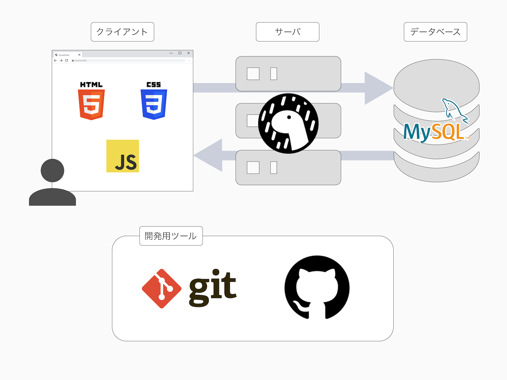

# intern-dev-tutorial

jig.jp のインターンで勉強会に使う資料のリポジトリです。

## TOC

- Git / Github 学習資料: git
  - [README.md](./git/README.md)
  - [DOCS.md](./git/docs.md)
- JavaScriptを始めよう: javascript
  - [README.md](./javascript/README.md)
  - [DOCS.md](./javascript/DOCS.md)
- HTML/CSSを始めよう: html-css
  - [README.md](./html-css/README.md)
  - [DOCS.md](./html-css/DOCS.md)
- Denoについて: deno
  - [README.md](./deno/README.md)
- クライアント・サーバの通信: transfer-protocol
  - [README.md](./transfer-protocol/README.md)
- APIハンズオン: api
  - [README.md](./api/README.md)
- データベース: MySQL: detabase
  - [README.md](./database/README.md)
  - [docs.md](./database/docs.md)
- ログインハンズオン: did-login
  - [README.md](./did-login/README.md)
- デザイン: design
  - [README.md](./design/README.md)
  - [SLIDE.md](./design/slide.md)
- ChatGPT APIハンズオン: chat-gpt-api
  - [README>md](./chat-gpt-api/README.md)

## Edit

編集する方は、必要な拡張やパッケージをインストールしてください。

- VSCodeの @recommended 拡張をインストール
- `https://deno.com/`を参考に、Denoをインストール
- `https://nodejs.org/`を参考に、NodeJSをインストール
- `npm install`で、パッケージをインストール

校正ルールはproofdictで管理しています。次のリポジトリから編集してください。

- <https://jigintern.github.io/proof-dictionary/>

## 著者

- <https://github.com/nabe1005>
- <https://github.com/Futaba-Kosuke>
- <https://github.com/dicenull>
- <https://github.com/takerucam>
- <https://github.com/rough-github>
- <https://github.com/Ryo-7>
- <https://github.com/haruyuki-16278>

### スペシャルサンクス

Contributerの皆様 <https://github.com/jigintern/intern-dev-tutorial/graphs/contributors>

### Credits

#### octicons

- <https://github.com/primer/octicons/blob/main/LICENSE>
