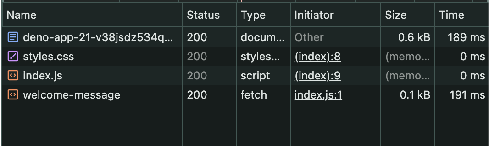

<!-- _class: lead -->
<!-- _paginate: false -->
<!-- _header: '' -->

# はじめてのAPI

---

<!-- _class: chapter -->
<!-- _header: '' -->

# 1. APIとは何か

---

## 名前がそのまま意味

<div class="acronym">
  <div class="arow">
    <span class="ini">A</span><span class="eng">pplication</span>
    <span class="jp">アプリケーションを</span>
  </div>
  <div class="arow">
    <span class="ini">P</span><span class="eng">rogramming</span>
    <span class="jp">プログラムから使うための</span>
  </div>
  <div class="arow on">
    <span class="ini">I</span><span class="eng">nterface</span>
    <span class="jp">窓口</span>
  </div>
  <div class="sum">アプリをプログラムから使うための<strong>窓口</strong></div>
</div>

---

## インターフェース ＝ 窓口

<div class="io">
  <div class="ioside">ブラウザ</div>
  <div class="arrows">
    <div class="ioline">
      <span class="iolabel">決まった形で頼む</span>
      <span class="ioarrow">──────▶</span>
    </div>
    <div class="ioline">
      <span class="ioarrow">◀──────</span>
      <span class="iolabel">答えが返る</span>
    </div>
  </div>
  <div>
    <div class="gatelabel">↓ この面が窓口 ＝ API</div>
    <div class="ioside api">server.js</div>
  </div>
</div>

<div class="note tight">
inter（間） + face（面） ＝ <strong>間にある面</strong> 厚みのない1枚の面<br>
窓口は<strong>サーバー側の表面</strong> 銀行の窓口が銀行の一部なのと同じ
</div>

---

## 窓口があると うれしいことが2つ

<div class="benefits">
  <div><span class="bnum">利点1</span> 中身を知らなくても使える</div>
  <div><span class="bnum">利点2</span> 見せたくないものを隠せる</div>
</div>

---

## 利点1 中身を知らなくても使える

| | 裏側でやっていること | 自分が書くこと |
| --- | --- | --- |
| **天気** | 観測データを集めて スパコンで計算 | `fetch("/weather")` |
| **地図** | 膨大な画像から その地点を切り出す | `fetch("/map")` |
| **翻訳** | 大量の文章で学習したモデルで推論 | `fetch("/translate")` |

<div class="note tight">
左は<strong>知らなくていい</strong> 書くのは右の<strong>1行</strong>だけ<br>
自分で気象観測をしなくても 天気を出すアプリがつくれる
</div>

---

## 利点2 見せたくないものを隠せる

<div class="row tight">
  <div class="box">
    <span class="label">ブラウザ側</span>
    index.html / api.js
    <div class="inner">開発者ツールで<br><strong>誰でも中身が見える</strong></div>
  </div>
  <div class="arrowlabel">
    <span class="arrow">⇄</span>
    API
  </div>
  <div class="box api">
    <span class="label">サーバー側</span>
    server.js
    <div class="inner">中身は<br><strong>誰にも見えない</strong></div>
  </div>
</div>

<div class="note tight">
パスワードの照合 APIキー データベースの情報は <strong>全部この右側に置く</strong><br>
この見えない側を<strong>バックエンド</strong>と呼ぶ
</div>

---

## 窓口のルールは この4つ

| | これがルール | 例 |
| --- | --- | --- |
| ① | どのURLか | `/greeting-me` |
| ② | どのメソッドか | `GET` |
| ③ | 何を渡すか | `name` |
| ④ | 何が返るか | `Hello, taro` |

<div class="note tight">
この4つが決まっていれば <strong>別々の人がつくっても繋がる</strong><br>
②のGETとPOSTが 前の章でやったやつ
</div>

---

## 4つを組み合わせると コードになる

```js
// server.js
if (req.method === "GET" && pathname === "/greeting-me") {
//      ② メソッド                    ① URL

  const name = new URL(req.url).searchParams.get("name");
//                                    ③ 渡されたもの を受け取る

  return new Response("Hello, " + name);
//                    ④ 返すもの
}
```

<div class="note tight">
今日書くのは これだけ<br>
4本とも <strong>①②③④のどれかが変わるだけ</strong>
</div>

---

<!-- _class: chapter -->
<!-- _header: '' -->

# 2. server.jsは<br>全部の入口

---

## これが昨日の最初の形

```js
import { serveDir } from "jsr:@std/http/file-server";

Deno.serve((req) => {                    // 通信は全部ここに来る
  const pathname = new URL(req.url).pathname;
  console.log(pathname);                 // 叩かれたパスを表示

  if (req.method === "GET" && pathname === "/welcome-message") {
    return new Response("jigインターンへようこそ！");
  }

  return serveDir(req, { fsRoot: "public", ... });
});
```

<div class="note tight">
テンプレートから始まったときの <code>server.js</code><br>
書き換えたのは中身だけ <strong>形はこのまま残っている</strong>
</div>

---

## 上から順に「自分の担当か」を見ている

<div class="steps">
  <div>通信が来た</div>
  <div><span class="step">1</span> GETで <code>/welcome-message</code> か？ → <strong class="hl">バックエンドの情報</strong> を返す</div>
  <div class="on"><span class="step">2</span> どれでもない → <code>serveDir</code> が <strong class="hl">ブラウザの構成要素</strong> を返す</div>
</div>

<div class="note tight">
一番下の <code>serveDir</code> は「どれにも当たらなかったとき」の受け皿
</div>

---

## フロントの構成要素も server.js が返している

<div class="split">
  <div class="stop">server.js</div>
  <div class="sarrows"><span>↙</span><span>↘</span></div>
  <div class="srow">
    <div class="sbox">
      <span class="stitle">フロントの構成要素</span>
      <span class="sitems"><code>index.html</code> / <code>styles.css</code><br><code>index.js</code></span>
    </div>
    <div class="sbox api">
      <span class="stitle">バックエンドの情報</span>
      <span class="sitems"><code>/welcome-message</code><br>の文字</span>
    </div>
  </div>
</div>

<div class="note tight">
画面をつくる部品も データも <strong>同じ入口から 同じ形で返る</strong><br>
だから 1ファイルで両方できている
</div>

---

## 構成要素は 1つずつ 4回に分けて返る

| 叩かれたURL | 上から順に見た結果 | 返ってきたもの |
| --- | --- | --- |
| `/` | どれにも当たらない → `serveDir` | `index.html` |
| `/styles.css` | どれにも当たらない → `serveDir` | CSS |
| `/index.js` | どれにも当たらない → `serveDir` | JavaScript |
| `/welcome-message` | **1番目のifに当たった** | 「ようこそ」の文字 |

<div class="note tight">
3回は <strong>フロントの構成要素</strong> 1回は <strong>バックエンドの情報</strong><br>
どちらも同じ <code>server.js</code> が 同じ形で返している
</div>

---

## 自分のサイトで見てみよう

<div class="steps">
  <div><span class="step">1</span> <strong>開発者ツール</strong>（F12）→ <strong>Network</strong> タブ</div>
  <div class="on"><span class="step">2</span> ページを再読み込みすると <strong>4行ならぶ</strong></div>
</div>

<div class="shot">
  
</div>

<div class="note tight">
<code>Initiator</code> を見ると <strong>誰が呼んだか</strong>が分かる<br>
<code>styles.css</code> と <code>index.js</code> は <code>(index)</code> から つまり<strong>HTMLが呼んでいる</strong>
</div>

---

<!-- _class: chapter -->
<!-- _header: '' -->

# 3. APIハンズオン

---

## 昨日デプロイしたアプリに 足していく

<div class="steps">
  <div><span class="step">1</span> 昨日クローンしたフォルダを開く <span>例: deno-app</span></div>
  <div><span class="step">2</span> <code>server.js</code> に窓口を4つ足す</div>
  <div class="on"><span class="step">3</span> push すると <strong>自動でデプロイされる</strong> <span>昨日のような設定は要らない</span></div>
  <div><span class="step">4</span> 昨日のURLに <code>/profile</code> を付けると <strong>スマホからも叩ける</strong></div>
</div>

<div class="note tight">
作業するのは<strong>自分のリポジトリ</strong><br>
教材リポジトリ（<code>intern-dev-tutorial</code>）<span class="ng">ではない</span>
</div>

---

## 4本とも同じ進め方

<div class="steps">
  <div><span class="step">1</span> <strong>サーバー側</strong>に書く</div>
  <div class="on"><span class="step">2</span> <strong>ブラウザのURL直打ち</strong>で確かめる</div>
  <div><span class="step">3</span> <strong>ブラウザ側</strong>に書く</div>
  <div><span class="step">4</span> ボタンで確かめる</div>
</div>

<div class="note tight">
2番を挟むと 動かないとき<strong>どちらが原因か</strong>を自分で切り分けられる
</div>

---

## 今日さわるファイルは3つ

| ファイル | 今日の扱い |
| --- | --- |
| `server.js` | `return serveDir(` の**上に足す** |
| `public/api.js` | **新しくつくる** 今日書くJSは全部ここ |
| `public/index.html` | `</body>` の**直前に足す** |

<div class="note tight">
今日書くJSは <code>api.js</code> に<strong>新しくつくる</strong><br>
<code>serveDir</code> より下に書くと<span class="ng">たどりつかない</span>ので 必ず<strong>その上</strong>へ
</div>

---

<!-- _class: lead -->

# READMEへ！
