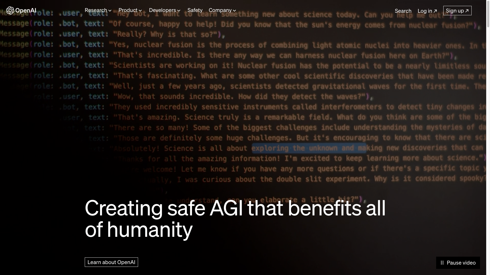
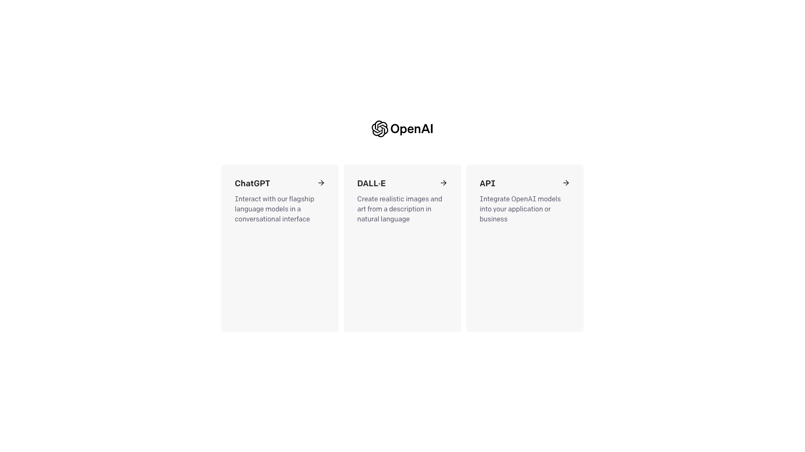
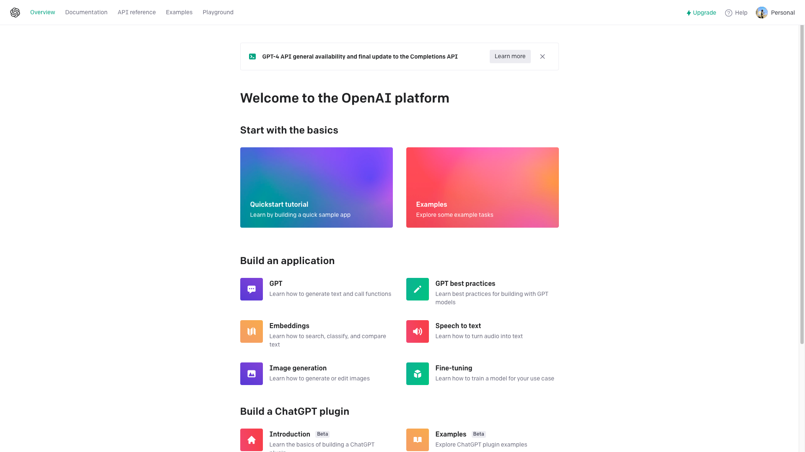
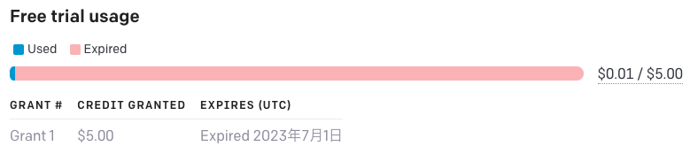
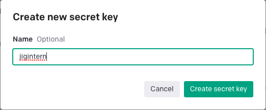

# ChatGPT API ハンズオン

ここでは、Deno で ChatGPT の API を利用する方法を紹介します。

## 1. 🔧 準備編

### 1-1. 🧐 ChatGPT とは？

OpenAI が開発した人工知能チャットボットです。

2023年7月現在、公式ページから、GPT 3.5 が無料で使用できますが、  
今回は OpenAI API を使用して ChatGPT を使用します。

### 1-2. ✏️ OpenAIのアカウントを作成しよう

API や ChatGPT の利用にはアカウント登録が必要になります。  
登録済みの人はそのアカウントを使用してください。

ます、[OpenAI](https://openai.com) に移動します。



右上から、Sign Up を選択して、新規登録画面へ移動しましょう。


アカウント登録済みの人は Log in からログイン画面へ移動します。


ここからは、各自でアカウントの登録をお願いします🙏  
完了時に以下のような画面になっていればOKです。



今回は API を使用するので、API を選択します。  
ChatGPT を使用したい場合は、ここで ChatGPT を選択してください。



### 1-3. ⚙️ API クレジットと API キーの確認

続いて、API クレジットとAPI キーを確認していきます。

自分のプログラムから、API を呼び出すには API キーが必要になります。  
また、クレジットを消費します(クレジットがない場合は課金する必要があります)。

画面右上の自分のアイコンと Personal と書いてある部分をクリック、出てきたメニューから Manage Account を選択します。


画面が移動したら、左側メニューから Usage を選択してください。

Usage では自分がどれくらい API を使用したかが確認できます。  
下図のように、Free trial usage というのがあるかと思いますが、こちらが無料で使用できるクレジットになります。  
この図では $5.00 が無料枠として付与されています。

この部分では、Used が使用済みクレジット、 Expired が期限切れのクレジットを示しています。

つまり、この図の状態だと無料枠が残っていないので、使用したい場合は課金する必要があるということになります。



---

続いて、API キーの確認をしていきます。  
今度は、左のメニューから、API Keysを選択します。  


ここでは、発行したAPI キーのリストを確認することができます。
Secret Key という名前のキーがデフォルトで発行されているはずです。

ここでは、インターン用に新しく1つキーを発行していきます。  
「+ Create new secret key」を選択します。



名前は各自におまかせしますが、「jigintern」のように何に使っているかわかりやすい命名にしておくのをオススメします。

名前を入力したら、Create secret key を押します。


このようにAPI キーが発行されればOKです。  

**ここで出てきたAPIキーは Done を選択すると、この後は見れなくなります。**

なので、発行したキーはどこかに保管しておいてください。

(上の英語の説明でも、 you won't be able to view it again としっかり説明されています)

ちなみに、万が一わからなくなった場合は、そのキーを削除して、新しくキーを作ってしまえばOKです。

2個以上ある場合は、ゴミ箱アイコンを押せば消せます。


## 2. 💪 実践編

それでは、準備はできたので、実際に API を使用してみます。

とはいえ、実際の API 仕様を確認してイチから実装するのも厳しいので、こちらのfetchChat / fetchConversation を使用します。

[aichat](https://github.com/code4fukui/ai_chat)

### 2-1. 😎 サンプルを元に動かすところまでやってみよう

ということで、この README.md と同じ階層にある、sample フォルダに移動します。中には Deno と `fetchChat` / `fetchConversation` を利用したサンプルコードが入っています。

`fetchChat` / `fetchConversation` も内部実装では ChatGPT の API を使用しているので、API キーが必要になります。

このAPI キーは、`.env` というファイルに作成すると動くようになっているので、`.env.example` というファイルを `.env` に改名します。  
(つまり、ファイル名から `.example` を消してください)

改名したら、ファイルの中身を書き換えていきます。  
`OPENAI_API_KEY=` までを残して `sk-` 以下を削除します。  
削除したら、`=` の後に、APIキーを貼り付けましょう。  
今回は今から教えるAPIキーを使用してください(ZoomのChatかSlack等で共有します)。

以前の内容で Deno の環境構築は終わっていると思いますので、  
移動したら下記のとおりコマンドを実行してください。

```bash
./serve.ts
```

うまく動かない人は、下記でも大丈夫です。

```bash
deno run --allow-read --allow-net --allow-write --allow-env --watch serve.ts
```

Deno Deploy を使用する際は、APIキーは Deno Deploy 側で設定する必要があります。  
各チームで担当のメンターに対応してもらってください。

コードの中身は、この後解説するので、ひとまずChatGPTが動くか試してみましょう！

### 2-2. 👀 実装をのぞいてみよう

動作確認まで終わったかと思うので、  
今度はプログラムがどのようになっているのかを確認していきます。

ChatGPT の API を叩いて、返答を受け取るまでの処理に着目します。  
おおまかには chat.html / index.html (フロントエンド) -> serve.ts (バックエンド) -> OpenAI API という順番で呼び出しています。

フロントエンド側からは、fetch API を使用して以下のように呼び出しています。

```js
const response = await fetch('/api/conversation', {
        method: 'POST',
        headers: {
          'Content-Type': 'application/json'
        },
        body: JSON.stringify({ messages: messages })
      });

      if (!response.ok) {
        return 'Error: ' + response.status;
      }

      const data = await response.json();
      return data.message;
```

`/api/conversation` に対して、POSTリクエストを送っていますね。

では、バックエンド側はこのAPIをどのように実装しているのか確認しましょう。

```js
const json = await req.json();
console.log(json);
const res = await fetchConversation(json.messages, null, true);
console.log(res);
return new Response(JSON.stringify({ message: res }));
```

まず、リクエストをjson形式で受け取ります。
フロントエンド側からメッセージが、messagesという名前で送られてきているので、サーバーでは`json.messages` というようにして利用しています。  
`fetchConversation` で、API を呼び出して、ChatGPTからの返答を受け取っています。  
chat.html / fetchChat のほうも同様です。

このように、serve.js / serve.ts で ChatGPT API を呼び出す API を作成し、html 側からは作成した API を呼び出すことで、ChatGPTの返答をhtml(フロントエンド)側まで持ってくることができます。

最後に fetchChat / fetchConversation の呼び出し方・使い方を学習します。

### 2-3. 😀 `fetchChat` / `fetchConversation` の使い方

#### `fetchChat`

`fetchChat` は入力した1メッセージのみを送り、返り値として ChatGPT からの返答メッセージを受け取ります。

サンプルの実装では下記のようになっています。

```js
const res = await fetchChat(json.message);
```

引数として、ユーザーの入力したメッセージを文字列型(string)で指定するだけでOKです。  
受け取ったレスポンス res も文字列になっています。

#### `fetchConversation`

`fetchConversation` は ユーザー(user)とChatGPT(assistant)の会話(複数のメッセージ)を送ることで、返り値としてChatGPTからの返答メッセージを受け取ります。

そのため、入力1通、返答1通ではなく、会話そのもののやりとりから返答を考えてもらうことができます。

サンプルの実装では下記のようになっています。

```js
const res = await fetchConversation(json.messages, null, true);
```

引数が3つ指定されていますが、1つ目がやり取りのメッセージ、2つ目が関数呼び出し用の関数、3つ目が GPT3.5 を使用するかどうかのbool値になっています。

1つ目の引数のメッセージは以下のような形式 (Object) になっています。

role は、`user` がユーザー、ChatGPT からの返答が `assistant` となっています。

```js
{
  messages: [
    { role: "user", content: "こんにちは" },
    { role: "assistant", content: "こんにちは！ご用件は何でしょうか？" },
    { role: "user", content: "カレーの作り方を教えてください。" }
  ]
}
```

2つ目の引数、関数呼び出しはここでは特に触れないので、使わない場合は null でOK です。

3つ目の引数も、GPT-4 を使用する場合は false にする必要がありますが、今回は GPT-3.5 で十分かなと思いますので、true のままで大丈夫です。


