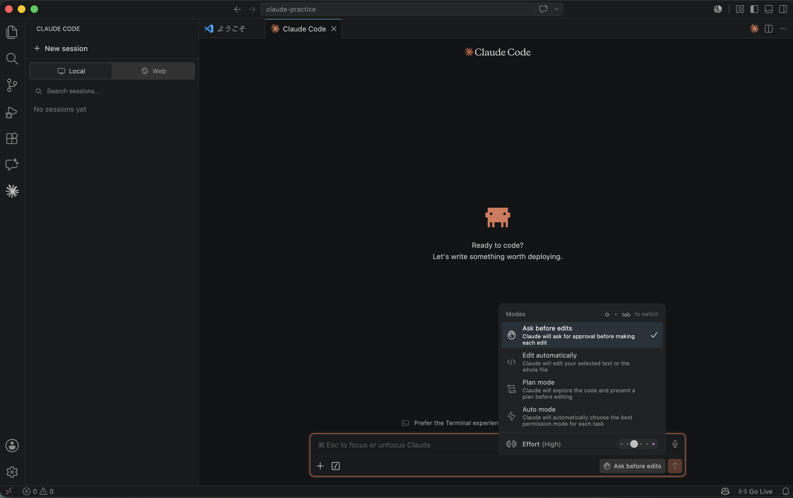
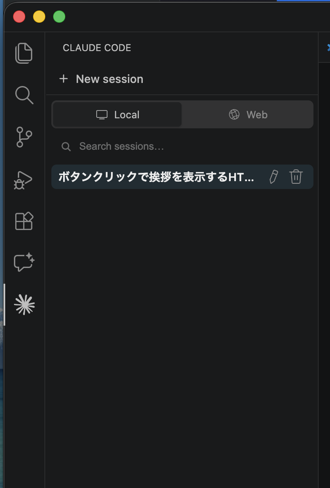
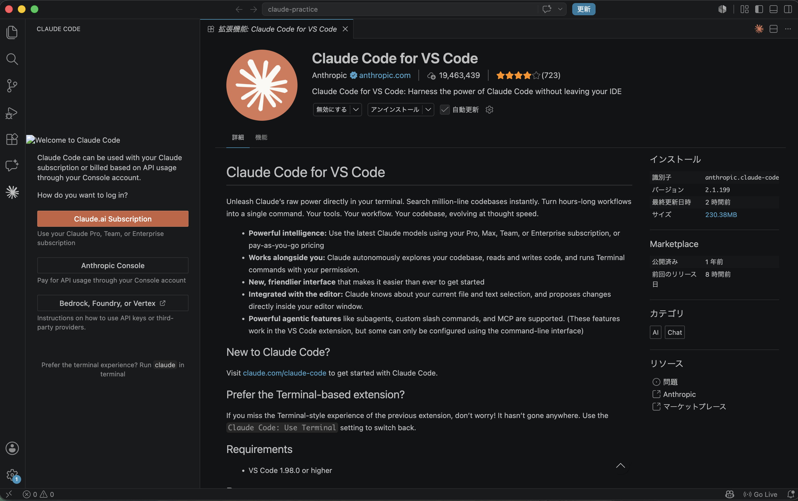
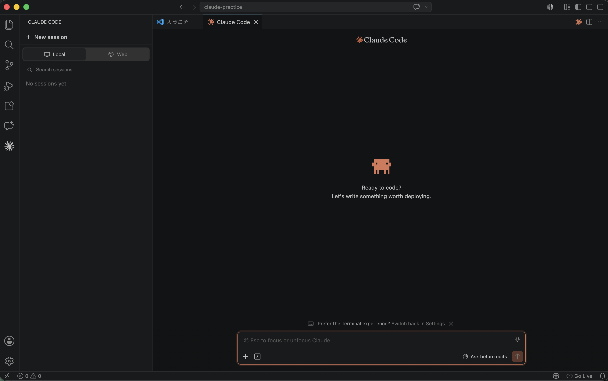
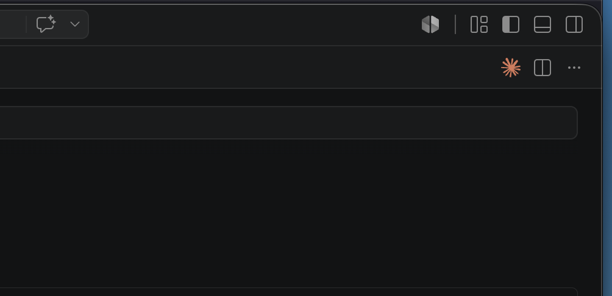
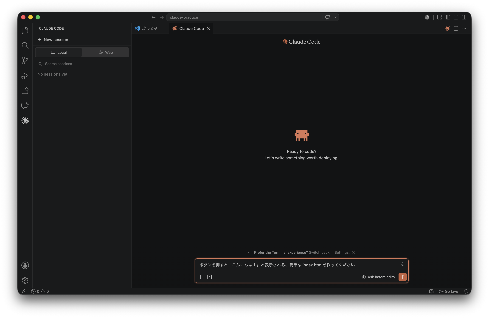
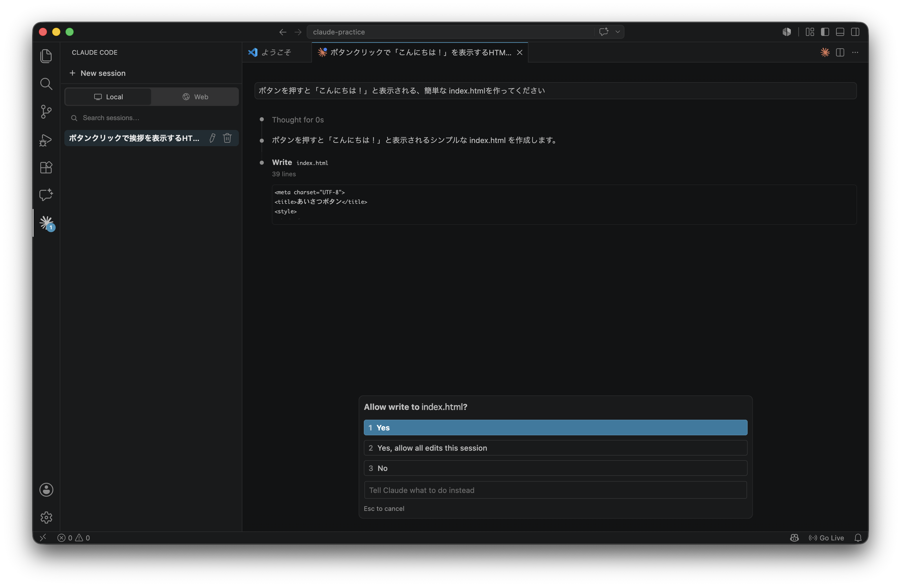
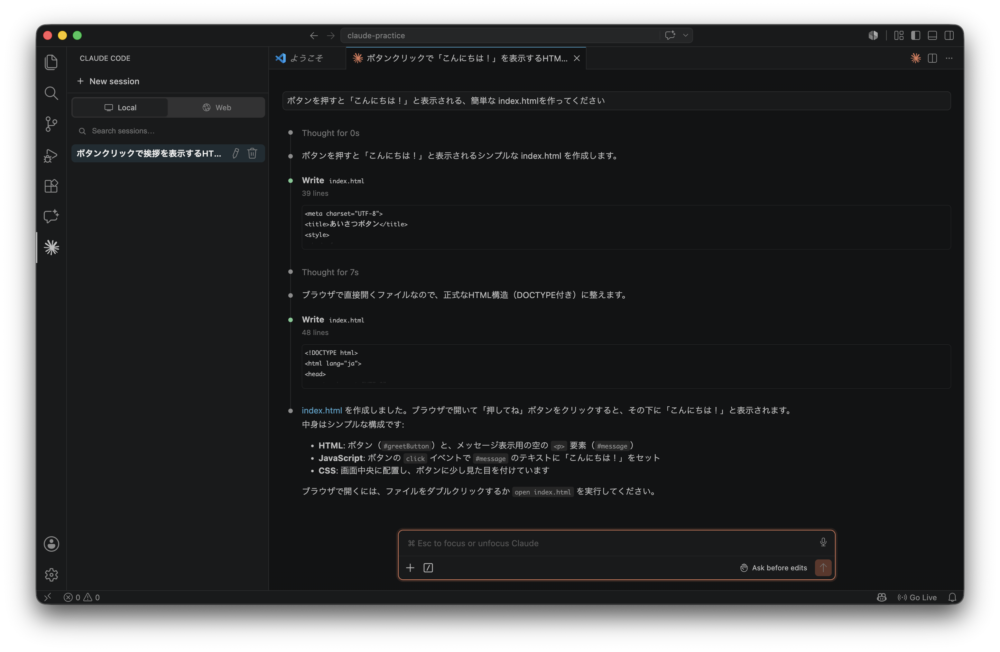
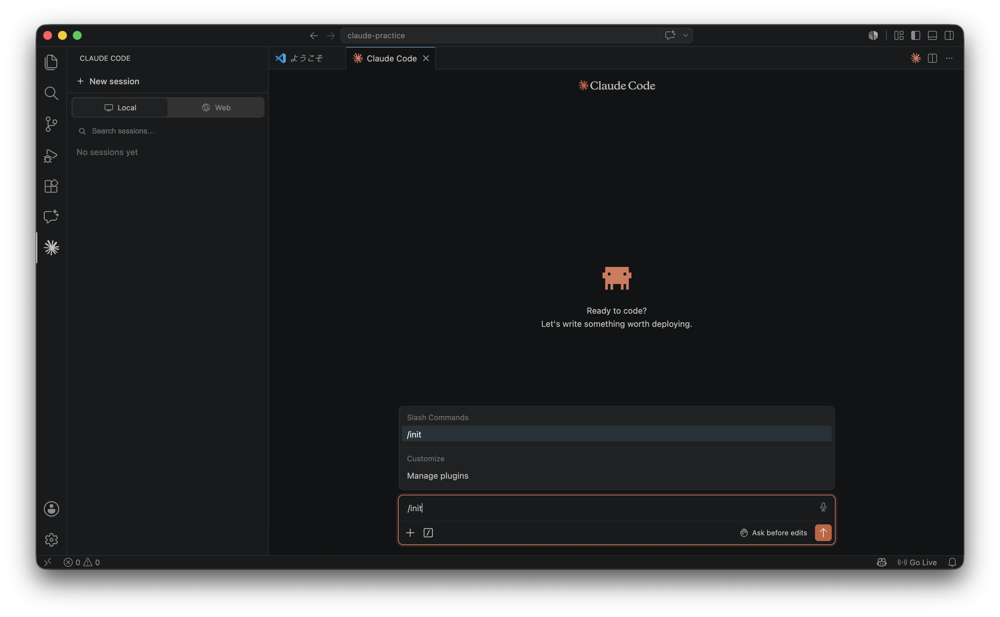
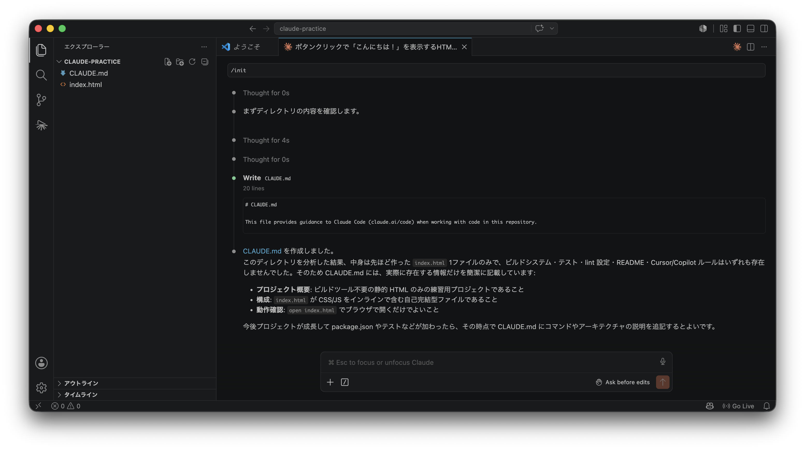

# Claude Code を利用した開発手法

本項では、Anthropic が提供する AI コーディングツール [Claude
Code](https://code.claude.com/docs/ja/overview)
を利用した開発手法について解説します。

本資料は **VS Code 拡張機能** を使って進めます。事前準備（[README.md](./README.md)）が済んでいることを前提とします。

## 1. 導入編

*Claude Code について知ろう！*

### 1-1. Claude Code とは何か？

> Claude Code は agentic coding ツールで、コードベースを読み取り、ファイルを編集し、コマンドを実行し、開発ツールと統合します。  
> 出典: https://code.claude.com/docs/ja/overview

Claude Code は、AI（Claude）を活用した「コーディングアシスタント」ツールです。  
エディタやターミナルに常駐し、自然言語で指示するだけで、コードを**読む・書く・実行する**ことができます。

たとえば「このプロジェクトは何をしているの？」と聞けばコードを読んで説明してくれますし、「ログインのバグを直して」と頼めば原因を探して修正案を出してくれます。  
人間が「何をしたいか」を伝え、Claude が「どう実現するか」を考えて作業する、という関係で開発を進めます。

> Topic: ただコードを書くだけでなく、複数ファイルにまたがる変更、テストの実行、git のコミットや Pull Request 作成まで頼めるのが特徴です。

### 1-2. Claude Code で何ができるのか？

Claude Code は、おおよそ以下のようなことができます。

- **コードベースの理解**: 「この関数はどこで使われている？」「全体の構成を教えて」
- **機能の実装**: 「ユーザー一覧ページを追加して」
- **バグの修正**: エラーメッセージを貼り付けて「これを直して」
- **テストの作成・実行**: 「この機能のテストを書いて、実行して、失敗を直して」
- **git 操作**: 「変更を説明的なメッセージでコミットして」

指示は自然言語で構いませんが、**具体的であるほど精度が上がります**。  
「バグを直して」よりも「ログイン後に画面が真っ白になるバグを直して。再現手順は〜」のように、状況・期待する結果・対象範囲を添えると、より意図どおりに動いてくれます。

### 1-3. 安全の仕組み（権限承認）

Claude Code は、**ファイルの編集・コマンドの実行などを行う前に、必ずあなたの承認を求めます**。  
Ask before edits モードなら勝手にコードを書き換えたり、危険なコマンドを実行したりはしないので、安心して使えます。

承認のしかたは「許可モード」で切り替えられます。入力欄の右下のモード表示をクリックするか、`Shift + Tab` で切り替えます。  
モードは次の4つです。

| モード | 動作 |
| --- | --- |
| **Ask before edits**（編集前に確認） | 編集のたびに承認を求める |
| **Edit automatically**（自動で編集） | 確認せずに編集を進める |
| **Plan mode**（計画をたてて確認） | コードを調べてから、編集の前に計画を提示する |
| **Auto mode**（自動選択） | タスクに応じて最適な許可モードを自動で選ぶ |



最初のうちは **Ask before edits**、「いきなり実装されると不安」というときは **Plan mode** がおすすめです。Plan mode ではClaudeが先に実装計画を提示し、ユーザーが承認して初めて実装（編集・コマンド実行）が始まります。計画を修正したいときは、そのままチャットで依頼できます。

## 2. Claude Code を触ってみよう

*VS Code 拡張機能で実際に使ってみよう！*

ここからは実際に手を動かします。**まだ何も無い、空のフォルダから始めても大丈夫です。**  
適当な作業用フォルダ（例: `claude-practice`）を作り、VS Code で開いておきましょう（すでに開いているプロジェクトがあれば、それを使っても構いません）。  

### 2-1. Claude パネルを開こう

VS Code の中で **Spark アイコン**（✱ のようなマーク）が Claude Code を表します。  
まずは Claude のパネルを開いてみましょう。

<details>
<summary>練習: Claude パネルを開いてみよう</summary>

**左のアクティビティバー** の Spark アイコンをクリックします。サイドバーに**セッション（会話）の一覧**が表示されます。



初めて開いたときはログイン画面が表示されます。「**Claude.ai Subscription**」を選び、ブラウザで Anthropic アカウントにサインインしてください。



サイドバーの「**+ New session**」をクリックすると、新しい会話が**エディタのタブとして**開きます。ここが Claude との作業場所になります。



> Topic: ファイルを開いているときは、**エディタ右上** の Spark アイコンからも Claude を呼び出せます。こちらは一覧を経由せずに、**すぐに新しい会話のタブが開きます**。アイコンが見つからないときは、コマンドパレット（Mac: `Cmd+Shift+P` / Windows・Linux: `Ctrl+Shift+P`）で「Claude Code」と入力しても開けます。
>
> 

</details>

### 2-2. プロンプトを送ってみよう

パネルが開いたら、入力欄に「やりたいこと」を自然言語で書いて送信します。  
空のフォルダなら、まずは何かを「**作ってもらう**」と Claude Code の楽しさが分かります。

<details>
<summary>練習: 簡単なページを作ってもらおう</summary>

1. Claude のパネルの入力欄に、次のように入力して送信します
   ```
   ボタンを押すと「こんにちは！」と表示される、簡単な index.html を作ってください
   ```
2. Claude が「やること」を考え、ファイルを作ろうとすることを確認します（実際に作られるのは次の 2-3 で承認してからです）



> Topic: すでにコードが入ったプロジェクトを開いている場合は、「**このプロジェクトは何をしているのか説明してください**」と聞いてみましょう。コードを読んで概要を教えてくれます。

</details>

### 2-3. 変更を依頼して差分を確認・承認しよう

Claude がファイルを作ったり編集したりするときは、**追加・変更される内容**（差分）を表示し、承認を求めてきます。  
勝手に保存されることはないので、内容を見てから承認しましょう。

<details>
<summary>練習: 差分を確認して承認しよう</summary>

1. 2-2 で Claude が `index.html` を作ろうとすると、**書き込む内容**と「**Allow write to index.html?**（index.html への書き込みを許可しますか？）」という確認が表示されます
2. 内容を確認して選びます
   - **Yes** … この書き込みを許可する
   - **Yes, allow all edits this session** … このセッション中の編集をすべて許可する
   - **No** … 許可しない
   - 「Tell Claude what to do instead」に、代わりにやってほしいことを書くこともできます



3. 承認すると `index.html` が作られます。**ブラウザで開いて**、ボタンが動くか確かめてみましょう



</details>

### 2-4. ファイルや行を参照させよう

「このファイルを見て」と特定のファイルを指定したいときは、`@` を使います。  
`@` のあとにファイル名を入力すると候補が出ます（あいまい一致に対応しているので、一部だけ入力でも探せます）。

<details>
<summary>練習: @ メンションでファイルを指定しよう</summary>

さきほど作った `index.html` を参照して、機能を足してもらいましょう。

1. 入力欄で `@` を入力し、続けて `index` などと打って候補から `index.html` を選びます
   ```
   @index.html にボタンをもう1つ追加して、押すと現在時刻を表示するようにしてください
   ```
2. Claude が指定したファイルを読み、差分を出してくれることを確認します（承認すると反映されます）

> Topic: エディタでコードを範囲選択した状態で `Option+K`（Mac）/ `Alt+K`（Windows・Linux）を押すと、`@ファイル名#5-10` のように **行番号付きの参照** を入力欄に挿入できます。

</details>

### 2-5. コマンドを使おう

「コマンド」は、`/` で始まる**短い命令**です（「スラッシュコマンド」と呼ばれることもあります）。  
ふだんのプロンプトが「Claude への文章でのお願い」だとすると、コマンドは「**Claude Code という道具そのものの操作**」です。会話のリセットや設定の変更など、決まった機能を一発で呼び出せます（Slack や Discord の `/` コマンドと同じ仕組みです）。

入力欄で `/` を入力するか、入力欄の下の「**/**」ボタン（Show command menu）を押すとメニューが表示されます。よく使うものは次のとおりです（かっこ内はコマンド名）。

| メニュー項目 | できること |
| --- | --- |
| **Clear conversation**（`/clear`） | 会話をリセットして新しく始める（別のタスクに移るときに使う） |
| **Switch model… / Effort**（`/model`） | 使うモデルや考える深さを切り替える（→ 後述の「2-8. モデルと Effort について」） |
| **Account & usage…**（`/usage`） | プランの使用状況を確認する |

このほかにも多くの組み込みコマンドがあります。また、**スキル**（Skills）という仕組みで機能を追加でき、チームやプロジェクト独自の `/○○` が増えていることもあります（メニューに見慣れない項目があったら、たいていこれです）。

<details>
<summary>練習: コマンドメニューを開いてみよう</summary>

1. 入力欄で `/` を1文字入力し、よく使う機能のメニューが表示されることを確認します
2. さらに続けて `usage` と入力すると、候補が絞り込まれることを確認します
3. そのまま実行して、プランの使用状況が表示されることを確かめてみましょう

</details>

### 2-6. 過去の会話を再開しよう

作業を中断しても、過去の会話を呼び出して続きから再開できます。

<details>
<summary>練習: セッション一覧から再開しよう</summary>

1. 左のアクティビティバーの Spark アイコンをクリックし、サイドバーに**セッション一覧**を表示します
2. 「Search sessions...」でキーワード検索するか、一覧から過去の会話を探します
3. 会話をクリックすると、その続きから再開できます

> Topic: ターミナル（CLI）では `/resume` で過去の会話を選んで再開できます。VS Code 拡張機能と CLI は会話履歴を共有しているので、拡張機能で始めた会話を CLI で続けることもできます。

</details>

### 2-7. CLAUDE.md でルールを覚えさせよう

`CLAUDE.md` は、Claude Code への「**永続的な指示書**」です。  
プロジェクトのルート（一番上の階層）に置いておくと、**毎回のセッション開始時に自動で読み込まれます**。  
コーディング規約・使うライブラリ・作業の進め方などを書いておくと、毎回説明しなくても従ってくれます。

<details>
<summary>練習: CLAUDE.md を作ってみよう</summary>

1. 入力欄で `/init` と入力し、候補から選んで実行します



2. Claude がプロジェクトを調べて、`CLAUDE.md` のたたき台を自動生成することを確認します



3. 生成された内容を読み、必要に応じて手で追記・修正します

書く内容の例:

```markdown
# コーディング規約
- インデントはスペース2つ
- import / export（ESモジュール）を使う

# 進め方
- 変更後は必ずテストを実行する
- コミットメッセージは何をしたか分かるように書く
```

> Topic: `CLAUDE.md` が長すぎると毎回読む量が増えてしまいます。「Claude が繰り返し同じ間違いをするとき」に少しずつ足していくのがコツです。

</details>

### 2-8. モデルと Effort について

使う**モデル**や **Effort**（思考にどれだけ労力をかけるか）は、入力欄で `/` を入力したメニューの **Model** セクション（Switch model… / Effort）から切り替えられます。  
ただし、**基本はデフォルトのままで問題ありません**。最初は気にせず、慣れてきて「もっとじっくり考えさせたい」「速く返してほしい」と感じたときに調整してみましょう。

## 3. うまく使うコツ・困ったとき

**うまく使うコツ**

- **具体的に指示する**: 目的・期待する結果・対象ファイルを添える
- **スコープを区切る**: 一度に欲張らず、small な単位で頼む
- **不安なら Plan mode**: 先に計画を確認してから実装させる
- **区切りで `/clear`**: 別のタスクに移るときは履歴をリセットして混ざらないようにする

**困ったとき**

- ログインできない → パネルの再読み込み（コマンドパレット → `Developer: Reload Window`）を試す
- 会話を再開したい → サイドバーのセッション一覧（CLI なら `/resume`）
- 操作の許可を出しすぎた／不安 → `Ask before edits` や `Plan mode` に戻す。判断に迷ったらメンターに相談する


