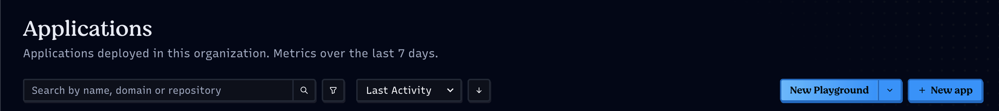
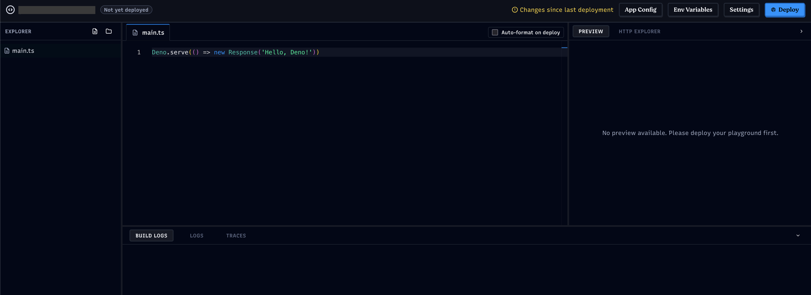
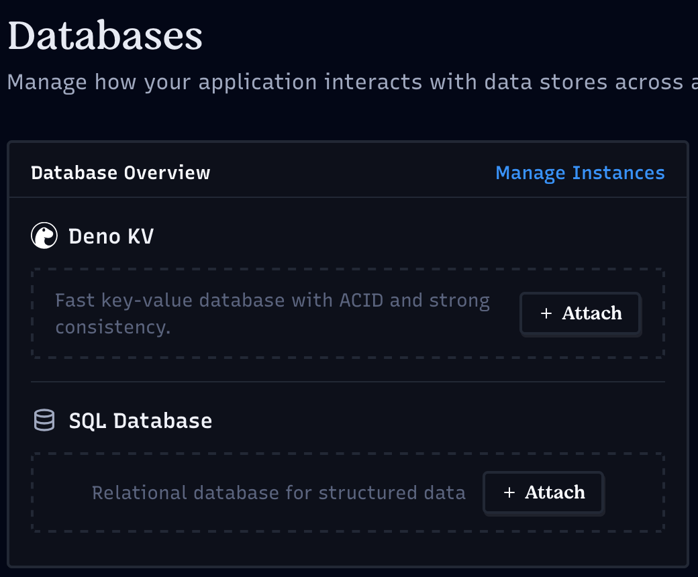
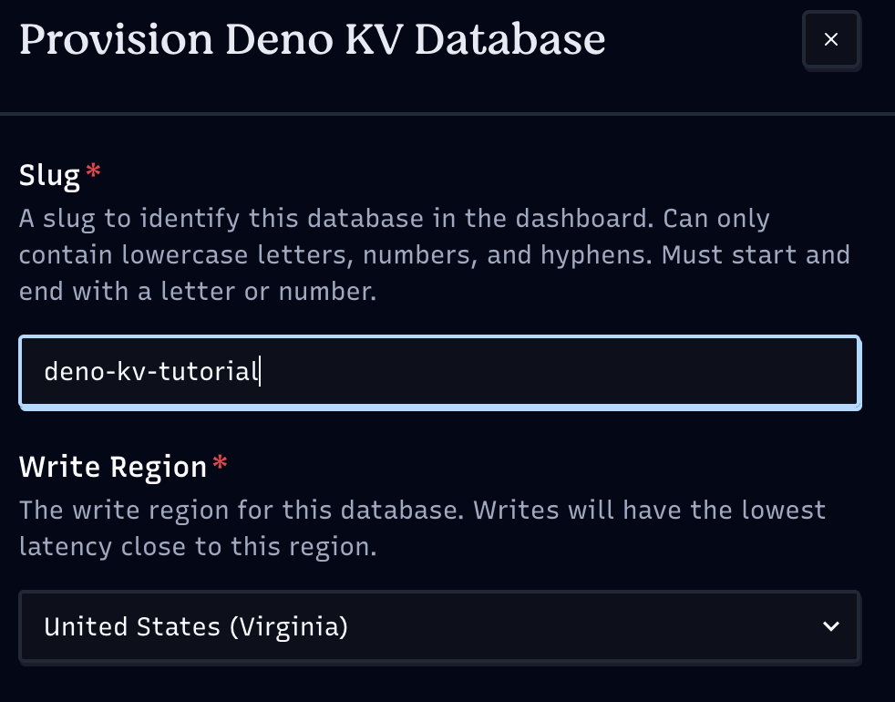
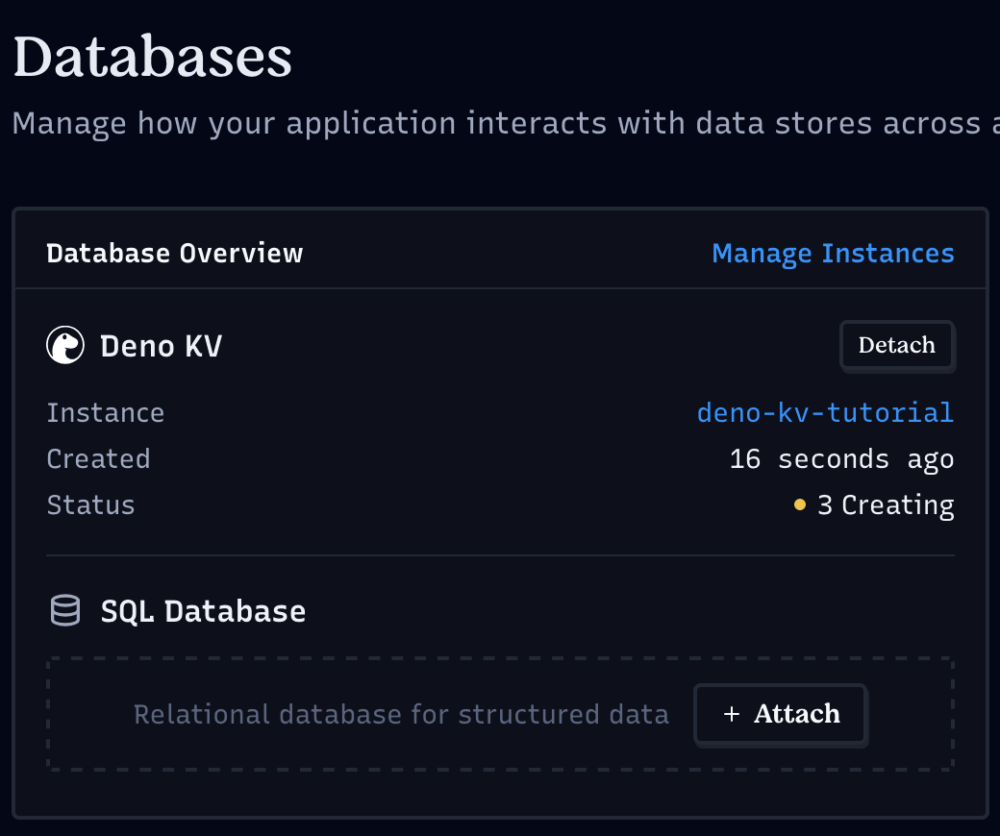
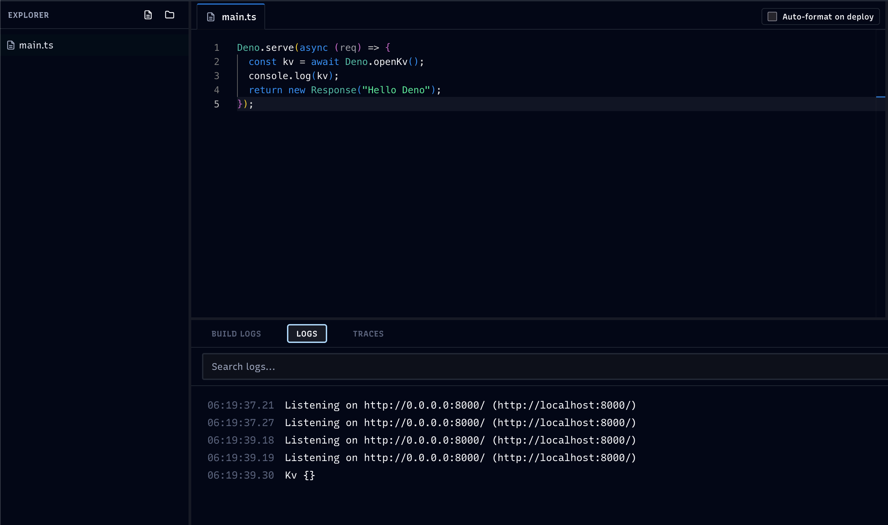
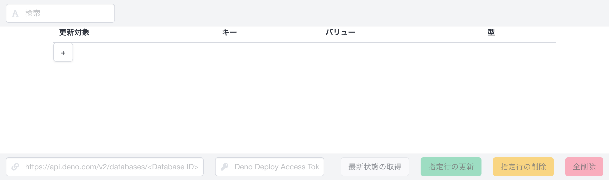

# Deno KV入門

本項では、Deno Land Inc.から提供されているDeno用データベース [Deno KV](https://deno.com/kv) を利用した開発手法について解説します。  
データの保存が可能になれば、アプリケーション開発の幅が一気に広がります！

## 1. 導入編

*データベースやDeno KVについて知ろう！*

### 1-1. データベースとは何か？

> データベースは、情報を保存、管理、取得するための構造化されたシステムです。  
> 出典: https://cloud.google.com/discover/databases?hl=ja

データベースは、データを構造化して保存するためのシステムです。  
データの保存が必要となる多くのアプリケーションで使用されています。ファイル等に単純に保存する場合と比較してデータが扱いやすくなっています。

データベースを操作するための方式は大きく分けると、「RDBMS」と「NoSQL」の二種類に分けられます。

「RDBMS: **R**elational **D**ata**B**ase **M**anagement **S**ystem」では、データを表に保存し、表同士を関連付けることでデータを保存します。また、データベースを操作する言語であるSQLを使用できるようになっています。  
MySQLやPostgreSQLなどが代表的です。

「NoSQL: **N**ot **o**nly **SQL**」は、「RDBMS」以外の総称です。名前の通り、SQLを使用しないことが特徴です。SQLが得意とする機能が利用できない代わりに、大規模な並列分散処理や、柔軟なデータ構造を実装できます。様々な種類が存在しており、目的ごとに独自の機能を持っています。  
MongoDBやDynamoDB、Cloud Firestoreなどが代表的です。

> Topic: NoSQLにはkeyとvalueのペアで値を保持する「key-valueデータベース」、JSON形式でデータ保存する「ドキュメントデータベース」、グラフ構造を備える「グラフデータベース」などが存在します。詳細な解説は省きますが、興味のある方は調べてみて下さい。

本項で学習するDeno KVは、NoSQLのkey-valueデータベースに分類されます。  
キーに対してバリューを1つ保存する、シンプルな構造のデータベースです。

### 1-2. Deno KVとは何か？

Deno KVは、Deno Land Inc.から提供されているDeno用NoSQLデータベースです。key-valueデータベースに分類されます。Deno公式から提供されていることもあり、Denoから比較的容易に利用できます。開発途上の機能なので仕様が変わる可能性はありますが、個人開発程度であれば、十分な性能を発揮してくれるでしょう。

Deno KVでは、以下のような形式でデータを保存します。ここでは、学校の名簿を想定して例を記載しています。  
keyに対してvalueが一意に紐づくため、keyとvalueのデータ構造は慎重に決定しましょう。

> Tips: Deno KVのkeyには、JSON等と異なり、複数の要素をリスト形式で当てることができます。

| key | value |
| -- | -- |
| `["school", "classroom", 1]` | `{ "grade": 1, "class": "A" }` |
| `["school", "classroom", 2]` | `{ "grade": 1, "class": "B" }` |
| `["school", "classroom", 3]` | `{ "grade": 2, "class": "A" }` |
| `["school", "student", 1]` | `{ "name": "田中", "classroom": 1 }` |
| `["school", "student", 2]` | `{ "name": "山田", "classroom": 2 }` |
| `["school", "student", 3]` | `{ "name": "じぐ太郎", "classroom": 2 }` |

## 2. 実践編

*Deno KVを実際に使ってみよう！*

### 2-0. 実践の準備をしよう

Deno Deployには、Denoのコードを簡単に記述・実行・デプロイできるPlaygroundという機能が搭載されています。ここでは、簡単のためPlaygroundを使用してみましょう。

> Topic: ローカルでDeno KVを利用する場合、Denoの起動時のオプションに`--unstable-kv`が必要になります
> ```sh
> # 例
> deno run -A --unstable-kv my_kv_code.ts
> ```

<details>
<summary>練習: DenoのPlaygroundを作ってみよう</summary>

1. [Deno Deploy](https://console.deno.com)にログインします

2. 「Apps」ページの「New Playground」をクリックします


3. 以下のような画面が開けばOKです


4. 画面中央のコードを以下のように書き換えて、「Deploy」をクリックします

```js
Deno.serve(async(req) => {
    return new Response("Hello Deno");
});
```

5. 画面右側の「PREVIEW」に「Hello Deno」と表示されればOKです

</details>

<details>
<summary>練習: Deno KVのデータベースを用意しよう</summary>

Deno KVを使うには、データベースを作成して、Playgroundに紐づけます。

1. 「Apps」ページから作成したPlaygroundを開き、画面左のメニューから「Databases」を選びます

2. 「Deno KV」の「+ Attach」をクリックします


3. 「Select a KV database」を開き、「+ Provision new Deno KV」を選びます

4. 「Slug」に`deno-kv-tutorial`と入力します。「Write Region」はそのままで構いません


5. 「Provision Deno KV」をクリックし、続けて「Attach database」をクリックします

6. 「Instance」に作成したデータベースが表示されればOKです


</details>

### 2-1. set: Deno KVにデータを保存する

Deno KVにデータを保存してみましょう。以下のようなコードを書くことで、簡単にDeno KVにアクセスして、データを保存できます。

```js
// Deno KVにアクセス
const kv = await Deno.openKv();

// Deno KVに保存
// 第一引数はkey, 第二引数はvalue
// keyが既に存在する場合は、更新
const result = await kv.set(["hoge"], { "fuga": "waiwai" });

// レスポンスを表示
console.log(result);
```

<details>
<summary>練習: Deno KVにアクセスしてみよう</summary>

1. Deno KVにアクセスするコードを書き加えます

```diff
Deno.serve(async(req) => {
+   const kv = await Deno.openKv();
+   console.log(kv);

    return new Response("Hello Deno");
});
```

2. 「Deploy」をクリックして、画面下部の「LOGS」に「Kv {}」と表示されていることを確認します


</details>

<details>
<summary>練習: Deno KVにデータを追加してみよう</summary>

1. Deno KVにデータを保存するコードを書き加えます。ここでは、簡単のためkeyは固定しておきます

```diff
Deno.serve(async(req) => {
    const kv = await Deno.openKv();
    console.log(kv);

+   const key = ["student", 1];
+   const value = {
+       name: "山田"
+   };
+   const result = await kv.set(key, value);
+   console.log(result);

    return new Response("Hello Deno");
});
```

2. 「Deploy」をクリックして、ログに`{ ok: true, versionstamp: "..." }`と表示されていることを確認します

> Topic: `versionstamp`は、そのデータが何番目の更新で書き込まれたかを表す値です。同じkeyを更新すると変化します

</details>

<details>
<summary>練習: Deno KVのデータを更新してみよう</summary>

1. Deno KVのデータを更新するようにコードを書き換えます。先程書き込んだkeyを指定して更新します

```diff
Deno.serve(async(req) => {
    const kv = await Deno.openKv();
    console.log(kv);

    const key = ["student", 1];
    const value = {
-       name: "山田"
+       name: "高橋"
    };
    const result = await kv.set(key, value);
    console.log(result);

    return new Response("Hello Deno");
});
```

2. 「Deploy」をクリックして、ログの`versionstamp`が先程と変わっていることを確認します

</details>

<details>
<summary>練習: Deno KVに更にデータを追加してみよう</summary>

1. 後のために、Deno KVに更にデータを追加しておきます

```diff
Deno.serve(async(req) => {
    const kv = await Deno.openKv();
    console.log(kv);

    const key = ["student", 1];
    const value = {
        name: "高橋"
    };
    const result = await kv.set(key, value);
    console.log(result);
+
+   await kv.set(["student", 2], { name: "佐藤" });
+   await kv.set(["student", 3], { name: "鈴木" });
+   await kv.set(["student", 4], { name: "じぐ太郎" });
+   await kv.set(["teacher", 1], { name: "じぐ先生" });
+   await kv.set(["teacher", 2], { name: "じぇいぴー先生" });

    return new Response("Hello Deno");
});
```

2. 「Deploy」をクリックして、エラーが出ていないことを確認します

> Topic: ここで追加したデータは、次の2-2で取得して確認します

</details>

### 2-2. get/getMany/list: Deno KVからデータを取得してみよう

Deno KVからデータを取得してみましょう。データの取得には幾つかの方法があります。

- get: 単体の取得
- getMany: 複数の取得
- list: 条件指定の取得

この3種類を上手く活用して、データを取得してください。

```js
// Deno KVにアクセス
const kv = await Deno.openKv();

// get: 単体の取得
const getResult = await kv.get(["hoge", 1]);
console.log(getResult);

// getMany: 複数の取得
const getManyResult = await kv.getMany([
    ["hoge", 1],
    ["hoge", 2],
    ["fuga", 1]
]);
console.log(getManyResult);

// list: 条件指定の取得
const listResult = await kv.list({ prefix: ["hoge"] })
for await (const item of listResult) {
    console.log(item);
}
```

<details>
<summary>練習: Deno KVのデータを単体取得してみよう</summary>

1. `get`では、取得したいkeyだけを指定します。ここでは、`key: ["student", 1]`のデータを取得してみましょう

```diff
Deno.serve(async(req) => {
    const kv = await Deno.openKv();
    console.log(kv);

    // ...
    await kv.set(["teacher", 2], { name: "じぇいぴー先生" });
+
+   const getResult = await kv.get(["student", 1]);
+   console.log("get_result: ", getResult);

    return new Response("Hello Deno");
});
```

2. 「Deploy」をクリックして、ログに取得された値が出力されるのを確認します

</details>

<details>
<summary>練習: Deno KVのデータを複数取得してみよう</summary>

1. `getMany`では、取得したいkeyを全て指定します。ここでは、`key: ["student", 1]~["student", 4]`のデータを取得してみましょう

```diff
Deno.serve(async(req) => {
    const kv = await Deno.openKv();
    console.log(kv);

    // ...
    console.log("get_result: ", getResult);
+
+   const getManyResult = await kv.getMany([
+       ["student", 1],
+       ["student", 2],
+       ["student", 3],
+       ["student", 4],
+   ]);
+   console.log("get_many_result: ", getManyResult);

    return new Response("Hello Deno");
});
```

2. 「Deploy」をクリックして、ログに取得された値が出力されるのを確認します

</details>

<details>
<summary>練習: Deno KVのデータを条件指定で取得してみよう</summary>

1. `list`では、取得したいkeyの条件を指定します。ここでは、`prefix`を使用して`"teacher"`のデータを全て取得してみましょう

```diff
Deno.serve(async(req) => {
    const kv = await Deno.openKv();
    console.log(kv);

    // ...
    console.log("get_many_result: ", getManyResult);
+
+   // イテレーターが作成される
+   const teacherIterator = kv.list({
+       prefix: ["teacher"],
+   });
+   // ループしながらDeno KVに問い合わせるので、forループにawaitを付ける
+   for await (const teacherItem of teacherIterator) {
+       console.log("teacher_item: ", teacherItem);
+   }

    return new Response("Hello Deno");
});
```

2. 「Deploy」をクリックして、ログに取得された値が出力されるのを確認します

3. `list`では、範囲指定のデータを取得することもできます。`key: ["student", 1]~["student", 2]`のデータを取得してみましょう

```diff
Deno.serve(async(req) => {
    const kv = await Deno.openKv();
    console.log(kv);

    // ...
        console.log("teacher_item: ", teacherItem);
    }
+
+   // start以上end未満の値が検索対象になるので、["student", 1] ~ ["student", 2]を取得したい場合、endには["student", 3]を指定する
+   // `start` <= 検索対象 < `end`
+   const studentIterator = kv.list({
+       start: ["student", 1],
+       end: ["student", 3],
+   });
+   for await (const studentItem of studentIterator) {
+       console.log("student_item: ", studentItem);
+   }

    return new Response("Hello Deno");
});
```

4. 「Deploy」をクリックして、ログに取得された値が出力されるのを確認します

</details>

### 2-3. delete: Deno KVからデータを削除してみよう

Deno KVに保存したデータを削除してみましょう。データの削除には`delete`を使用します。

```js
// Deno KVにアクセス
const kv = await Deno.openKv();

// データを削除
// setと異なり、戻り値はありません
await kv.delete(["hoge"]);
```

<details>
<summary>練習: Deno KVからデータを削除してみよう</summary>

1. Deno KVのデータを削除するコードを書き加えます。`key: ["student", 1]`を削除してみましょう

```diff
Deno.serve(async(req) => {
    const kv = await Deno.openKv();
    console.log(kv);

    // ...
       console.log("student_item: ", studentItem);
    }
+
+   // データを削除
+   await kv.delete(["student", 1]);

    return new Response("Hello Deno");
});
```

2. 削除されたことを確認するために、`get`で読み出すコードを書き加えます

```diff
    // データを削除
    await kv.delete(["student", 1]);
+
+   const deletedResult = await kv.get(["student", 1]);
+   console.log("deleted_result: ", deletedResult);
```

3. 「Deploy」をクリックして、ログの`value`が`null`になっていることを確認します

</details>

## 3. 補足編

*Deno KVのデータを、管理画面から見てみよう！*

### 3-1. 管理画面はなぜ必要か

2章では、保存したデータを`console.log`で確認していました。
この方法だと、確認したいデータが増えるたびにコードを書き足してデプロイし直すことになります。
今どんなデータが入っているのか、その全体像も分かりません。

そこで、Deno KVのデータを一覧できる管理画面を使います。
[deno-kv-manager](https://github.com/jigintern/deno-kv-manager)は、Deno KVのデータを一覧・編集・削除できる管理画面です。
自分のPCで起動して、Deno Deploy上のDeno KVに接続して使います。

- 使う場面: 保存されているデータを一覧で確認したい、動作確認用のデータを手で用意したい、間違えて入れたデータを消したい
- 使わない場面: アプリケーションの動作としてデータを読み書きする場合。こちらは2章で学んだ`set`/`get`/`delete`をコードに書きます

### 3-2. 管理画面を起動しよう

<details>
<summary>練習: deno-kv-managerを起動してみよう</summary>

1. リポジトリをクローンします

```sh
git clone https://github.com/jigintern/deno-kv-manager.git
cd deno-kv-manager
```

2. 管理画面を起動します

```sh
deno run -A --unstable-kv server.ts
```

3. ブラウザで<http://localhost:8080>を開き、以下のような画面が表示されればOKです


> Topic: 起動したままにしておくと、この後の手順で使えます。終了したいときはターミナルで`Ctrl + C`を押します

</details>

### 3-3. Playgroundのデータベースに接続しよう

管理画面からDeno KVに接続するには、次の2つが必要です。

- 接続URL: どのデータベースに繋ぐかを指定するURL。2-0で作成したデータベースのDatabase IDから組み立てます
- アクセストークン: 接続してよい利用者かを確かめるための文字列。Deno Deployのコンソールで発行します

接続URLは、Database IDを次の形に当てはめたものです。

```
https://api.deno.com/v2/databases/<Database ID>/connect
```

<details>
<summary>練習: Database IDを調べよう</summary>

1. [Deno Deploy](https://console.deno.com)で、2-0で作成したPlaygroundを開きます

2. 画面左のメニューから「Databases」を選びます

3. Databases一覧に表示されている、`deno-kv-tutorial`のDatabase IDをコピーします

4. コピーしたIDを当てはめて、接続URLを組み立てておきます

</details>

<details>
<summary>練習: アクセストークンを発行しよう</summary>

1. [アクセストークンのページ](https://console.deno.com/account/access-tokens)を開きます

2. 「New Access Token」をクリックし、説明欄に`deno-kv-manager`と入力して発行します

3. 表示されたトークンをコピーします

> Topic: トークンは発行時にしか表示されません。閉じてしまった場合は、新しく発行し直してください

> Warning: アクセストークンは、あなたのDeno Deployアカウントを操作できる文字列です。他の人に見せたり、GitHubのリポジトリに含めたりしないでください

</details>

<details>
<summary>練習: 管理画面からデータを見てみよう</summary>

1. 管理画面の左下にある入力欄へ、組み立てた接続URLとアクセストークンを入力します

2. 「最新状態の取得」をクリックします

3. 2章で保存した`["student", ...]`と`["teacher", ...]`のデータが表示されればOKです

> Topic: 2-3で`["student", 1]`を削除しているため、`student`は2〜4の3件だけが表示されます

</details>

### 3-4. 管理画面からデータを編集してみよう

管理画面では、データの追加・更新・削除ができます。
コードを書き換えてデプロイし直さなくても、その場でデータを直せます。

キーとバリューは、どちらもJSON形式で表示されます。
2章で`kv.set(["student", 2], { name: "佐藤" })`と保存したデータは、キーが`["student",2]`、バリューが`{ "name": "佐藤" }`として並びます。
右端の「型」は、バリューをどの型として保存するかの指定です。
オブジェクトなら`json`、文字列なら`string`、数値なら`number`を選びます。

<details>
<summary>練習: データを更新してみよう</summary>

1. `["teacher", 1]`の行のバリューを、`{ "name": "じぐ校長" }`に書き換えます。「型」は`json`のままにしておきます

2. その行の「更新対象」にチェックが付いていることを確認して、「指定行の更新」をクリックします

3. 「最新状態の取得」をクリックして、バリューが変わっていることを確認します

</details>

<details>
<summary>練習: データを削除してみよう</summary>

1. `["teacher", 2]`の行の「更新対象」にチェックを付けます

2. 「指定行の削除」をクリックします

3. 「最新状態の取得」をクリックして、その行が消えていることを確認します

> Warning: 「全削除」は、接続先のDeno KVに入っているデータをすべて消します。確認のダイアログでOKを選ぶと元に戻せないので、接続先を確かめてから実行してください

</details>
