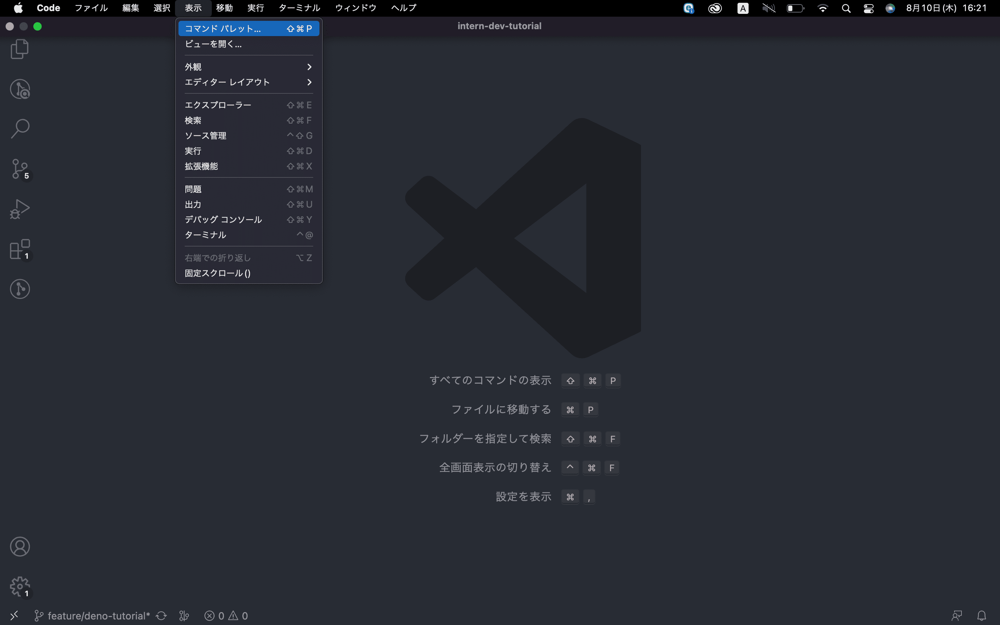
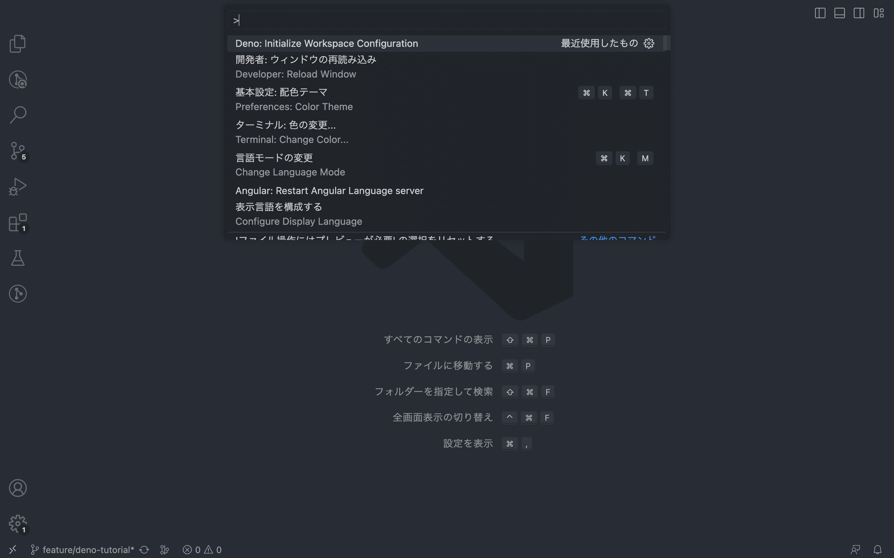
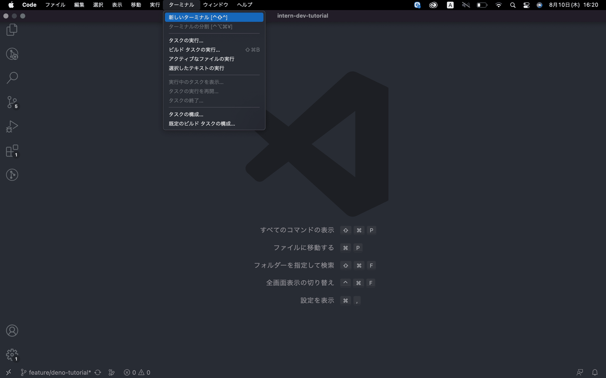
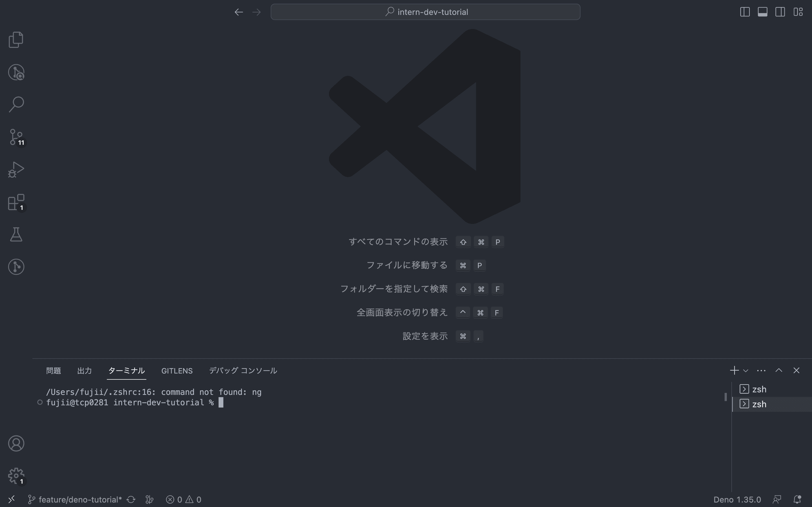
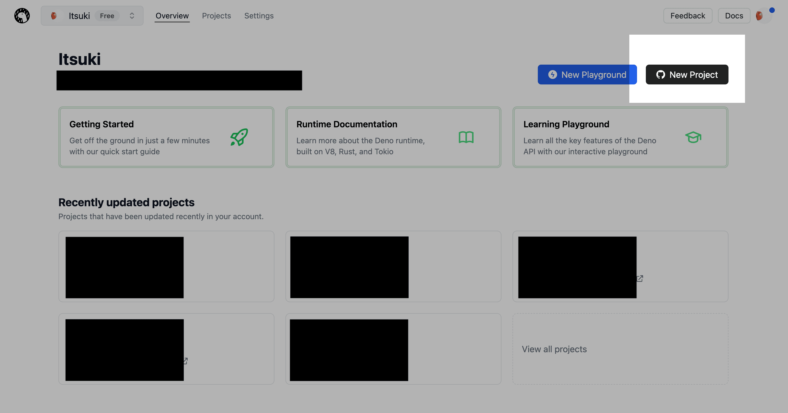
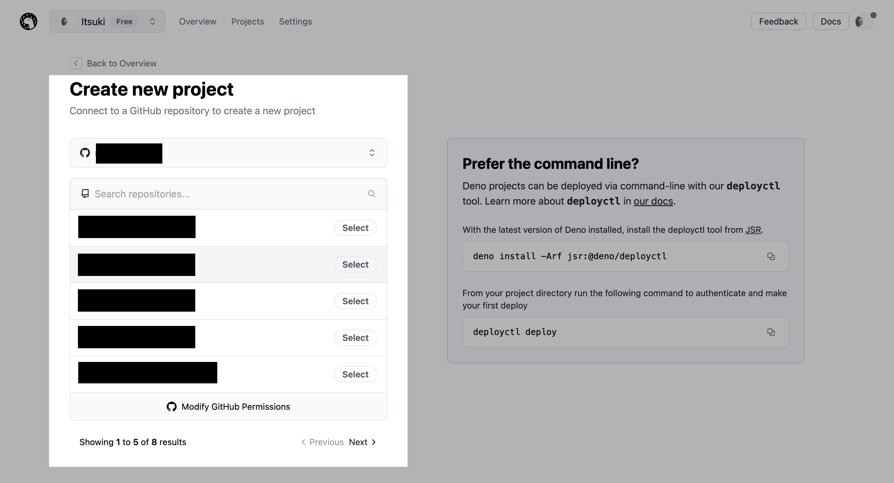
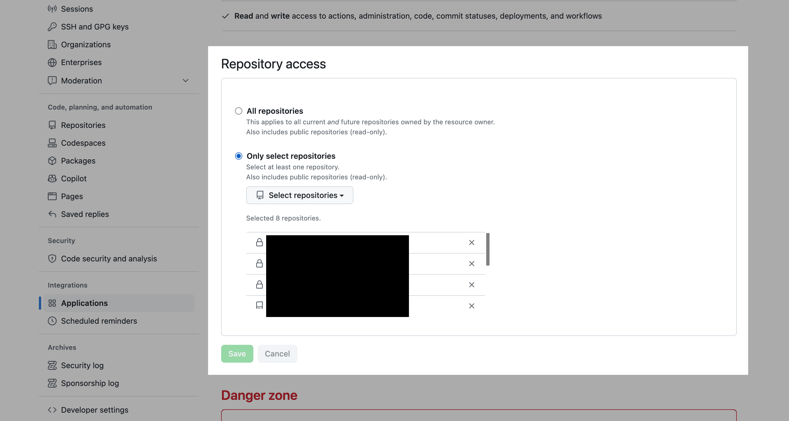
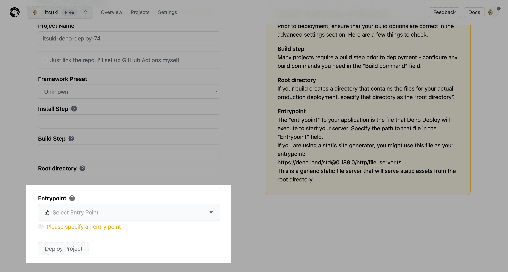

# Deno と Deno Deploy ハンズオン

- [Deno と Deno Deploy ハンズオン](#deno-と-deno-deploy-ハンズオン)
- [0. このセクションの目標](#0-このセクションの目標)
- [1. まず、Deno って何？](#1-まずdeno-って何)
- [2. さっそく、Deno をインストールしましょう](#2-さっそくdeno-をインストールしましょう)
- [3. Deno 使ってみよう](#3-deno-使ってみよう)
  - [3-1. 下準備](#3-1-下準備)
  - [3-2. JavaScript のコードを実行してみよう](#3-2-javascript-のコードを実行してみよう)
  - [3-3. ファイルを実行するときの権限の許可について](#3-3-ファイルを実行するときの権限の許可について)
  - [3-4. (発展) 毎回打ち込むコマンドが長いと感じたら](#3-4-発展-毎回打ち込むコマンドが長いと感じたら)
  - [3-5. (発展) JavaScript ファイルをリントしてみよう](#3-5-発展-javascript-ファイルをリントしてみよう)
  - [3-6. (発展) JavaScript ファイルをフォーマットしてみよう](#3-6-発展-javascript-ファイルをフォーマットしてみよう)
  - [3-7. (発展) JavaScript ファイルをテストしてみよう](#3-7-発展-javascript-ファイルをテストしてみよう)
- [4. (発展) サンプルプロジェクトのコードを読んでみよう](#4-発展-サンプルプロジェクトのコードを読んでみよう)
  - [4-1. (発展) server.js を読んでみよう](#4-1-発展-serverjs-を読んでみよう)
  - [4-2. (発展) ESModule の形でファイルを読み込む](#4-2-発展-esmodule-の形でファイルを読み込む)
  - [4-3. (発展) import map を使ってみよう](#4-3-発展-import-map-を使ってみよう)
  - [4-4. (発展) クライアント側からの API リクエストを処理](#4-4-発展-クライアント側からの-api-リクエストを処理)
  - [4-5. (発展) public/index.js を読んでみよう](#4-5-発展-publicindexjs-を読んでみよう)
- [5. Deno Deploy を用いてコードをデプロイしてみよう](#5-deno-deploy-を用いてコードをデプロイしてみよう)
- [5-1. 実際にデプロイしてみる](#5-1-実際にデプロイしてみる)
- [6. まとめ](#6-まとめ)

# 0. このセクションの目標

このセクションでは以下の項目を身につけましょう！

1. `deno run`コマンドで TypeScript ファイルを実行できる 💪
2. Deno Deploy を用いてコードをデプロイして、他の人が見られるようにする 🚀

その他発展的内容も記載しています。

- Deno でコードをリントしてみよう
- Deno でコードをフォーマットしてみよう
- Deno でコードをテストしてみよう
- サンプルプロジェクトのコードを読んでみよう

# 1. まず、Deno って何？

[Deno](https://deno.land/) とは、JavaScript や TypeScript で書かれたコードを実行する環境です。

> 公式サイト
> <a href="https://deno.land/"> >  </a>

Deno がインストールされた環境で`deno run <ファイル名>`のコマンドを実行することで、JavaScript や TypeScript で書かれたファイルを実行できます。

Deno はコードを実行する機能以外にも、コードをリントしたり、コードをフォーマットしたり、コードをテストしたりできる機能が初めから備わっていて大変便利です。

このセクションではサンプルプロジェクトを用意しています。これから Deno をインストールして、書いたコードを実行してみましょう！

# 2. さっそく、Deno をインストールしましょう

早速、Deno を以下のリンク先からインストールしてみましょう。

[公式サイト - Deno のインストール方法](https://docs.deno.com/runtime/manual/getting_started/installation)

基本的には公式サイトの手順を参考にします。

ターミナルを準備してから、公式サイトのコマンドをコピーしてターミナルに貼り付けてインストールしてみましょう。

**ターミナル**は**Windows**なら`powershell`、**Mac OS**なら`ターミナル`などがありますが、なんでも大丈夫です。

Mac OS の人は`homebrew`というパッケージ管理ツールをインストールして、その`homebrew`を使用して`Deno`をインストールすると今後も便利そうです。

[homebrew の公式サイト](https://brew.sh/ja)

# 3. Deno 使ってみよう

サンプルプロジェクトのコードを Deno で実行してみよう。

## 3-1. 下準備

1. VSCode で、`intern-dev-tutorial/deno`を開きましょう。

2. VSCode の拡張機能のタブから「Deno」を検索してインストールしよう。


3. VSCode の上のヘッダーの「**表示**」から「**コマンドパレット(Command Palette)**」を押す。



4. 「**Deno: Initialize Workspace Configuration**」を選択する。



5. VSCode の上のヘッダーの「**ターミナル**」から「**新しいターミナル**」を押して、ターミナルを表示しておこう





Deno を有効化すると、現在のフォルダに`.vscode`というフォルダが作成されて、中に`settings.json`というファイルが作成されます。

今回は VSCode で Deno を快適に使用できるようにするためこのような設定をします。

`settings.json`は、 Deno を使用する上での設定を登録できるファイルです。
準備に沿って設定すると、以下のような内容になっています。

```json
{
  "deno.enable": true
}
```

## 3-2. JavaScript のコードを実行してみよう

このセクションでは、Deno で JavaScript ファイルを**実行する**方法を学びます。

Deno では JavaScript ファイルを`run`コマンドを用いて以下のようにして実行できます。

```shell
deno run <ファイル名>
```

では、早速 Deno でこのプロジェクトの直下にある`server.js`を実行してみましょう。

ターミナルで以下のテキストを入力して Enter を押してみましょう。

```shell
deno run server.js
```

実行すると以下のような文言がターミナルに表示されます。

```shell
┌ ⚠️  Deno requests net access to "0.0.0.0:8000".
├ Requested by `Deno.listen()` API.
├ Run again with --allow-net to bypass this prompt.
└ Allow? [y/n/A] (y = yes, allow; n = no, deny; A = allow all net permissions) >
```

一旦は深く考えずに`y`を入力していきましょう。

そうすると以下のような文言がターミナルに表示されます。

```shell
Listening on http://localhost:8000/
```

では、ブラウザのアドレスバーに <http://localhost:8000> のアドレスを入力して検索してみましょう。

検索してみても画面が切り替わらないですね。
ここでターミナルの方を見てみましょう。

```shell
┌ ⚠️  Deno requests read access to "public".
├ Requested by `Deno.stat()` API.
├ Run again with --allow-read to bypass this prompt.
└ Allow? [y/n/A] (y = yes, allow; n = no, deny; A = allow all read permissions) >
```

このような文言が表示されているので、先ほど同様に`y`を押してみましょう。

ブラウザに戻ってみて、以下のような画面が表示されれば成功です！


インターンへようこそ！

Deno で JavaScript ファイルの`server.js`を無事実行できました！ 簡単ですね！

## 3-3. ファイルを実行するときの権限の許可について

実行されたコード内で「ファイルの読み込み/書き込み」や「ネットワーク通信」の処理が走るとその時点でコンソールに確認の文言が表示され、そのまま実行するか拒否するかの選択を促します。

改めて先ほど表示された文言を確認してみましょう。

```shell
┌ ⚠️  Deno requests net access to "0.0.0.0:8000".
├ Requested by `Deno.listen()` API.
├ Run again with --allow-net to bypass this prompt.
└ Allow? [y/n/A] (y = yes, allow; n = no, deny; A = allow all net permissions) >

Deno が`0.0.0.0:8000`にアクセスしようとしています。許可するには`y`、拒否するには`n`、以降全てのネットワーク権限を許可するには`A`を入力してください
```

先ほど表示された文言は上記のようになっており、ネットワークへのアクセスを許可するために`y`を押したということになります。

一方で、ブラウザで`http://localhost:8000`へアクセスした時に表示された以下の文言は以下のような内容でした。

```shell
┌ ⚠️  Deno requests read access to "public".
├ Requested by `Deno.stat()` API.
├ Run again with --allow-read to bypass this prompt.
└ Allow? [y/n/A] (y = yes, allow; n = no, deny; A = allow all read permissions) >

public フォルダ内のファイルの読み込みを行おうとしています。許可するには`y`、拒否するには`n`、以降全ての読み込み権限を許可するには`A`を入力してください
```

このように Deno はデフォルトでは「ファイルの読み込み/書き込み」、 「ネットワーク通信」を許可しない限りは一切実行できません。

この仕組みにより、Deno では**高いセキュリティ**が期待できます。

しかし、毎回実行するたびに`y`を入力するのは面倒ですよね。

**run**コマンドにオプション指定をして毎回`y`を入力しないようにしてみましょう。

`deno run`をするときに、それぞれ以下のような対応のオプション指定をしてあげると、権限を許可できます。

- ファイルの読み込み -> `--allow-read`

- ファイルの書き込み -> `--allow-write`

- ネットワーク通信 -> `--allow-net`

今回の場合「ファイルの読み込み」と「ネットワーク通信」の権限を与える必要があったので、以下のように実行してあげるとターミナルに警告文が表示されずに実行できます！

```shell
deno run --allow-read --allow-net server.js
```

オプションを指定したコマンドを実行して、警告文がでないことを確認してみましょう。

また、`--watch`オプションについても知っておくと良さそうです。

`--watch`オプション指定をしておくことで、  
`server.js`を編集した時に再度コマンドを打って実行しなおさなくても Deno が勝手に再実行してくれるので便利です。

`--watch`オプション指定を加えたコマンドで`server.js`を実行してみましょう。

最終的なコマンドは以下のようになります。

```shell
deno run --watch --allow-read --allow-net server.js
```

## 3-4. (発展) 毎回打ち込むコマンドが長いと感じたら

前のセクションでは以下のコマンドで`server.js`が実行できることを学びました。

```shell
deno run --watch --allow-read --allow-net server.js
```

しかし、このコマンドで毎回実行しようとすると以下のようなデメリットが考えられます。

- 毎回これを打つのは長い
- どの権限を許可していたか忘れたら、一度実行しないといけない
- 結局このコマンドをどこかにメモなどに保存する流れになりそう

このようなデメリットを解決する方法として、**task**コマンドがあります！

このセクションでは**task**コマンドについて学んでいきますが、  
チーム開発では無理に使う必要はなく、**run**コマンドで毎回実行しても問題ないです。

**task**コマンドは以下のようにして実行します。

```shell
deno task <タスク名>
```

では、このタスク名は`deno.json`ファイルで設定しています。

`deno.json`ファイルの以下の部分をみてみましょう。

```json
  "tasks": {
    "start": "deno run --watch --allow-net --allow-read server.js"
  },
```

ここには、実行したいコマンドに別名(タスク名)を与えることができます。

`deno run --watch --allow-net --allow-read server.js`に`start`と言う別名を与えるように設定しています。

よって`deno task start`に実行すると`deno run --watch --allow-net --allow-read server.js`を実行していることと同じになります。

```shell
deno task start
```

とてもスッキリして良さそうです！

もし追加でファイルの書き込み権限を与えるために`--allow-write`オプションを追加したいとなっても、`deno.json`の`start`部分のコードを修正するだけで良いです。

このセクションでは**task**コマンドについて学びました。
便利コマンドなのでぜひ使ってみてください！

## 3-5. (発展) JavaScript ファイルをリントしてみよう

このセクションでは、Deno で JavaScript ファイルを**リント**する方法を学びます。

`Deno`には JavaScript ファイルをリントする機能が標準で備わっています。

**リント**とは、「**与えられたルールに基づいて、潜在的にバグとなりうるソースコードを チェック すること**」です。

例えば以下のようなものが挙げられます。

- ソースコード内に未使用の変数が存在する
- ソースコード内に初期化されていない変数が存在する

この機能を使うことで意図してないミスを未然に警告してくれて大変に役立ちます。

JavaScript ファイルをリントするには以下のようなコマンドでできます。

```shell
deno lint
```

とても簡単にできます。

このリントで参照する**ルール**は`deno.json`の`lint`部分で設定されています。

```json
  "lint": {
    "include": ["./**/*.js"],
    "rules": {
      "tags": ["recommended"],
      "include": ["ban-untagged-todo"],
      "exclude": ["no-unused-vars"]
    }
  }
```

今回のこの設定は[Deno 公式サイト](https://docs.deno.com/runtime/manual/getting_started/configuration_file/#lint)の設定をコピーしたものです。

Deno でリント時に参照されるルールの一覧は[Deno のリントルール](https://lint.deno.land/?q=&all=on)で確認できます。

今回の設定では`tags`に`recommended`が指定されているので、上記のサイトのルール一覧の中から`recommended`タグがついているもの全て適用しています。

また、`include`によって追加で`ban-untagged-todo`ルールを適用し、`exclude`によって`no-unused-vars`ルールを除外しています。

`recommended`ルールでは、他の有名なリンターの
[ESLint](https://eslint.org/) や [typescript-eslint](https://typescript-eslint.io/) で `recommended` として扱われているルールの多くをサポートしています。

では、一度リントエラーを起こしてみましょう。

`server.js`を開いて一番下の行に以下の行を追加して、`Ctrl + S`で保存してみましょう。

```js
var message = "Jig.jpインターンへようこそ！";
```

保存ができたらターミナルで以下のコマンドを実行してみましょう。

```txt
deno lint
```

そうすると以下のような結果が表示されます。

```shell
(no-var) `var` keyword is not allowed.
var message = 'Jig.jpインターンへようこそ！';
^^^^^^^^^^^^^^^^^^^^^^^^^^^^^^^^^^
    at /Users/fujii/dev/deno-sample-project/server.js:27:1

    help: for further information visit https://lint.deno.land/#no-var

Found 1 problem
Checked 3 files
```

これは「var は使わないでください」といった警告文です。([詳細なルール: no-var](https://lint.deno.land/rules/no-var))

どのファイルの何行目まで表示してくれて便利です。

このように、**lint**コマンドを実行すると、あらかじめ決めておいた「ルール」を元に、それにそぐわないコードがないか チェック します。

チーム開発でも**リント**を使って、潜在的にバグとなりうるコードがないかチェックしてみましょう！

## 3-6. (発展) JavaScript ファイルをフォーマットしてみよう

このセクションでは、Deno で JavaScript ファイルを**フォーマット**する方法を学びます。

`Deno`にはファイルを**フォーマット**する機能も標準で備わっています。

`フォーマットする`とは「**コードの形を整える**」ことです。

この**フォーマット**を使用することでどの人がコードを書いても同じようにコードを整えられるので、  
人によってコードの形がバラバラになるといったことが起こらず便利です。

自分 1 人で開発している時であっても、適当に書いたコードをきれいに整えてくれるのでありがたいです。

JavaScript ファイルをフォーマットするには以下のようなコマンドでできます。

```shell
deno fmt
```

これも簡単ですね。

このコマンドを実行するとカレントディレクトリ以下の JavaScript ファイル全てに対してフォーマットします。

フォーマットの設定は、`deno.json`の`fmt`部分で設定されています。

こちらもリントと同様に、[公式サイト](https://docs.deno.com/runtime/manual/getting_started/configuration_file/#fmt)の設定をコピーしたものです。

```json
  "fmt": {
    "useTabs": true, // タブを使用するか
    "lineWidth": 80,  // 一行の文字数
    "indentWidth": 4, // インデントの文字数
    "semiColons": true, // セミコロンをつけるかどうか
    "singleQuote": true, // シングルクォートを使用するかどうか
    "proseWrap": "preserve",
    "include": ["./**/*.js"],
  }
```

基本的にはこの設定で十分ですが、ルールを変更したい時にはこちらの設定をいじりましょう。

設定できるフォーマッタの種類については[公式サイト](https://docs.deno.com/runtime/manual/tools/formatter/)から確認できます。

では、実際にフォーマットしてみましょう！

```shell
deno fmt
```

をターミナルに打ち込んで Enter をしてみましょう。

```chell
Checked 3 files
```

のような文言が表示されました。

では、`server.js`の中身を見て何か変化はありましたでしょうか？

おそらくないはずです。

すでに指定されたルールに則って、フォーマット(整形)してあったからです。

では試しに、フォーマットのルールを変えてみましょう。

`deno.json`の`fmt`部分の  
`semiColons`の部分を`false`, `singleQuote`の部分を`true`に書き換えてみましょう。

以下のようになります。

```json
  "fmt": {
    "useTabs": false,
    "lineWidth": 80,
    "indentWidth": 2,
    "semiColons": false, // trueからfalseに変更した
    "singleQuote": true, // falseからtrueに変更した
    "proseWrap": "preserve",
    "include": ["./**/*.js"]
  },
```

そして再度、`deno fmt`を実行し, `server.js`の中身を見てみましょう。

- 行末にセミコロン(;)がない

- 文字列はすべて('')で囲まれている

のように修正されていますね。

このように`deno fmt`を使用することでコードを整えてくれます。

チーム開発でもこのフォーマット機能を利用してきれいなコードにしていきましょう！

## 3-7. (発展) JavaScript ファイルをテストしてみよう

このセクションでは、Deno で JavaScript ファイルを**テスト**する方法を学びます。

Deno には JavaScript ファイルを`テスト`を実行する環境も標準で備わっています。

**テスト**には手動テストと自動テストがあります。

- 手動テストは、実際に手を動かして動作確認するもの

- 自動テストは、コードが正しく動作されるかテストする、**テスト専用のコード**が書かれたファイルを実行すること

で、Deno に備わっているのは「自動テスト」が行える環境です。

自動テストが行える環境を構築するのはやや大変ですが、Deno では標準で備わっているためとても便利です。

自動テストコードを書いてテストを実行することで、以下のようなメリットがあります。

- コードが適切に動作することに安心できる
- 1 回の実行で全てのテストファイルを実行できるので手動でテストするよりも効率がいい
- 自分が修正した範囲以外で悪影響がないことを安心できる

JavaScript ファイルをテストするには以下のようなコマンドでできます。

```shell
deno test
```

これも簡単ですね！

テストの設定に関しても以下のように、`deno.json`の`test`部分で設定しています。

この設定では、末尾に`.test.js`がついているファイルを実行するように指定しています。

```json
  "test": {
    "include": [
      "./**/*.test.js"
    ]
  }
```

では早速テストコードを実行してみましょう。

ターミナルに以下のコマンドを入力して Enter を押してみましょう。

```shell
deno test
```

すると、以下のような文言が表示されます。

```shell
running 1 test from ./sample.test.js
1 + 1 は 2 である ... ok (9ms)

ok | 1 passed | 0 failed (89ms)
```

`./sample.test.js`の「1+1 は 2 である」というテストが 1 つ実行され、OK でしたと表示されています。

では`sample.test.ts`の中身を以下のように修正し保存して、`deno test`を実行してみましょう。

```js
assertEquals(1 + 1, 2);

↓

assertEquals(1 + 1, 3); // 3に修正
```

すると今度は以下のような文言が表示されます。

```shell
1 + 1 は 2 である ... FAILED (10ms)

 ERRORS

1 + 1 は 2 である => ./sample.test.js:3:6
error: AssertionError: Values are not equal.


    [Diff] Actual / Expected


-   2
+   3

  throw new AssertionError(message);
        ^
    at assertEquals (https://deno.land/std@0.193.0/testing/asserts.ts:188:9)
    at file:///Users/fujii/dev/deno-sample-project/server.test.js:5:3

 FAILURES

1 + 1 は 2 である => ./sample.test.js:3:6

FAILED | 0 passed | 1 failed (24ms)

error: Test failed
```

このようにもし自動テストで失敗したテストがあれば、以下の情報が表示されます。

- 自動テストが失敗したこと

- どのテストが失敗したか

- 失敗した箇所

- 期待された値とテスト時に渡された値

このように`Deno`では、テストを行える環境が標準で備わっています。

より詳しい Deno での自動テストに関する記事は[公式サイト](https://docs.deno.com/runtime/manual/basics/testing/)をみて見てください。

# 4. (発展) サンプルプロジェクトのコードを読んでみよう

ここからはいままで実行してきた`server.js`やこのディレクトリのファイル構造についてみていきましょう。

それぞれのファイルの役割を説明していきます。

- `deno.json`
  - `Deno`であれこれ実行させるときに必要な設定ファイル
  - `task`, `lint`, `fmt`, `test`などの様々な設定ができる。
  - `imports`に関しては後ほど説明
- `server.js`
  - このサンプルプロジェクトのサーバー部分。
  - ブラウザからのアクセスに対して、表示させたいファイルや文言を返す処理が書かれている。
  - 先ほど`deno task start`で実行させていたファイル
- `sample.test.js`
  - テストコードが書かれたファイル
  - `deno test`で実行させていたファイル
- `public/`
  - ブラウザからリクエストが来た時に、`server.js`内の処理によってブラウザに返されるファイル類
  - `index.html`
    - ブラウザに表示するファイル
  - `styles.css`
    - スタイリングを指定するファイル
  - `index.js`
    - ブラウザからサーバーにアクセスする処理が書かれたファイル

## 4-1. (発展) server.js を読んでみよう

このセクションでは`server.js`を読みながら以下のことを学んでいきましょう！

- ESModule の形でファイルを読み込む方法

- import map を使う方法

- クライアント側からの API リクエストに対して、ファイルや文字列を返す方法

## 4-2. (発展) ESModule の形でファイルを読み込む

まずは「ESModule の形でファイルを読み込む方法」について学んでいきます。

Deno で「外部からファイルを取り込む」時は**ESModule**というファイルの読み込みの仕組みを採用しています。

**ESModule**の特徴は以下のようなものが挙げられます。

- `import`, `export`を用いて取り入れ/公開を制御できる
- ファイルを実行するときに、勝手に`import`先からコードを参照するため、複数のファイルを読み込む必要がなくなる

以下のようにしてその JavaScript ファイルに必要な外部の変数やメソッドを取り込むことができます。

```ts
import { <変数>, <メソッド> } from "JavaScriptファイルのPathやUrl"
```

また、`html`ファイルから JavScript ファイルを読み込みたい時がありますが、  
その場合は`type="module"`を付与して以下のようにします。

```html
<script type="module" src="JavaScriptファイルのPathやUrl"></script>
```

`server.js`の最初の行で行っているように外部の`serveDir`メソッドを取り込むことは以下のようにしてできます。

```js
import { serveDir } from "jsr:@std/http/file-server@1.0.17";
```

しかし、実際の`server.js`で書かれているコードは少し違っていますね。
そのことに関しては次のセクションで学びましょう。

上記のコードで書いても問題なく動くため安心してください。

このセクションでは**ESModule**と言う形で外部のファイルを取り込む方法を学びました！

## 4-3. (発展) import map を使ってみよう

前のセクションで以下のように外部の変数やメソッドを取り込む方法を学びました。

```js
import { serveDir } from "jsr:@std/http/file-server@1.0.17";
```

ここで、Deno の**import map**と言う機能を使ってみましょう。

まず`deno.json`の`import`部分をみてみると以下のようになっています。

```json
  "imports": {
    "@std/http": "jsr:@std/http@^1.0.17"
  },
```

この設定によって JavaScript ファイルで外部のファイルにアクセスするとき、  
`jsr:@std/http/file-server@1.0.17`は`@std/http`でアクセスできるようになりました。

よって以下のように書き換えることができます！

```ts
import { serveDir } from "@std/http";
```

スッキリして良さそうですね。

**import map**と言う機能を使用することで以下のようなメリットがあります。

- 毎回 URL を直書きする必要がなくなる

- 可読性が上がる

- 使用する外部のファイルのバージョンを固定できる

- バージョンの変更は`deno.json`の`import`部分の URL の数字を変えるだけで全てのファイルに適用される

- `deno.json`の`import`部分を見るだけで、このプロジェクトで使用されているライブラリの一覧を確認できる

ぜひ使ってみましょう！

このセクションでは**import map**と言う機能の使い方や使用するメリットを学びました。

## 4-4. (発展) クライアント側からの API リクエストを処理

クライアント側からの API リクエストに関する処理を学びましょう！

- API リクエストの種類を判別する処理

- ファイルを返す処理

- 文字列を返す処理

まずクライアント側からの API リクエストを受け付ける処理は以下のように`serve`関数で行います。

```js
/**
 * APIリクエストを処理する
 */
Deno.serve((req) => {
  // リクエストに対する処理の中身
});
```

この`req`変数を用いて API リクエストの`method`部分と`path`部分を見ていきます。

API リクエストには`method`というものがあり、以下のようなものがあります。

- GET (取得)

- POST (送る)

- PUT (更新)

- DELETE (削除)

また API リクエストの**path**というものは`GET http://localhost:8000/welcome-message`の`/welcome-message`部分を指します。

`server.js`では、API リクエストの`method`が`GET`で、`path`が`/welcome-message`の時に`return new Response(<文言>)`で文言を返しています。

以下の箇所で行っています。

```js
// URLのパスを取得
const pathname = new URL(req.url).pathname;
// パスが"/welcome-message"だったら「"jigインターンへようこそ！"」の文字を返す
if (req.method === "GET" && pathname === "/welcome-message") {
  // 文言を返す
  return new Response("jig.jpインターンへようこそ！👍");
}
```

それ以外の時、例えば`http://localhost:8000/`にアクセスした時は、  
path が`/`なので以下のように public フォルダをクライアントに返しています。

```js
// publicフォルダ内にあるファイルを返す
return serveDir(req, {
  fsRoot: "public",
  urlRoot: "",
  showDirListing: true,
  enableCors: true,
});
```

よって、`deno run`を実行してから、`http://localhost:8000/`にアクセスすると`public`内の`index.html`のページが表示されるんですね。

## 4-5. (発展) public/index.js を読んでみよう

クライアント側で表示される`index.html`から読み込まれる`index.js`を読んでいきましょう。

`index.js`の読み込み方法は以下のように、「[3-７-2. (発展) ESModule の形でファイルを読み込む](#3-７-2-発展-esmoduleの形でファイルを読み込む)」でも説明しましたように ESModule の形で読み込んでいます。

```html
<script type="module" src="./index.js"></script>
```

`index.js`をみてみましょう。

```js
addEventListener('load', async () => {
  ...
});
```

この部分は「`ページ全体が、スタイルシートや画像などのすべての依存するリソースを含めて読み込まれたときに発生します`」というものです。([MDN: loadイベント](https://developer.mozilla.org/ja/docs/Web/API/Window/load_event))

中のコードを見ていきます。

```js
const response = await fetch("/welcome-message");
```

ここでは**fetch API**を使用しています。
fetch メソッドは引数で**path**を指定して、サーバーにリクエストを送ります。

この場合、引数が`/welcome-message`になっているので、現在開いているアドレスのホスト名の`http://localhost:8000`に path の`/welcome-message`をくっ付けて`http://localhost:8000/welcome-message`にアクセスします。

先ほどの「[4-4. (発展) クライアント側からの API リクエストを処理](#4-4-発展-クライアント側からの-api-リクエストを処理)」でも説明しましたように、この API リクエストに対してクライアント側に`"jig.jpインターンへようこそ！👍"`という文字を返しています。

以下のコードで`index.html`内にある`id="welcomeMessage"`の要素を探して、`"jig.jpインターンへようこそ！👍"`の文字を入力しています。

```js
document.querySelector("#welcomeMessage").innerText = await response.text();
```

これで`http://localhost:8000/`へアクセスした時に、「jig.jp インターンへようこそ！」の文言が画面に表示されるサンプルプロジェクトの流れを追うことができました。

# 5. Deno Deploy を用いてコードをデプロイしてみよう

ここでは自分のコードをデプロイする方法を学びましょう。

前のセクションまでは手元のコンソールで`deno run <ファイル名>`のコマンドを入力して、ブラウザから <http://localhost:8000/>にアクセスしてページを表示していました。

しかし、その状態のままでは他の人に自分のサイトを表示させることができないですね。

他の人にも自分のサイトをみてもらえるようにデプロイを行いましょう。

デプロイとは、開発したアプリケーションを実際に外部の環境に配置し、運用を開始する作業を指します。

このセクションでは Deno Deploy を用いて、`deno run <ファイル名>`を外部のサーバーで実行させることで、指定された URL から誰でもそのサイトを見ることができるようにします。

# 5-1. 実際にデプロイしてみる

Deno を用いた開発をしているのであれば、Deno Deploy を使用することでとても簡単にコードをデプロイできます。

[Deno Deploy の公式サイト](https://deno.com/deploy) を開きましょう。

まずは自分の GitHub アカウントでログインしましょう。


ログインできたら「Overview」の画面の右上にある「New Project」ボタンからプロジェクト作成画面に移動しましょう。



自分が作成したプロジェクトを選択しましょう。



もしここに作成したプロジェクトが表示されない場合は、「Modify GitHub Permission」をクリックして、GitHub の設定画面に遷移してください。



「Repository access」の項目で Deno Deploy からアクセスできるリポジトリ(プロジェクト)を選択できます。「Select Repositories」から自分が作成したプロジェクトを選択して、「Save」ボタンで保存しましょう。

保存し終えたら Deno Deploy の画面から再度自分が作成したリポジトリを選択しましょう。

選択したら、「Entrypoint」の欄から`deno run`で実行したいファイルを選択します。`deno run server.js`としたい場合は`server.js`を選択します。



「Entrypoint」のファイルを選択し終えたら、「Deploy Project」ボタンからデプロイを行いましょう！

デプロイが完了したらダッシュボード画面に遷移します。

その画面の「Domains」の箇所に記載されている URL をクリックすることでサイトにアクセスできます！

コードを書かずにポチポチ選択するだけでデプロイできました！ 簡単ですね！

# 6. まとめ

このセクションの初めに以下の目標を立てましたが、達成できましたでしょうか？

> このセクションでは以下の項目をマスターしましょう 🎉
>
> 1. `deno run`コマンドで TypeScript ファイルを実行できる 💪
> 2. Deno Deploy を用いてコードをデプロイする方法を理解する 🚀

他の発展的な内容もとても便利な機能ばかりですので、ぜひ実際に開発する時には Deno の様々な機能を活用してみてください！
