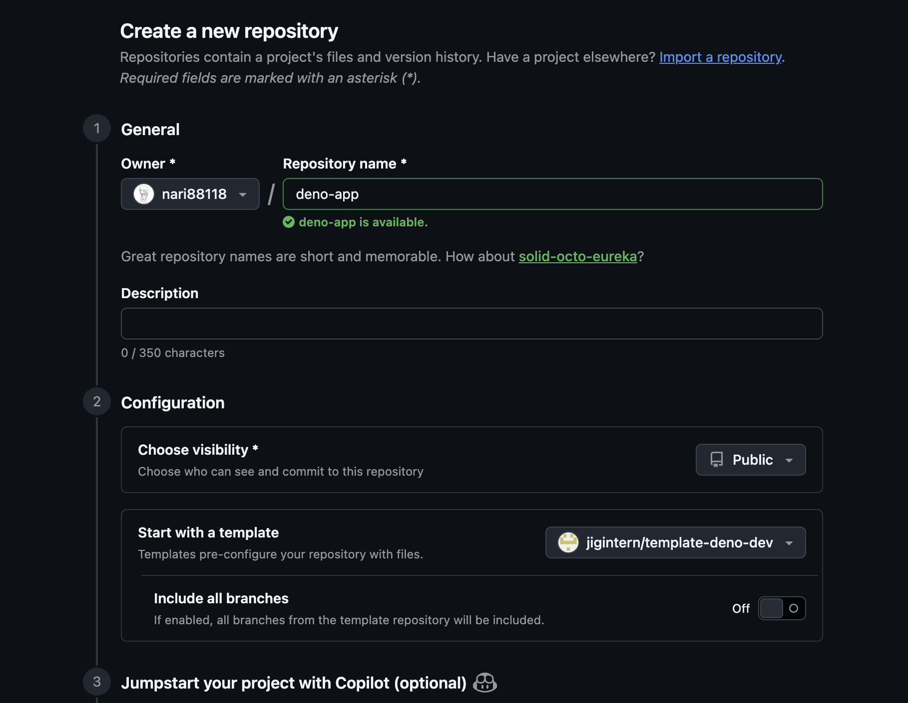
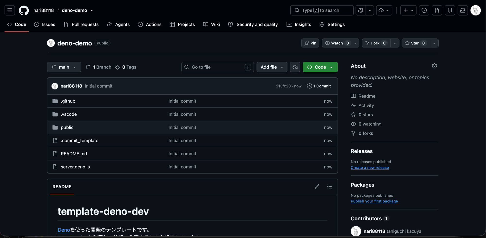
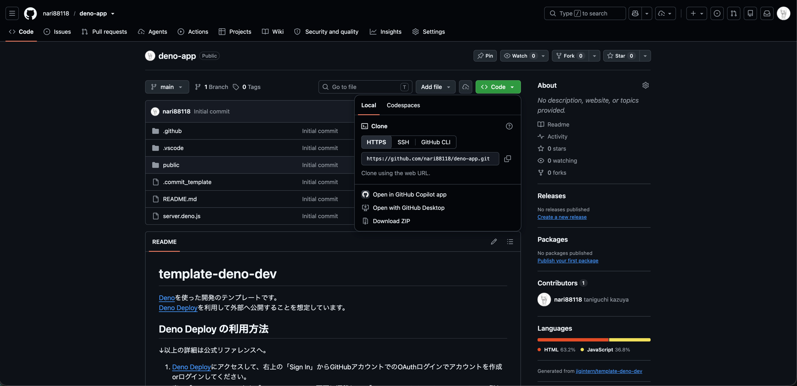
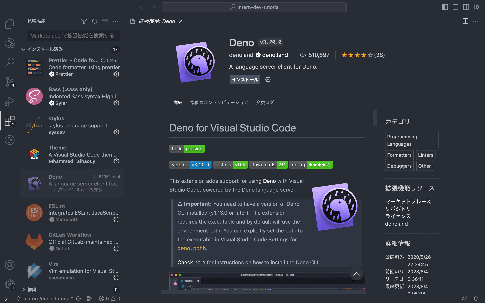
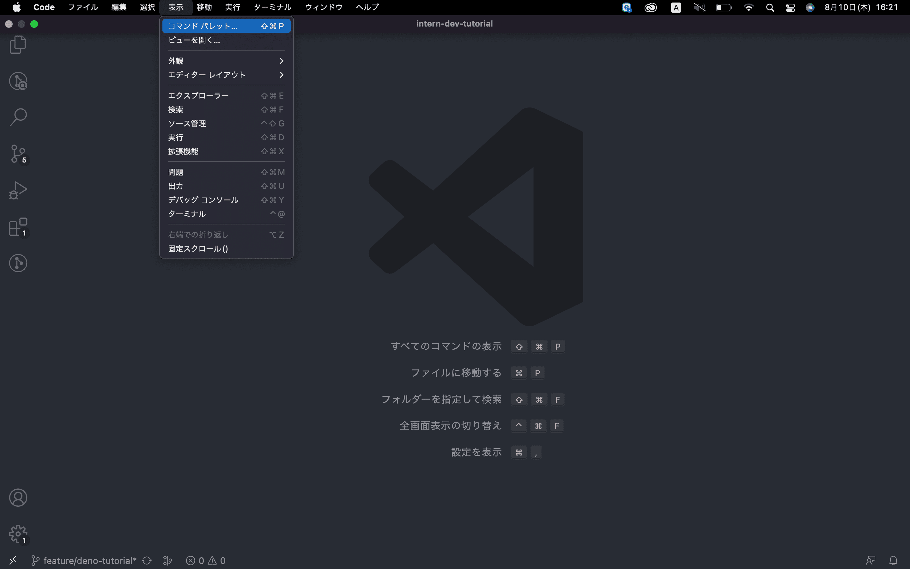
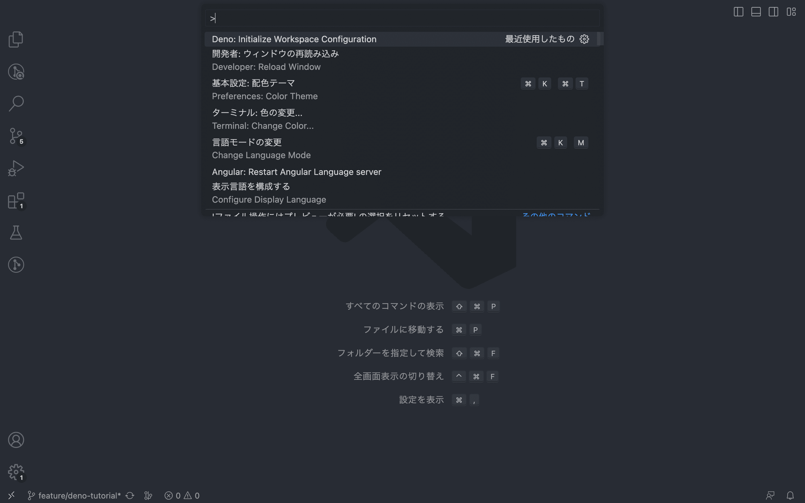
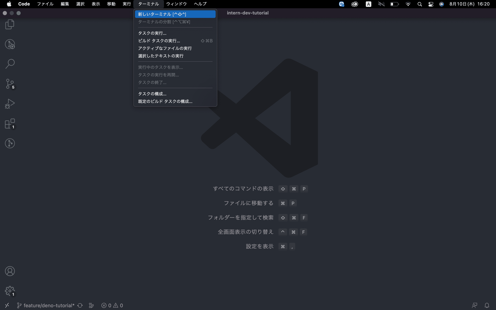
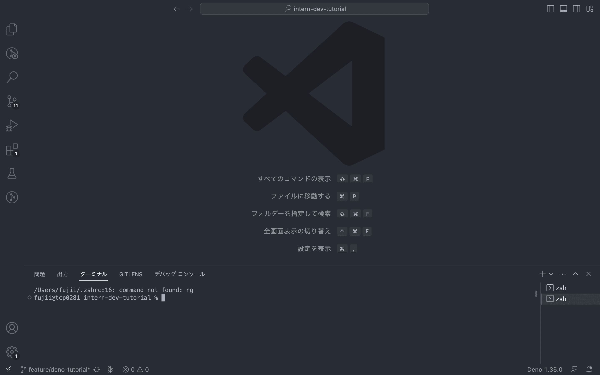

# Deno と Deno Deploy ハンズオン

- [Deno と Deno Deploy ハンズオン](#deno-と-deno-deploy-ハンズオン)
- [0. このセクションの目標](#0-このセクションの目標)
- [1. まず、Deno って何？](#1-まずdeno-って何)
- [2. さっそく、Deno をインストールしましょう](#2-さっそくdeno-をインストールしましょう)
- [3. GitHub に自分のリポジトリを作ろう](#3-github-に自分のリポジトリを作ろう)
  - [3-1. 新しいリポジトリを作る](#3-1-新しいリポジトリを作る)
  - [3-2. できたリポジトリを確認する](#3-2-できたリポジトリを確認する)
  - [3-3. 自分の PC にクローンする](#3-3-自分の-pc-にクローンする)
- [4. Deno 使ってみよう](#4-deno-使ってみよう)
  - [4-1. 下準備](#4-1-下準備)
  - [4-2. JavaScript のコードを実行してみよう](#4-2-javascript-のコードを実行してみよう)
  - [4-3. ファイルを実行するときの権限の許可について](#4-3-ファイルを実行するときの権限の許可について)
- [5. 自分で書き換えてみよう](#5-自分で書き換えてみよう)
  - [5-1. サーバーが返す文言を変えてみよう](#5-1-サーバーが返す文言を変えてみよう)
  - [5-2. ページの見た目を変えてみよう](#5-2-ページの見た目を変えてみよう)
  - [5-3. うまくいかないときは](#5-3-うまくいかないときは)
  - [5-4. 書き換えたら、GitHub に送っておこう](#5-4-書き換えたらgithub-に送っておこう)
- [6. デプロイして、他の人に見てもらおう](#6-デプロイして他の人に見てもらおう)
- [7. (発展) Deno の便利な機能を使ってみよう](#7-発展-deno-の便利な機能を使ってみよう)
  - [7-1. (発展) 毎回打ち込むコマンドが長いと感じたら](#7-1-発展-毎回打ち込むコマンドが長いと感じたら)
  - [7-2. (発展) JavaScript ファイルをリントしてみよう](#7-2-発展-javascript-ファイルをリントしてみよう)
  - [7-3. (発展) JavaScript ファイルをフォーマットしてみよう](#7-3-発展-javascript-ファイルをフォーマットしてみよう)
  - [7-4. (発展) JavaScript ファイルをテストしてみよう](#7-4-発展-javascript-ファイルをテストしてみよう)
- [8. (発展) サンプルプロジェクトのコードを読んでみよう](#8-発展-サンプルプロジェクトのコードを読んでみよう)
  - [8-1. (発展) server.js を読んでみよう](#8-1-発展-serverjs-を読んでみよう)
  - [8-2. (発展) ESModule の形でファイルを読み込む](#8-2-発展-esmodule-の形でファイルを読み込む)
  - [8-3. (発展) import map を使ってみよう](#8-3-発展-import-map-を使ってみよう)
  - [8-4. (発展) クライアント側からの API リクエストを処理](#8-4-発展-クライアント側からの-api-リクエストを処理)
  - [8-5. (発展) public/index.js を読んでみよう](#8-5-発展-publicindexjs-を読んでみよう)
- [9. まとめ](#9-まとめ)

# 0. このセクションの目標

このセクションのゴールはひとつです。

**スマホで、自分の Web アプリが見られる** 🚀

そのために、以下の順で進めます。

1. Deno をインストールする
2. GitHub に自分のリポジトリを作る
3. `deno run`コマンドでサンプルプロジェクトを動かす
4. 中身を自分で書き換えてみる
5. インターネットに公開する

コードを書けるようになる必要はありません。今日は**動かす**回です。

その他、発展的内容も記載しています。時間が余ったときや、あとから読み返すときに使ってください。

- Deno でコードをリントしてみよう
- Deno でコードをフォーマットしてみよう
- Deno でコードをテストしてみよう
- サンプルプロジェクトのコードを読んでみよう

# 1. まず、Deno って何？

このセクションにはスライド資料があります。文章より先に、こちらを見ると分かりやすいです。

- [スライド資料](https://jigintern.github.io/intern-dev-tutorial/deno/deno-slide.html)
- [PDF資料](https://jigintern.github.io/intern-dev-tutorial/deno/deno-slide.pdf)
- [テキスト資料](./slide.md)

[Deno](https://deno.com/) とは、JavaScript や TypeScript で書かれたコードを実行する環境です。

Deno がインストールされた環境で`deno run <ファイル名>`のコマンドを実行することで、JavaScript や TypeScript で書かれたファイルを実行できます。

Deno はコードを実行する機能以外にも、コードをリントしたり、コードをフォーマットしたり、コードをテストしたりできる機能が初めから備わっていて大変便利です。

このセクションではサンプルプロジェクトを用意しています。これから Deno をインストールして、書いたコードを実行してみましょう！

# 2. さっそく、Deno をインストールしましょう

早速、Deno を以下のリンク先からインストールしてみましょう。

[公式サイト - Deno のインストール方法](https://docs.deno.com/runtime/getting_started/installation/)

基本的には公式サイトの手順を参考にします。

ターミナルを準備してから、公式サイトのコマンドをコピーしてターミナルに貼り付けてインストールしてみましょう。

**ターミナル**は**Windows**なら`powershell`、**Mac OS**なら`ターミナル`などがありますが、なんでも大丈夫です。

Mac OS の人は`homebrew`というパッケージ管理ツールをインストールして、その`homebrew`を使用して`Deno`をインストールすると今後も便利そうです。

[homebrew の公式サイト](https://brew.sh/ja)

インストールできたら、以下のコマンドでバージョンを確認してみましょう。

```shell
deno --version
```

`deno 2.` から始まる行が表示されれば成功です。

# 3. GitHub に自分のリポジトリを作ろう

次の章から、いよいよサンプルプロジェクトを動かしていきます。

その前に、**今日つくるものの置き場所**を用意しておきましょう。GitHub に**自分のリポジトリ**を作ります。

なぜ先に作るかというと、6 章でインターネットに公開するときに、**「GitHub に置いてあるコードを読み込む」**という形で公開するからです。最初から自分のリポジトリの中で作業しておけば、あとから引っ越す手間がかかりません。

> [!NOTE]
> GitHub アカウントをまだ持っていない人は、先に作成してください。
> アカウントの作り方や Git の基本的な使い方は [Git / Github 学習資料](../git/README.md) にまとまっています。

## 3-1. 新しいリポジトリを作る

GitHub にログインした状態で、緑色の「**New**」ボタンを押します。


> [!TIP]
> このボタンは自分のリポジトリ一覧のページにあります。画面右上の「**+**」から「**New repository**」を選んでも同じ画面に進めます。

「Create a new repository」の画面が開きます。



たくさん項目がありますが、**さわるのは 2 箇所だけ**です。

**1. Repository name — 好きな名前を入れる**

自分のアプリの名前です。ここでは例として`deno-app`としています。

- 半角の英数字とハイフン(`-`)で付けるのがおすすめです
- 入力欄の下に緑色で `〇〇 is available.` と出れば、その名前は使えます
- すでに同じ名前のリポジトリを持っていると使えないので、その時は別の名前にしましょう

**2. Start with a template —`jigintern/template-deno-dev`を選ぶ** ← **一番大事**

`Start with a template`は、**空っぽのリポジトリではなく、あらかじめファイルが入った状態でリポジトリを作る**ための設定です。

`jigintern/template-deno-dev`には Deno で動くサンプルが入っているので、これを選ぶだけで**動かす準備ができた状態**のリポジトリが手に入ります。

その下の`Include all branches`は`Off`のままで大丈夫です。

残りの項目はさわらなくて大丈夫です。`Choose visibility`（誰が見られるか）も`Public`のままで進めましょう。

入力できたら、画面を下にスクロールして「**Create repository**」を押します。

## 3-2. できたリポジトリを確認する

しばらく待つと、自分のリポジトリのページが表示されます。



テンプレートの中身がコピーされた状態でリポジトリができました。`public`フォルダやサーバーのファイルが並んでいれば成功です。

ここが、これから自分のコードを置いていく場所になります。

## 3-3. 自分の PC にクローンする

いまリポジトリは GitHub 上、つまりインターネットの向こう側にあります。
自分で編集するために、これを**自分の PC にダウンロード**しましょう。

この操作を **clone（クローン）** と言います。

緑色の「**Code**」ボタンを押して、「**Local**」タブ →「**HTTPS**」タブの順に選び、表示された URL の右にあるコピーボタンを押します。



URL は`https://github.com/<自分のユーザー名>/<リポジトリ名>.git`という形になっています。

コピーできたらターミナルを開いて、リポジトリを置きたい場所（デスクトップなど）に移動してから、以下のコマンドを実行します。

```shell
git clone <コピーしたURL>
```

たとえば、こんな形になります。

```shell
git clone https://github.com/nari88118/deno-app.git
```

実行すると、リポジトリと同じ名前のフォルダが作られて、その中にファイルがダウンロードされます。

```shell
Cloning into 'deno-app'...
remote: Enumerating objects: 15, done.
Receiving objects: 100% (15/15), done.
```

`cd`でそのフォルダに入って、中身を確認してみましょう。

```shell
cd deno-app
ls
```

ファイルが並んで表示されれば成功です 🎉

> [!TIP]
> ターミナルではなく、VSCode の画面から clone することもできます。
> やり方は [Git / Github 学習資料](../git/docs.md#2-1-clone-githubリポジトリを丸ごとダウンロードしよう) を参照してください。

これで、自分だけの作業場所ができました。次の章から、このフォルダの中で作業していきます。

# 4. Deno 使ってみよう

サンプルプロジェクトのコードを Deno で実行してみよう。

## 4-1. 下準備

1. VSCode で、`intern-dev-tutorial/deno`を開きましょう。

2. VSCode の拡張機能のタブから「Deno」を検索してインストールしよう。



3. VSCode の上のヘッダーの「**表示**」から「**コマンドパレット(Command Palette)**」を押す。



4. 「**Deno: Initialize Workspace Configuration**」を選択する。



5. VSCode の上のヘッダーの「**ターミナル**」から「**新しいターミナル**」を押して、ターミナルを表示しておこう





Deno を有効化すると、現在のフォルダに`.vscode`というフォルダが作成されて、中に`settings.json`というファイルが作成されます。

今回は VSCode で Deno を快適に使用できるようにするためこのような設定をします。

`settings.json`は、 Deno を使用する上での設定を登録できるファイルです。
準備に沿って設定すると、以下のような内容になっています。

```json
{
  "deno.enable": true
}
```

## 4-2. JavaScript のコードを実行してみよう

このセクションでは、Deno で JavaScript ファイルを**実行する**方法を学びます。

Deno では JavaScript ファイルを`run`コマンドを用いて以下のようにして実行できます。

```shell
deno run <ファイル名>
```

では、早速 Deno でこのプロジェクトの直下にある`server.js`を実行してみましょう。

ターミナルで以下のテキストを入力して Enter を押してみましょう。

```shell
deno run server.js
```

実行すると以下のような文言がターミナルに表示されます。

```shell
┏ ⚠️  Deno requests net access to "0.0.0.0:8000".
┠─ Requested by `Deno.listen()` API.
┠─ To see a stack trace for this prompt, set the DENO_TRACE_PERMISSIONS environmental variable.
┠─ Learn more at: https://docs.deno.com/go/--allow-net
┠─ Run again with --allow-net to bypass this prompt.
┗ Allow? [y/n/A] (y = yes, allow; n = no, deny; A = allow all net permissions) >
```

一旦は深く考えずに`y`を入力していきましょう。

そうすると以下のような文言がターミナルに表示されます。

```shell
Listening on http://0.0.0.0:8000/ (http://localhost:8000/)
```

では、ブラウザのアドレスバーに <http://localhost:8000> のアドレスを入力して検索してみましょう。

検索してみても画面が切り替わらないですね。
ここでターミナルの方を見てみましょう。

```shell
┏ ⚠️  Deno requests read access to "public".
┠─ Requested by `Deno.stat()` API.
┠─ To see a stack trace for this prompt, set the DENO_TRACE_PERMISSIONS environmental variable.
┠─ Learn more at: https://docs.deno.com/go/--allow-read
┠─ Run again with --allow-read to bypass this prompt.
┗ Allow? [y/n/A] (y = yes, allow; n = no, deny; A = allow all read permissions) >
```

このような文言が表示されているので、先ほど同様に`y`を押してみましょう。

ブラウザに戻ってみて、以下のような画面が表示されれば成功です！


インターンへようこそ！

Deno で JavaScript ファイルの`server.js`を無事実行できました！ 簡単ですね！

## 4-3. ファイルを実行するときの権限の許可について

実行されたコード内で「ファイルの読み込み/書き込み」や「ネットワーク通信」の処理が走るとその時点でコンソールに確認の文言が表示され、そのまま実行するか拒否するかの選択を促します。

改めて先ほど表示された文言を確認してみましょう。

```shell
┏ ⚠️  Deno requests net access to "0.0.0.0:8000".
┗ Allow? [y/n/A] (y = yes, allow; n = no, deny; A = allow all net permissions) >

Deno が`0.0.0.0:8000`にアクセスしようとしています。許可するには`y`、拒否するには`n`、以降全てのネットワーク権限を許可するには`A`を入力してください
```

先ほど表示された文言は上記のようになっており、ネットワークへのアクセスを許可するために`y`を押したということになります。

一方で、ブラウザで`http://localhost:8000`へアクセスした時に表示された以下の文言は以下のような内容でした。

```shell
┏ ⚠️  Deno requests read access to "public".
┗ Allow? [y/n/A] (y = yes, allow; n = no, deny; A = allow all read permissions) >

public フォルダ内のファイルの読み込みを行おうとしています。許可するには`y`、拒否するには`n`、以降全ての読み込み権限を許可するには`A`を入力してください
```

このように Deno はデフォルトでは「ファイルの読み込み/書き込み」、 「ネットワーク通信」を許可しない限りは一切実行できません。

この仕組みにより、Deno では**高いセキュリティ**が期待できます。

しかし、毎回実行するたびに`y`を入力するのは面倒ですよね。

**run**コマンドにオプション指定をして毎回`y`を入力しないようにしてみましょう。

`deno run`をするときに、それぞれ以下のような対応のオプション指定をしてあげると、権限を許可できます。

- ファイルの読み込み -> `--allow-read`

- ファイルの書き込み -> `--allow-write`

- ネットワーク通信 -> `--allow-net`

今回の場合「ファイルの読み込み」と「ネットワーク通信」の権限を与える必要があったので、以下のように実行してあげるとターミナルに警告文が表示されずに実行できます！

```shell
deno run --allow-read --allow-net server.js
```

オプションを指定したコマンドを実行して、警告文がでないことを確認してみましょう。

また、`--watch`オプションについても知っておくと良さそうです。

`--watch`オプション指定をしておくことで、  
`server.js`を編集した時に再度コマンドを打って実行しなおさなくても Deno が勝手に再実行してくれるので便利です。

`--watch`オプション指定を加えたコマンドで`server.js`を実行してみましょう。

最終的なコマンドは以下のようになります。

```shell
deno run --watch --allow-read --allow-net server.js
```

このコマンドは次の章でも使うので、**ターミナルはそのまま開いたままにしておいてください。**

# 5. 自分で書き換えてみよう

ここまでで、用意されたサンプルプロジェクトが動くようになりました。

でも、まだ「他の人が作ったもの」が動いているだけですね。ここからは中身を書き換えて、**自分のもの**にしていきましょう。

前の章の`--watch`付きのコマンドでサーバーを起動したままにしておいてください。起動していない人は、もう一度実行しましょう。

```shell
deno run --watch --allow-read --allow-net server.js
```

## 5-1. サーバーが返す文言を変えてみよう

`server.js`を開いてみましょう。以下の行があります。

```js
return new Response("jigインターンへようこそ！");
```

この`"jigインターンへようこそ！"`の部分が、ブラウザに表示されている文言です。

好きな文字に書き換えて、`Ctrl + S`（Mac は `Cmd + S`）で保存してみましょう。

```js
return new Response("こんにちは！わたしの名前は〇〇です🐣");
```

保存したらターミナルを見てみましょう。`--watch`を付けているので、Deno が自動でサーバーを再起動してくれます。

```shell
Watcher File change detected! Restarting!
Listening on http://0.0.0.0:8000/ (http://localhost:8000/)
```

<http://localhost:8000> をブラウザで**再読み込み**してみましょう。書き換えた文言に変わっていれば成功です 🎉

うまくいったら、何度でも好きなように書き換えてみてください。絵文字も使えます。

> [!NOTE]
> 文字を囲んでいる`"`（ダブルクォート）は消さないように気をつけてください。
> 消してしまうとエラーになります。もし消してしまったら、書き直せば直ります。

## 5-2. ページの見た目を変えてみよう

文言だけでなく、ページの見た目も変えられます。

`public/index.html`を開いてみましょう。

```html
<body>
  <!-- サーバーから返ってきた文字を表示する場所 -->
	<h1 id="welcomeMessage"></h1>

  <script type="module" src="./index.js"></script>
</body>
```

`<h1 id="welcomeMessage"></h1>`が、さっきの文言が表示される場所です。

試しに、その下に自分の好きな文章を追加してみましょう。

```html
<h1 id="welcomeMessage"></h1>

<p>はじめてのWebアプリです！</p>
```

保存したら、ブラウザを再読み込みしてみましょう。追加した文章が表示されます。

> [!TIP]
> `public`フォルダの中のファイルは、サーバーを再起動しなくても反映されます。
> ブラウザの再読み込みだけで大丈夫です。

色や文字の大きさを変えたい人は、`public/styles.css`をいじってみましょう。

HTML と CSS について詳しくは [HTML/CSS を始めよう](../html-css/README.md) のセクションを参照してください。

## 5-3. うまくいかないときは

**ブラウザに何も表示されない**

ターミナルを見てみましょう。赤い文字でエラーが出ていませんか？ 出ている場合は、直前に書き換えた箇所を見直してみてください。

**「このサイトにアクセスできません」と出る**

サーバーが起動していない可能性があります。ターミナルに`Listening on ...`と表示されているか確認しましょう。表示されていなければ、もう一度コマンドを実行してください。

**書き換えたのに表示が変わらない**

ブラウザの再読み込みを忘れていないか確認しましょう。それでも変わらない場合は、キャッシュが残っているかもしれません。`Ctrl + Shift + R`（Mac は `Cmd + Shift + R`）で強制的に再読み込みできます。

**どうしても直らない**

書き換える前の状態に戻したいときは、VSCode で `Ctrl + Z`（Mac は `Cmd + Z`）を何度か押すと元に戻せます。それでも解決しない場合は、遠慮なく声をかけてください 🙋

## 5-4. 書き換えたら、GitHub に送っておこう

満足いくまで書き換えられたでしょうか。

ただし、書き換えた内容は**まだ自分の PC の中にあるだけ**です。3 章で作ったリポジトリには、まだ何も届いていません。

次の章のデプロイは「**GitHub に置いてあるコードを読み込む**」という形で動きます。このままだと、**書き換える前の状態が公開されてしまいます。**

前日にやった **commit** と **push** で、変更を GitHub に送っておきましょう。

1. VSCode の左側の **ソース管理（Source Control）** タブを開く
2. 変更したファイルを確認して、メッセージを書いて **commit** する
3. **push** して GitHub に送る

やり方を忘れてしまった人は、こちらを見てください。

- [2-3. commit: 作業前と後の差分を記録しよう](../git/docs.md#2-3-commit-作業前と後の差分を記録しよう)
- [2-5. push: 作業の成果を Github にアップロードして共有しよう](../git/docs.md#2-5-push-作業の成果をgithubにアップロードして共有しよう)

push できたら、**GitHub の自分のリポジトリのページをブラウザで開いて確認しておきましょう。**書き換えた内容が反映されていれば準備完了です。

# 6. デプロイして、他の人に見てもらおう

ここまでで、自分だけの Web アプリができました。

でも、今の状態では**自分の PC でしか見られません。**PC を閉じたら止まってしまいます。

他の人にも見てもらえるように、**デプロイ**しましょう。デプロイとは、作ったものを外部の環境に配置して、誰でもアクセスできる状態にすることです。

このセクションは**スライドで進めます。**

- [デプロイ編のスライドへ（18枚目〜）](https://jigintern.github.io/intern-dev-tutorial/deno/deno-slide.html#18)
- [PDF資料（18ページ〜）](https://jigintern.github.io/intern-dev-tutorial/deno/deno-slide.pdf#page=18)
- [テキスト資料](./slide.md)

使うのは [Deno Deploy](https://deno.com/deploy) です。Deno を作っているところが用意している置き場所で、個人の練習なら無料で使えます。

　デプロイが終わったら、**自分のスマホで URL を開いてみてください。**さっき書き換えた文言が、自分のスマホに表示されます 🎉

# 7. (発展) Deno の便利な機能を使ってみよう

ここからは発展的な内容です。Deno には、コードを実行する以外にも便利な機能が標準で備わっています。

> [!IMPORTANT]
> **7 章と 8 章は、この教材リポジトリ（`intern-dev-tutorial/deno`）を開いて進めてください。**
> ここから先は`deno.json`という設定ファイルを見ながら進めますが、3 章で作った自分のリポジトリには入っていません。
> VSCode でもう 1 つウィンドウを開いて、`intern-dev-tutorial/deno`フォルダを開くのがおすすめです。

## 7-1. (発展) 毎回打ち込むコマンドが長いと感じたら

前のセクションでは以下のコマンドで`server.js`が実行できることを学びました。

```shell
deno run --watch --allow-read --allow-net server.js
```

しかし、このコマンドで毎回実行しようとすると以下のようなデメリットが考えられます。

- 毎回これを打つのは長い
- どの権限を許可していたか忘れたら、一度実行しないといけない
- 結局このコマンドをどこかにメモなどに保存する流れになりそう

このようなデメリットを解決する方法として、**task**コマンドがあります！

このセクションでは**task**コマンドについて学んでいきますが、  
チーム開発では無理に使う必要はなく、**run**コマンドで毎回実行しても問題ないです。

**task**コマンドは以下のようにして実行します。

```shell
deno task <タスク名>
```

では、このタスク名は`deno.json`ファイルで設定しています。

`deno.json`ファイルの以下の部分をみてみましょう。

```json
  "tasks": {
    "start": "deno run --watch --allow-net --allow-read server.js"
  },
```

ここには、実行したいコマンドに別名(タスク名)を与えることができます。

`deno run --watch --allow-net --allow-read server.js`に`start`と言う別名を与えるように設定しています。

よって`deno task start`に実行すると`deno run --watch --allow-net --allow-read server.js`を実行していることと同じになります。

```shell
deno task start
```

とてもスッキリして良さそうです！

もし追加でファイルの書き込み権限を与えるために`--allow-write`オプションを追加したいとなっても、`deno.json`の`start`部分のコードを修正するだけで良いです。

このセクションでは**task**コマンドについて学びました。
便利コマンドなのでぜひ使ってみてください！

## 7-2. (発展) JavaScript ファイルをリントしてみよう

このセクションでは、Deno で JavaScript ファイルを**リント**する方法を学びます。

`Deno`には JavaScript ファイルをリントする機能が標準で備わっています。

**リント**とは、「**与えられたルールに基づいて、潜在的にバグとなりうるソースコードを チェック すること**」です。

例えば以下のようなものが挙げられます。

- ソースコード内に未使用の変数が存在する
- ソースコード内に初期化されていない変数が存在する

この機能を使うことで意図してないミスを未然に警告してくれて大変に役立ちます。

JavaScript ファイルをリントするには以下のようなコマンドでできます。

```shell
deno lint
```

とても簡単にできます。

このリントで参照する**ルール**は`deno.json`の`lint`部分で設定されています。

```json
  "lint": {
    "include": ["./**/*.js"],
    "rules": {
      "tags": ["recommended"],
      "include": ["ban-untagged-todo"],
      "exclude": ["no-unused-vars"]
    }
  }
```

今回のこの設定は[Deno 公式サイト](https://docs.deno.com/runtime/fundamentals/configuration/)の設定をコピーしたものです。

Deno でリント時に参照されるルールの一覧は[Deno のリントルール](https://docs.deno.com/lint/)で確認できます。

今回の設定では`tags`に`recommended`が指定されているので、上記のサイトのルール一覧の中から`recommended`タグがついているもの全て適用しています。

また、`include`によって追加で`ban-untagged-todo`ルールを適用し、`exclude`によって`no-unused-vars`ルールを除外しています。

`recommended`ルールでは、他の有名なリンターの
[ESLint](https://eslint.org/) や [typescript-eslint](https://typescript-eslint.io/) で `recommended` として扱われているルールの多くをサポートしています。

では、一度リントエラーを起こしてみましょう。

`server.js`を開いて一番下の行に以下の行を追加して、`Ctrl + S`で保存してみましょう。

```js
var message = "jig.jpインターンへようこそ！";
```

保存ができたらターミナルで以下のコマンドを実行してみましょう。

```shell
deno lint
```

そうすると以下のような結果が表示されます。

```shell
error[no-var]: `var` keyword is not allowed.
  --> /path/to/intern-dev-tutorial/deno/server.js:24:1
   |
24 | var message = "jig.jpインターンへようこそ！";
   | ^^^

  docs: https://docs.deno.com/lint/rules/no-var


Found 1 problem
Checked 3 files
```

これは「var は使わないでください」といった警告文です。([詳細なルール: no-var](https://docs.deno.com/lint/rules/no-var))

どのファイルの何行目まで表示してくれて便利です。

このように、**lint**コマンドを実行すると、あらかじめ決めておいた「ルール」を元に、それにそぐわないコードがないか チェック します。

確認できたら、追加した`var`の行は削除しておきましょう。

チーム開発でも**リント**を使って、潜在的にバグとなりうるコードがないかチェックしてみましょう！

## 7-3. (発展) JavaScript ファイルをフォーマットしてみよう

このセクションでは、Deno で JavaScript ファイルを**フォーマット**する方法を学びます。

`Deno`にはファイルを**フォーマット**する機能も標準で備わっています。

`フォーマットする`とは「**コードの形を整える**」ことです。

この**フォーマット**を使用することでどの人がコードを書いても同じようにコードを整えられるので、  
人によってコードの形がバラバラになるといったことが起こらず便利です。

自分 1 人で開発している時であっても、適当に書いたコードをきれいに整えてくれるのでありがたいです。

JavaScript ファイルをフォーマットするには以下のようなコマンドでできます。

```shell
deno fmt
```

これも簡単ですね。

このコマンドを実行するとカレントディレクトリ以下の JavaScript ファイル全てに対してフォーマットします。

フォーマットの設定は、`deno.json`の`fmt`部分で設定されています。

こちらもリントと同様に、[公式サイト](https://docs.deno.com/runtime/fundamentals/configuration/)の設定をコピーしたものです。

```json
  "fmt": {
    "useTabs": true,        // タブを使用するか
    "lineWidth": 80,        // 一行の文字数
    "indentWidth": 4,       // インデントの文字数
    "semiColons": true,     // セミコロンをつけるかどうか
    "singleQuote": true,    // シングルクォートを使用するかどうか
    "proseWrap": "preserve",
    "include": ["./**/*.js"]
  }
```

基本的にはこの設定で十分ですが、ルールを変更したい時にはこちらの設定をいじりましょう。

設定できるフォーマッタの種類については[公式サイト](https://docs.deno.com/runtime/reference/cli/fmt/)から確認できます。

では、実際にフォーマットしてみましょう！

```shell
deno fmt
```

をターミナルに打ち込んで Enter をしてみましょう。

```shell
Checked 3 files
```

のような文言が表示されました。

では、`server.js`の中身を見て何か変化はありましたでしょうか？

おそらくないはずです。

すでに指定されたルールに則って、フォーマット(整形)してあったからです。

では試しに、フォーマットのルールを変えてみましょう。

`deno.json`の`fmt`部分の`semiColons`を`false`に書き換えてみましょう。

```json
  "fmt": {
    "useTabs": true,
    "lineWidth": 80,
    "indentWidth": 4,
    "semiColons": false,    // trueからfalseに変更した
    "singleQuote": true,
    "proseWrap": "preserve",
    "include": ["./**/*.js"]
  }
```

そして再度、`deno fmt`を実行し, `server.js`の中身を見てみましょう。

行末のセミコロン(;)がなくなっていますね。

このように`deno fmt`を使用することでコードを整えてくれます。

確認できたら、`semiColons`は`true`に戻して、もう一度`deno fmt`を実行しておきましょう。

チーム開発でもこのフォーマット機能を利用してきれいなコードにしていきましょう！

## 7-4. (発展) JavaScript ファイルをテストしてみよう

このセクションでは、Deno で JavaScript ファイルを**テスト**する方法を学びます。

Deno には JavaScript ファイルを`テスト`を実行する環境も標準で備わっています。

**テスト**には手動テストと自動テストがあります。

- 手動テストは、実際に手を動かして動作確認するもの

- 自動テストは、コードが正しく動作されるかテストする、**テスト専用のコード**が書かれたファイルを実行すること

で、Deno に備わっているのは「自動テスト」が行える環境です。

自動テストが行える環境を構築するのはやや大変ですが、Deno では標準で備わっているためとても便利です。

自動テストコードを書いてテストを実行することで、以下のようなメリットがあります。

- コードが適切に動作することに安心できる
- 1 回の実行で全てのテストファイルを実行できるので手動でテストするよりも効率がいい
- 自分が修正した範囲以外で悪影響がないことを安心できる

JavaScript ファイルをテストするには以下のようなコマンドでできます。

```shell
deno test
```

これも簡単ですね！

テストの設定に関しても以下のように、`deno.json`の`test`部分で設定しています。

この設定では、末尾に`.test.js`がついているファイルを実行するように指定しています。

```json
  "test": {
    "include": [
      "./**/*.test.js"
    ]
  }
```

では早速テストコードを実行してみましょう。

ターミナルに以下のコマンドを入力して Enter を押してみましょう。

```shell
deno test
```

すると、以下のような文言が表示されます。

```shell
running 1 test from ./sample.test.js
1 + 1 は 2 である ... ok (246µs)

ok | 1 passed | 0 failed (2ms)
```

`./sample.test.js`の「1+1 は 2 である」というテストが 1 つ実行され、OK でしたと表示されています。

では`sample.test.js`の中身を以下のように修正し保存して、`deno test`を実行してみましょう。

```js
assertEquals(1 + 1, 2);

↓

assertEquals(1 + 1, 3); // 3に修正
```

すると今度は以下のような文言が表示されます。

```shell
running 1 test from ./sample.test.js
1 + 1 は 2 である ... FAILED (10ms)

 ERRORS

1 + 1 は 2 である => ./sample.test.js:3:6
error: AssertionError: Values are not equal.


    [Diff] Actual / Expected


-   2
+   3

  throw new AssertionError(message);
        ^
    at assertEquals (https://jsr.io/@std/assert/1.0.19/equals.ts:67:9)
    at file:///path/to/intern-dev-tutorial/deno/sample.test.js:5:2

 FAILURES

1 + 1 は 2 である => ./sample.test.js:3:6

FAILED | 0 passed | 1 failed (11ms)

error: Test failed
```

このようにもし自動テストで失敗したテストがあれば、以下の情報が表示されます。

- 自動テストが失敗したこと

- どのテストが失敗したか

- 失敗した箇所

- 期待された値とテスト時に渡された値

確認できたら、`3`を`2`に戻しておきましょう。

このように`Deno`では、テストを行える環境が標準で備わっています。

より詳しい Deno での自動テストに関する記事は[公式サイト](https://docs.deno.com/runtime/test/)をみて見てください。

# 8. (発展) サンプルプロジェクトのコードを読んでみよう

ここからはいままで実行してきた`server.js`やこのディレクトリのファイル構造についてみていきましょう。

それぞれのファイルの役割を説明していきます。

- `deno.json`
  - `Deno`であれこれ実行させるときに必要な設定ファイル
  - `task`, `lint`, `fmt`, `test`などの様々な設定ができる。
  - `imports`に関しては後ほど説明
- `server.js`
  - このサンプルプロジェクトのサーバー部分。
  - ブラウザからのアクセスに対して、表示させたいファイルや文言を返す処理が書かれている。
  - 先ほど`deno task start`で実行させていたファイル
- `sample.test.js`
  - テストコードが書かれたファイル
  - `deno test`で実行させていたファイル
- `public/`
  - ブラウザからリクエストが来た時に、`server.js`内の処理によってブラウザに返されるファイル類
  - `index.html`
    - ブラウザに表示するファイル
  - `styles.css`
    - スタイリングを指定するファイル
  - `index.js`
    - ブラウザからサーバーにアクセスする処理が書かれたファイル

## 8-1. (発展) server.js を読んでみよう

このセクションでは`server.js`を読みながら以下のことを学んでいきましょう！

- ESModule の形でファイルを読み込む方法

- import map を使う方法

- クライアント側からの API リクエストに対して、ファイルや文字列を返す方法

## 8-2. (発展) ESModule の形でファイルを読み込む

まずは「ESModule の形でファイルを読み込む方法」について学んでいきます。

Deno で「外部からファイルを取り込む」時は**ESModule**というファイルの読み込みの仕組みを採用しています。

**ESModule**の特徴は以下のようなものが挙げられます。

- `import`, `export`を用いて取り入れ/公開を制御できる
- ファイルを実行するときに、勝手に`import`先からコードを参照するため、複数のファイルを読み込む必要がなくなる

以下のようにしてその JavaScript ファイルに必要な外部の変数やメソッドを取り込むことができます。

```ts
import { <変数>, <メソッド> } from "JavaScriptファイルのPathやUrl"
```

また、`html`ファイルから JavScript ファイルを読み込みたい時がありますが、  
その場合は`type="module"`を付与して以下のようにします。

```html
<script type="module" src="JavaScriptファイルのPathやUrl"></script>
```

`server.js`の最初の行で行っているように外部の`serveDir`メソッドを取り込むことは以下のようにしてできます。

```js
import { serveDir } from "jsr:@std/http@1.0.17/file-server";
```

しかし、実際の`server.js`で書かれているコードは少し違っていますね。
そのことに関しては次のセクションで学びましょう。

上記のコードで書いても問題なく動くため安心してください。

このセクションでは**ESModule**と言う形で外部のファイルを取り込む方法を学びました！

## 8-3. (発展) import map を使ってみよう

前のセクションで以下のように外部の変数やメソッドを取り込む方法を学びました。

```js
import { serveDir } from "jsr:@std/http@1.0.17/file-server";
```

ここで、Deno の**import map**と言う機能を使ってみましょう。

まず`deno.json`の`imports`部分をみてみると以下のようになっています。

```json
  "imports": {
    "@std/assert": "jsr:@std/assert@^1.0.19",
    "@std/http": "jsr:@std/http@^1.0.17"
  },
```

この設定によって JavaScript ファイルで外部のファイルにアクセスするとき、  
`jsr:@std/http@1.0.17/file-server`は`@std/http`でアクセスできるようになりました。

よって以下のように書き換えることができます！

```ts
import { serveDir } from "@std/http";
```

スッキリして良さそうですね。

**import map**と言う機能を使用することで以下のようなメリットがあります。

- 毎回 URL を直書きする必要がなくなる

- 可読性が上がる

- 使用する外部のファイルのバージョンを固定できる

- バージョンの変更は`deno.json`の`imports`部分の URL の数字を変えるだけで全てのファイルに適用される

- `deno.json`の`imports`部分を見るだけで、このプロジェクトで使用されているライブラリの一覧を確認できる

ぜひ使ってみましょう！

このセクションでは**import map**と言う機能の使い方や使用するメリットを学びました。

## 8-4. (発展) クライアント側からの API リクエストを処理

クライアント側からの API リクエストに関する処理を学びましょう！

- API リクエストの種類を判別する処理

- ファイルを返す処理

- 文字列を返す処理

まずクライアント側からの API リクエストを受け付ける処理は以下のように`Deno.serve`関数で行います。

```js
/**
 * APIリクエストを処理する
 */
Deno.serve((req) => {
  // リクエストに対する処理の中身
});
```

この`req`変数を用いて API リクエストの`method`部分と`path`部分を見ていきます。

API リクエストには`method`というものがあり、以下のようなものがあります。

- GET (取得)

- POST (送る)

- PUT (更新)

- DELETE (削除)

また API リクエストの**path**というものは`GET http://localhost:8000/welcome-message`の`/welcome-message`部分を指します。

`server.js`では、API リクエストの`method`が`GET`で、`path`が`/welcome-message`の時に`return new Response(<文言>)`で文言を返しています。

以下の箇所で行っています。

```js
// URLのパスを取得
const pathname = new URL(req.url).pathname;
// パスが"/welcome-message"だったら「"jigインターンへようこそ！"」の文字を返す
if (req.method === "GET" && pathname === "/welcome-message") {
  // 文言を返す
  return new Response("jig.jpインターンへようこそ！👍");
}
```

それ以外の時、例えば`http://localhost:8000/`にアクセスした時は、  
path が`/`なので以下のように public フォルダをクライアントに返しています。

```js
// publicフォルダ内にあるファイルを返す
return serveDir(req, {
  fsRoot: "public",
  urlRoot: "",
  showDirListing: true,
  enableCors: true,
});
```

よって、`deno run`を実行してから、`http://localhost:8000/`にアクセスすると`public`内の`index.html`のページが表示されるんですね。

## 8-5. (発展) public/index.js を読んでみよう

クライアント側で表示される`index.html`から読み込まれる`index.js`を読んでいきましょう。

`index.js`の読み込み方法は以下のように、「[8-2. (発展) ESModule の形でファイルを読み込む](#8-2-発展-esmodule-の形でファイルを読み込む)」でも説明しましたように ESModule の形で読み込んでいます。

```html
<script type="module" src="./index.js"></script>
```

`index.js`をみてみましょう。

```js
addEventListener('load', async () => {
  ...
});
```

この部分は「`ページ全体が、スタイルシートや画像などのすべての依存するリソースを含めて読み込まれたときに発生します`」というものです。([MDN: loadイベント](https://developer.mozilla.org/ja/docs/Web/API/Window/load_event))

中のコードを見ていきます。

```js
const response = await fetch("/welcome-message");
```

ここでは**fetch API**を使用しています。
fetch メソッドは引数で**path**を指定して、サーバーにリクエストを送ります。

この場合、引数が`/welcome-message`になっているので、現在開いているアドレスのホスト名の`http://localhost:8000`に path の`/welcome-message`をくっ付けて`http://localhost:8000/welcome-message`にアクセスします。

先ほどの「[8-4. (発展) クライアント側からの API リクエストを処理](#8-4-発展-クライアント側からの-api-リクエストを処理)」でも説明しましたように、この API リクエストに対してクライアント側に`"jig.jpインターンへようこそ！👍"`という文字を返しています。

以下のコードで`index.html`内にある`id="welcomeMessage"`の要素を探して、`"jig.jpインターンへようこそ！👍"`の文字を入力しています。

```js
document.querySelector("#welcomeMessage").innerText = await response.text();
```

これで`http://localhost:8000/`へアクセスした時に、「jig.jp インターンへようこそ！」の文言が画面に表示されるサンプルプロジェクトの流れを追うことができました。

# 9. まとめ

このセクションの初めに立てた目標は達成できましたでしょうか？

> **スマホで、自分の Web アプリが見られる** 🚀

1. Deno をインストールした
2. GitHub に自分のリポジトリを作った
3. `deno run`コマンドでサンプルプロジェクトを動かした
4. 中身を自分で書き換えた
5. インターネットに公開した

ここまでできれば、後日のチーム開発の準備は万全です。

うまくいかなかったところがある人は、**必ず今日中に相談してください。**

発展的な内容もとても便利な機能ばかりですので、ぜひ実際に開発する時には Deno の様々な機能を活用してみてください！
