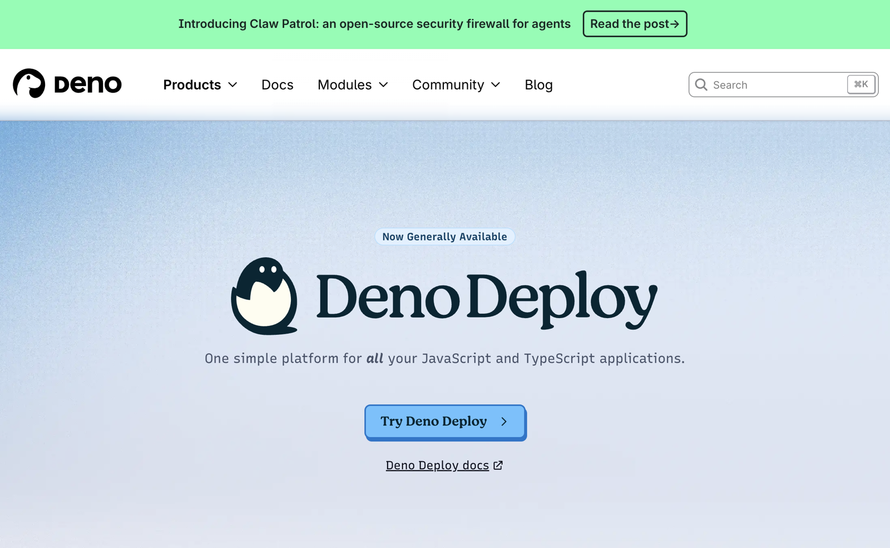
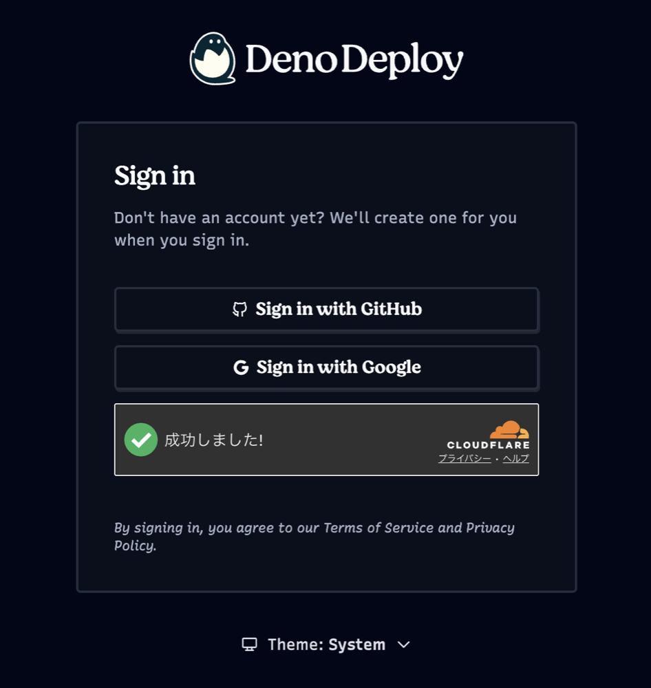
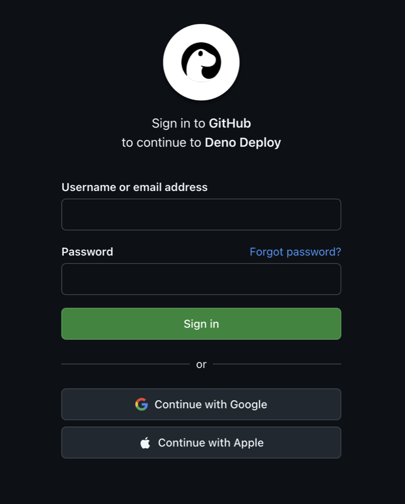
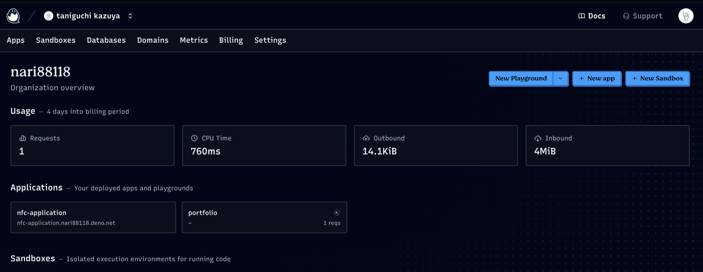
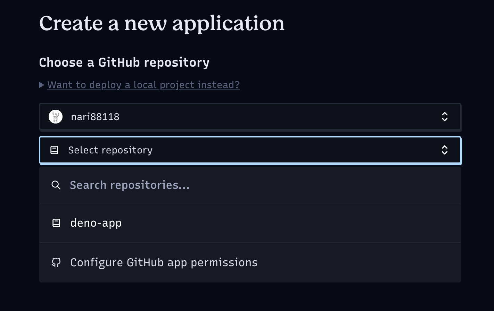
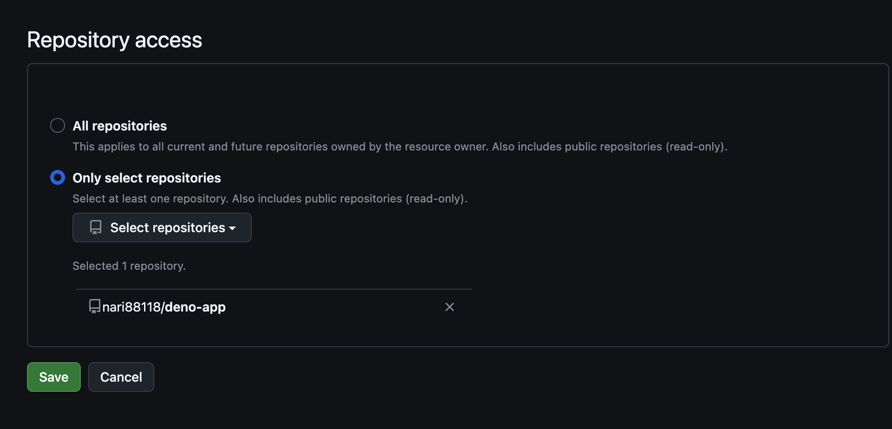
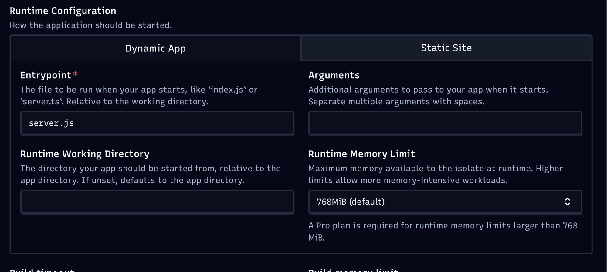
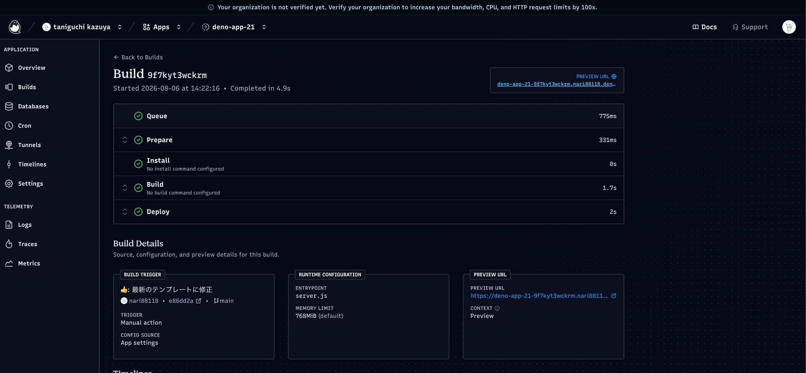

<!-- _class: lead -->
<!-- _paginate: false -->
<!-- _header: '' -->


# はじめてのDeno

---

## 今日のゴール

<br>

<div class="goal">スマホで<br>自分のWebアプリが見られる</div>

<div class="note">
インターネットに公開するところまでやります
</div>

---

<!-- _class: big -->

コードを書けるように
なる必要はありません

---

<!-- _class: chapter -->
<!-- _header: '' -->

# 1. Denoとは何か

---

<!-- _class: big -->

JavaScriptって、
**どこで動いていますか？**

---

## <span class="step">1</span> ブラウザの中で動いている

<div class="browsers">
  <span>Chrome</span>
  <span>Edge</span>
  <span>Safari</span>
  <span>Firefox</span>
</div>

<div class="note">
こういうアプリの中で、JavaScriptが動いています
</div>

---

## <span class="step">2</span> でも、これはただの文字です

```js
console.log("こんにちは");
```

<br>

**読んで、実行してくれる「仕組み」が別に必要。**

---

## <span class="step">3</span> その仕組みは、ブラウザの中にある

<div class="frame-row">
  <div class="browser">
    <div class="bar">
      <span class="dot"></span><span class="dot"></span><span class="dot"></span>
      <span class="barlabel">ブラウザ</span>
    </div>
    <div class="screen">
      <div class="engine">JSを動かす仕組み</div>
      <div class="inner">JavaScript</div>
    </div>
  </div>
</div>

<div class="note">
だから今までは、ブラウザがないと動かせなかった
</div>

---

## <span class="step">4</span> 取り出して、PCに置いたら？

<div class="frame-row">
  <div class="browser dim">
    <div class="bar">
      <span class="dot"></span><span class="dot"></span><span class="dot"></span>
      <span class="barlabel">ブラウザ</span>
    </div>
    <div class="screen">
      <div class="inner">JavaScript</div>
    </div>
  </div>
  <div class="arrow">→</div>
  <div class="pc">
    <div class="monitor">
      <div class="engine">JSを動かす仕組み</div>
    </div>
    <div class="stand"></div>
    <div class="base"></div>
    <div class="caption">あなたのPC</div>
  </div>
</div>

---

## <span class="step">5</span> それが「JavaScriptランタイム」

<div class="frame-row">
  <div class="pc">
    <div class="monitor">
      <div class="engine">JSを動かす仕組み</div>
      <div class="inner">JavaScript</div>
    </div>
    <div class="stand"></div>
    <div class="base"></div>
    <div class="caption">あなたのPC</div>
  </div>
  <div class="logobox">
    
    <div class="rtlist">
      <div class="on">Deno</div>
      <div>Node.js</div>
      <div>Bun</div>
    </div>
    <div class="caption">今日使うのはDeno</div>
  </div>
</div>

---

<!-- _class: big -->
<!-- _backgroundColor: #f0fdfa -->

Denoとは

<br>

**「ブラウザの外で<br>JavaScriptを動かす道具」**

---

## ブラウザの中は、制限されている

<br>

<div class="frame-row compact">
  <div class="sidelist">
    <div>ブラウザで動くJSからは、</div>
    <div class="on">PCの機能をほとんど使えません</div>
  </div>
  <div class="browser">
    <div class="bar">
      <span class="dot"></span><span class="dot"></span><span class="dot"></span>
      <span class="barlabel">ブラウザ</span>
    </div>
    <div class="screen">
      <div class="inner">JavaScript</div>
    </div>
  </div>
</div>

<div class="note">
ファイルを開く、好きなところと通信する、など<br>
不便だからではなく、わざとそうしてあります（安全のため）
</div>

---

## PC上でなら、PCの機能を使えます

<div class="frame-row">
  <div class="pc">
    <div class="monitor">
      <div class="engine">JavaScript</div>
      <div class="inner">ファイル</div>
      <div class="inner">ネットワーク</div>
    </div>
    <div class="stand"></div>
    <div class="base"></div>
    <div class="caption">あなたのPC</div>
  </div>
  <div class="sidelist">
    <div>1. ファイル操作ができる</div>
    <div class="on">2. ネットワークを使える</div>
  </div>
</div>

<div class="note">
今日使うのは2番です<br>
なお、どちらも使うときは Deno が「許可していいですか？」と聞いてきます
</div>

---

## ネットワークが使えると

<div class="frame-row mid">
  <div class="pc">
    <div class="monitor">
      <div class="engine">送る側</div>
    </div>
    <div class="stand"></div>
    <div class="base"></div>
    <div class="caption">あなたのPC</div>
  </div>
  <div class="arrow">→</div>
  <div class="browser">
    <div class="bar">
      <span class="dot"></span><span class="dot"></span><span class="dot"></span>
      <span class="barlabel">ブラウザ</span>
    </div>
    <div class="screen">
      <div class="inner">受け取る側</div>
    </div>
  </div>
</div>

<div class="etclist">
  <div>・<strong>アクセスを待ち受けられる</strong><span> ＝ HTTPサーバー、バックエンドを立ち上げられる</span></div>
  <div>・<strong>他所のAPIに、相手側の設定に関係なく繋げる</strong><span> — ブラウザからだと弾かれることがある</span></div>
  <div>・<strong>HTTP以外の通信もできる</strong><span> — データベースに直接つなぐ、など</span></div>
  <div>・<strong>そのまま公開できる</strong><span> — 他の人にも見てもらえる</span></div>
  <div class="etc">etc...</div>
</div>

<div class="leadin">
一番上の「アクセスを待ち受けられる」を、このあと実際にやります
</div>

---

## Denoを使っている会社

<div class="companies">
  <span>Slack</span>
  <span>Spotify</span>
  <span>GitHub</span>
  <span>Stripe</span>
  <span>Netlify</span>
  <span>Supabase</span>
</div>

<div class="note">
たとえば <strong>Slack</strong> は、アプリの自動化を動かす仕組みにDenoを使っています
</div>

---

<!-- _class: big -->
<!-- _backgroundColor: #f0fdfa -->

後日のチーム開発でも
**Denoを使います**

---

## 1章のまとめ

<br>

- Denoは **ブラウザの外でJavaScriptを動かす道具**
- PC上でなら、ファイルやネットワークが使える
- だから、**自分のPCでサーバーを動かせる**

<br>

### READMEに戻って、セットアップをしましょう！

---

<!-- _class: chapter -->
<!-- _header: '' -->

# 作ったものを、
# 他の人に見てもらう

Deno Deploy

---

## 今は、自分しか見られません

<div class="frame-row eq">
  <div class="pc">
    <div class="monitor">
      <div class="engine">server.js</div>
      <div class="minibrowser">
        <div class="mbar">
          <span class="mdot"></span><span class="mdot"></span><span class="mdot"></span>
          <span class="mlabel">localhost:8000</span>
        </div>
        <div class="mscreen ok">見られる</div>
      </div>
    </div>
    <div class="stand"></div>
    <div class="base"></div>
    <div class="caption">あなたのPC</div>
  </div>
  <div class="ng">✕</div>
  <div class="pc">
    <div class="monitor">
      <div class="minibrowser">
        <div class="mbar">
          <span class="mdot"></span><span class="mdot"></span><span class="mdot"></span>
          <span class="mlabel">localhost:8000</span>
        </div>
        <div class="mscreen no">見られない</div>
      </div>
    </div>
    <div class="stand"></div>
    <div class="base"></div>
    <div class="caption">友達のPC</div>
  </div>
</div>

<div class="note tight">
<strong>local</strong>（手元の）＋ <strong>host</strong>（コンピュータ1台）<br>
＝ <strong>手元のコンピュータ</strong>。誰が開いても、その人自身のPCを指します
</div>

---

## PCを閉じたら、止まります

<div class="frame-row">
  <div class="pc dim">
    <div class="monitor">
      <div class="inner">停止中</div>
    </div>
    <div class="stand"></div>
    <div class="base"></div>
    <div class="caption">あなたのPC</div>
  </div>
  <div class="ng">✕</div>
  <div class="browser">
    <div class="bar">
      <span class="dot"></span><span class="dot"></span><span class="dot"></span>
      <span class="barlabel">ブラウザ</span>
    </div>
    <div class="screen">
      <div class="inner">見られない</div>
    </div>
  </div>
</div>

<div class="note tight">
<code>Ctrl + C</code> で止めたら終わり。PCの電源を切っても終わりです
</div>

---

## ずっと動いてくれるPCを、借ります

<div class="frame-row">
  <div class="cloud">
    <div class="body">
      <div class="engine">server.js</div>
    </div>
    <div class="caption">借りたPC（24時間動いている）</div>
  </div>
  <div class="arrow">→</div>
  <div class="browser">
    <div class="bar">
      <span class="dot"></span><span class="dot"></span><span class="dot"></span>
      <span class="barlabel">https://...</span>
    </div>
    <div class="screen">
      <div class="inner">誰でも見られる</div>
    </div>
  </div>
</div>

<div class="leadin">
これを「デプロイ」と言います
</div>

---

## 使うのは Deno Deploy

<br>

### Denoを作っているところが用意している、**置き場所**

### 個人の練習なら**無料**で使えます

<div class="note">
GitHubに置いたコードを読み込んで、勝手に動かしてくれます
</div>

---

## 準備は、もうできています

<br>

### 1. **GitHubアカウント** ✅

### 2. コードが**GitHubに置いてある**こと ✅

<div class="note">
さっき作った自分のリポジトリに、書き換えた内容をpush済みですね。<br>
あとは、それをDeno Deployに教えるだけです。
</div>

---

## <span class="step">1</span> Deno Deploy を開く

<div class="shot">
  
</div>

<div class="note tight">
<code>deno.com/deploy</code> →「<strong>Try Deno Deploy</strong>」を押します
</div>

---

## <span class="step">2</span> サインインする

<div class="shot2">
  
  
</div>

<div class="note tight">
「<strong>Sign in with GitHub</strong>」→ GitHubのIDとパスワードを入れます
</div>

---

## <span class="step">3</span> 「許可しますか？」と聞かれたら

<br>

### そのまま**承認**してください

<div class="note">
DenoがGitHubのリポジトリを読んでいいか、確認されます。初回だけです
</div>

---

## <span class="step">4</span> 自分の置き場所が開く

<div class="shot sm">
  
</div>

<div class="note tight">
ここに、作ったアプリが並んでいきます。「<strong>+ New app</strong>」を押します
</div>

<div class="warn">
初回は、この置き場所の名前を決める画面が出ます。<br>
<strong>名前は後から変えられません。</strong>公開URLの一部になります。
</div>

---

## <span class="step">5</span> リポジトリを選ぶ

<div class="shot sm">
  
</div>

<div class="note tight">
<strong>さっき作った自分のリポジトリ</strong>を選びます
</div>

---

## 一覧に出てこないときは

<div class="shot sm">
  
</div>

<div class="note tight">
「Configure GitHub app permissions」→ GitHubに移動 → <strong>自分のリポジトリを選んでSave</strong> → 戻ると選べます
</div>

---

## <span class="step">6</span> 動かし方を指定する

<br>

### このアプリは「**動的**」です

<div class="steps">
  <div><strong>静的サイト</strong><span> — 置いてあるファイルを、そのまま返すだけ</span></div>
  <div><strong>動的アプリ</strong><span> — アクセスのたびに、コードを動かす</span></div>
</div>

<div class="note tight">
<code>server.js</code> が文言を作って返すので、あちらのPCで<strong>動かしてもらう</strong>必要があります
</div>

---

## <span class="step">6</span> Edit app config を押す

<div class="shot sm">
  
</div>

<div class="warn">
最初は <strong>Static Site</strong> が選ばれています。<br>
<strong>Dynamic App</strong> に切り替えて、Entrypoint に <code>server.js</code> と入力してください。
</div>

---

## <span class="step">7</span> Create App を押す

<div class="shot sm">
  
</div>

<div class="note tight">
緑のチェックが並べば成功です
</div>

---

<!-- _class: big -->
<!-- _backgroundColor: #f0fdfa -->

URLが発行されます

**スマホからも見られます**

<span style="font-size:26px; color:#52606d; font-weight:normal;">
アプリ名<span style="color:#0b8f82;">.</span>置き場所の名前<span style="color:#0b8f82;">.deno.net</span>
</span>

---

## これからは、pushするだけ

<br>

### GitHubに変更を送ると、**自動でやり直してくれます**

<div class="note">
毎回この画面を開く必要はありません
</div>

---

## まとめ

<br>

- 自分のPCで動かしている間は、**自分しか見られない**
- **デプロイ**すると、ずっと動いてくれるPCに置ける
- Deno Deployなら、**GitHubのコードを読み込んで動かしてくれる**

<br>

### チーム開発の成果物も、これで公開します

