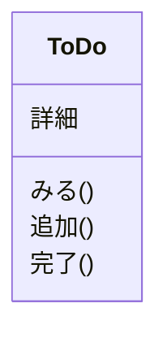

# デザイン概論

使いやすいデザインを作れるようになろう
デザインの中でもUIデザインについて

- Figmaでハンズオンやってもらう

## UIデザインの考え方

User Interface (UI)は、ユーザと情報の境界で、情報をやり取りする

図: ユーザ ←UI→ 情報

- UIは、ユーザに情報を表示する
- UIは、情報の操作をユーザに提供する

情報の表示と操作が使いやすいと良いUI

### ToDoアプリを考えてみよう

例として、ToDoアプリのUIデザインを考える
ToDoアプリでやりたいことは次の通り

- ToDo一覧を見る
- 新しいToDoを追加する
- 追加したToDoを完了にする
- ToDoの詳細を書く

やりたいことが実現できるUIを書いてみよう
時間は5分ぐらい。だんだん良くしていく。

初めに悪い例から。やりたいことからそのままUIを作る。

やることを選んでから、情報が表示されるUI。
よくないこと

- ほぼ同じ画面がたくさんある
- 操作を選ばないとToDoが見られない
- 完了を選んでから、やっぱり消したいが大変

やりたいことからUIを作ると使いにくいUIになる。
抽象化しよう。

### UIデザインの流れ

やりたいことからそのままUIデザインしないことが大事。

やりたいことからオブジェクトを抽出する。
オブジェクト基準でUIを考えよう。

オブジェクト抽出→ビュー・ナビゲーション→レイアウトの流れ
レイアウトして、より良いデザインを思いついたらオブジェクト抽出に戻ってくる。

#### オブジェクト抽出

やりたいことからオブジェクトを抽出する。
それぞれのオブジェクトの属性とアクションを抽出する。
UMLのクラス図のようなイメージ。クラス名とパラメータとメソッドを抽出する。
CRUDで考えると良い。 Create Read Update Delete
CRUDのReadはビューが実現するので、アクションとしてなくて良い

#### ビュー・ナビゲーション

まずはビューを考える。

コレクションビューとシングルビュー

コレクションビューはオブジェクトを複数表示する
シングルビューはある1つのオブジェクトを表示する

それぞれビューが持つ属性とアクションを考える。
Createはコレクションビューに置く。
Updateは基本シングルビューに置く。コレクションから編集できても良い
Deleteはどちらにも置く。
次にナビゲーションを考える。

まず、コレクションからシングルへナビゲーションする
別のオブジェクトからナビゲーションを考える

不要なビューやナビゲーションを削る。
ビュー・ナビゲーションができたら、ようやくレイアウトに入る。

#### レイアウト

ビュー・ナビゲーションから、レイアウトを考える。
ワイヤーフレームを作る。
よくあるレイアウトに合わせると良い。

コレクションビューのパターン
リスト、グリッド、マッピング

既存のアプリのレイアウトを見てみよう

### UIデザインの流れでToDoアプリを考えてみよう

もう一度ToDoアプリのデザインを考えてみよう
今度はUIデザインの流れに沿って考える。

ToDoアプリでやりたいことは次の通り

- ToDo一覧を見る
- 新しいToDoを追加する
- 追加したToDoを完了にする
- ToDoの詳細を書く

#### ToDoアプリのオブジェクト抽出

オブジェクトはToDoだけ
属性は詳細だけ。
アクションは追加、完了、みる

#### ToDoアプリのビュー

ビューを考える。
ToDoリストが並ぶコレクションと、ToDo名と詳細があるシングル。

#### ToDoアプリのナビゲーション

ToDoコレクションからシングルへ、ToDoシングルからコレクションへ遷移する。

#### ToDoアプリのレイアウト

レイアウトを考える。考えてみよう。5分ぐらい
[オブジェクトとナビゲーションの図]

ビューの数は同じになるようにレイアウトを考えよう
増減したらオブジェクト抽出を考え直すと良い

オブジェクトを手がかりにレイアウトを作る。

## ビジュアルデザイン

ここまでやってきたことは、オブジェクト指向UI (OOUI)設計。
OOUI設計では、ビジュアルデザインまでは設計できない。
とりあえずは、既存のビジュアルデザインを真似て作ると良い。

ビジュアルデザインを学ぶと個性が出せる。

- デザイン4つの基本原則
  - コントラスト(Contrast) 反復(Repetition) 整列(Alignment) 近接(Proximity)
- デザインシステム
  - ビューやナビゲーション、ビジュアルデザインを体系立ててまとめたもの
  - アプリ全体で一貫したデザインにできる

## あわせて読みたい

- オブジェクト指向UIデザイン
- ノンデザイナーズ・デザインブック
- MaterialDesignGuidelines <https://m3.material.io/>
- HumanInterfaceGuidelines <https://developer.apple.com/design/human-interface-guidelines>
