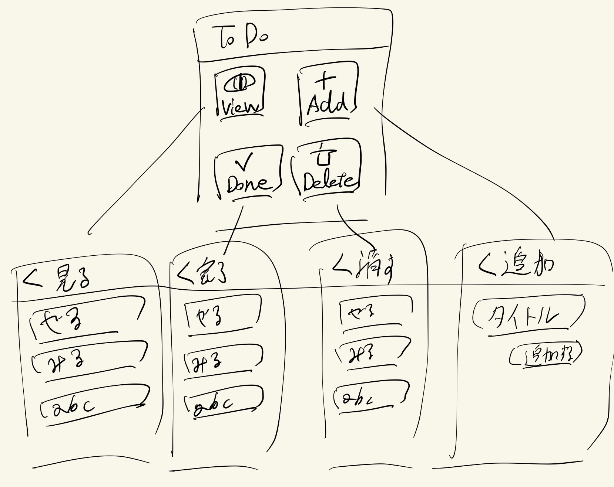
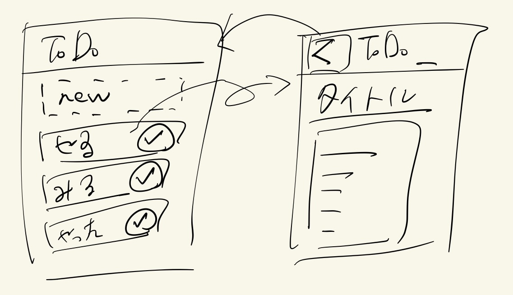

# 使いやすいUIデザイン

<!-- textlint-disable ja-technical-writing/ja-no-mixed-period -->  

---

## 目次

1. UIとは
2. UIを作ってみる
3. UIデザインの流れ
4. ビジュアルデザイン

---

<!-- header: 1. UIとは -->

## 1. UIとは

---

## User Interface (UI)

UIは、ユーザーと情報の境界。情報をやり取りする

---

## UIは、情報の**表示**と**操作**を提供する

- ユーザーーに**情報を表示**する
- **情報の操作**をユーザーに提供する

---

<!-- header: 2. UIを作ってみる -->

## 早速UIを作ってみよう

---

## ToDoアプリを考えてみる

---

## やってみよう: ToDoアプリのUI

- ToDo一覧を見る
- 新しいToDoを追加する
- 追加したToDoを完了にする
- ToDoのタイトルと詳細を書く

これらの機能が実現できること

---

## 機能から**直接**UIを作ると、使いにくい

- 同じ画面がたくさんある
- ToDoがすぐ表示されない
- 機能を選択してToDoが表示

---

## 機能を**抽象化**してUIを作ると、使いやすい

ToDoという**オブジェクト**を抽出する

---

## 機能からオブジェクトを抽出する

- オブジェクトを基準にUIを考える
- 機能から直接UIを作らない

---

## **オブジェクトを抽出**してから、UIを作ろう

---

<!-- header: 3. UIデザインの流れ -->

## 3. UIデザインの流れ

---

## UIデザインの流れの図

---

<!-- header: 3.1. UIデザインの流れ オブジェクト抽出 -->

## 3.1 オブジェクト抽出

- 機能から**オブジェクト**を抽出
- オブジェクトは、**属性**と**アクション**を持つ
- UMLのクラス図のようなイメージ

---

## オブジェクトは、ユーザーが操作する対象物

- オブジェクトの詳細やプロパティとして、属性を持つ

---

## アクションは**C(R)UD**で考える

CRUDは、Create Read Update Delete

- Readはビュー。アクションにしない

---

## ToDoアプリで、オブジェクト抽出

- ToDo一覧を見る
- 新しいToDoを追加する
- 追加したToDoを完了にする
- ToDoのタイトルと詳細を書く

---

## ToDoアプリで、オブジェクトは**ToDo**だけ

- **ToDo**一覧を見る
- 新しい**ToDo**を追加する
- 追加した**ToDo**を完了にする
- **ToDo**のタイトルと詳細を書く

---

## ToDoアプリで、ToDoの属性は**タイトル・詳細**

- ToDo一覧を見る
- 新しいToDoを追加する
- 追加したToDoを完了にする
- ToDoの**タイトル**と**詳細**を書く

---

## ToDoアプリで、ToDoのアクションは**Create・完了**

- ToDo一覧を**見る** (Read)
- 新しいToDoを**追加**する (Create)
- 追加したToDoを**完了**にする
- ToDoのタイトルと詳細を書く

CRUDにできないのは、**完了**だけ

---

## ToDoアプリのオブジェクトを抽出した結果

- オブジェクトは、**ToDo**
- ToDoの属性は、**タイトル・詳細**
- ToDoのアクションは、**Create・完了**

---

## オブジェクト抽出ができました

---

<!-- header: 3.2. UIデザインの流れ ビュー・ナビゲーション -->

## 3.2. ビュー・ナビゲーション

---

## オブジェクトからビューを考える

コレクションビューとシングルビュー

---

## コレクションビューは**同じオブジェクトを複数**表示する

**Create**・**Delete**アクションを配置する

オブジェクトによっては、Updateアクションも配置

---

## シングルビューは**1つのオブジェクト**を表示する

**Update**・**Delete**アクションを配置する

---

## ビューのナビゲーションを考える

- **コレクション**から**シングル**へナビゲーション
- 別オブジェクトからのナビゲーション

---

## ビュー・ナビゲーションを削る

- ビューをまとめる
- いらないナビゲーションをなくす

---

## ToDoアプリで、ビュー

- ToDoリストが並ぶコレクションビュー
- ToDoのタイトルと詳細があるシングルビュー

---

## ToDoアプリで、ナビゲーション

---

<!-- header: 3.3. UIデザインの流れ レイアウト-->

## 3.3 レイアウト

---

## ビュー・ナビゲーションから、レイアウトを考える

- いわゆるワイヤーフレーム
- ビューの数だけレイアウトを考える
- 既存アプリを参考にしよう

---

## コレクションビューのレイアウト3種

- リスト :scroll:
- グリッド :hash:
- マッピング :globe_with_meridians:

---

## シングルビューのレイアウト3種

- 属性とアクションだけ
- 関連オブジェクトをプレビュー
- 関連オブジェクトのコレクションビューを含む

---

## アクションは**オブジェクトの近く**にレイアウトする

---

## やってみよう: ToDoアプリで、レイアウト

| オブジェクト | ナビゲーション |
| --- | --- |
|  |  |

---

## ToDoアプリで、レイアウト

- ToDoリストが並ぶコレクションビュー
- ToDoのタイトルと詳細があるシングルビュー

---

## UIデザインの流れのまとめ

1. オブジェクト抽出
2. ビュー・ナビゲーション
3. レイアウト

---

<!-- header: 4. ビジュアルデザイン -->

## 4. ビジュアルデザイン

---

## ビジュアルデザインは、UIの**見た目**をデザインする

---

## ビジュアルデザインのポイント

- 既存のビジュアルデザインを真似て作る
- ビジュアルデザインを学ぶと個性が出せる
- ただ、難しい

---

## ビジュアルデザインの例

- **デザイン4つの基本原則**
  - コントラスト 反復 整列 近接
- **デザインシステム**
  - ビューやナビゲーション、ビジュアルデザインを体系立ててまとめたもの
  - アプリ全体で一貫したデザインにできる

---

## まとめ

- UIとは、情報の表示と操作を提供する
- UIデザインは、オブジェクトから考える
- UIデザインの流れは、オブジェクト抽出、ビュー・ナビゲーション、レイアウト
- ビジュアルデザインは、UIの見た目をデザインする

---

## あわせて読みたい

- オブジェクト指向UIデザイン <https://amzn.asia/d/4vxk6h5>
- ノンデザイナーズ・デザインブック <https://amzn.asia/d/6LvdOd9>
- MaterialDesignGuidelines <https://m3.material.io/>
- HumanInterfaceGuidelines <https://developer.apple.com/design/human-interface-guidelines>
