<!-- _paginate: false -->

# 使いやすいUIデザイン

---

## この時間のゴール

1. **UIの役割を理解する**
2. **良いUIをつくるポイントを知る**

---

<!-- _class: small -->

## ハンズオン①　まずは自由に描こう

**お題：「アイスコーヒー（500円）を注文する画面」** 四角と文字だけでOK。いま思いつくままに描いてみましょう。

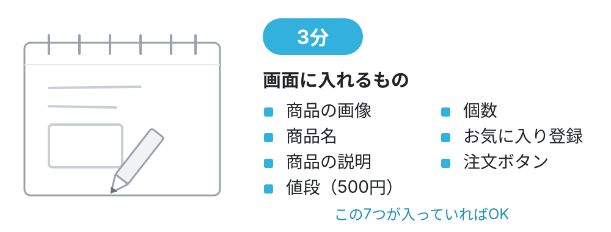

---

<!-- _class: small -->

## UIとは 「ユーザーとサービスをつなぐ接点」

---

## 良いUI と 悪いUI の違い

- **悪いUI：「どこを押せばいいかわからない…」**
- **良いUI：「見た瞬間にすぐ操作できる！」**

---

<!-- _class: small -->

## よくある「悪いUI」の失敗パターン

**ボタンの位置がわからない** 「注文する」など重要なボタンが 小さかったり、目立つボタンとすり替わっていると見つけられない。

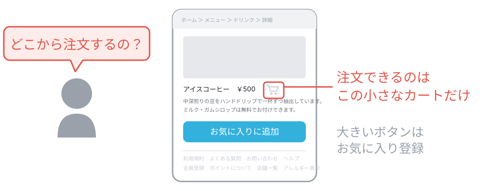

---

<!-- _class: small -->

## よくある「悪いUI」の失敗パターン

**文字が小さく読みにくい** フォントが極端に小さい、または背景色と同化していて読めない。

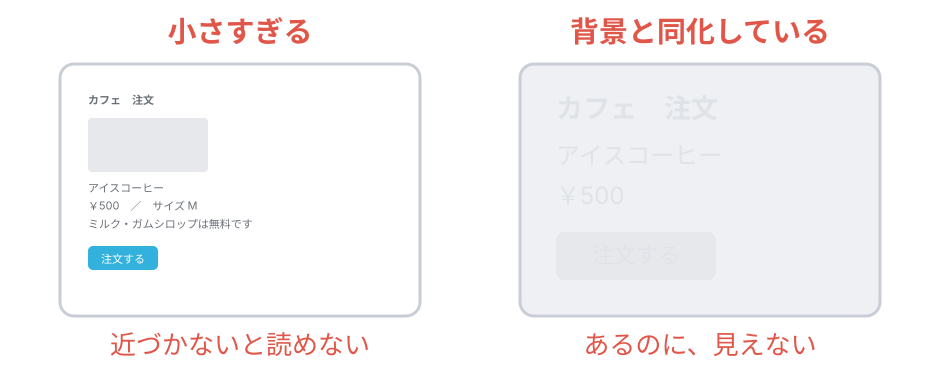

---

<!-- _class: small -->

## よくある「悪いUI」の失敗パターン

**要素の詰め込みすぎ** 説明文やリンクを画面いっぱいに詰め込むと、どこが大事なのか分からなくなる

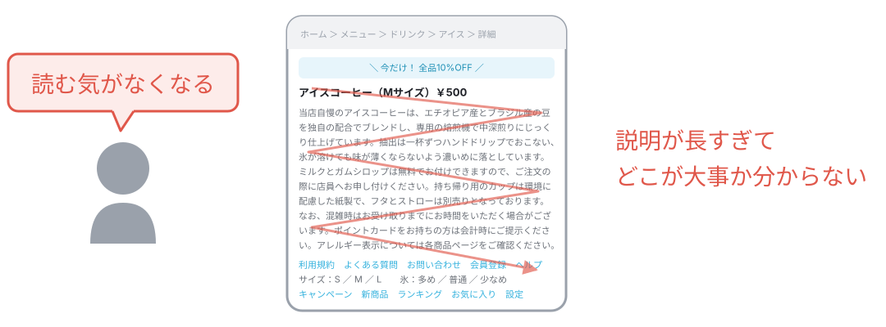

---

<!-- _class: small -->

## 同じ注文画面でも、こんなに変わる

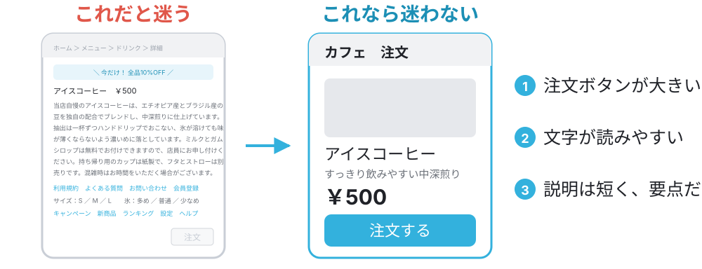

---

<!-- _class: small -->

## 良いUIをつくるポイント

- 画面の見た目や要素の並び順を整えること
- 使いたい機能を、迷わずすぐ使えるようにする
- ユーザーに「どう操作すればいいか」を考えさせない

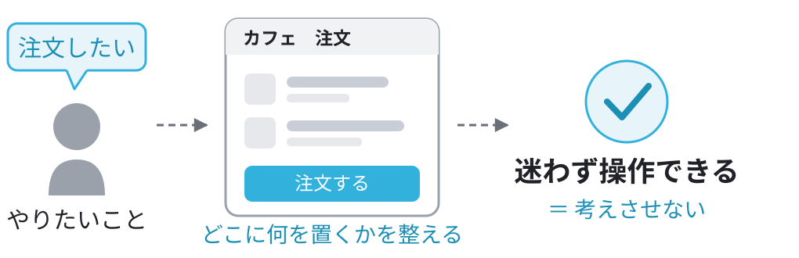

---

<!-- _class: small -->

## 良いUIをつくるポイント①配置

**いちばん押してほしいボタンを、大きく・目立つ場所に。** 「どこを押すの？」と探す時間をなくします。

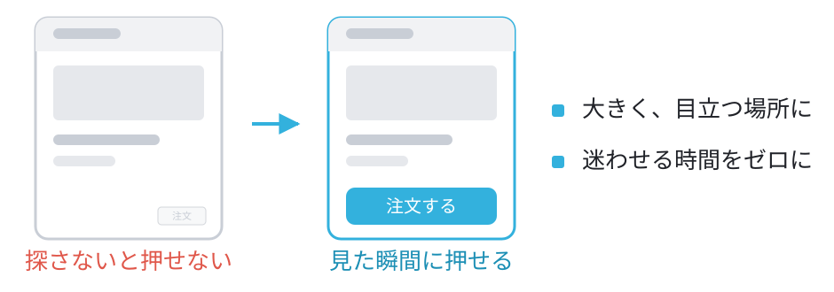

---

<!-- _class: small -->

## 良いUIをつくるポイント②文字

**商品名と値段は、離れて見ても読める大きさに。** 背景と文字の色にメリハリをつけると、ぐっと読みやすくなります。

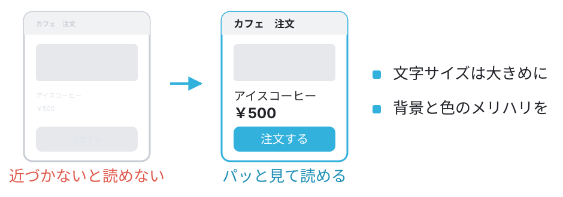

---

<!-- _class: small -->

## 良いUIをつくるポイント③並び順

**関係のあるものは近づけて、ひとかたまりに。** 詰め込みすぎず、まわりに余白をとると迷わなくなります。

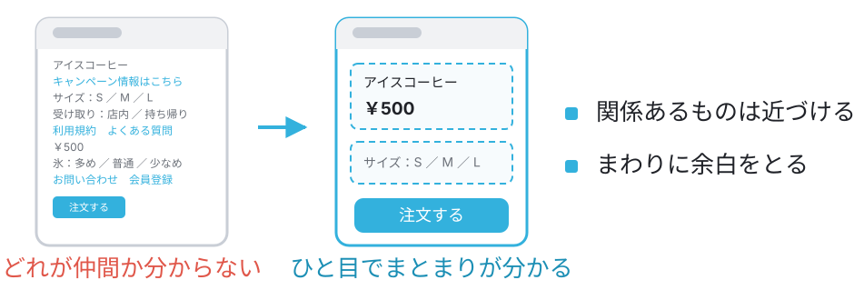

---

<!-- _class: small -->

## 配置・文字・並び順を意識すると、こうなる

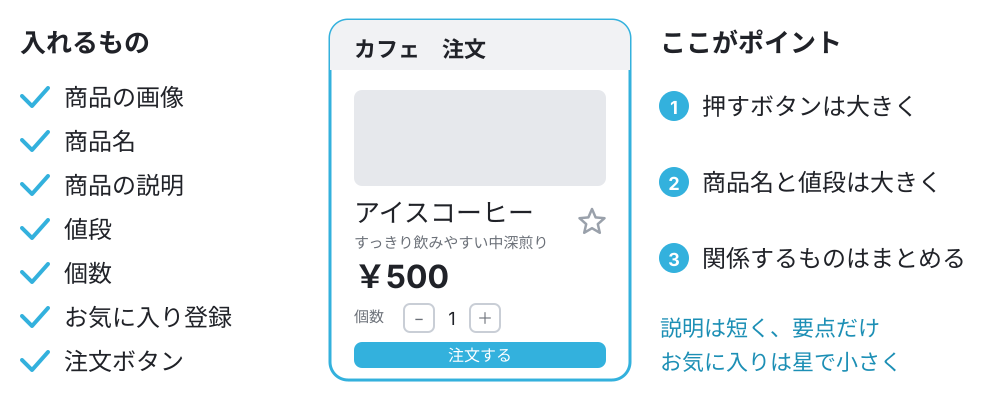

---

## 定番のレイアウトはどんどん真似していい

---

<!-- _class: small -->

## なぜ定番の形を真似していいのか？

- 「戻る」や「メニュー」は、どのアプリもだいたい同じ場所にある
- 使い慣れた形なら、説明しなくても迷わず操作できる
- 独自の配置よりも、みんなが知っている形がいちばん親切

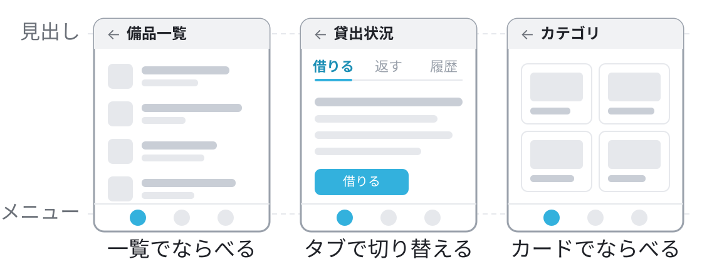

---

<!-- _class: small -->

## UI改善の第一歩は「ユーザー目線」

**初めて使う人の気持ちになる**

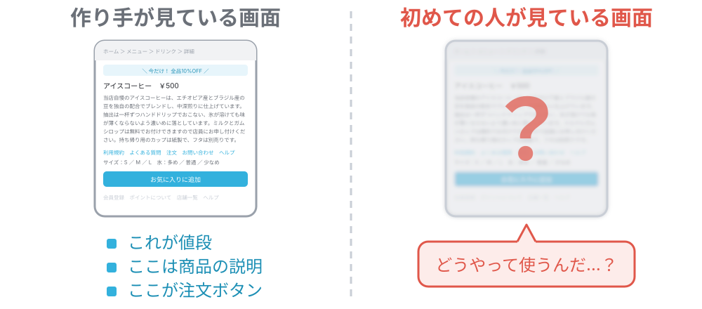

---

<!-- _class: small -->

## UI改善の第一歩は「ユーザー目線」

**チームメンバーに触ってもらう**

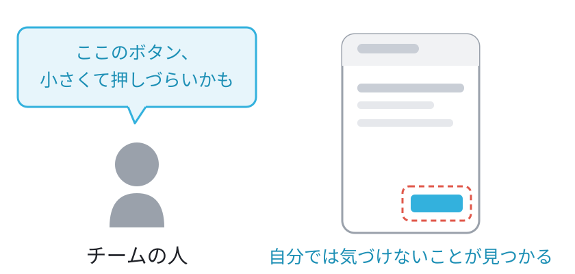

---

<!-- _class: small cols3 -->

## デザイン知識がなくてもできる3つの工夫

1. 余白をしっかり取る
2. 読みやすい色と文字
3. 視線の流れに合わせる

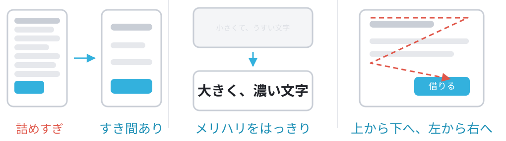

---

<!-- _class: small -->

## ハンズオン② 最初よりも意識して描いてみよう

**お題：「映画のチケットを予約する画面」** 配置・文字・並び順を意識して、新しいページに描いてみましょう。

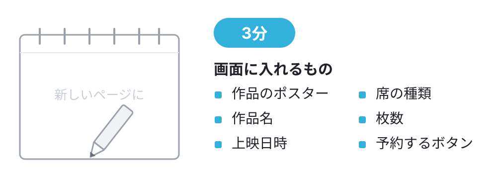

---

<!-- _class: point -->

## まとめ：迷わせないアプリを作ろう

UIデザインで一番重要なのは、 高度なテクニックではなく 「使う人への思いやり」です。

まずはチームの仲間と画面を見せ合いながら、 楽しく開発を進めていきましょう！
