# 使いやすいUIデザイン

<!-- textlint-disable ja-technical-writing/ja-no-mixed-period -->

---

<!-- _class: point -->

## この時間の目標

**チームで作るアプリの画面**を 自分で考えられるようになる

---

<!-- _class: agenda -->

## 今日は4本立て

1. UIとは
2. UIを作ってみる
3. UIデザインの流れ
4. ビジュアルデザイン

---

<!-- header: 1. UIとは -->
<!-- _class: chapter -->

## 1. UIとは

---

## 「UI ＝ 見た目」 **ではない**

**UI**と聞くと、 色や形を思い浮かべがち

---

## UIデザインと ビジュアルデザインは別

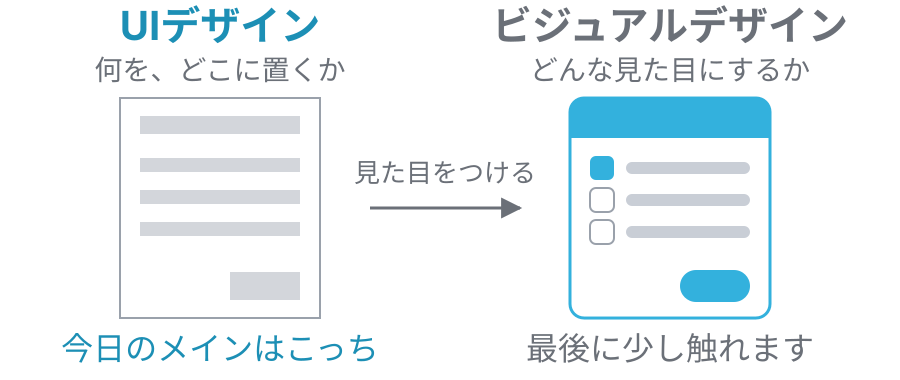

---

## **UI** ＝ **User Interface**

ユーザーと**サービス**の **あいだ**にあるもの

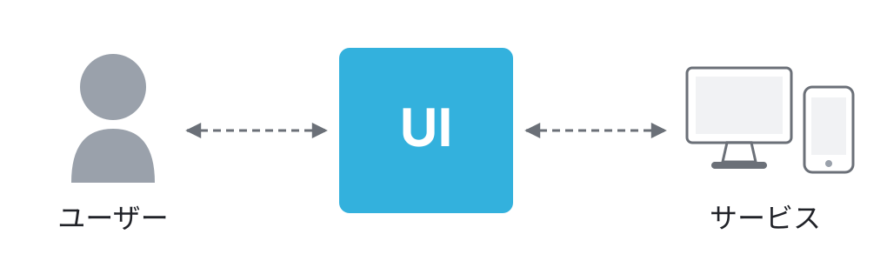

---

## その**あいだ**にあるのは、 この**2種類**

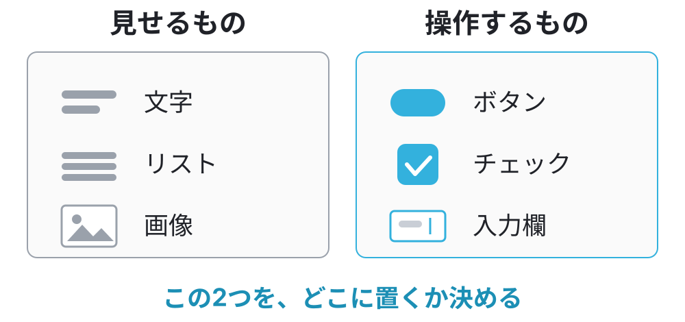

---

<!-- header: 2. UIを作ってみる -->
<!-- _class: chapter -->

## 2. UIを作ってみる

---

<!-- _class: exercise spec -->

### ハンズオン ①

## 備品貸出アプリを考えてみよう！

学校の備品を借りるアプリ

- 備品の一覧を**見る**
- 備品の**名前と数を見る**
- 備品を**借りる**
- 借りた備品を**返す**

---

<!-- _class: split -->

## 機能から**直接**UIを作ると 使いにくい

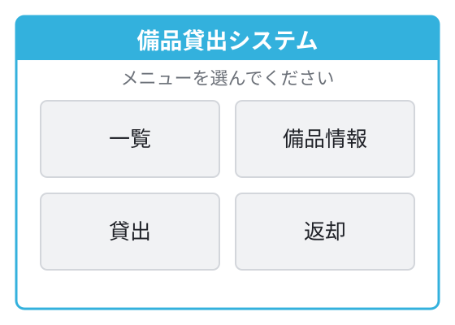

---

## ボタンを並べると**2タップ必要**

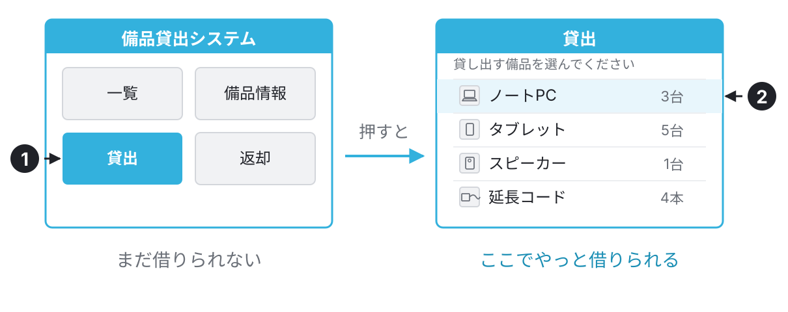

---

## 備品を並べると**1タップ**

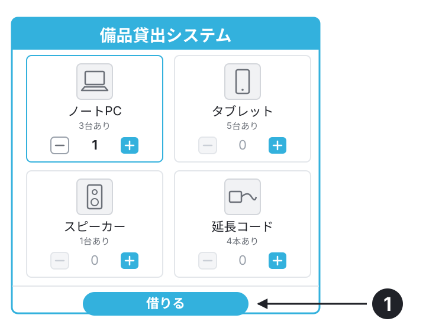

---

## 同じ画面を**何枚も作らずに済む**

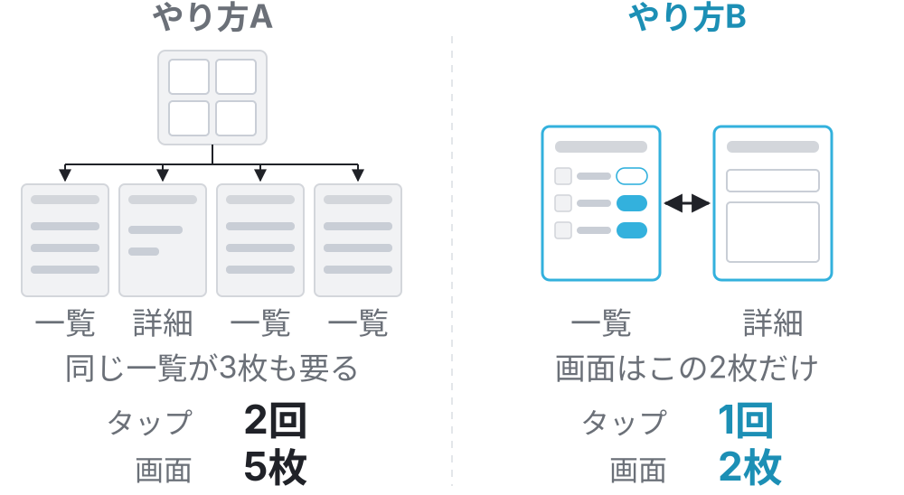

---

<!-- _class: point -->

## 主役にした**備品**を **オブジェクト**と呼ぶ

**オブジェクト**を決めてから、 画面を作る

LINEならトーク、Amazonなら商品

---

## **備品**を主役にしたから、 画面はこの2つになった

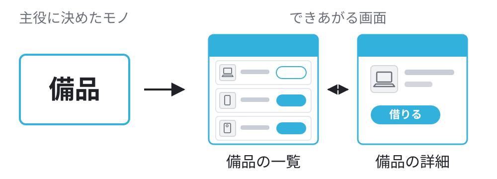

---

<!-- header: 3. UIデザインの流れ -->
<!-- _class: chapter -->

## 3. UIデザインの流れ

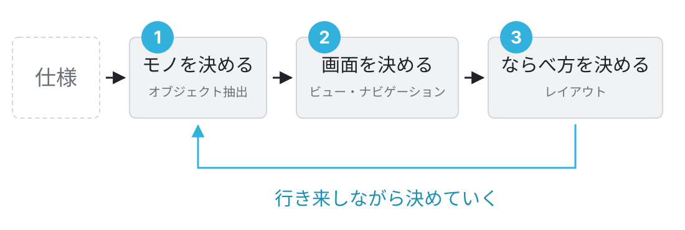

---

## **ビュー**はモノが見える場所、 **アクション**はモノにできること

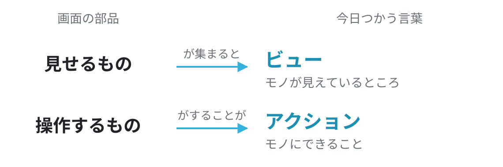

---

<!-- header: 3.1 モノを決める -->
<!-- _class: chapter sub -->

## 3.1 モノを決める

仕様から**オブジェクト**を拾い出す

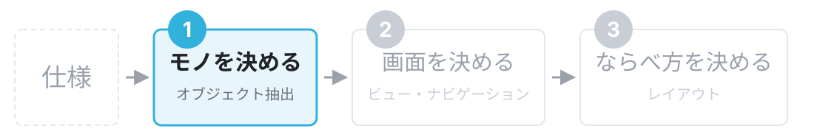

---

## モノには**情報**があり、 **できること**がある

- 持っている情報を**属性**という
- できることが**アクション**

---

## モノを拾い出す手順は3つ

1. 名詞に**線**を引く
2. 同じものを**まとめる**
3. **属性**と**アクション**に分ける

---

## 名詞に線を引くと、 **備品**だけが残る

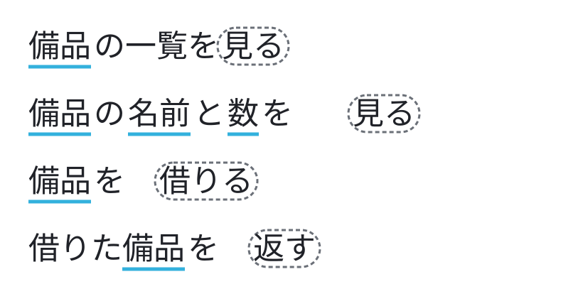

---

<!-- _class: exercise -->

### ハンズオン ②

## 仕様に出てくる**名詞**を 書き出してみよう

スケッチブックに、思いつくものを全部（**1分**）

---

<!-- _class: split -->

## アクションは **つくる・かえる・けす**

英語でCreate・Update・Delete

**見る**はアクションにしない。 押した先にあるのは画面だけ

---

<!-- _class: split -->

## 備品は、属性3つと アクション2つを持つ

- 属性は **名前・数・借りているか**
- アクションは **借りる・返す**

**つくる・けす**は、先生の仕事。 だから仕様になく、作らない

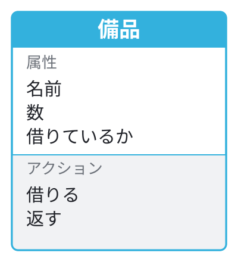

---

<!-- header: 3.2 画面を決める -->
<!-- _class: chapter sub -->

## 3.2 画面を決める

モノが見える場所（**ビュー**）と、 その行き来（**ナビゲーション**）

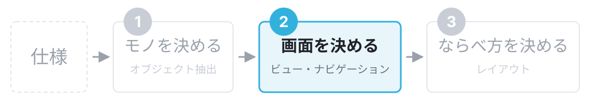

---

## ビューは「**一覧**」と 「**詳細**」の2種類

| コレクションビュー（一覧） | シングルビュー（詳細） |
| --- | --- |
| 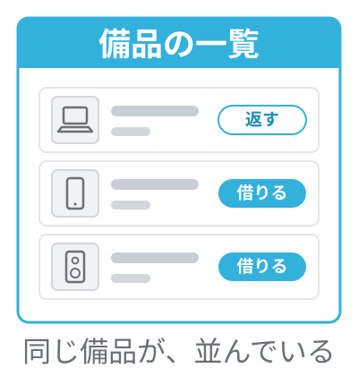 | 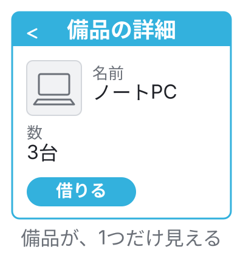 |

---

## アクションは、そのモノが 見えている**ビュー**に置く

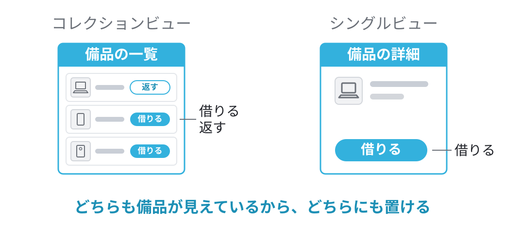

---

<!-- _class: split -->

## ナビゲーションは ビュー同士の行き来

一覧から備品を選ぶと詳細へ。 詳細から戻ると一覧へ

オブジェクトが増えたら、 まず全部書き出してから削る

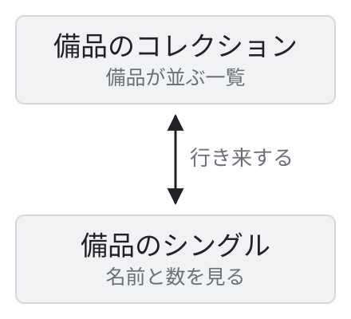

---

<!-- header: 3.3 ならべ方を決める -->
<!-- _class: chapter sub -->

## 3.3 ならべ方を決める

**レイアウト**。色や飾りはつけず、 置き場所だけを描く（**ワイヤーフレーム**）

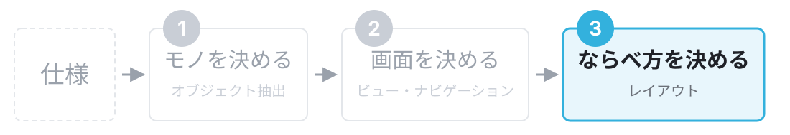

---

## 画面のならべ方には、 決まった型がある

| 一覧のならべ方 | 詳細のならべ方 |
| --- | --- |
| 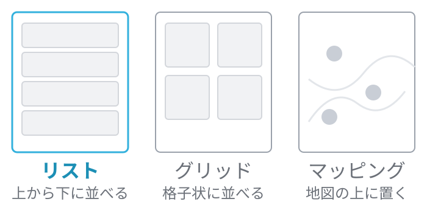 | 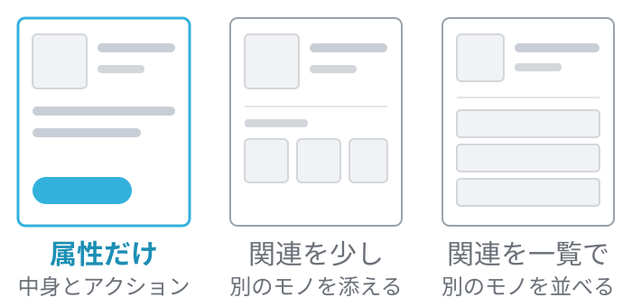 |

---

<!-- _class: exercise -->

### ハンズオン ③

## 3ステップで、 描き直してみよう

1. **モノ**を決める
2. **画面**を決める
3. **ならべ方**を決める

新しいページに。 最初の絵は消さないでください

---

<!-- _class: split -->

## 答え: 備品貸出アプリの レイアウト

- 備品が並ぶ **コレクションビュー**
- 備品1つが見える **シングルビュー**

最初の絵と、 見比べてみてください

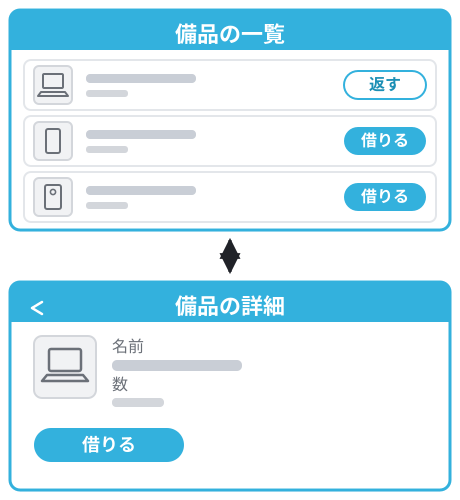

---

<!-- header: 4. ビジュアルデザイン -->

## 見た目は、この**4つ**で だいぶよくなる

- **近接**: 関係あるものを近づける
- **整列**: 端をそろえる
- **反復**: 同じものは同じ見た目にする
- **コントラスト**: 差をはっきりつける

---

## 見た目は、発明しない。真似る

似たようなアプリを見て、 同じように置けばいい

---

<!-- header: "" -->

## まとめ

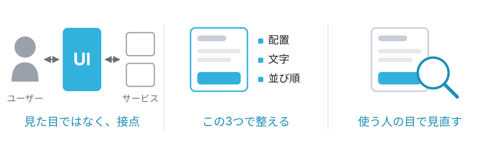

---

## 明日から、自分のチームの アプリでやる

仕様を書いたら、**名詞に線を引く**

それだけで、つくる画面が見えてくる

---

<!-- _class: small -->

## 出典・もっと知りたくなったら

- オブジェクト指向UIデザイン（今日の中核） <https://amzn.asia/d/4vxk6h5>
- ノンデザイナーズ・デザインブック（4つの原則） <https://amzn.asia/d/6LvdOd9>
- デジタル庁デザインシステム <https://design.digital.go.jp/>
- MaterialDesignGuidelines（レイアウトの型） <https://m3.material.io/>
- HumanInterfaceGuidelines <https://developer.apple.com/design/human-interface-guidelines>

