# HTML/CSS を始めよう

> 想定時間: 90分
> 動作環境: Google Chrome / [StackBlitz](https://stackblitz.com)

<details>
  <summary>TOC</summary>

- HTML/CSS を始めよう
   1. HTML/CSSに触れてみよう
      1. 開発者ツールを見よう
         1. Elements(要素)タブを見よう
         2. Style(スタイル)タブを見よう
         3. Computed(計算済み)タブを見よう
         4. VisBugを使ってみよう
      2. Hello, World! しよう
   2. ページを作ってみよう
      1. 
   3. レイアウトを考えよう
      1. CSSについて知ろう
      2. 
   4. 動的にページに変更を加えよう
      1. JSを組み込もう

</details>

## 1. HTML/CSSに触れてみよう

Web開発をやってみようと思ったとき、誰しもがまず目にするのが `HTML`/`CSS`/`JavaScript` という組み合わせだと思います。これらについていまから学んでいきます。

### 1-1. 開発者ツールを見よう

まずWeb開発で必ず使うツールとしてブラウザの開発者ツールの使い方を説明します。
ブラウザの右上のケバブボタンからメニューを開いて、「その他のツール」→「デベロッパーツール」から開発者ツールを開いておいてください。


#### 1-1-1. Elements(要素)タブを見よう

↑で開いてもらった開発者ツールの一番上のタブで「Elememts」もしくは「要素」と書かれているタブがあるのでそこを開いてください。


ここで開発者ツールの左上にある点線と矢印のアイコンをクリックすると、ページの要素をクリックしてツールで要素の詳細を確認できます。

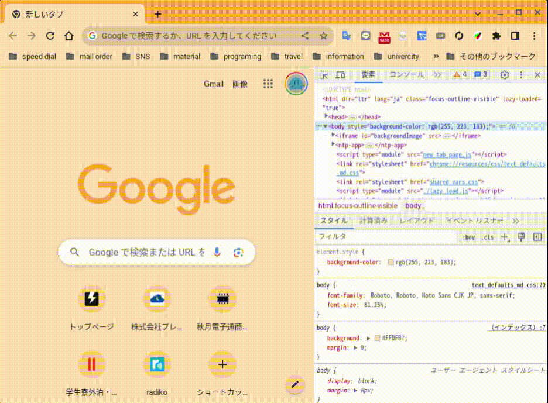

#### 1-1-2. Style(スタイル)タブを見よう

1-1-1. でやったようにして要素選択ツールなどで適当な要素を選択すると、それに合わせて開発ツール下部にあるスタイルタブ内の表示も変わります。ここでは各セレクタに適用されているスタイルを確認することができます。
また、ここで適当にスタイルを書き換えることもできます。

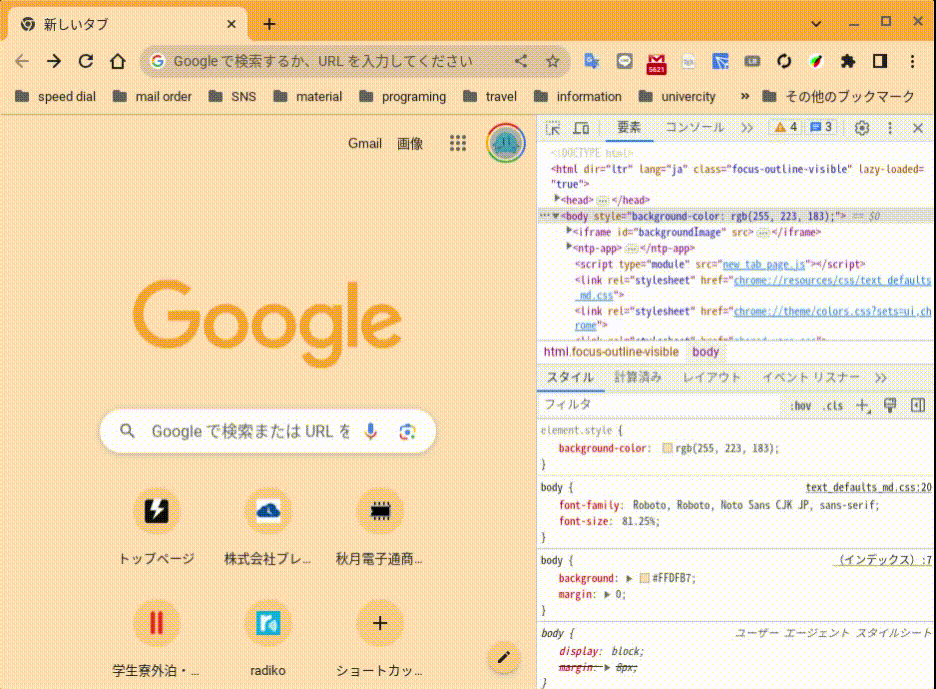

#### 1-1-3. Computed(計算済み)タブを見よう

1-1-2. で確認したStyleタブの横に Computed(計算済み)タブ があるので、そこも確認しましょう。

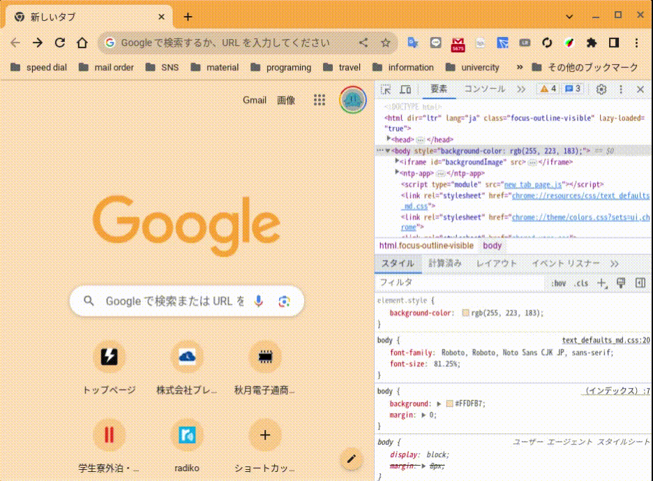

このタブでは選択中の要素の計算された大きさが表示されます。
外から順にmargin、border、padding、content(内容)の大きさがそれぞれでわかるため意図しない大きさが設定されている部分などを見つけやすいです。

#### 1-1-4. VisBugを使ってみよう

ここでChromeで使える便利な拡張機能「VisBug」も紹介します。[こちら](https://chrome.google.com/webstore/detail/visbug/cdockenadnadldjbbgcallicgledbeoc?hl=ja)からインストールできます。

インストールしたら `Alt`+`Shift`+`D` のショートカットでVisBugを起動できます。
様々な機能がありますが、特に便利なガイドツールとインスペクトツールを紹介しておきます。

VisBug の起動時に自動で開くツールがガイドツールです。このツールでは、クリックした要素とマウスホバー中の要素の大きさの差分が表示されます。

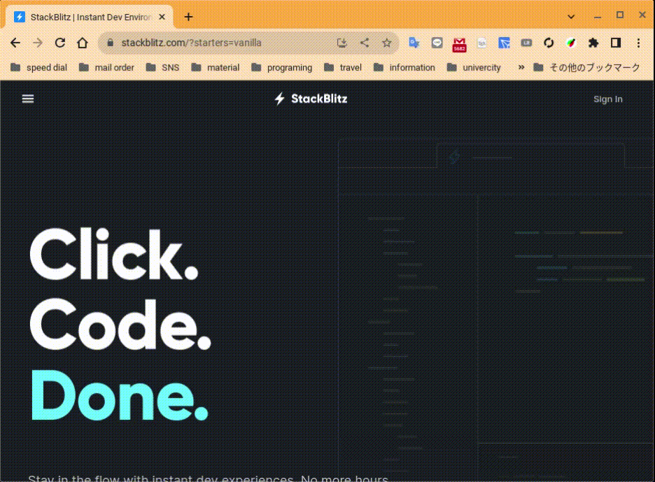

標準だと左側に出てくるツールバーから二番目のツールを開くとインスペクトツールになります。
このツールはホバー中の要素の詳細が簡単に見れるツールで、devtoolのComputedタブで見ていた要素の大きさだったり、Styleタブで確認した色周りの設定も一発で見れるのが便利です。


ここで紹介した開発者ツールと拡張機能は何かと使えると便利なので頭の片隅にでもおいておいてください。

## 2. ページを作ってみよう

では実際にWebページの開発を始めてみましょう！  
ここでは [StackBlitz](https://stackblitz.com/?starters=vanilla) というWeb IDEを使います。


GitHubアカウントでログイン可能なので右上の「Sign in」からログインしておいてください。(制作物の保存に必要です)
ログインが成功すると↓のような画面に遷移します。


「New Project」をクリックすると新規プロジェクトダイアログが開くので、Vanillaタブにある Static をクリックしてください。

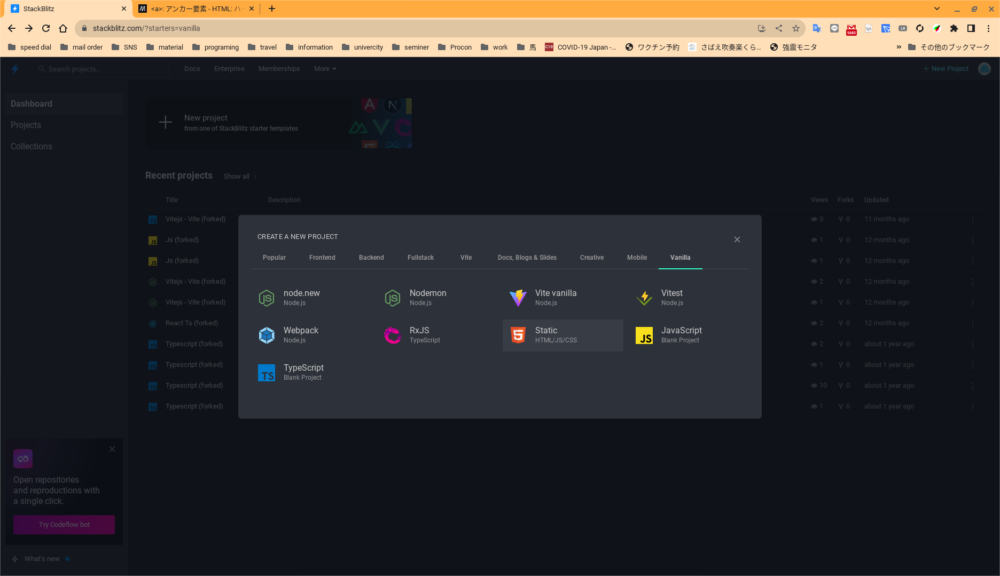

↓の画像のようにエディタとエミュレータが表示された状態に遷移するはずです。


ではファイルビューアーにあるファイルをすべて削除して準備完了です。

### 2-1. HTMLをはじめよう

では空になったファイルビューアーの右上にカーソルをホバーして、アイコンからファイルの追加をクリックします。最初に作るHTMLファイルは `index.html` とします。以下の内容を`index.html`に書き込んでください。

```HTML:index.html
Hello, World !
```

StackBlitzのエミュレータに↓のように表示されていることを確認してください。

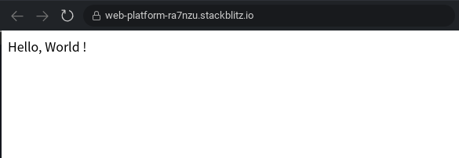

先程の`Hello, World !`の前後を`<h1>`\~`</h1>`で囲んで見てください。これでエミュレータに表示されるテキストが大きくなったはずです。

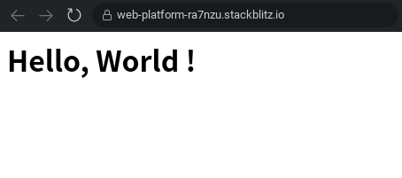

このとき↑のコードの`<h1>`,`</h1>`を **タグ**　*（開始タグ、終了タグ）* といい、タグを含む全体を **要素** といいます。ここで使用している`h1`タグは heading のhをとった見出しを示すタグで、ページで最も重要な見出し要素に使うものです。  
このように、文字列をタグで囲むことをマークアップといい、マークアップすることでブラウザなんの要素かを解釈でき、内容に合わせた表示をとることができます。

### 2-2. HTMLの基本的な構造を知ろう

ではより実用的なHTMLの記述に移っていきます。まずは↓のコードを`index.html`に入力してみてください。  
(StackBlitzでhtmlファイルに `<!` まで入力すると候補に出てくるスニペットに↑のコードを入れ込んだものです)

```HTML
<!DOCTYPE html>
<html lang="ja">
  <head>
    <meta charset="UTF-8" />
    <meta name="viewport" content="width=device-width, initial-scale=1.0" />
    <title>サンプルページ</title>
  </head>
  <body>
    <h1>Hello, World !</h1>
  </body>
</html>
```

表示が少しだけ変わったかと思います。これは本来2-1.で示したコードでは表示がうまくいっていないことを示しています。

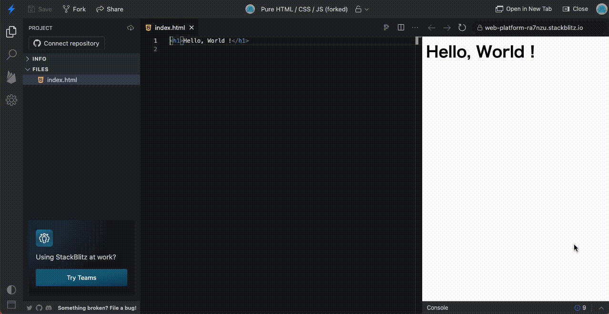

#### 2-2-1. 文書型定義とルート要素

試しに上から順に1行ずつコメントにしてどこが表示が変わった原因かを探りましょう。

HTMLでのコメントは、コメントにしたい記述一帯を `<!--` \~ `--->` で囲むことで表現できます。
>Tips: StackBlitzではコメントにしたい行にカーソルをおいて `Ctrl`+`/` を押すことでコメントにできます

1行目の `<!DOCTYPE html>` をコメントにすると表示が変わっているのがわかります。
この行は*文書型定義*と呼ばれるもので、ブラウザにファイルがHTMLで記述されていることを伝えています。
この記述がない場合には先程のような不具合が発生し得るため、必ずHTMLファイルの先頭には文書型定義をおきましょう。

HTMLの記述は`<html>`\~`</html>`の中に記述されるべきで、この要素をルート要素と言います。
ルート要素の子には *一つの`<head>`要素* と *そのあとに続く一つの`<body>`要素* が許可されています。
サンプルコードでは開始タグに`lang="ja"`という記述があります。これはサイトがenglish=英語で記述されていることを示していて、この記述のおかげでブラウザはページの内容をサイト制作者が意図した言語で解釈することができます。(文字化けが起こらなくなるなど) 
この`lang="ja"`のようにタグの中に書かれる設定を **属性** といいます。

<details>
  <summary>HTMLにおける子孫</summary>

  要素の中に入れ子になった要素のことを *子* といい、要素の中の要素からみて自分を含む要素を *親* と言い表すことがあります。
  共通の親を持つ要素を *兄弟*、親から見て子要素の子要素の子要素の...と続いていく要素郡を *子孫* などと表すこともあります。この資料で頻出する表現になるので覚えておくと良いでしょう。
</details>

#### 2-2-2. head要素

`<head>`要素は、HTMLファイルに記述するもののうち、閲覧者に見せる **コンテンツでないもの** を子孫に記述する要素です。例えば、ページのタイトルや説明文が含まれます。2-2.のコードから`<head>`要素を切り出すと以下のようになります。

```HTML
<head>
  <meta charset="UTF-8" />
  <meta name="viewport" content="width=device-width, initial-scale=1.0" />
  <title>Document</title>
</head>
```

このうち、`<meta`\~`/>`で囲まれた要素は *メタ要素* というものです。その名の通りメタデータを表現するために利用します。  
属性を`charset="UTF-8"`としたものは「文書の文字セットをUTF-8に設定する」意味を持ちます。  
属性に`name="<指定するメタデータの名前>"`とされているメタ要素はまた別に特定のメタデータを指定することができ、この例では`"viewport"`が指定されています。これは表示領域に関する指定で、主にスマートフォンでページを閲覧したときに意図しない幅で表示されないようにしたり、表示が拡大・縮小されたりしないようにできます。

`<title>`~`</title>`で囲まれた`<title>`要素は、ページを開いたときにブラウザのタブに表示されるタイトルを指定します。これもページ閲覧者に伝えるよりブラウザに伝えて使ってもらうような値であるため、HTMLメタ関連の要素になります。

これ以外にも、`<head>`要素の中にはJSを記述したり読み込んだりする`<script>`要素や後述するCSSを記述できる`<style>`要素、現在のファイルと外部リソースの関係を表現できる`<link>`要素等が記述できます。

#### 2-2-3. body要素

`<body>`要素は、HTMLに記述する **ページに表示されるすべてのコンテンツ** を子孫に記述する要素です。この例では`<h1>Hello, World !</h1>`のみがページに表示されるコンテンツです。例えば、このページにあなたの自己紹介を表示することになったら、その内容はすべて`<body>`要素の中に書かれます。

以下のコードを、コメントを置き換えつつ追記してみてください。

```HTML
  <body>
    <h1>Hello, World !</h1>
    <!-- ここから追加の記述 -->
    <h2>自己紹介</h2>
    <ul>
      <li>名前: <strong><!-- あなたの名前 ---></strong></li>
      <li>出身校: <!-- あなたの出身校 ---></li>
      <li>
        好きな食べ物ランキング: 
        <ol>
          <li><!-- 好きなもの1位 ---></li>
          <li><!-- 好きなもの2位 ---></li>
          <li><!-- 好きなもの3位 ---></li>
        </ol>
      </li>
    </ul>
    <!-- ここまで追加の記述 -->
  </body>
```

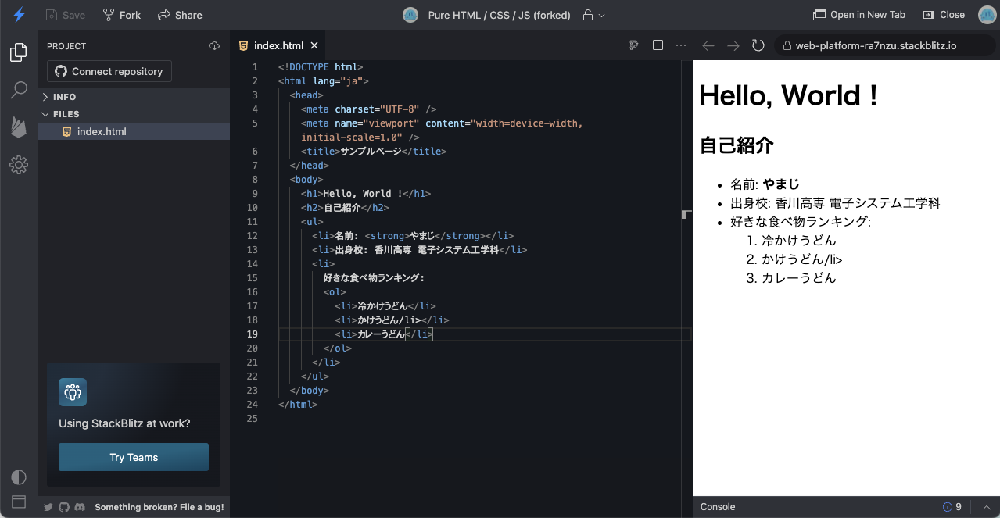

これがHTMLの基本的な構造です。

### 2-3. コンテンツを見やすく書くHTMLを知ろう

2-2.が終了した時点ではコードが↓のようになっていると思います。

```HTML
<!DOCTYPE html>
<html lang="ja">
  <head>
    <meta charset="UTF-8" />
    <meta name="viewport" content="width=device-width, initial-scale=1.0" />
    <title>サンプルページ</title>
  </head>
  <body>
    <h1>Hello, World !</h1>
    <h2>自己紹介</h2>
    <ul>
      <li>名前: <strong><!-- あなたの名前 ---></strong></li>
      <li>出身校: <!-- あなたの出身校 ---></li>
      <li>
        好きな食べ物ランキング: 
        <ol>
          <li><!-- 好きなもの1位 ---></li>
          <li><!-- 好きなもの2位 ---></li>
          <li><!-- 好きなもの3位 ---></li>
        </ol>
      </li>
    </ul>
  </body>
</html>
```

ここでは`<body>`要素の中身について、つまりページに表示されるコンテンツの表現について詳しく説明していきます。

#### 2-3-1. 見出しと段落

文書を表現するとき、見やすく、わかりやすくするためには塊を作って構造化することが重要です。物語でも論文でも章立てで (k部-)n章-m節-l項 というようにある程度の塊で分割、構造化されていますね。（もちろんこの資料もです）

このような構造を表現する方法が見出しと段落です。すでに見出し要素は登場済みですね。`<h1>`要素がそうだと2-1.で説明しました。  
似たタグがコード中にありますね？このように、見出し要素はその(章立てにおける)大きさを表現できるよう`<h1>`\~`<h6>`まで用意されています。

↓のコードを適当に追加してどんな表示になるか感覚を掴んでおきましょう。

```HTML
<h1>Windowsでコンピューターの世界が広がります。1234567890</h1>
<h2>Windowsでコンピューターの世界が広がります。1234567890</h2>
<h3>Windowsでコンピューターの世界が広がります。1234567890</h3>
<h4>Windowsでコンピューターの世界が広がります。1234567890</h4>
<h5>Windowsでコンピューターの世界が広がります。1234567890</h5>
<h6>Windowsでコンピューターの世界が広がります。1234567890</h6>
<span>Windowsでコンピューターの世界が広がります。1234567890</span>
```

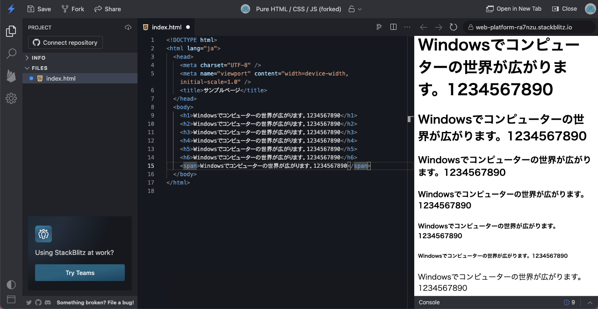

ここで比較対象として`<span>`要素を用意しました。この要素はコンテンツを囲む以外に意味を持たない、コンテンツをただ表示するだけの要素です。最も一般的なテキストの表示が`<span>`要素での表示になるので、これと比較することで見出し要素の見え方がよく分かるでしょう。

見出し要素の使用にはいくつかのポイントがあります。  
- `<h1>`要素はページに一つだけあるのが好ましいとされています。`<h1>`要素は最も大きな見出し、いうなれば物語や記事の題を表すための要素のようなもので、これが複数あることはありえないからです。  
- 見出し要素の大きさを入れ替えて使用するべきではありません。  
- 見出し要素は本文中で多用されるものは3段階にとどめた方がよいです。一般に章-節-項が使われて、巨大な文書を分けるために部が使われることからもそのほうが適しているでしょう。部まで必要になるような場合にはページそのものを分割することを考えるべきです。

また、段落を表す`<p>`要素も合わせて使用しましょう。一般に日本語では行頭を一字下げることで表現されますが、HTMLでは`<p>`\~`</p>`で囲むことで段落を表現できます。

#### 2-3-2. 箇条書き(リスト)

説明文などを書いていると特に、箇条書きで事柄を列挙したいことがあります。（↑の見出し要素の使用のポイントのような）
これは`<ul>`要素とその子要素の`<li>`要素で表現できます。サンプルでも自己紹介で登場していますね。

```HTML
<ul>
  <li>かけうどん</li>
  <li>しょうゆうどん</li>
  <li>ぶっかけうどん</li>
  <li>ざるうどん</li>
  <li>釜揚げうどん</li>
  <li>釜玉うどん</li>
  <li>カレーうどん</li>
  <li>しっぽくうどん</li>
</ul>
```


このうどん屋のメニューの列挙のように、項目の並びが重要でないものには順序のない箇条書きで表現するのが良いです。
それに対して、私の好きな順に並んだうどんのリストを表現したいときには`<ol>`要素とその子要素の`<li>`要素で記述できます。

```HTML
<strong>私の好きなうどんメニュー</strong>
<ol>
  <li>かけうどん</li>
  <li>しっぽくうどん</li>
  <li>ぶっかけうどん</li>
  <li>カレーうどん</li>
  <li>しょうゆうどん</li>
  <li>ざるうどん</li>
  <li>釜玉うどん</li>
  <li>釜揚げうどん</li>
</ol>
```

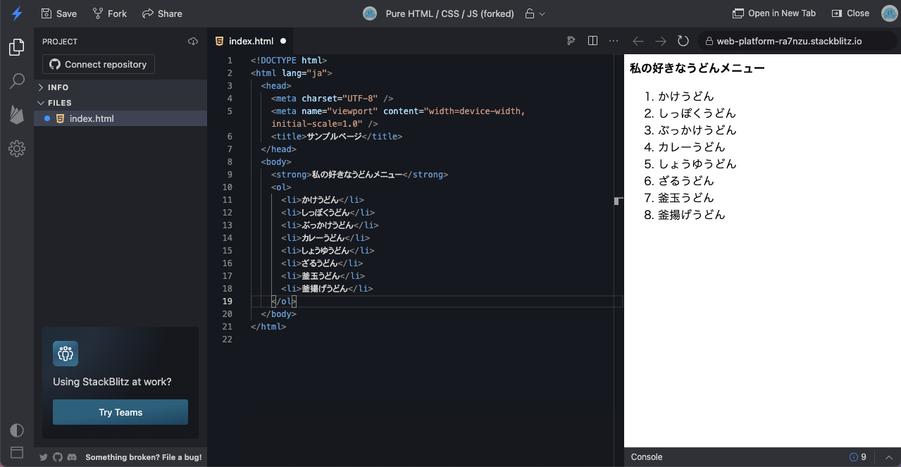

また、箇条書きの中に箇条書きを書く(入れ子にする)ことで箇条書きでも階層を表現できます。

```HTML
<ul>
  <li>
    材料(3~4人前): 
    <ul>
      <li>小麦粉: 400 g</li>
      <li>塩: 20 g</li>
      <li>水: 200 ml</li>
    </ul>
  </li>
  <li>
    作り方
    <ol>
      <li>分量通りの塩と水を混ぜて塩水をつくります。</li>
      <li>大きめのボウルにあけた小麦粉に塩水を加え、そぼろ状になるように熊手様にした手で素早く混ぜます。</li>
      <li>パラパラとした粒がおおよそひとかたまりになるようにこねます。</li>
      <li>ひとかたまりになったら生地の橋から中心に向けて生地を折りたたむようにして更にこねます。（20回程度）</li>
      <li>10~20分寝かせます。</li>
      <li>4.の手順を再度行います。(30回程度)</li>
      <li>10~20分寝かせます。</li>
      <li>伸ばして切ります。このとき四角形に近い形に伸ばせるときれいな麺になる部分が増えます。</li>
      <li>沸騰したたっぷりのお湯で10~12分茹でます。時々麺をつまんで茹で具合を確認してください。</li>
      <li>氷水に取り、やさしくこすり合わせるようにしてぬめりを落とします。</li>
      <li>一人前200g程度に玉を取ってうどんの完成です。</li>
    </ol>
  </li>
</ul>
```


#### 2-3-3. 強調と重要の表現とその違い

HTMLでも私達が普段話したり書いたりするのと同じように表現や意味を強調したり重要であることを伝えるための要素があります。

`<em>`要素は強調を示す要素です。コンテンツはイタリック(斜体)で表示されますが、イタリックでの表示のみが目的ならば`<span>`要素とCSSでの表現を使用するべきです。

例えば、以下のような例で重宝するでしょう。

```HTML
<p>
  クイズの問読みに置いて、パラレルと呼ばれる「ですが問題」では強調される部分の違いで,その後の問題分でどこが変化するのかがわかります。
  <ul>
    <li>「日本で <em>一番</em> 高い山は富士山ですが、」となった場合、「一番」が変化する→「二番目に」なら北岳</li>
    <li>「 <em>日本で</em> 一番高い山は富士山ですが、」となった場合、「日本で」が変化する→「世界で」ならエベレスト</li>
    <li>「日本で一番 <em>高い</em> 山は富士山ですが、」となった場合、「高い」が変化する→「低い」なら日和山（国土地理院の地形図に山として掲載されているものの中で）</li>
  </ul>
</p>
```

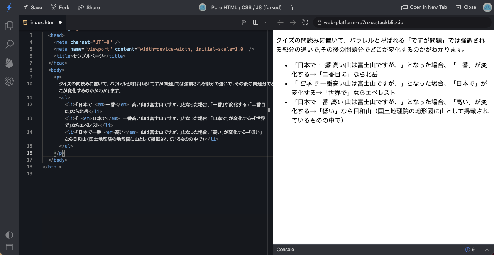

これに対して`<strong>`要素は重要性の高い言葉の表現にもちいます。コンテンツは太字で表示されますが、`<em>`要素と同様に太字での表示飲みが目的ならば`<span>`要素とCSSでなんとかするべきです。（ここまでの資料中で雑に使っていましたが、重要性を示す意図がない場合は誤用ですね。）

```HTML
<p>
  <strong>静的型付け</strong>、私の好きな言葉です。
</p>
```

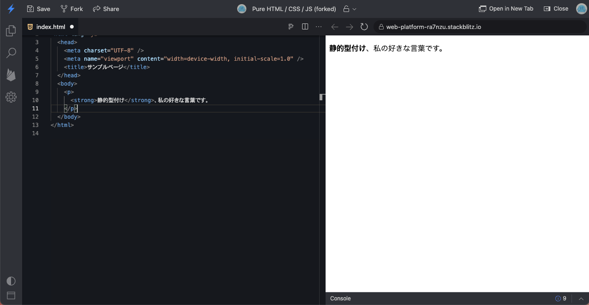

### 2-4. 画像を利用しよう

普段我々が目にするwebサイトは多かれ少なかれ画像を利用しているところがほとんどでしょう。HTMLでは以下のコードのようにして画像をページに表示することができます。  
> ※ StackBlitzは[バグ](https://github.com/stackblitz/core/issues/1687)があり、アップロードしたローカル画像を表示できません。そのため、ここでは自分のGitHubのプロフィールページからアイコンの画像アドレスを取得して表示させてみてください。

```HTML
" />
```


このように``タグの`src`属性に表示させたい画像までのパスを渡すことで、画像を取得してページに埋め込んで表示してくれます。
このときsrcに指定されているURLをすべて書くパスの指定を *絶対パス指定* 、それに対して↓のようにHTMLファイルから見たファイルの位置を指定する方法を *相対パス指定* と言います。

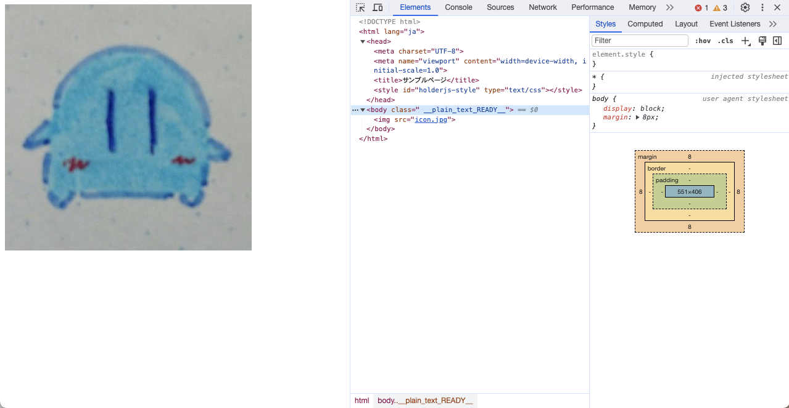

また、``要素に一般に追加される属性として`alt`属性があります。これは画像が取得できなかったときなどに表示される*代替テキスト*というもので、設定されている方が望ましいです。

<details>
  <summary>空要素</summary>

  HTML要素の一部は`<`~`/>`で囲まれた一つのタグだけで記述できます。このような要素を空要素と言います。
</details>

### 2-5. リンクを貼ろう

webにおけるリンクと呼ばれるものは、正式にはハイパーリンクと言います。このハイパーリンクによって様々な文書が相互にリンクされる要素をクモの巣になぞらえてWebと呼ばれるようになったほど、webにおいて欠かせないものです。

そんなハイパーリンクですが、↓のようにして記述できます。

```HTML
<a href="https://jig.jp">株式会社 jig.jp ホームページ</a>
```

`<a>`と`</a>`で囲まれた間の文字がリンクテキストとして表示され、`href`属性でリンク先アドレスを指定します。
この他に`target`属性を指定することがあり、`target="_blank"`とすることで新しいタブでページを開くことができます。

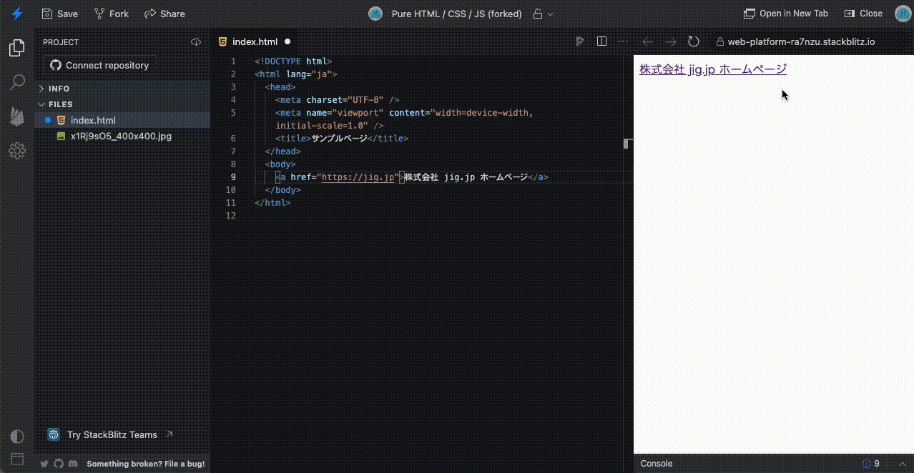

### 2-6. よくあるページのレイアウトとそのためのHTML要素を知ろう

ここまでで一般的な表示に用いるHTML要素はおおよそ説明できたでしょう。では実際に最近良く見るwebページの構造を考えてみましょう。
みなさんよく↓の図のようなサイトを見ると思います。


このレイアウトは、大きく分けるとヘッダー、右カラム、メインコンテンツ、左カラム、フッターで構成されています。

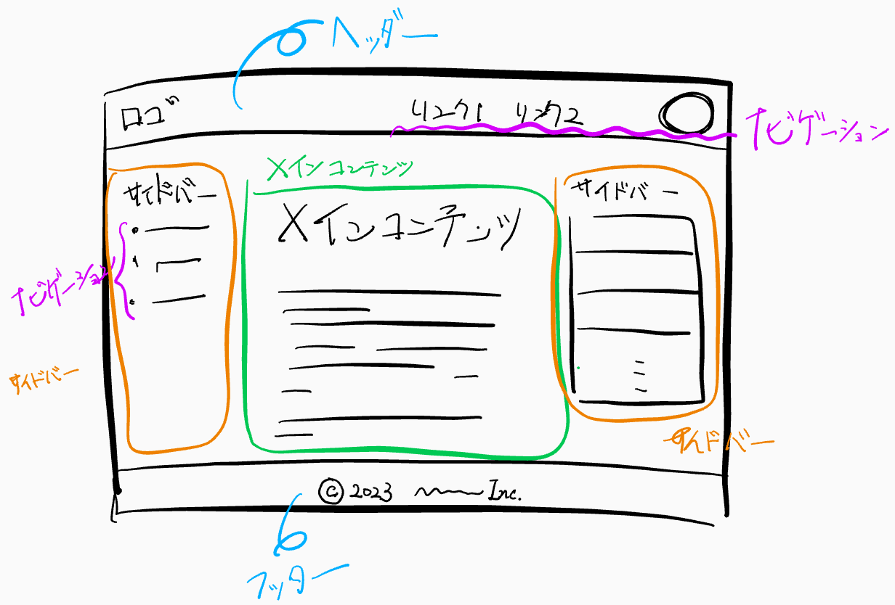

このようなレイアウトを聖杯レイアウトと言ったりします。実はこの表示上の大きな塊を表現するためのHTML要素があります。

- ヘッダー: `<header>`要素
- サイドバー: `<aside>`要素
- メインコンテンツ: `<main>`要素
- フッター: `<footer>`要素
- ナビゲーション: `<nav>`要素

これらは、ブラウザに要素がどんなコンテンツを内包しているかをより詳細に伝えることができる要素です。
詳細な説明は省きますが、これらの要素を適切に使うことで、よりアクセス性の良いwebコンテンツを作ることができます。

## 3. レイアウトとデザインを考えよう

### 3-１. CSSを始めよう

### 3-2. ボックスモデルを知っておこう

### 3-3. スタイルシートの種類と優先度

### 3-4. 思いどおりの見た目を作ろう

### 3-5. 擬似クラスと疑似要素を使いこなそう

## 4. 動的にページに変更を加えよう

### 4-1. JavaScriptでHTML要素を取得しよう

### 4-2. JavaScriptで要素に変更を加えよう

### 4-3. 

