# JavaScript を始めよう

> 想定時間: 90分

<details>
  <summary>TOC</summary>  

  1. JavaScript に触れてみよう
    1. console.xxx()
    2. コメント
    3. 変数
    4. 演算子
    5. 条件分岐
  2. 身の回りの計算を JavaScript にやらせてみよう
    1. 日付
    2. 三角方程式
  3. ブラウザの標準APIを利用しよう
    1. 非同期処理の使い方
    2. ファイル読み込み
    3. 位置情報API

</details>

## 1. JavaScript に触れてみよう

### 0. ブラウザの開発者用ツールを開こう

※ Google Chrome を利用することを前提としています

chromeの開発者ツールを利用します。
↓の画像のように右上のケバブメニューから開くことが出来ます。


> ショートカットキー
> Windows / Linux / ChromeOS : `Ctrl + Shift + I`
> macOS: `⌥ + ⌘ + I`

↓のような表示になっていれば開けています。(開発者ツールの幅は適当に調節してください)


今回の資料では↑の `Console` タブを利用します。他のタブは適宜他の資料で説明される予定です 🙏

### 1. Hello, World
>
> [console](https://developer.mozilla.org/ja/docs/Web/API/console)

最初にやることといえばこれでしょう。以下のコードを先程の `Console` タブに入力してEnterで実行してみてください。

```javascript
console.log('Hello, World !');
```

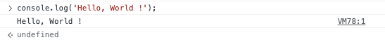
このようにして `Console` タブ上に任意のデータを出力することが出来ます。
ここで使った `console.log()` の仲間に↓のようなものがあります。後で使えるかもしれないのでそれぞれ試してみてほしいです。

| code | 出力結果 | 使い所 |
| ---- | ---- | ---- |
| `console.log('multiple', 'args)` | 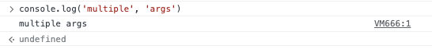 | 複数の値をいっぺんに確認したいとき |
| `console.warn('this is warn')` | 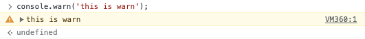 | 黄色い出力になって見つけやすい<br>被致命のエラーに使うとよい |
| `console.error('this is error')` | 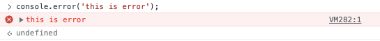 | 赤い出力になって見つけやすい<br>致命的なエラーに使うとよい |
| `console.table({'this': 'table'})` | 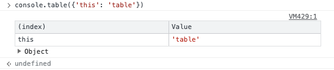 | オブジェクトを見やすく表示したいときに便利 |

### 2. コメント

> JavaScript Comments [w3c](https://www.w3schools.com/js/js_comments.asp)

おおよそのプログラミング言語にはコメントという機能があります。
コメントを書くことでコードの処理や意図を他の開発者にわかりやすくできます。
また、コードの動作を確かめるときに不要な部分をコメントにすることで実行を省くことができます。

```javascript
// JavaScriptには2種類のコメントの書き方があり、こちらは行中の // 以後をコメントにします
// console.log('例えばこんなふうな実行したくない行をコメントにできます。');

/* 
  この書き方では複数行をコメントにできます。
  処理の塊をまるごとコメントにしたい場合に便利です。
*/
```

### 3. 四則演算

やはりプログラムでやらせるものといえば計算でしょう。  
以下に簡単な四則演算のコードを示します、それぞれ実行して動作を確かめてください。

| code | 出力結果 |
| ---- | ---- |
| `1 + 1;` | 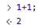 |
| `1 - 1;` | 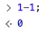 |
| `2 * 2;` |  |
| `2 / 2;` | 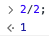 |

これらを用いて以下の2次方程式の解を求めてください。ただし、2次方程式の解の公式 $ x = {-b \pm \sqrt{b^2-4ac} \over 2a}$ を使って良いものとします
なお、JavaScriptでは $\sqrt x$ は `Math.sqrt(x)`、 $x^2$ は `Math.pow(x, 2)` と表せます。
<details>
  <summary>ヒント</summary>
  
  ２次方程式の解の公式はJavaScriptでは以下のようにして表せます。

  ```JavaScript
  (-b + Math.sqrt(Math.pow(b, 2) - 4 * a * c)) / (2 * a);
  (-b - Math.sqrt(Math.pow(b, 2) - 4 * a * c)) / (2 * a);
  ```

  ↑の中のa, b, cを数値に置き換えて実行してみてください。
</details>

#### 練習問題

**Q1.)** $ 2x^2 + 4x + 2 = 0 $

<details>
  <summary>A1.)</summary>

  $ x = {-4 \pm \sqrt{4^2 - 4 \times 2 \times 2} \over 2 \times 2} $
  $ x = {-4 \over 4} = -1 $

  よって、 $x = -1$ (重解)

  
</details>

**Q2.)** $ 4x^2 - 4 = 0 $

<details>
  <summary>A2.)</summary>
  
  $ x = {-0 \pm \sqrt(0^2 -4 \times 4 \times -4) \ over 2 \times 4}$
  $ x = {\pm \sqrt(64) \over 8}$
  $ x = \pm 1$

  よって、 $x = \pm 1$

  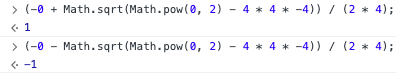
</details>

### 4. 変数

> [JSPrimer 変数と宣言](https://jsprimer.net/basic/variables/)

*3. 演算* で使った2次方程式の解の公式ですが、先程の練習問題では我々がa, b, cに我々が数値を代入して計算を行わせる形で利用しました。  
変数の代入もプログラムにやってもらえると嬉しいですよね？プログラムにも変数の概念があります。
JavaScriptで変数を利用するには、変数を**宣言**する必要があります。以下のコードを実行してみてください。

```JavaScript
let variable; // 再代入可能な変数として variable を宣言する
const constant = 1; // 再代入不可能な変数として constant を宣言して、初期値を 1 とする
```

<details>
  <summary>【※補足】代入演算子</summary>
  
  ↑のコードで `const constant = 1;` の行で登場した `=` を代入演算子と呼びます。  
  演算子の左側にある変数に対して値を代入するものです。
</details>

これで `variable`,`constant` という名前の変数が宣言されて、consoleで利用可能になりました。
試しに `console.log(variable, constant);`として出力を確認してください。


ここでは`variable`は値が代入されていないため `undefined`(未定義) となり、`const`は初期値`1`を代入しているので`1`が出力されます。
では `let` と `const` により違いを見て見るため、両方に `2` を代入してみましょう。

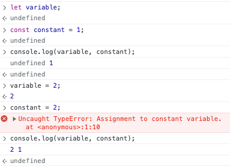

`let`は再代入可能な変数を宣言するため`variable`には`2`が代入できています。  
しかし、`const`は再代入不可能な変数を宣言するため、`const`に`2`を代入しようとしたときには`Assignment to constant variable.`とエラーが表示されています。
この性質から、`const`で宣言した変数は**定数**と呼ばれることもあります。

ではようやく冒頭の話題に戻り、より楽に計算を行いましょう。

```JavaScript
(-b + Math.sqrt(Math.pow(b, 2) - 4 * a * c)) / (2 * a);
(-b - Math.sqrt(Math.pow(b, 2) - 4 * a * c)) / (2 * a);
```

↑の式ですが、`a`,`b`,`c`をそれぞれ変数として宣言し、変数に問題から与えられる値を代入すれば↑の計算を再実行するだけでよくなります。
Q1.を解くコードは↓のようになるでしょう。

```JavaScript
let a = 2, b = 4, c = 2;
(-b + Math.sqrt(Math.pow(b, 2) - 4 * a * c)) / (2 * a);
(-b - Math.sqrt(Math.pow(b, 2) - 4 * a * c)) / (2 * a);
```

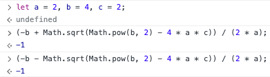

Q2.を解くために値を代入して、解の公式を再度実行することで楽に計算できます。
> ※ chromeのconsoleタブでは↑↓キーでそれまでの命令を参照して実行することが出来ます。
> 

### データ型とリテラル

変数を使っていく上で切っても切り離せないのが型の概念とそれぞれの記法(リテラル)です。
JavaScriptは**動的型付け言語**といって変数に対し明示的に型を指定しません。が、変数そのものやコード中に登場する値には型があります。
この値の型のことを**データ型**と言い、データ型には以下に示す**7つのプリミティブ型**と**オブジェクト**があります。
ある値がどのデータ型を持つのかを調べるには `typoof` 演算子を利用します。

#### プリミティブ型

それぞれの型の名前と意味、`typeof`の実行結果を示します。

| 型名 | 意味 | `typeof`実行結果 |
| ---- | ---- | ---- |
| null | null (*=値が存在しないこと*) を意味するデータ型・キーワード | 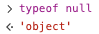 |
| undefined | 値が未定義であること を意味するデータ型 | 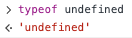 |
| Boolean | 論理値 `true` または `false` をとるデータ型 |  |
| Number | 整数もしくは浮動小数点数をとるデータ型 | 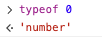 |
| BigInt | 任意の精度の整数をとるデータ型 | 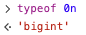 |
| String | 0字以上の文字または文字列をとるデータ型 | ) |
| Symbol | 実体が一意で不変な値を取るデータ型 | 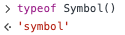 |

#### オブジェクト

JavaScriptで利用されるもののうち、↑のプリミティブ型以外はすべてオブジェクトに分類されます。
オブジェクトに分類されるものの例を以下に示します。

| 種類 | 定義 | `typeof`実行結果 |
| ---- | ---- | ---- |
| オブジェクト | `const obj = {};` | 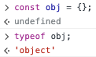 |
| 配列 | `const arr = [];` |  |
| 関数 | `const func = () => {};` |  |
| クラス | `class myClass {}` |  |
| 正規表現 | `onst re = new RegExp('/ab+c/');` |  |

<!-- koko -->

<details>
  <summary>0, null, undeifnedの違い</summary>
  
  一般にこの３つをわかりやすく説明するため、トイレットペーパーを用いた説明がなされます。
  | 0 | null | undefined |
  | ---- | ---- | ---- |
  | 芯はある | ペーパーホルダーはある | ペーパーホルダーもない |
  |  |  |  |
  > 画像引用元: [いらすとや](https://www.irasutoya.com/)

  これらはすべてfalsy(論理値としてfalseになる性質がある)な値ですが、これは「この状態で用を足したあと拭けるか」と聞かれるとムリ、と思うと覚えやすいです。
  また、芯に紙を巻き直すことはできること、芯がないとかホルダーがないとかでは紙を巻き直す操作も出来ないことを考えると、感覚的にこれらの値・型の意味をとらえやすいでしょう。
</details>

### オブジェクトと配列

### 関数
>
> [JSPrimer 関数と宣言](https://jsprimer.net/basic/function-declaration/)

ここまではブラウザのconsoleタブで↑↓キーを押すことで押すことで命令を再利用しました。
しかし、実際のコード中では↑のような操作は出来ません。そこで**関数**を利用します。

JavaScriptでの関数とは、ある一連の処理をひとつにまとめたものです。
ここでは`solveQuadraticEquations(a, b, c);`として先程の解の公式を一つの命令に`a`, `b`, `c`を引数として渡すだけで解を求めて返す関数を実装してみましょう。

#### 関数宣言

関数の宣言には複数の方法があります。まずは`function`キーワードを使用した関数宣言のサンプルを示します。

```JavaScript
function solveQuadraticEquations(a, b, c) {
  const ans1 = (-b + Math.sqrt(Math.pow(b, 2) - 4 * a * c)) / (2 * a);
  const ans2 = (-b - Math.sqrt(Math.pow(b, 2) - 4 * a * c)) / (2 * a);
  return [ans1, ans2];
}
solveQuadricEquations(2, 4, 2);
```

↑のコードでは1行目の `solveQuadraticEquations` が**関数名**となり。この名前を用いて6行目のように処理を呼び出すことが可能になります。

1行目の関数名のあとに続く `(a, b, c)` は関数の呼び出し時に処理に使う値を渡すための **仮引数** というものです。
関数内の処理のみ利用可能になるもので、6行目の呼び出しの例では`a`に2,`b`に4,`c`に2というように順番に値が入ります。
この仮引数のお陰で、実際の数値が分からないものをわかったものとして処理に用いることが出来ます。
数学的に言うと *2次の項の係数をa, 1次の項の係数をb, 0次の項の係数をcとおく* として計算を進めるような感じです。

4行目の `return [ans1, ans2]` は関数が呼び出されたときに処理の結果として呼び出し元に値を返す処理です。
`[ans1, ans2]` はans1, ans2を*配列*としてひとまとめにしています。配列は変数の羅列で、*インデックス*という配列中の順番を指定することでひとつの値を取り出せます。
