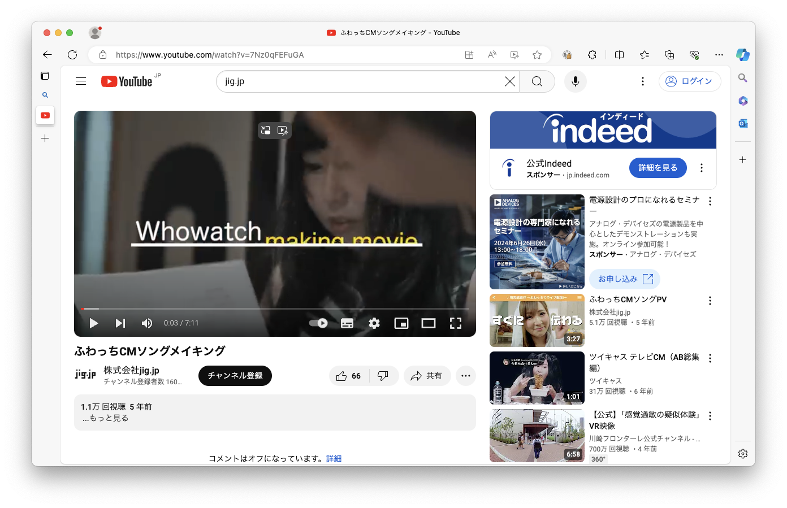
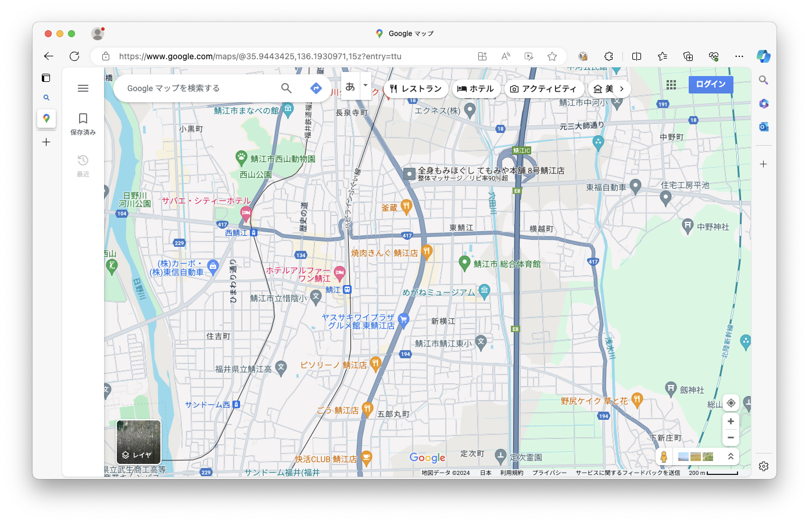
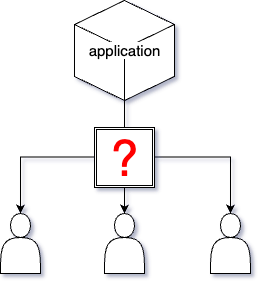
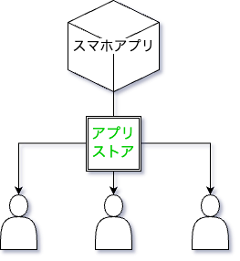
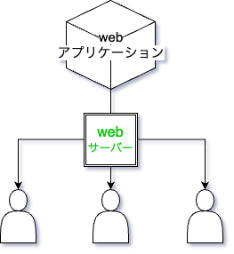
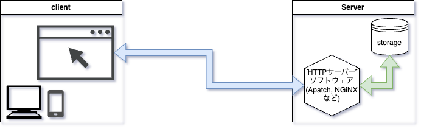

# Webアプリケーション概論

<!-- > 想定時間: 90分 -->
<!-- Author: Yamaji Toshiyuki (@haruyuki_16278) -->

---

### 目次

1. Webアプリケーションとは
1. Webアプリケーションの仕組み
   1. Webアプリケーションのシステム構成
   1. Web API サーバー
   1. Webアプリケーションの種類
1. Webアプリケーションとフレームワーク
   1. クライアントサイドフレームワーク
   1. サーバーサイドフレームワーク
   1. フルスタックWebフレームワーク
<!-- 1. 参考文献 -->

---

## 1. Webアプリケーションとは

---

### Q. Webアプリケーションとは

---

**ブラウザ上で動作するアプリケーションのこと**

---

**ブラウザ上で動作するアプリケーションのこと**  
↕
*ネイティブアプリケーション*
> 各種OS上にインストールして利用するソフトウェア

---

### 例えば？

---

- 動画や映像配信を閲覧できる動画配信サイト

---

- 販売されている商品を閲覧し、カートにいれるなどの操作を行えるECサイト

---

- 地図を表示して特定の場所を検索したり、経路検索を行える地理情報システムを利用したサイト

---

- ブラウザ上で遊べるゲームサイト

---

- サイト内での操作による描画の変化を伴うようなサイト

---

今回のインターンでは、この **Webアプリケーション** を開発していただきます。

そのためには世の中のWebアプリケーションがどのような仕組みで動作しているのかを知る必要があります。  
この講義では現代で一般的に利用されるWebアプリケーションの構成と、その中で利用されるフレームワークを中心に解説します。

---

## 2. webアプリケーションの仕組み

- 2-1 Webアプリケーションのシステム構成
- 2-2 Web API サーバー
- 2-3 Webアプリケーションの種類

---

### 2-1. Webアプリケーションシステムの構成

---

アプリケーションをユーザーが利用するには
**ユーザーにアプリケーションを届ける仕組み**が必要

---

例えば：スマホアプリ
各種アプリストアを通してユーザーに届けられる

---

**では Webアプリケーション は？**

---

アプリケーションの実行に必要な情報を
**Webサーバーから配信する**ことでユーザーから利用可能に

---

実際の構成の例：オンプレミスの場合

<!-- オンプレ構成でサーバーを公開してNGiNXなどを利用した構成 -->

---

より詳細には...

---

実際の構成の例：クラウドを利用する場合(AWS)

---

Webアプリケーションをユーザーに届けるには
**コンテンツ配信の仕組みが必要**

---

## 4. 参考文献

- [ウェブアプリケーションとは? - ウェブアプリケーションの説明 - AWS](https://aws.amazon.com/jp/what-is/web-application/)
