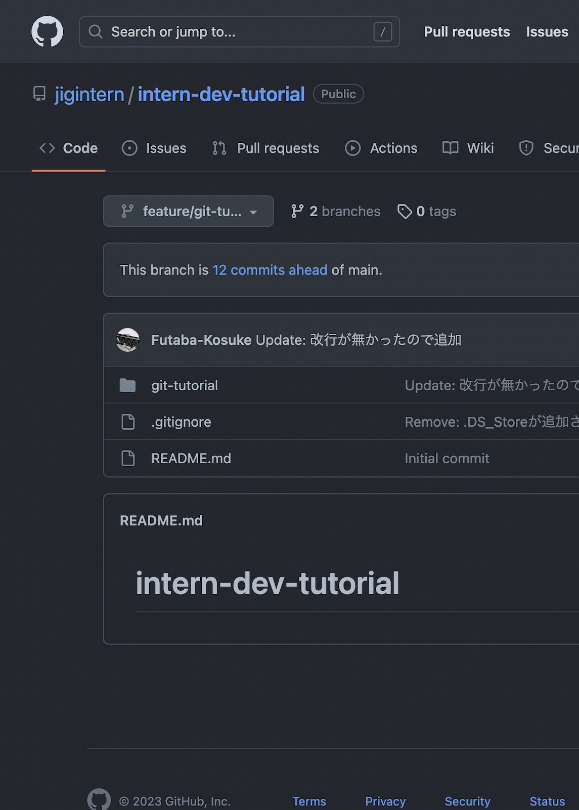
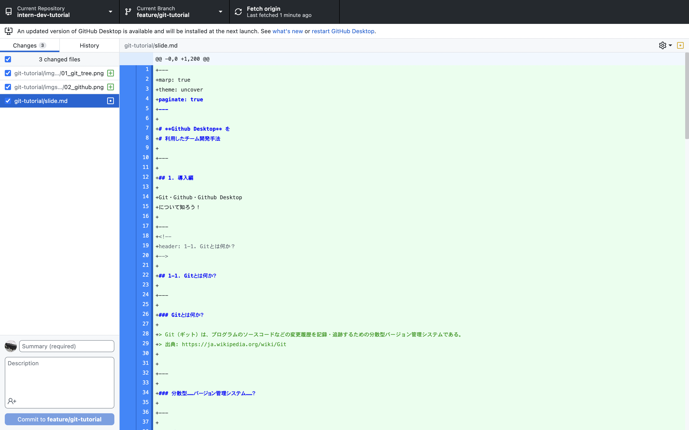

# **Github Desktop** を
# 利用したチーム開発手法

---

## 1. 導入編

*Git・Github・Github Desktop
について知ろう！*

---
<!--
header: 1-1. Gitとは何か？
-->

## 1-1. Gitとは何か？

---

### Gitとは何か？

> Git（ギット）は、プログラムのソースコードなどの変更履歴を記録・追跡するための分散型バージョン管理システムである。  
> 出典: https://ja.wikipedia.org/wiki/Git

---

### 分散型……バージョン管理システム……？

---

### どういうもの……？

---

### **ゲームのセーブデータ**みたいに
### 今の状態を保存しておくもの

これをリポジトリ、と呼びます

---

### **作業が一段落**したら、今の状態を保存します

履歴が溜まっていきますね
すると……？

---

### **いつ、何の機能**を実装したのか分かる

履歴には説明文をつけるので、
分かりやすいです

---

### バグが発生した時も、**元に戻せる**

過去のデータに、一瞬で元通り

---

### 変なデータ、**必要なし**

- `program.c`
- `program(1).c`
- `program(2).c`
- `program(3)_これが最終版.c`
- `program_提出用.c`

---

### その上、**複数人**で作業するための機能も沢山

編集の重複を防いだり、差分を分かりやすくしたり……

---

### Gitとは何か？

ソースコードをいい感じに管理するやつ

---

<!--
header: 1-2. Githubとは何か？
-->

## 1-2. Githubとは何か？

---

### Githubとは何か？

> GitHub（ギットハブ）は、ソフトウェア開発のプラットフォームであり、ソースコードをホスティングする。コードのバージョン管理システムにはGitを使用する。  
> 出典: https://ja.wikipedia.org/wiki/GitHub

---

### ソースコードを……ホスティングする……？

---

### つまり？

---

### Gitをオンラインで管理するやつ

Gitのデータをアップロードして共有・バックアップするためのサービスです

[https://github.com/](https://github.com/)

---

### 記録がある程度溜まったら、**アップロード**

PC上のデータが吹っ飛んでも、オンラインに残ります

---

### 複数人で、データ**共有**

クラウドでの共有は不要です

---

### **他の人**も、閲覧可能

能力をアピールする場としても

---

### Githubとは何か？

ソースコードをいい感じに、チームで管理するやつ

---

<!--
header: 1-3. Github Desktopとは何か？
-->

## 1-3. Github Desktopとは何か？

---

### Github Desktopとは何か？

> GitHub Desktop では、コマンド ラインや Web ブラウザーではなく GUI を使用して GitHub と対話できます。  
> 出典: https://docs.github.com/ja/desktop

---

### Gitは、**コマンドライン**で操作するのが一般的

→

---

### Github Desktopを使えば、**コマンド無し**で操作できます

環境構築もインストールするだけ！
事前にインストールして貰いました

---
<!--
backgroundColor: #222
color: #FFF
-->

# UIはこんな感じ
表示されているのは、この資料を書いている時の様子です

---
<!-- 
_header: ""
-->

---
<!--
backgroundColor: #default
color: #default
-->

### 今回はGithub Desktopを使って開発します
お気に入りのGitの操作方法があれば、そちらで進めていただいても問題ありません！

---
