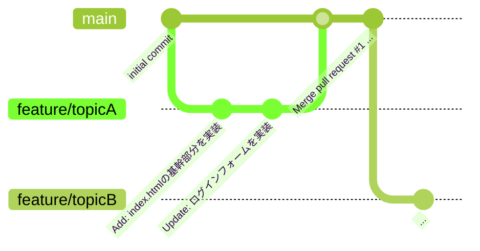
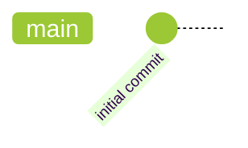
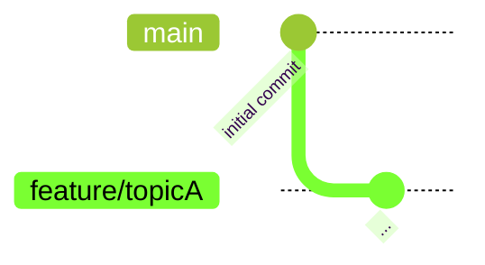
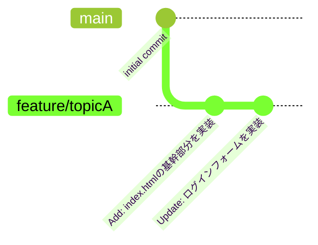
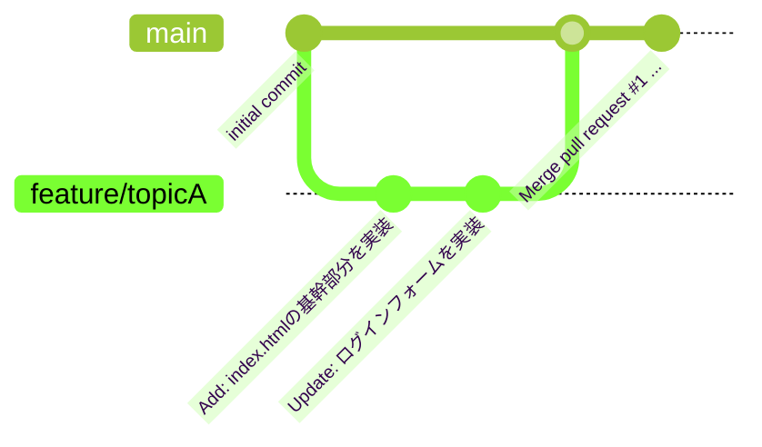

# VSCode の Git 機能を利用したチーム開発手法

本項では、Visual Studio Code（VSCode）に標準搭載されているGit機能（ソース管理ビュー）を利用した開発手法について解説します。  
この資料と同一のフォルダ内に、スライドも掲載しており、双方を参照することで学習を進めます。  

基本的にはスライドで解説を進めるので、本項は必要に応じて参照してください。

## 1. 導入編

*Git・GitHub・VSCodeのGit機能について知ろう！*

### 1-1. Gitとは何か？

> Git（ギット）は、プログラムのソースコードなどの変更履歴を記録・追跡するための分散型バージョン管理システムである。  
> 出典: https://ja.wikipedia.org/wiki/Git

Gitは、プログラムのソースコードを管理するためのツールの一つです。多くの開発現場で採用されており、Gitを活用できることは、それだけで大きなアドバンテージとなります。  

Gitでは一つのアプリケーション開発につき、一つのリポジトリと呼ばれるものを作成します（規模によっては二つ、三つになることもあります）。このPC上で作成するリポジトリを、ローカルリポジトリと言います。  

このリポジトリに変更前と変更後の**差分を記録**することで、作業内容の明文化、バグ発生時の作業内容の巻き戻し等を可能にします。  
また、複数人で開発を行う際の作業の衝突を解決するための機能も備わっています。

> Topic: **差分を記録**することで、「`program.c`, `program(1).c`, `program(2).c`, `program(3)_これが最終版.c`, `program_提出用.c`...」のような形でのバックアップを取る必要が無くなります。



### 1-2. GitHubとは何か？

> GitHub（ギットハブ）は、ソフトウェア開発のプラットフォームであり、ソースコードをホスティングする。コードのバージョン管理システムにはGitを使用する。  
> 出典: https://ja.wikipedia.org/wiki/GitHub

GitHubは、Gitのリポジトリをインターネット上で管理するためのサービスです。このリポジトリを、リモートリポジトリと言います。  
リポジトリをアップロードしておくことで、複数人での開発時のソースコードの共有、ソースコードのバックアップ、自身の実績の公開の場として、等の効果を期待できます。  
この資料も、GitHub上で公開されています。

GitHubを活用した開発では、大まかに、以下のような手順で作業が進められます。  
1. clone: GitHubリポジトリを丸ごとダウンロードする
2. branch: 作業を枝分かれさせて、他の開発者との衝突を防止する
3. 通常通りに、プログラムを書く
4. commit: 作業前と後の**差分を記録**する
5. push: 作業の成果をGitHubにアップロードして共有する
6. Pull Request: 枝分かれした成果を結合する

### 1-3. VSCodeのGit機能とは何か？

> Visual Studio Code には統合されたソース管理機能(SCM)があり、Git のサポートが標準で組み込まれています。  
> 出典: https://code.visualstudio.com/docs/sourcecontrol/overview

VSCodeには、Git / GitHubの機能をGUI（ボタン等でコンピュータに命令を送るもの）で操作するための「ソース管理 (Source Control)」ビューが標準で搭載されています。  
Gitは多くの場合、CUI（文字のみでコンピュータに命令を送るもの）で操作を行いますが、これに慣れるためには時間が必要なため、簡略化のために使用します。  

拡張機能のインストールは不要で、VSCodeさえ導入されていればすぐに使うことができます。ただし、Git本体のインストールは別途必要です（事前準備で導入済みのものとします）。

> Topic: CUIでも操作できると、様々な環境に適応できるのでおすすめです

## 2. VSCodeのGit機能を触ってみよう

*VSCodeのGit機能を実際に使ってみよう！*

### 2-1. clone: GitHubリポジトリを丸ごとダウンロードしよう



`clone`（クローン）は、リポジトリを**丸ごと**、PCにダウンロードするための操作です。  
GitHubにアップロードされているリポジトリを丸ごと取得し、内部の全ファイルも同時にダウンロードします。  

基本的には、開発の最初に各開発者が一度ずつ行う操作です。  

VSCodeでは、以下のように操作することで、クローンの操作を行うことができます。  
例として、`git-tutorial-2026`のリポジトリで作業してみましょう。 

<details>
<summary>練習: VSCodeでクローンしてみよう</summary>

1. 練習リポジトリのURLにアクセスして、「<> Code」ボタンをクリックし、表示されたHTTPSのURLをコピーします
> repository: https://github.com/jigintern/git-tutorial-2026


2. VSCodeを開いて、「ようこそ」画面の「Git リポジトリのクローン... (Clone Git Repository...)」をクリックします  
コマンドパレット（Cmd/Ctrl+Shift+P）で「Git: クローン (Git: Clone)」を選んでも、同じ操作ができます。


3. 画面上部の入力欄に、コピーしたURLを貼り付けて、Enterキーを押します


4. PC上での保存先のフォルダーを選択します


5. 「クローンしたリポジトリを開きますか？」という通知が表示されるので、「開く」をクリックします  
（「このフォルダー内のファイルの作成者を信頼しますか？」と確認された場合は、「はい、作成者を信頼します」を選択してください）


6. エクスプローラーに、GitHubにアップロードされていたファイルが表示されていることを確認します


</details>


### 2-2. branch: 作業を枝分かれさせよう



`branch`（ブランチ）は、リポジトリ内で作業を行う際、他の開発者と作業を**枝分かれ**させる機能です。  
このように、作業を枝分かれさせることを、慣習的に「ブランチを切る」「ブランチを生やす」と言います。

例えば、機能Aを作る開発者と機能Bを作る開発者で、ファイルの編集箇所が重複してしまった場合、片方の変更内容が意図せず削除されてしまう場合があります。  
これを防止するため、機能ごとに編集内容を枝分かれさせ、結合する際に編集箇所の重複を確認・まとめて修正するという手法で作業を進めます。  
また、これによって編集履歴が分かりやすくなり、編集内容の巻き戻し等の際にどこまで巻き戻すのかの目算が立てやすくなる効果も期待できます。  
作業中に致命的なバグが発生した場合に、ブランチを放棄することで、大本のブランチへの被害を回避することも可能です。

一人で作業する場合でも、ブランチを切ることで作業の見通しが良くなる効果が期待できるため、ブランチを切って作業することが推奨されます。

また、作業するブランチを切り替える操作を`checkout`（チェックアウト）と呼びます。

VSCodeでは、以下のように操作することで、ブランチを切る操作を行うことができます。

<details>
<summary>練習: ブランチを切ってみよう</summary>

1. 画面左下、ステータスバーに表示されているブランチ名（main）をクリックします


2. 画面上部に表示されるメニューから、「+ 新しいブランチの作成... (Create new branch...)」をクリックします


3. 新規ブランチの名前を入力して、Enterキーを押します  
ブランチの名前は他の参加者と重複しないよう、自分の名前等で設定してください。


4. ステータスバーの表示が、新しいブランチ名に切り替わったことを確認します


</details>

既にファイルに変更を加えていた場合、その変更は新しいブランチにそのまま持ち越されます。


### 2-3. commit: 作業前と後の**差分を記録**しよう


`commit`（コミット）は、作業前と作業後の**差分を記録**する操作です。  
作業が一段落したタイミングでコミットを行うことで、作業内容の明文化や、バグ発生時の巻き戻し等で役立ちます。  
また、コミットにはコミットメッセージという説明文を付与するため、作業内容を振り返る際の手助けにもなります。

> Topic: リポジトリに `.gitignore` という名前のファイルを追加することで、Git管理下から強制的に除外するファイルを定義することができます。  
> これを使用すれば、GitHubにアップしてはいけない情報（テスト用のパスワード、認証情報のハッシュ等）をGit管理下から除外できます。
> ```
> # .gitignore
> .env
> .password
> .DS_Store
> ```

VSCodeでは、以下のように操作することで、コミットの操作を行うことができます。

<details>
<summary>練習: 作業してコミットしてみよう</summary>

1. ファイルを新規作成します  
ファイルの名前は他の参加者と重複しないよう、自分の名前等で半角英数字で設定してください


2. 作成したファイルに、適当なプログラムを書き込みます


3. アクティビティバー（画面左端）の「ソース管理 (Source Control)」アイコンをクリックして、ソース管理ビューを開きます  
「変更 (Changes)」に作成したファイルが表示されていること、ファイル名をクリックすると差分が表示されることを確認します


4. ファイル名にカーソルを合わせて「+」(変更をステージ / Stage Changes)をクリックし、「ステージされた変更 (Staged Changes)」に移動させます


5. 上部の入力欄に、変更内容についての説明文（コミットメッセージ）を記載し、「コミット (Commit)」ボタンをクリックします  
これでコミットが完了します


</details>

> Topic: ステージ（stage）は、「次のコミットに含める変更を選ぶ」操作です。今回のように変更をまとめてコミットする場合は、ステージを省略しても構いません（ステージせずにコミットすると、すべての変更をコミットするか確認されます）。


### 2-4. log: 作業の履歴を確認しよう

`log`（ログ）は、コミットの履歴を確認する操作です。  
現在作業中のブランチでのコミットの履歴を確認し、作業内容を確認することができます。  
作業を始める前やコミットが正しく完了したか、作業の開始地点が正しいかなどの確認のために用います。

VSCodeでは、以下のように操作することで、ログを確認することができます。

<details>
<summary>練習: コミットの履歴を確認しよう</summary>

1. ソース管理ビューの「グラフ (Graph)」に、コミットの履歴が表示されることを確認します


</details>

> Topic: エクスプローラー下部の「タイムライン (Timeline)」では、開いているファイル単位の変更履歴を確認できます。


### 2-5. push: 作業の成果をGitHubにアップロードして共有しよう

`push`（プッシュ）は、現在のブランチの作業内容をGitHub等にアップロードする操作です。  
他の開発者に作業内容を共有する時、作業が一段落して、ブランチの内容を元のブランチに結合したい時などに行います（後述。ブランチの結合操作は他開発者に確認してもらうのが望ましいため、GitHub上で行います）。

VSCodeでは、以下のように操作することで、プッシュの操作を行うことができます。

<details>
<summary>練習: 作業内容をプッシュしてみよう</summary>

1. ソース管理ビューの「Branch の発行 (Publish Branch)」をクリックします


2. 初回はGitHubへのサインインを求められるので、「許可 (Allow)」をクリックします


3. ブラウザが開くので、GitHubにログインして「Authorize Visual-Studio-Code」をクリックし、VSCodeに戻ります


4. ブラウザでGitHubを開き、プッシュしたブランチが正しく反映されていることを確認します


</details>

一度プッシュしたブランチにさらにコミットした場合は、「変更の同期 (Sync Changes)」ボタンでプッシュできます。

> Topic: サインインがうまくいかない場合は、GitHub CLI（`gh auth login`）やGit Credential Managerを導入することで解決できることがあります。


### 2-6. Pull Request: 枝分かれした成果を結合しよう



`Pull Request`（プルリクエスト）は、GitHubの機能の一つで、ブランチ機能で分岐した作業を大本のブランチへと結合するための機能です。  
この結合作業を`merge`（マージ）と呼びます。この操作はローカルでも行うことができますが、ブランチの結合操作は**他開発者に確認してもらうのが望ましい**ため、GitHub上で行います。

> Topic: `Pull Request`は、GitHub以外のGit管理用のサービス（GitLab等）では、`Merge Request`（マージリクエスト）と呼ぶこともあります。

ブランチの結合作業は、以下の順序で行います。  
1. 作業ブランチの内容をGitHubにアップロード（push: プッシュ）する。
2. 作業ブランチから元のブランチへの結合用の`Pull Request`を作成する。
3. 他開発者（レビュワー）が作業内容を確認して、問題点を指摘する。問題点が無い場合、確認した旨をコメントする。
4. ブランチを結合（merge: マージ）する。

GitHub上で、以下のように操作することで、Pull Requestの作成〜結合までを行うことができます。  

<details>
<summary>練習: プッシュした新規ブランチを、元のブランチに結合してみよう</summary>

1. GitHubで「Pull requests」のタブをクリック

2. 「New pull request」をクリックします


3. 新規ブランチの名前、Pull Requestのタイトル、本文を入力します  
他の開発者に確認してもらうものなので、作業内容が理解しやすい内容にすると良いです

4. 「Create pull request」をクリックすると、Pull Requestが作成されます


5. 他開発者に、Pull Requestの確認を依頼します  
SlackやGitHub上でのコメントなど、適宜チーム内で決定した方法で依頼しましょう

6. 確認を依頼された人は、Pull Requestの変更内容等を確認して、問題箇所があればコメント等で指摘します  
問題箇所が無い場合は、LGTM（Looks Good To Me: 私は良いと思います）等のコメントをつけて確認したことを報告しましょう


7. Pull Requestの作成者は、「Merge pull request」をクリックして、Pull Requestを元のブランチに結合します


8. `main`ブランチを確認して、変更内容が正しく取り込まれていることを確認します

</details>


### 2-7. fetch / pull: GitHubリポジトリの変更部分をダウンロードしよう

`fetch`（フェッチ）は、GitHub上のリモートリポジトリの**変更を確認**する操作です。  
`pull`（プル）は、GitHub上のリモートリポジトリの**変更をダウンロード**する操作です。

一見すると違いがありませんが、`fetch`で行うのは変更が行われているかの確認のみで、実際にPC上のファイルの内容が書き換わることはありません。対して、`pull`を行った場合、変更内容がPC上のファイルに反映され、書き換えられます。

VSCodeでは、以下のように操作することで、これらの操作を行うことができます。

<details>
<summary>練習: fetch / pullで変更後のGitHubの内容を取り込もう</summary>

1. ステータスバーのブランチ名をクリックし、`main`ブランチに切り替えます


2. ソース管理ビュー右上の「... (その他のアクション)」メニューから、「フェッチ (Fetch)」をクリックします  
これだけでは変更内容は取り込まれませんが、GitHub上で変更があったことをVSCodeが認識します


3. ステータスバーのブランチ名の横に、「2↓」のように取り込める変更の数が表示されます  
同じ「...」メニューから「プル (Pull)」をクリックします（ステータスバーの同期ボタンをクリックしても同じです）  
これで変更内容が取り込まれ、PC上のファイルが更新されます


4. 変更内容が取り込まれていることを、ソース管理ビューの「グラフ (Graph)」から確認します


</details>

> Topic: VSCodeの設定で自動フェッチ（`git.autofetch`）を有効にしている場合、手順2を行わなくても「2↓」のような表示が現れることがあります（初回起動時などに、自動フェッチを有効にするか確認されることがあります）。
