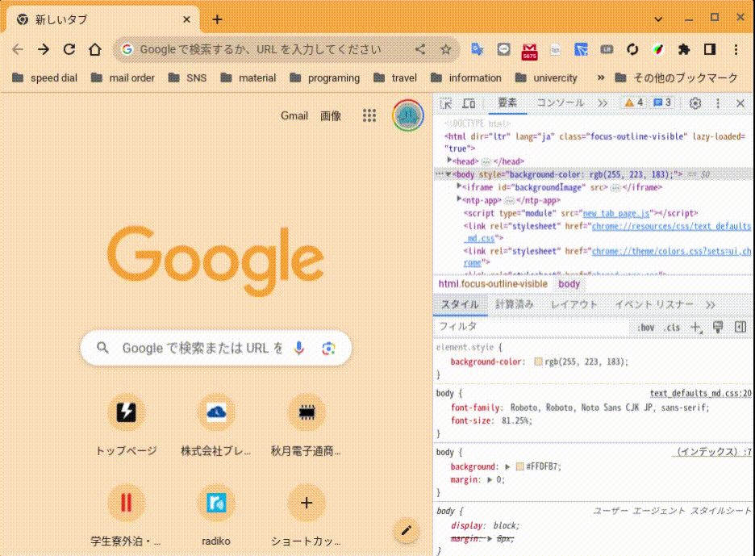
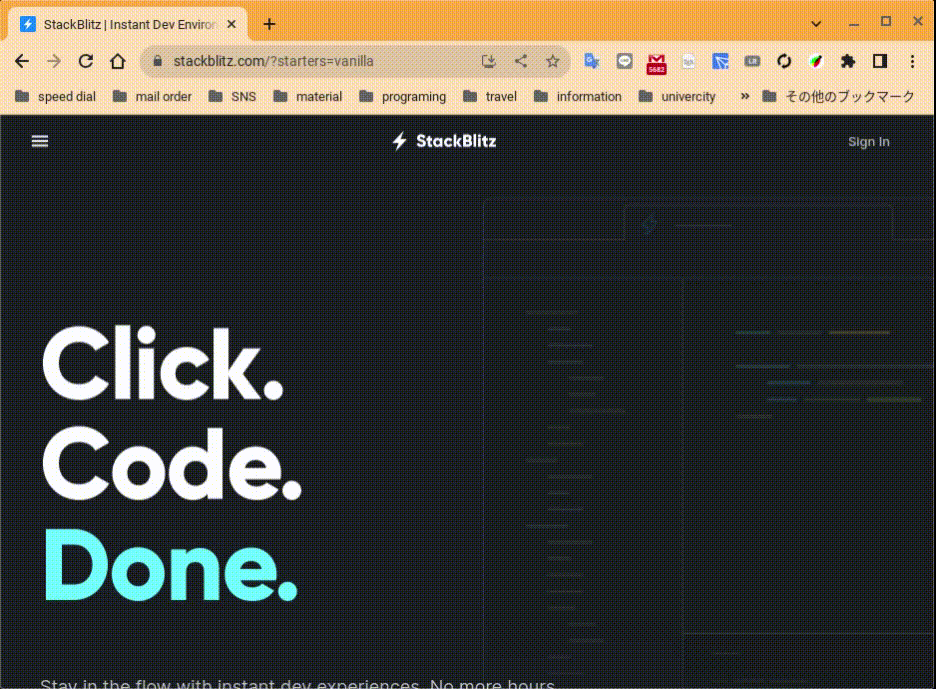

<!--
  ============================================================================
  HTML/CSS を始めよう（勉強会スライド）
  ビルド: npx marp slide.md --html -o slide.html --allow-local-files --theme-set themes/jig.css
  ============================================================================
-->

<!-- _class: lead -->

# HTML/CSS を始めよう

Web ページの基本的な「構造」と「見た目」を、手を動かして身につける

---

## 今回のゴール

**HTML でページの構造を書き、CSS で見た目とレイアウトを整える**——Web アプリケーション作りの土台を、
小さな例を手を動かしながら身につけます。

- HTML でページの**意味と構造**をマークアップできる（見出し・段落・リスト・画像・リンク）
- CSS で色・文字・余白・枠を思いどおりに整えられる
- Grid / Flexbox で「よくある Web アプリのレイアウト」を組める

---

## 今回の流れ

| 章  | テーマ                       | 学ぶこと                                                 |
| --- | ---------------------------- | -------------------------------------------------------- |
| 1   | HTML の基本的な要素    | タグ/要素・基本構造・見出し/リスト/画像/リンク・意味づけ |
| 2   | CSS で見た目を整える         | 読み込み・ボックスモデル・優先度・セレクタ・変数/文字/背景/図形 |
| 3   | CSS で思いどおりに並べる     | Flexbox（横並び・揃える）・Grid（列・エリア）・使い分け         |

---

## 進め方

各トピックは **「説明」→「やってみよう」** の 2 枚組で進みます。

- **説明** … 仕組みと使いどころを、図とコードで理解する
- **やってみよう** … その場のコード欄で **▶ 実行**。書き換えて表示の変化を見る

<span class="tag-write">記述</span> が付いたら、空欄やコードを自分で書き換えて試す課題です。

<div class="note">

「やってみよう」のコード欄は **▶ 実行** で右側にプレビューが出ます。書き換えてすぐ試せるので、
別の環境を用意しなくても、ここで手を動かせます。コード欄・プレビューは端をドラッグして広げられます。

</div>

---

<!-- _class: lead -->

# Chapter 1 HTML でページを組み立てる

タグと要素 ・ 基本構造 ・ 見出しと段落 ・ リスト ・ 強調 ・ 画像とリンク ・ 意味を持つ要素

---

<!-- _class: tight -->

## 1-1. この章のゴール

HTML でページの骨組み（構造）を作れるようになります。

- タグで文字に**意味**をつける（マークアップ）
- ページの**基本構造**（head / body）を書く
- 見出し・段落・リスト・画像・リンクを使い分ける

---

<!-- _class: tight -->

## 1-2. タグと要素

文字を `<h1>` 〜 `</h1>` のように**タグ**で囲むと、ブラウザは「見出し」として解釈し、内容に合った表示をします。

<div class="syntax">

`<h1>`（開始タグ）と `</h1>`（終了タグ）で囲むことを**マークアップ**、囲んだ全体を**要素**と呼びます。
`h1` は heading（見出し）の h をとった、最も重要な見出し用のタグです。

</div>

---

<!-- _class: tight -->

## 1-2. やってみよう

**▶ 実行**して、囲まれた文字だけが大きく表示されるのを見てみましょう。ただし `<h1>` は文字を大きくするタグではなく、**「見出し」という意味**を与えるタグです。大きく見えるのは*見出しの既定の見た目*で、大きさ自体は後から CSS で自由に変えられます。

<div class="timer-box" data-seconds="120">
  <button class="timer-btn" data-delta="-60">−</button>
  <div class="timer"></div>
  <button class="timer-btn" data-delta="60">＋</button>
</div>

<div class="playground" data-mode="dom" data-height="200">

```html
<h1>Hello, World !</h1>
これは囲まれていないただの文字
```

</div>

---

<!-- _class: tight -->

## 1-3. HTML の基本構造

実用的な HTML は次の形です。まずは「入れ物の形」として覚えます。

```html
<!DOCTYPE html>
<html lang="ja">
  <head>
    <meta charset="UTF-8" />
    <meta name="viewport" content="width=device-width, initial-scale=1.0" />
    <title>サンプルページ</title>
  </head>
  <body>
    <h1>Hello, World !</h1>
  </body>
</html>
```

<div class="aside">

`<!DOCTYPE html>` = 文書型定義（ブラウザに「これは HTML」と伝える）。`<html>` = ルート要素。
`lang="ja"` のようにタグ内に書く設定を**属性**と言います。

</div>

---

<!-- _class: tight -->

## 1-4. head と body の役割

HTML は大きく 2 つに分かれます。

<div class="split side-wide">
<div class="split-main">

- **`<head>`** … 閲覧者に**見せない**情報
  - `title`（タブ名）・`meta`（文字コードや表示設定）
  - CSS / JavaScript の読み込み
- **`<body>`** … ページに**表示されるすべて**のコンテンツ

</div>
<div class="split-side">
<svg viewBox="0 0 340 200" style="width: 100%; height: auto;" font-family="ui-sans-serif, system-ui, sans-serif" xmlns="http://www.w3.org/2000/svg">
  <rect x="120" y="10" width="100" height="34" rx="6" fill="#3f51b5"/>
  <text x="170" y="33" font-size="15" fill="#fff" text-anchor="middle">&lt;html&gt;</text>
  <line x1="150" y1="44" x2="80" y2="78" stroke="#90a4ae" stroke-width="2"/>
  <line x1="190" y1="44" x2="260" y2="78" stroke="#90a4ae" stroke-width="2"/>
  <rect x="20" y="78" width="120" height="34" rx="6" fill="#78909c"/>
  <text x="80" y="101" font-size="15" fill="#fff" text-anchor="middle">&lt;head&gt;</text>
  <text x="80" y="136" font-size="12" fill="#455a64" text-anchor="middle">見せない情報</text>
  <text x="80" y="154" font-size="11" fill="#888" text-anchor="middle">title / meta / 読込</text>
  <rect x="200" y="78" width="120" height="34" rx="6" fill="#43a047"/>
  <text x="260" y="101" font-size="15" fill="#fff" text-anchor="middle">&lt;body&gt;</text>
  <text x="260" y="136" font-size="12" fill="#2e7d32" text-anchor="middle">表示される中身</text>
  <text x="260" y="154" font-size="11" fill="#888" text-anchor="middle">文章 / 画像 / リンク</text>
</svg>
</div>
</div>

---

<!-- _class: tight -->

## 1-5. 見出しと段落

文章は「かたまり」に分けると読みやすくなります。HTML では見出しと段落で構造を表します。

- 見出し … 重要度に応じて `<h1>`〜`<h6>` の 6 段階
- 段落 … `<p>`
- 意味を持たないただの文字 … `<span>`

<div class="note">

**使い方のコツ** `<h1>` はページに 1 つ / 大きさを飛ばさない（h2 の下に h3）/ 多用は 3 段階まで。

</div>

---

<!-- _class: tight -->

## 1-5. やってみよう

各見出しの大きさと、段落・span の違いを **▶ 実行**して見比べましょう。

<div class="timer-box" data-seconds="120">
  <button class="timer-btn" data-delta="-60">−</button>
  <div class="timer"></div>
  <button class="timer-btn" data-delta="60">＋</button>
</div>

<div class="playground" data-mode="dom" data-height="200">

```html
<h1>見出し1（ページの題）</h1>
<h2>見出し2</h2>
<h3>見出し3</h3>
<p>これは段落（p）。まとまった文章に使います。</p>
<span>span はただの文字。見た目は変わりません。</span>
```

</div>

---

<!-- _class: tight -->

## 1-6. リスト（箇条書き）

項目を並べるときはリストを使います。

- `<ul>` … 順序が関係ない箇条書き（行頭に点）
- `<ol>` … 順序が大事な箇条書き（行頭に番号）
- どちらも項目は `<li>`。リストの中にリストを入れる**入れ子**もできます

---

<!-- _class: tight -->

## 1-6. やってみよう

<span class="tag-write">記述</span> 中身を**自分の情報**に書き換えて **▶ 実行**。`ul`（点）と `ol`（番号）の違いを確かめましょう。

<div class="timer-box" data-seconds="120">
  <button class="timer-btn" data-delta="-60">−</button>
  <div class="timer"></div>
  <button class="timer-btn" data-delta="60">＋</button>
</div>

<div class="playground" data-mode="dom" data-height="200">

```html
<h2>自己紹介</h2>
<ul>
  <li>名前: <strong>じぐ太郎</strong></li>
  <li>好きな食べ物ランキング:
    <ol>
      <li>うどん</li>
      <li>そば</li>
    </ol>
  </li>
</ul>
```

</div>

---

<!-- _class: tight -->

## 1-7. 強調：em と strong

見た目ではなく「**意味**」で選ぶのがポイントです。

- `<em>` … 強調（標準では斜体で表示される）
- `<strong>` … 重要（標準では太字で表示される）

<div class="aside">

「斜体にしたいだけ」「太字にしたいだけ」なら `<span>` + CSS を使います（意味づけタグの誤用を避ける）。

</div>

---

<!-- _class: tight -->

## 1-7. やってみよう

**▶ 実行**して、`em`（斜体）と `strong`（太字）の表示を確かめましょう。

<div class="timer-box" data-seconds="120">
  <button class="timer-btn" data-delta="-60">−</button>
  <div class="timer"></div>
  <button class="timer-btn" data-delta="60">＋</button>
</div>

<div class="playground" data-mode="dom" data-height="200">

```html
<p>日本で <em>一番</em> 高い山は富士山です。</p>
<p><strong>締め切りは今日です。</strong></p>
```

</div>

---

<!-- _class: tight -->

## 1-8. 画像とリンク

画像は ``、リンクは `<a>`。`img` は閉じタグの要らない**空要素**です。タグの後ろに `名前="値"` の形で書く追加設定を**属性**と呼びます。

```html


<a href="https://jig.jp">株式会社 jig.jp</a>
<a href="https://jig.jp" target="_blank">新しいタブで開く</a>
```

<div class="aside">

- **`src`** … 画像ファイルの場所（`./`＝サイト内の相対パス／`https://`＝外部 URL の絶対パス）
- **`alt`** … 画像の代替テキスト（表示できない時や読み上げ時に読まれる説明文）
- **`href`** … リンク先の URL（*hypertext reference*）／ **`target="_blank"`** … 新しいタブで開く

</div>

---

<!-- _class: tight -->

## 1-9. ページの骨組み：意味を持つ要素

よく見る Web ページのレイアウト（**聖杯レイアウト**）は、意味を表す要素で組み立てられます。

<div class="split side-wide">
<div class="split-main">

- `<header>` ヘッダー / `<nav>` ナビゲーション
- `<main>` メインコンテンツ / `<aside>` サイドバー
- `<footer>` フッター
- **`<div>`** … 意味を持たない万能の「箱」（要素をまとめて装飾）
- **`<span>`** … 文字用の箱

</div>
<div class="split-side">


</div>
</div>

<div class="aside">

意味の合う要素を使うと、ブラウザや読み上げ機能に構造が正しく伝わります（アクセシビリティ向上）。

</div>

---

<!-- _class: tight -->

## 1 章のまとめ

<div class="note">

**チェックポイント**

- タグで文字に「意味」をつけられた（マークアップ）
- `head`（見せない情報）と `body`（表示される中身）の役割を説明できる
- 見出し・段落・リスト・強調・画像・リンク・意味を持つ要素を使い分けられる
</div>

次は、この骨組みに **CSS で見た目**をつけていきます。

---

<!-- _class: lead break -->

# 休憩 5 分

<div class="timer-box" data-seconds="300">
  <button class="timer-btn" data-delta="-60">−</button>
  <div class="timer"></div>
  <button class="timer-btn" data-delta="60">＋</button>
</div>

---

<!-- _class: lead -->

# Chapter 2 CSS で見た目を整える

CSS の書き方 ・ ボックスモデル ・ 優先度 ・ セレクタ ・ 疑似クラス ・ 変数 ・ 文字 ・ 背景と枠 ・ 図形

---

<!-- _class: tight -->

## 2-1. この章のゴール

HTML の骨組みに **CSS** で色・大きさ・余白・枠をつけ、見た目を仕上げます。

- セレクタで「どの要素に」スタイルを当てるかを指定できる
- ボックスモデルで「余白と枠のしくみ」を理解する
- 狙った要素だけにスタイルを効かせられる
- 文字・背景・枠・図形・変数で見た目を自在に整えられる

---

<!-- _class: tight -->

## 2-2. CSS を始める

CSS は **どの要素を・どう飾るか**を指定します。基本の形は `セレクタ { プロパティ: 値; }`。

<div class="syntax">

`h1` = **セレクタ**（どの要素か）、`color` = **プロパティ**（何を）、`red` = **値**（どうする）。
実ファイルではHTML ファイルの `<head></head>` 要素の中に `<link rel="stylesheet" href="style.css" />` のように CSS ファイルのリンクを指定して HTML から 読み込みます。

</div>

---

<!-- _class: tight -->

## 2-2. やってみよう

`<style>` の中の色を変えて **▶ 実行**してみましょう。

<div class="timer-box" data-seconds="120">
  <button class="timer-btn" data-delta="-60">−</button>
  <div class="timer"></div>
  <button class="timer-btn" data-delta="60">＋</button>
</div>

<div class="playground" data-mode="dom" data-height="200">

```html
<style>
  h1 { color: red; }
</style>
<h1>Hello, World !</h1>
```

</div>

---

<!-- _class: tight -->

## 2-3. ボックスモデル

すべての要素は「額に入った絵」のように、**内側から content → padding → border → margin** の四角で囲まれています。

<div class="split side-wide">
<div class="split-main">

- `content` … 中身（文字や画像）
- `padding` … 中身と枠の間の**内側の余白**
- `border` … **枠線**
- `margin` … 要素どうしの**外側の余白**

</div>
<div class="split-side">


</div>
</div>

---

<!-- _class: tight -->

## 2-4. box-sizing で大きさを扱いやすく

要素の幅は **content ＋ padding ＋ border** の合計です。既定の `content-box` では `width` が
**content だけ**を指すため、下の例では `160 + 16×2 + 4×2 = 200px` に膨らみます。
`box-sizing: border-box` にすると `width` が **枠込み**になり、実寸は 160px のまま（content 側が縮む）。

<div class="fig-row">
<svg width="720" height="215" viewBox="0 0 720 215" font-family="ui-sans-serif, system-ui, sans-serif" xmlns="http://www.w3.org/2000/svg">
  <rect x="40" y="12" width="14" height="14" fill="#90caf9"/>
  <text x="60" y="24" font-size="13" fill="#333">content</text>
  <rect x="150" y="12" width="14" height="14" fill="#ffe0b2"/>
  <text x="170" y="24" font-size="13" fill="#333">padding</text>
  <rect x="262" y="12" width="14" height="14" fill="#546e7a"/>
  <text x="282" y="24" font-size="13" fill="#333">border</text>
  <text x="390" y="24" font-size="13" fill="#777">※ どちらも width: 160px 指定</text>
  <text x="40" y="66" font-size="15" font-weight="bold" fill="#3f51b5">content-box（既定）</text>
  <rect x="40" y="74" width="400" height="44" fill="#546e7a"/>
  <rect x="48" y="74" width="384" height="44" fill="#ffe0b2"/>
  <rect x="80" y="74" width="320" height="44" fill="#90caf9"/>
  <text x="240" y="101" font-size="13" text-anchor="middle" fill="#1a237e">content (160px)</text>
  <text x="454" y="101" font-size="15" font-weight="bold" fill="#e91e63">実寸 200px</text>
  <text x="40" y="152" font-size="15" font-weight="bold" fill="#3f51b5">border-box</text>
  <rect x="40" y="160" width="320" height="44" fill="#546e7a"/>
  <rect x="48" y="160" width="304" height="44" fill="#ffe0b2"/>
  <rect x="80" y="160" width="240" height="44" fill="#90caf9"/>
  <text x="200" y="187" font-size="13" text-anchor="middle" fill="#1a237e">content (120px)</text>
  <text x="374" y="187" font-size="15" font-weight="bold" fill="#e91e63">実寸 160px</text>
</svg>
</div>

<div class="note">

現代の Web 開発では最初に `* { box-sizing: border-box; }` と書くのが定番です。

</div>

---

<!-- _class: tight -->

## 2-4. やってみよう

同じ `width: 160px` でも `border-box` の方が枠込みで収まります。**▶ 実行**して見比べましょう。

<div class="timer-box" data-seconds="120">
  <button class="timer-btn" data-delta="-60">−</button>
  <div class="timer"></div>
  <button class="timer-btn" data-delta="60">＋</button>
</div>

<div class="playground" data-mode="dom" data-height="200">

```html
<style>
  .box {
    width: 160px;
    padding: 16px;
    border: 4px solid #333;
    background: #cfd8dc;
    margin: 6px 0;
  }
  .border {
    box-sizing: border-box;
  }
</style>
<div class="box">content-box（既定・実寸は width より大きい）</div>
<div class="box border">border-box（width=160px に収まる）</div>
```

</div>

---

<!-- _class: tight -->

## 2-5. スタイルの優先度

<div class="split side-wide">
<div class="split-main">

スタイルシートは 3 種類あり、**後のものほど優先**されます。

- **UA スタイルシート** … ブラウザが最初から持つ既定（`<h1>` が大きいのはこれ）
- **オーサースタイルシート** … 開発者が書く CSS
- **ユーザースタイルシート** … 閲覧者の設定（最優先）

**私たちアプリ開発者が実際に編集するのは、オーサースタイルシートだけ。** 他の 2 つは「こういう仕組みがある」と知っておけば十分です。

<div class="aside">

デフォルトのスタイルをまとめて整える「CSS リセット」という仕組みもあります（付録）。

</div>

</div>
<div class="split-side">
<svg viewBox="0 0 320 248" style="width: 100%; height: auto;" font-family="ui-sans-serif, system-ui, sans-serif" xmlns="http://www.w3.org/2000/svg">
  <defs>
    <marker id="prioarrow" markerWidth="8" markerHeight="8" refX="6" refY="3" orient="auto"><path d="M0,0 L6,3 L0,6 Z" fill="#455a64"/></marker>
  </defs>
  <text x="16" y="18" font-size="13" fill="#455a64">優先度（後に書いた方が勝つ）</text>
  <rect x="16" y="32" width="222" height="50" rx="6" fill="#e91e63"/>
  <text x="127" y="56" font-size="14" fill="#fff" text-anchor="middle">ユーザー（閲覧者）</text>
  <text x="127" y="73" font-size="11" fill="#fce4ec" text-anchor="middle">最優先</text>
  <rect x="16" y="100" width="222" height="50" rx="6" fill="#3f51b5"/>
  <text x="127" y="124" font-size="14" fill="#fff" text-anchor="middle">オーサー（開発者）</text>
  <text x="127" y="141" font-size="11" fill="#c5cae9" text-anchor="middle">私たちが書く CSS</text>
  <rect x="16" y="168" width="222" height="50" rx="6" fill="#90a4ae"/>
  <text x="127" y="192" font-size="14" fill="#fff" text-anchor="middle">UA（ブラウザ既定）</text>
  <text x="127" y="209" font-size="11" fill="#eceff1" text-anchor="middle">最初から持つ</text>
  <line x1="272" y1="213" x2="272" y2="37" stroke="#455a64" stroke-width="2" marker-end="url(#prioarrow)"/>
  <text x="286" y="46" font-size="13" fill="#455a64">高</text>
  <text x="286" y="214" font-size="13" fill="#455a64">低</text>
</svg>
</div>
</div>

---

<!-- _class: tight -->

## 2-6. セレクタで狙って当てる

「どの要素に効かせるか」を細かく指定できます。

| 書き方     | 意味 (対応するHTMLの要素)                                         |
| ---------- | ------------------------------------------- |
| `h1`       | すべての h1 要素（要素型）                  |
| `.box`     | `class="box"` の要素（クラス）              |
| `#main`    | `id="main"` の要素（ID・重複禁止）          |
| `a, p`     | a と p の両方（グループ化）                 |
| `p span`   | p の**子孫**の span（子孫結合子・スペース） |
| `p > span` | p の**直接の子**の span（子結合子）         |

---

<!-- _class: tight -->

## 2-6. やってみよう

`.card > strong`（直接の子）だけ色が変わることを、**▶ 実行**して確かめましょう。

<div class="timer-box" data-seconds="120">
  <button class="timer-btn" data-delta="-60">−</button>
  <div class="timer"></div>
  <button class="timer-btn" data-delta="60">＋</button>
</div>

<div class="playground" data-mode="dom" data-height="200">

```html
<style>
  .card {
    border: 2px solid #3f51b5;
    padding: 8px;
  }
  .card > strong {
    color: #e91e63;
  }
</style>
<div class="card">通常の文字 <strong>強調された子</strong></div>
```

</div>

---

<!-- _class: tight -->

## 2-7. 疑似クラス・疑似要素

HTML に書かれていない「状態」や、要素にもスタイリングを当てられます。

- `:hover` などが**疑似クラス**（`:` ひとつ）… ホバー中などの状態
- `::first-letter` などが**疑似要素**（`::` ふたつ）… 要素の一部

---

<!-- _class: tight -->

## 2-7. やってみよう

下の**ボタンにカーソルを乗せて**、`:hover` で色が変わるのを確かめましょう。

<div class="timer-box" data-seconds="120">
  <button class="timer-btn" data-delta="-60">−</button>
  <div class="timer"></div>
  <button class="timer-btn" data-delta="60">＋</button>
</div>

<div class="playground" data-mode="dom" data-height="200">

```html
<style>
  .btn {
    display: inline-block;
    padding: 8px 16px;
    border-radius: 6px;
    background: #3f51b5;
    color: #fff;
    cursor: pointer;
  }
  .btn:hover {
    background: #e91e63;
  }
  p::first-letter {
    font-size: 2em;
    color: #e91e63;
  }
</style>
<div class="btn">ホバーしてね</div>
<p>最初の一文字が大きく色づきます。</p>
```

</div>

---

<!-- _class: tight -->

## 2-8. カスタムプロパティ（変数）

色などを `:root` に**変数**として定義し、`var()` で使い回せます。1 か所直すと使っている全部に反映されます。

<div class="aside">

変数名は必ず `--` で始めます。色の意味を名前で伝えられ、可読性も上がります。

</div>

---

<!-- _class: tight -->

## 2-8. やってみよう

`--brand` の色を変えると、使っている箇所すべてに反映されます。**▶ 実行**して試しましょう。

<div class="timer-box" data-seconds="120">
  <button class="timer-btn" data-delta="-60">−</button>
  <div class="timer"></div>
  <button class="timer-btn" data-delta="60">＋</button>
</div>

<div class="playground" data-mode="dom" data-height="200">

```html
<style>
  :root {
    --brand: #3f51b5;
  }
  h2 {
    color: var(--brand);
  }
  .tag {
    background: var(--brand);
    color: #fff;
    padding: 2px 10px;
    border-radius: 4px;
  }
</style>
<h2>ブランドカラー</h2>
<span class="tag">同じ色を使い回す</span>
```

</div>

---

<!-- _class: tight -->

## 2-9. 文字の見た目

文字の見た目を変える代表的なプロパティです。

- `color` … 文字色
- `font-size` … 文字の大きさ
- `font-weight` … 太さ（`normal` / `bold`）
- `line-height` … 行の高さ（行間）
- `text-decoration` … 下線・打ち消し線など
- `font-family` … フォントの種類

---

<!-- _class: tight -->

## 2-9. やってみよう

`<style>` の値をいじって、文字の変化を **▶ 実行**して確かめましょう。

<div class="timer-box" data-seconds="120">
  <button class="timer-btn" data-delta="-60">−</button>
  <div class="timer"></div>
  <button class="timer-btn" data-delta="60">＋</button>
</div>

<div class="playground" data-mode="dom" data-height="200">

```html
<style>
  p {
    color: #3f51b5;
    font-size: 20px;
    font-weight: bold;
    line-height: 1.8;
    text-decoration: underline;
    font-family: sans-serif;
  }
</style>
<p>文字の見た目は CSS で自由に変えられます。<br>
色・大きさ・太さ・行間・下線・フォントを試してみましょう。</p>
```

</div>

---

<!-- _class: tight -->

## 2-10. 要素の見た目（背景・枠）

背景色・枠・角丸を組み合わせると「カード」のような見た目が作れます。

<div class="aside">

`background-color` / `background-image` / `border` / `border-radius` など。ほかにも多数あるので、使うときに調べましょう。

</div>

---

<!-- _class: tight -->

## 2-10. やってみよう

背景・枠・角丸の値を変えて **▶ 実行**。自分好みのカードにしてみましょう。

<div class="timer-box" data-seconds="120">
  <button class="timer-btn" data-delta="-60">−</button>
  <div class="timer"></div>
  <button class="timer-btn" data-delta="60">＋</button>
</div>

<div class="playground" data-mode="dom" data-height="200">

```html
<style>
  .card {
    width: 220px;
    padding: 16px;
    background: #e8f0fe;
    border: 2px solid #3f51b5;
    border-radius: 12px;
  }
</style>
<div class="card">角丸のカード</div>
```

</div>

---

<!-- _class: tight -->

## 2-11. 形をつくる

`border-radius` を大きくすると、四角形が円や丸帯型になります。

- `border-radius: 50%` … 円
- `border-radius: 100vh` … 丸帯型

<div class="aside">

もっと凝った形（吹き出しなど）も CSS で作れます（付録参照）。

</div>

---

<!-- _class: tight -->

## 2-11. やってみよう

**▶ 実行**して円と丸帯型を確かめましょう。数値を変えると形が変わります。

<div class="timer-box" data-seconds="120">
  <button class="timer-btn" data-delta="-60">−</button>
  <div class="timer"></div>
  <button class="timer-btn" data-delta="60">＋</button>
</div>

<div class="playground" data-mode="dom" data-height="200">

```html
<style>
  .circle {
    width: 120px;
    height: 120px;
    background: #4dd0e1;
    border-radius: 50%;
  }
  .band {
    width: 220px;
    height: 56px;
    margin-top: 10px;
    background: #aed581;
    border-radius: 100vh;
  }
</style>
<div class="circle"></div>
<div class="band"></div>
```

</div>

---

<!-- _class: tight -->

## 2 章のまとめ

<div class="note">

**チェックポイント**

- `セレクタ { プロパティ: 値 }` の形で書ける
- content / padding / border / margin と `box-sizing` を説明できる
- 要素型・クラス・ID・結合子・疑似で狙った要素に当てられる
- 変数・文字・背景・枠・図形で見た目を自在に整えられる
</div>

---

<!-- _class: lead break -->

# 休憩 5 分

<div class="timer-box" data-seconds="300">
  <button class="timer-btn" data-delta="-60">−</button>
  <div class="timer"></div>
  <button class="timer-btn" data-delta="60">＋</button>
</div>

---

<!-- _class: lead -->

# Chapter 3 思いどおりに並べる

フレックスボックス ・ グリッド ・ 使い分け

---

<!-- _class: tight -->

## 3-1. この章のゴール

要素を思いどおりの位置に並べます。実務で最もよく使う 2 大レイアウトです。

- **Flexbox**（1 次元）で「横並び・中央寄せ・均等配置」を自在にする
- **Grid**（2 次元）で「ページ全体の骨格」を組む
- 場面に応じて 2 つを使い分けられる

---

<!-- _class: tight -->

## 3-2. Flexbox の基本

`display: flex` を付けた要素（親）の中では、**子要素が主軸に沿って一列に並びます**。既定は横（行）方向です。

<div class="split side-wide">
<div class="split-main">

- 親に **`display: flex`** … 子が**横並び**になる
- **`gap`** … 子どうしの**すき間**
- 子が並ぶ向き＝**主軸**、直交する向き＝**交差軸**

</div>
<div class="split-side">
<svg viewBox="0 0 330 200" style="width: 100%; height: auto;" font-family="ui-sans-serif, system-ui, sans-serif" xmlns="http://www.w3.org/2000/svg">
  <defs>
    <marker id="ax" markerWidth="8" markerHeight="8" refX="6" refY="3" orient="auto"><path d="M0,0 L6,3 L0,6 Z" fill="#455a64"/></marker>
    <marker id="axp" markerWidth="8" markerHeight="8" refX="6" refY="3" orient="auto"><path d="M0,0 L6,3 L0,6 Z" fill="#e91e63"/></marker>
  </defs>
  <text x="74" y="16" font-size="11" fill="#607d8b">display: flex（親）</text>
  <rect x="70" y="22" width="250" height="80" rx="6" fill="none" stroke="#90a4ae" stroke-dasharray="5 4"/>
  <rect x="82" y="36" width="64" height="52" rx="4" fill="#90caf9"/><text x="114" y="67" font-size="13" text-anchor="middle" fill="#0d47a1">子</text>
  <rect x="158" y="36" width="64" height="52" rx="4" fill="#90caf9"/><text x="190" y="67" font-size="13" text-anchor="middle" fill="#0d47a1">子</text>
  <rect x="234" y="36" width="64" height="52" rx="4" fill="#90caf9"/><text x="266" y="67" font-size="13" text-anchor="middle" fill="#0d47a1">子</text>
  <line x1="70" y1="120" x2="320" y2="120" stroke="#455a64" stroke-width="2" marker-end="url(#ax)"/>
  <text x="195" y="140" font-size="13" text-anchor="middle" fill="#455a64">主軸（子が並ぶ向き）</text>
  <line x1="42" y1="102" x2="42" y2="22" stroke="#e91e63" stroke-width="2" marker-end="url(#axp)"/>
  <text x="42" y="120" font-size="12" text-anchor="middle" fill="#e91e63">交差軸</text>
</svg>
</div>
</div>

---

<!-- _class: tight -->

## 3-2. やってみよう

<span class="tag-write">記述</span> `gap` の値を変えたり、`flex-direction: column` を足して縦並びも試しましょう。

<div class="timer-box" data-seconds="120">
  <button class="timer-btn" data-delta="-60">−</button>
  <div class="timer"></div>
  <button class="timer-btn" data-delta="60">＋</button>
</div>

<div class="playground" data-mode="dom" data-height="200">

```html
<style>
  .row {
    display: flex;
    gap: 8px;
  }
  .box {
    width: 80px;
    height: 60px;
    background: #90caf9;
    display: flex;
    align-items: center;
    justify-content: center;
  }
</style>
<div class="row">
  <div class="box">A</div>
  <div class="box">B</div>
  <div class="box">C</div>
</div>
```

</div>

---

<!-- _class: tight -->

## 3-3. 位置を揃える

`justify-content` と `align-items` で、子要素を**主軸・交差軸それぞれ**の方向に揃えます。

<div class="split side-wide">
<div class="split-main">

- **`justify-content`** … 主軸（既定は横）方向
  - `flex-start` / `center` / `flex-end`
  - `space-between` / `space-around` / `space-evenly`
- **`align-items`** … 交差軸（既定は縦）方向
  - `stretch`（既定）/ `center` / `flex-start` / `flex-end`

</div>
<div class="split-side">
<svg viewBox="0 0 300 220" style="width: 100%; height: auto;" font-family="ui-sans-serif, system-ui, sans-serif" xmlns="http://www.w3.org/2000/svg">
  <text x="6" y="11" font-size="11" fill="#3f51b5" font-weight="bold">justify-content（主軸＝横）</text>
  <text x="6" y="26" font-size="10" fill="#607d8b">center</text>
  <rect x="6" y="30" width="288" height="26" rx="4" fill="#eceff1"/>
  <rect x="108" y="33" width="24" height="20" rx="3" fill="#90caf9"/>
  <rect x="138" y="33" width="24" height="20" rx="3" fill="#90caf9"/>
  <rect x="168" y="33" width="24" height="20" rx="3" fill="#90caf9"/>
  <text x="6" y="72" font-size="10" fill="#607d8b">space-between</text>
  <rect x="6" y="76" width="288" height="26" rx="4" fill="#eceff1"/>
  <rect x="10" y="79" width="24" height="20" rx="3" fill="#90caf9"/>
  <rect x="138" y="79" width="24" height="20" rx="3" fill="#90caf9"/>
  <rect x="266" y="79" width="24" height="20" rx="3" fill="#90caf9"/>
  <text x="6" y="124" font-size="11" fill="#e91e63" font-weight="bold">align-items（交差軸＝縦）</text>
  <text x="6" y="139" font-size="10" fill="#607d8b">flex-start</text>
  <rect x="6" y="143" width="88" height="70" rx="4" fill="#eceff1"/>
  <rect x="18" y="149" width="28" height="20" rx="3" fill="#f48fb1"/>
  <rect x="54" y="149" width="28" height="20" rx="3" fill="#f48fb1"/>
  <text x="106" y="139" font-size="10" fill="#607d8b">center</text>
  <rect x="106" y="143" width="88" height="70" rx="4" fill="#eceff1"/>
  <rect x="118" y="168" width="28" height="20" rx="3" fill="#f48fb1"/>
  <rect x="154" y="168" width="28" height="20" rx="3" fill="#f48fb1"/>
  <text x="206" y="139" font-size="10" fill="#607d8b">flex-end</text>
  <rect x="206" y="143" width="88" height="70" rx="4" fill="#eceff1"/>
  <rect x="218" y="187" width="28" height="20" rx="3" fill="#f48fb1"/>
  <rect x="254" y="187" width="28" height="20" rx="3" fill="#f48fb1"/>
</svg>
</div>
</div>

---

<!-- _class: tight -->

## 3-3. やってみよう

<span class="tag-write">記述</span> `justify-content` を `space-between` や `flex-end` に変えて、並びの変化を見ましょう。

<div class="timer-box" data-seconds="120">
  <button class="timer-btn" data-delta="-60">−</button>
  <div class="timer"></div>
  <button class="timer-btn" data-delta="60">＋</button>
</div>

<div class="playground" data-mode="dom" data-height="200">

```html
<style>
  .row {
    display: flex;
    /* ↓ ここを space-between / flex-end などに変えてみよう */
    justify-content: center;
    align-items: center;
    gap: 8px;
    height: 120px;
    background: #eceff1;
  }
  .box {
    width: 70px;
    height: 50px;
    background: #90caf9;
    display: flex;
    align-items: center;
    justify-content: center;
  }
</style>
<div class="row">
  <div class="box">A</div>
  <div class="box">B</div>
  <div class="box">C</div>
</div>
```

</div>

---

<!-- _class: tight -->

## 3-4. 伸縮

余ったスペースの扱いをコントロールします。

- **`flex: 1`**（子に付ける）… その子が**余白を埋めて伸びる**。複数に付ければ比率で分け合う

<div class="aside">

ナビバーの「ロゴを左・メニューを右」は、間の要素に `flex: 1` を入れると作れます。

</div>

---

<!-- _class: tight -->

## 3-4. やってみよう

<span class="tag-write">記述</span> 中央の `flex: 1` を消すと、伸びずに縮みます。値を変えて挙動を見ましょう。

<div class="timer-box" data-seconds="120">
  <button class="timer-btn" data-delta="-60">−</button>
  <div class="timer"></div>
  <button class="timer-btn" data-delta="60">＋</button>
</div>

<div class="playground" data-mode="dom" data-height="200">

```html
<style>
  .bar {
    display: flex;
    gap: 8px;
    background: #eceff1;
    padding: 8px;
  }
  .item {
    padding: 12px;
    background: #90caf9;
    text-align: center;
  }
  /* ↓ flex: 1 を消すと「伸びない」。数値を増やすと取り分が増える */
  .grow {
    flex: 1;
    background: #a5d6a7;
  }
</style>
<div class="bar">
  <div class="item">ロゴ</div>
  <div class="item grow">中央（伸びる）</div>
  <div class="item">メニュー</div>
</div>
```

</div>

---

<!-- _class: tight -->

## 3-5. Grid の基本

`display: grid` は**行と列の 2 次元**で配置します。まず「何列にするか」を `grid-template-columns` で決めます。

<div class="split side-wide">
<div class="split-main">

- **`grid-template-columns: 1fr 1fr 1fr`** … 3 等分の 3 列
- **`fr`** … 余ったスペースを分け合う比率（`2fr 1fr` は 2 : 1）
- **`repeat(3, 1fr)`** … `1fr 1fr 1fr` の短い書き方
- **`gap`** … マス目のすき間

</div>
<div class="split-side">
<svg viewBox="0 0 320 190" style="width: 100%; height: auto;" font-family="ui-sans-serif, system-ui, sans-serif" xmlns="http://www.w3.org/2000/svg">
  <text x="6" y="16" font-size="12" fill="#607d8b">repeat(3, 1fr) → 3 等分</text>
  <rect x="6" y="24" width="100" height="48" rx="4" fill="#90caf9"/><text x="56" y="53" font-size="13" text-anchor="middle" fill="#0d47a1">1fr</text>
  <rect x="110" y="24" width="100" height="48" rx="4" fill="#90caf9"/><text x="160" y="53" font-size="13" text-anchor="middle" fill="#0d47a1">1fr</text>
  <rect x="214" y="24" width="100" height="48" rx="4" fill="#90caf9"/><text x="264" y="53" font-size="13" text-anchor="middle" fill="#0d47a1">1fr</text>
  <text x="6" y="104" font-size="12" fill="#607d8b">2fr 1fr → 2 : 1</text>
  <rect x="6" y="112" width="204" height="48" rx="4" fill="#a5d6a7"/><text x="108" y="141" font-size="13" text-anchor="middle" fill="#1b5e20">2fr</text>
  <rect x="214" y="112" width="100" height="48" rx="4" fill="#a5d6a7"/><text x="264" y="141" font-size="13" text-anchor="middle" fill="#1b5e20">1fr</text>
</svg>
</div>
</div>

---

<!-- _class: tight -->

## 3-5. やってみよう

<span class="tag-write">記述</span> `grid-template-columns` を `2fr 1fr` や `repeat(4, 1fr)` に変えて、列の割り方を試しましょう。

<div class="timer-box" data-seconds="120">
  <button class="timer-btn" data-delta="-60">−</button>
  <div class="timer"></div>
  <button class="timer-btn" data-delta="60">＋</button>
</div>

<div class="playground" data-mode="dom" data-height="200">

```html
<style>
  .grid {
    display: grid;
    /* ↓ 列の数や比率を変えてみよう */
    grid-template-columns: repeat(3, 1fr);
    gap: 8px;
  }
  .cell {
    height: 56px;
    background: #90caf9;
    display: flex;
    align-items: center;
    justify-content: center;
  }
</style>
<div class="grid">
  <div class="cell">1</div>
  <div class="cell">2</div>
  <div class="cell">3</div>
  <div class="cell">4</div>
  <div class="cell">5</div>
  <div class="cell">6</div>
</div>
```

</div>

---

<!-- _class: tight -->

## 3-6. 名前付きエリアで聖杯レイアウト

`grid-template-areas` を使うと、**エリアに名前を付けて絵のように配置**できます。ヘッダー・左右カラム・メイン・フッターからなる「よくあるレイアウト（聖杯レイアウト）」も一気に組めます。

<div class="split side-wide">
<div class="split-main">

<div class="syntax">

`grid-template` で行・列と各エリアの並びを、`grid-area` で「どの要素をどのエリアに置くか」を指定します。

</div>

</div>
<div class="split-side">
<svg viewBox="0 0 340 230" style="width: 100%; height: auto;" font-family="ui-sans-serif, system-ui, sans-serif" xmlns="http://www.w3.org/2000/svg">
  <rect x="10" y="10" width="320" height="40" rx="4" fill="#90caf9"/>
  <text x="170" y="35" font-size="14" text-anchor="middle" fill="#0d47a1">header（ヘッダー）</text>
  <rect x="10" y="54" width="70" height="120" rx="4" fill="#ffab91"/>
  <text x="45" y="118" font-size="13" text-anchor="middle" fill="#bf360c">left</text>
  <rect x="84" y="54" width="168" height="120" rx="4" fill="#a5d6a7"/>
  <text x="168" y="118" font-size="14" text-anchor="middle" fill="#1b5e20">main（メイン）</text>
  <rect x="256" y="54" width="74" height="120" rx="4" fill="#ffab91"/>
  <text x="293" y="118" font-size="13" text-anchor="middle" fill="#bf360c">right</text>
  <rect x="10" y="178" width="320" height="40" rx="4" fill="#90caf9"/>
  <text x="170" y="203" font-size="14" text-anchor="middle" fill="#0d47a1">footer（フッター）</text>
</svg>
</div>
</div>

---

<!-- _class: tight -->

## 3-6. やってみよう

<span class="tag-write">記述</span> 左右カラムの幅（`120px`）や `main` の色を変えて **▶ 実行** してみましょう。

<div class="timer-box" data-seconds="120">
  <button class="timer-btn" data-delta="-60">−</button>
  <div class="timer"></div>
  <button class="timer-btn" data-delta="60">＋</button>
</div>

<div class="playground" data-mode="dom" data-height="200">

```html
<style>
  * {
    box-sizing: border-box;
    margin: 0;
  }
  body {
    display: grid;
    gap: 4px;
    grid-template:
      'header header header' 40px
      'left   main   right'  150px
      'footer footer footer' 40px / 120px auto 120px;
  }
  header { grid-area: header; background: #90caf9; }
  .left  { grid-area: left;   background: #ffab91; }
  main   { grid-area: main;   background: #a5d6a7; }
  .right { grid-area: right;  background: #ffab91; }
  footer { grid-area: footer; background: #90caf9; }
  body > * { display: grid; place-content: center; }
</style>
<header>ヘッダー</header>
<div class="left">左</div>
<main>メイン</main>
<div class="right">右</div>
<footer>フッター</footer>
```

</div>

---

<!-- _class: tight -->

## 3-7. Flex と Grid の使い分け

<div class="split side-wide">
<div class="split-main">

- **Flexbox** … **1 次元**（横一列 or 縦一列）
  - ナビバー・ボタン群・カードの横並び・中央寄せ
- **Grid** … **2 次元**（行 × 列）
  - ページ全体の骨格・写真ギャラリー・カードを格子状に

</div>
<div class="split-side">
<svg viewBox="0 0 300 190" style="width: 100%; height: auto;" font-family="ui-sans-serif, system-ui, sans-serif" xmlns="http://www.w3.org/2000/svg">
  <text x="6" y="16" font-size="12" fill="#3f51b5">Flexbox（1 次元）</text>
  <rect x="6" y="22" width="288" height="46" rx="4" fill="#eceff1"/>
  <rect x="14" y="30" width="80" height="30" rx="3" fill="#90caf9"/>
  <rect x="106" y="30" width="80" height="30" rx="3" fill="#90caf9"/>
  <rect x="198" y="30" width="80" height="30" rx="3" fill="#90caf9"/>
  <text x="6" y="100" font-size="12" fill="#3f51b5">Grid（2 次元）</text>
  <g fill="#a5d6a7">
    <rect x="6" y="108" width="92" height="30" rx="3"/><rect x="104" y="108" width="92" height="30" rx="3"/><rect x="202" y="108" width="92" height="30" rx="3"/>
    <rect x="6" y="144" width="92" height="30" rx="3"/><rect x="104" y="144" width="92" height="30" rx="3"/><rect x="202" y="144" width="92" height="30" rx="3"/>
  </g>
</svg>
</div>
</div>

<div class="aside">

迷ったら「一列に並べる？ → **Flex**」「縦横きっちり？ → **Grid**」。2 つを組み合わせるのも普通です。

</div>

---

<!-- _class: tight -->

## 3 章のまとめ

<div class="note">

**チェックポイント**

- `display: flex` で横並び、`justify-content` / `align-items` で位置を揃えられる
- `flex: 1` で伸ばす、`flex-wrap` で折り返せる
- `grid-template-columns` と `fr` で列を作れる
- `grid-template-areas` で聖杯レイアウトを組める
- 1 次元は Flex、2 次元は Grid と使い分けられる
</div>

<div class="aside">

もっと遊びたい人へ: [Flexbox Froggy](https://flexboxfroggy.com/#ja) / [Grid Garden](https://cssgridgarden.com/#ja)

</div>

---

<!-- _class: lead -->

# 完成 🎉

---

<!-- _class: tight -->

## 体験したことを振り返る

HTML の構造化から、CSS の装飾・レイアウト（Grid / Flexbox）まで、ひととおり体験しました。

- **HTML** … タグで「意味と構造」をマークアップする
- **CSS** … セレクタで狙い、ボックスと配置で「見た目」を整える

この HTML と CSS が、あらゆる Web ページの土台です。
続けて **JavaScript** を学ぶと、クリックで動くページも作れます。

---

<!-- _class: tight -->

## お疲れさまでした

今日触れられなかった要素・プロパティはたくさんあります。作るときに調べながら足していきましょう。

- MDN Web Docs: [HTML](https://developer.mozilla.org/ja/docs/Web/html) / [CSS](https://developer.mozilla.org/ja/docs/Web/css)
- レイアウト練習: [Grid Garden](https://cssgridgarden.com/#ja) / [Flexbox Froggy](https://flexboxfroggy.com/#ja)


---

<!-- _class: lead -->

# 付録

---

<!-- _class: tight -->

## 付録：開発者ツールの開き方と 3 タブ

ページ上で**右クリック → 検証**、またはショートカット（Win/ChromeOS: `Ctrl`+`Shift`+`I` / Mac: `Cmd`+`Option`+`I`）で開きます。

<div class="split side-wide">
<div class="split-main">

- **Elements（要素）** … HTML の構造を見る・選択する
- **Styles（スタイル）** … 選択要素に効いている CSS を見る・その場で書き換える
- **Computed（計算済み）** … 実際の margin / border / padding / content のサイズを確認

</div>
<div class="split-side">



</div>
</div>

<div class="aside">

「意図しない大きさ」を見つけるのに Computed タブが便利です。

</div>

---

<!-- _class: tight -->

## 付録：拡張機能 VisBug

Chrome 拡張 [VisBug](https://chrome.google.com/webstore/detail/visbug/cdockenadnadldjbbgcallicgledbeoc?hl=ja) を入れると、`Alt`+`Shift`+`D` で起動。

<div class="split">
<div class="split-main">

- **ガイドツール** … クリックした要素とホバー要素の**サイズの差分**を表示
- **インスペクトツール** … ホバー要素のサイズや色をまとめて確認

</div>
<div class="split-side">



</div>
</div>

---

<!-- _class: tight -->

## 付録：もっと学ぶ（参考リンク）

<div class="split side-wide">
<div class="split-main">

**リファレンス（困ったら引く）**

- [MDN Web Docs](https://developer.mozilla.org/ja/) … HTML / CSS / JS の一次情報（日本語）
- [web.dev](https://web.dev/) … Google の実践的な Web 制作ガイド

**デザインシステム / ガイドライン**

- [Material Design 3](https://m3.material.io/) … Google のデザインシステム
- [Human Interface Guidelines](https://developer.apple.com/design/human-interface-guidelines) … Apple の設計指針

</div>
<div class="split-side">

<div class="aside">

**MDN** は「これどう書くんだっけ？」を引く辞書。
**デザインシステム**は「どう並べ・配色すると使いやすいか」の指針集です。

</div>

</div>
</div>

<!--
  ↓ 演習タイマーの実装。題材を問わずそのまま使う。触らないでください。
  各スライドに <div class="timer-box" data-seconds="秒数">…</div> を置くと右上にタイマーが出ます。
  クリックで開始/停止、右クリックでリセット、± ボタンで 60 秒単位の増減。
-->
<script>
document.querySelectorAll('.timer-box').forEach(box => {
  const el = box.querySelector('.timer');
  const initial = Number(box.dataset.seconds);
  let remain = initial;
  let id = null;

  const render = () => {
    const r = Math.max(remain, 0);
    const m = String(Math.floor(r / 60)).padStart(2, '0');
    const s = String(r % 60).padStart(2, '0');
    el.textContent = `${m}:${s}`;
    el.classList.toggle('warn', remain <= 60 && remain > 0);
    el.classList.toggle('done', remain <= 0);
  };
  const stop = () => { clearInterval(id); id = null; el.classList.remove('running'); };
  const start = () => {
    if (remain <= 0) return;
    el.classList.add('running');
    id = setInterval(() => {
      remain--;
      render();
      if (remain <= 0) stop();
    }, 1000);
  };

  el.addEventListener('click', () => {
    if (remain <= 0) { el.classList.remove('done'); return; }
    id ? stop() : start();
  });
  el.addEventListener('contextmenu', e => {
    e.preventDefault();
    stop();
    remain = initial;
    render();
  });
  box.querySelectorAll('.timer-btn').forEach(btn => {
    btn.addEventListener('click', () => {
      remain = Math.max(0, remain + Number(btn.dataset.delta));
      render();
    });
  });
  render();
});
</script>

<!--
  ↓ コードブロックにコピーボタンを付ける。題材を問わずそのまま使う。触らないでください。
  各 <pre> の右上に「コピー」が出て、コード全文をクリップボードにコピーします（@@ ハイライトの記号は含まれません）。
-->
<script>
document.querySelectorAll('pre').forEach(pre => {
  if (pre.closest('.playground')) return; // playground の pre は非表示（編集欄に置き換える）のでコピー不要
  const code = pre.querySelector('code');
  if (!code) return;
  const btn = document.createElement('button');
  btn.className = 'copy-btn';
  btn.type = 'button';
  btn.textContent = 'コピー';
  btn.addEventListener('click', async () => {
    const text = code.textContent;
    try {
      await navigator.clipboard.writeText(text);
    } catch (_) {
      const ta = document.createElement('textarea');
      ta.value = text;
      document.body.appendChild(ta);
      ta.select();
      document.execCommand('copy');
      ta.remove();
    }
    btn.textContent = 'コピーしました';
    btn.classList.add('copied');
    setTimeout(() => {
      btn.textContent = 'コピー';
      btn.classList.remove('copied');
    }, 1200);
  });
  pre.appendChild(btn);
});
</script>

<!--
  ↓ インライン playground（その場で試せるミニ実行環境）。題材を問わずそのまま使う。触らないでください。
  スライド本文に次のように書くと、編集→実行できる小さな実行環境になります（詳細は TEMPLATE_GUIDE.md）:

    <div class="playground" data-mode="console">

    ```js
    console.log("hello");
    ```

    </div>

  data-mode="console"（既定）は console.log の出力を、data-mode="dom" は HTML の描画結果＋console を表示。
  data-height="200" で出力領域の高さ(px)を調整できます。コードは sandbox iframe（allow-scripts のみ）内で実行され、
  さらに CSP で外部通信を遮断しているため、スライド本体にも外部にも影響しません。
-->
<script>
(function () {
  const consoles = {}; // pgId -> 出力先要素

  const SHIM = `(function(){
    function fmt(v){
      if (typeof v === 'string') return v;
      if (v instanceof Error) return v.message;
      if (v === undefined || v === null) return String(v);
      if (typeof v === 'function' || typeof v === 'symbol') return String(v);
      if (typeof v === 'number' && !isFinite(v)) return String(v);   // NaN / Infinity
      try { const s = JSON.stringify(v); return s === undefined ? String(v) : s; }
      catch (e) { return String(v); }
    }
    function send(level, args){
      try { parent.postMessage({ __pg: window.__PG_ID, level: level,
        text: Array.prototype.map.call(args, fmt).join(' ') }, '*'); } catch (e) {}
    }
    ['log','info','warn','error'].forEach(function(k){
      var orig = console[k];
      console[k] = function(){ send(k === 'log' ? 'log' : k, arguments); if (orig) try { orig.apply(console, arguments); } catch(e){} };
    });
    window.addEventListener('error', function(e){ send('error', [e.message]); });
    window.addEventListener('unhandledrejection', function(e){
      send('error', ['Unhandled: ' + (e.reason && e.reason.message || e.reason)]); });
  })();`;

  document.querySelectorAll('.playground').forEach((pg, i) => {
    const code = pg.querySelector('code');
    if (!code) return;
    const source = code.textContent.replace(/\n$/, '');
    const mode = pg.dataset.mode === 'dom' ? 'dom' : 'console';
    const height = Number(pg.dataset.height) || (mode === 'dom' ? 160 : 120);
    const pgId = 'pg' + i;

    const bar = document.createElement('div');
    bar.className = 'pg-bar';
    const runBtn = document.createElement('button');
    runBtn.type = 'button'; runBtn.className = 'pg-run'; runBtn.textContent = '▶ 実行';
    const resetBtn = document.createElement('button');
    resetBtn.type = 'button'; resetBtn.className = 'pg-reset'; resetBtn.textContent = '↺ リセット';
    bar.append(runBtn, resetBtn);

    const editor = document.createElement('textarea');
    editor.className = 'pg-editor';
    editor.value = source;
    editor.spellcheck = false;
    editor.rows = Math.min(Math.max(source.split('\n').length + 1, 6), 10);
    // bespoke は TEXTAREA 由来の keydown を既にスライド送りから除外するが、念のため二重に止める
    editor.addEventListener('keydown', e => e.stopPropagation());
    // コードは最初から編集可能。フォーカス前後で見た目・ボタン位置を一切変えない。

    const out = document.createElement('div');
    out.className = 'pg-out';
    out.hidden = true;
    const frame = document.createElement('iframe');
    frame.className = 'pg-frame';
    frame.setAttribute('sandbox', 'allow-scripts'); // 同一オリジン権限を与えない＝スライド本体に触れない
    if (mode === 'console') frame.classList.add('pg-frame-hidden');
    else frame.style.height = height + 'px';
    const con = document.createElement('div');
    con.className = 'pg-console';
    if (mode === 'console') con.style.maxHeight = height + 'px';
    consoles[pgId] = con;
    // 出力（プレビュー）の高さ調整バー。iframe を直接 resize すると iframe が pointer を
    // 奪って掴めないため、専用バーをドラッグして高さを変える（横方向の gutter と対）。
    const vgrip = document.createElement('div');
    vgrip.className = 'pg-vgrip';
    vgrip.title = 'ドラッグで高さを調整';
    out.append(frame, con, vgrip);
    // ドラッグ中の move/up は window で待つ（iframe 上で離しても確実に終了＝掴みっぱなし防止）。
    // Marp はスライドを SVG で拡大縮小表示するため、clientY（画面px）と style.height（スライド内px）の
    // 座標系が違う。pg の rect.width/offsetWidth でスケールを求め、ドラッグ量を割って換算する。
    let vDrag = false, vStartY = 0, vStartH = 0, vScale = 1;
    const vMove = e => {
      if (!vDrag) return;
      e.preventDefault();
      const h = Math.max(60, vStartH + (e.clientY - vStartY) / vScale);
      if (mode === 'dom') frame.style.height = h + 'px';
      else { con.style.height = h + 'px'; con.style.maxHeight = h + 'px'; }
    };
    const vEndDrag = () => {
      if (!vDrag) return;
      vDrag = false; pg.classList.remove('pg-vdragging');
      window.removeEventListener('pointermove', vMove);
      window.removeEventListener('pointerup', vEndDrag);
      window.removeEventListener('pointercancel', vEndDrag);
    };
    vgrip.addEventListener('pointerdown', e => {
      e.preventDefault(); e.stopPropagation();
      const target = (mode === 'dom' ? frame : con);
      vStartY = e.clientY;
      vStartH = parseFloat(target.style.height) || target.offsetHeight; // スライド内px（実寸）
      vScale = (pg.getBoundingClientRect().width / pg.offsetWidth) || 1; // 画面px / スライド内px
      vDrag = true;
      pg.classList.add('pg-vdragging');
      window.addEventListener('pointermove', vMove);
      window.addEventListener('pointerup', vEndDrag);
      window.addEventListener('pointercancel', vEndDrag);
    });

    // 実行前は右カラムにプレースホルダを出す。実行するとここが結果（out）に置き換わる。
    const hint = document.createElement('div');
    hint.className = 'pg-hint';
    hint.textContent = '▶ 実行 すると、ここに結果が出ます';
    // 左（コード）と右（結果）の境目。ドラッグで幅を変えられる。
    const gutter = document.createElement('div');
    gutter.className = 'pg-gutter';
    gutter.title = 'ドラッグで幅を調整';
    pg.append(editor, bar, out, hint, gutter); // 位置は CSS グリッドで固定（editor/bar=左, out/hint=右, gutter=境目）。

    const reset = () => {
      editor.value = source;
      out.hidden = true;
      hint.hidden = false;
      con.textContent = '';
      frame.removeAttribute('srcdoc');
    };
    const run = () => {
      const userCode = editor.value;
      con.textContent = '';
      out.hidden = false;
      hint.hidden = true;
      // CSP で iframe 内からの外部通信（fetch / XHR / WebSocket / 外部 img など）を遮断する。
      // 許可するのは inline script（SHIM とユーザーコード）と inline style（dom モードの描画）だけ。
      // ※ 将来 fetch や外部画像を使うレッスンを作るときは、この content を必要な分だけ緩める。
      const csp = "default-src 'none'; script-src 'unsafe-inline'; style-src 'unsafe-inline'; img-src data:";
      const head = '<!doctype html><meta charset="utf-8">'
        + '<meta http-equiv="Content-Security-Policy" content="' + csp + '">'
        + '<script>window.__PG_ID=' + JSON.stringify(pgId) + ';' + SHIM + '<\/script>';
      let srcdoc;
      if (mode === 'dom') {
        srcdoc = head + '<style>body{font-family:sans-serif;margin:8px;font-size:14px}<\/style>' + userCode;
      } else {
        srcdoc = head + '<script>try{\n' + userCode + '\n}catch(e){console.error(e&&e.message?e.message:e);}<\/script>';
      }
      frame.srcdoc = srcdoc;
    };

    runBtn.addEventListener('click', run);
    resetBtn.addEventListener('click', reset);

    // 境目のドラッグで左右カラムの幅を変える（--pg-left を書き換える）。
    let dragging = false;
    gutter.addEventListener('pointerdown', e => {
      e.preventDefault(); e.stopPropagation();
      dragging = true; pg.classList.add('pg-dragging');
      try { gutter.setPointerCapture(e.pointerId); } catch (_) {}
    });
    gutter.addEventListener('pointermove', e => {
      if (!dragging) return;
      e.stopPropagation();
      const rect = pg.getBoundingClientRect();
      const cs = getComputedStyle(pg);
      const inner = rect.width - (parseFloat(cs.paddingLeft) || 0) - (parseFloat(cs.paddingRight) || 0);
      if (inner <= 0) return;
      let frac = (e.clientX - rect.left - (parseFloat(cs.paddingLeft) || 0)) / inner * 100;
      frac = Math.max(25, Math.min(80, frac)); // どちらのカラムも潰れないようにクランプ
      pg.style.setProperty('--pg-left', frac + '%');
    });
    const endDrag = e => {
      if (!dragging) return;
      dragging = false; pg.classList.remove('pg-dragging');
      try { gutter.releasePointerCapture(e.pointerId); } catch (_) {}
    };
    gutter.addEventListener('pointerup', endDrag);
    gutter.addEventListener('pointercancel', endDrag);
  });

  window.addEventListener('message', e => {
    const d = e.data;
    if (!d || !d.__pg || !consoles[d.__pg]) return;
    const con = consoles[d.__pg];
    const line = document.createElement('div');
    line.className = 'pg-line pg-' + d.level;
    line.textContent = (d.level === 'error' ? '⚠ ' : '') + d.text;
    con.appendChild(line);
    con.scrollTop = con.scrollHeight;
  });
})();
</script>
