# HTML/CSS を始めよう

> 想定時間: 90分
> 動作環境: Google Chrome / [StackBlitz](https://stackblitz.com)

<details>
  <summary>TOC</summary>

- [HTML/CSS を始めよう](#htmlcss-を始めよう)
  - [1. HTML/CSSに触れてみよう](#1-htmlcssに触れてみよう)
    - [1-1. 開発者ツールを見よう](#1-1-開発者ツールを見よう)
      - [1-1-1. Elements(要素)タブを見よう](#1-1-1-elements要素タブを見よう)
      - [1-1-2. Style(スタイル)タブを見よう](#1-1-2-styleスタイルタブを見よう)
      - [1-1-3. Computed(計算済み)タブを見よう](#1-1-3-computed計算済みタブを見よう)
    - [1-２. VisBugを使ってみよう](#1-２-visbugを使ってみよう)
  - [2. ページを作ってみよう](#2-ページを作ってみよう)
    - [2-1. HTMLをはじめよう](#2-1-htmlをはじめよう)
    - [2-2. HTMLの基本的な構造を知ろう](#2-2-htmlの基本的な構造を知ろう)
      - [2-2-1. 文書型定義とルート要素](#2-2-1-文書型定義とルート要素)
      - [2-2-2. head要素](#2-2-2-head要素)
      - [2-2-3. body要素](#2-2-3-body要素)
    - [2-3. コンテンツを見やすく書くHTMLを知ろう](#2-3-コンテンツを見やすく書くhtmlを知ろう)
      - [2-3-1. 見出しと段落](#2-3-1-見出しと段落)
      - [2-3-2. 箇条書き(リスト)](#2-3-2-箇条書きリスト)
      - [2-3-3. 強調と重要の表現とその違い](#2-3-3-強調と重要の表現とその違い)
    - [2-4. 画像を利用しよう](#2-4-画像を利用しよう)
    - [2-5. リンクを貼ろう](#2-5-リンクを貼ろう)
    - [2-6. よくあるページのレイアウトとそのためのHTML要素を知ろう](#2-6-よくあるページのレイアウトとそのためのhtml要素を知ろう)
    - [2-7. 何でもない便利要素 `<div>`](#2-7-何でもない便利要素-div)
  - [3. レイアウトとデザインを考えよう](#3-レイアウトとデザインを考えよう)
    - [3-1. CSSを始めよう](#3-1-cssを始めよう)
    - [3-2. ボックスモデルと`box-sizing`](#3-2-ボックスモデルとbox-sizing)
    - [3-3. スタイルシートの種類と優先度](#3-3-スタイルシートの種類と優先度)
    - [3-4. セレクタでもっと限定的にスタイルを適用できるようになろう](#3-4-セレクタでもっと限定的にスタイルを適用できるようになろう)
      - [3-4-1. 基本セレクタと結合子](#3-4-1-基本セレクタと結合子)
      - [3-4-2. 疑似表記](#3-4-2-疑似表記)
    - [3-5. 思いどおりの見た目を作ろう](#3-5-思いどおりの見た目を作ろう)
      - [3-5-1. CSSカスタムプロパティを使おう](#3-5-1-cssカスタムプロパティを使おう)
      - [3-5-2. 文字の見た目を変更しよう](#3-5-2-文字の見た目を変更しよう)
      - [3-5-3. 要素の見た目を変更しよう](#3-5-3-要素の見た目を変更しよう)
      - [3-5-4. 形をつくろう](#3-5-4-形をつくろう)
    - [3-6. 思いどおりに配置しよう](#3-6-思いどおりに配置しよう)
      - [3-4-1. グリッドレイアウト](#3-4-1-グリッドレイアウト)
      - [3-4-2. フレックスボックス](#3-4-2-フレックスボックス)
  - [4. ページに変更を加えよう](#4-ページに変更を加えよう)
    - [4-1. HTMLでユーザーの入力を受け取ろう](#4-1-htmlでユーザーの入力を受け取ろう)
      - [4-1-1. ボタン要素](#4-1-1-ボタン要素)
      - [4-1-2. 要素のイベントを処理する](#4-1-2-要素のイベントを処理する)
    - [4-２. JavaScriptで要素に変更を加えよう](#4-２-javascriptで要素に変更を加えよう)
      - [4-2-1. コンテンツに変更を加えよう](#4-2-1-コンテンツに変更を加えよう)
      - [4-2-2. 見た目に変更を加えよう](#4-2-2-見た目に変更を加えよう)
    - [4-3. CSSで要素の変化を魅せよう](#4-3-cssで要素の変化を魅せよう)
  - [5. 終わりに](#5-終わりに)
  - [6. 参考文献](#6-参考文献)

</details>

## 1. HTML/CSSに触れてみよう

Web開発をやってみようと思ったとき、誰しもがまず目にするのが `HTML`/`CSS`/`JavaScript` という組み合わせだと思います。これらについていまから学んでいきます。

### 1-1. 開発者ツールを見よう

まずWeb開発で必ず使うツールとしてブラウザの開発者ツールがあります。
ブラウザの右上のケバブボタンからメニューを開いて、「その他のツール」→「デベロッパーツール」から開発者ツールを開いておいてください。
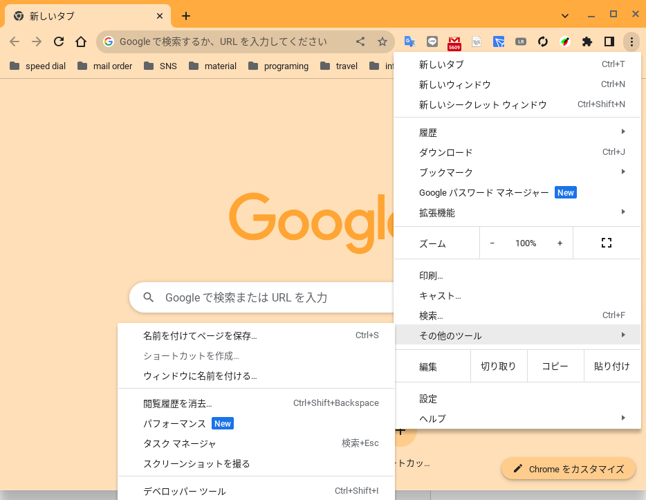

#### 1-1-1. Elements(要素)タブを見よう

1.1で開いてもらった開発者ツールの一番上のタブで「Elememts」もしくは「要素」と書かれているタブを開いてください。

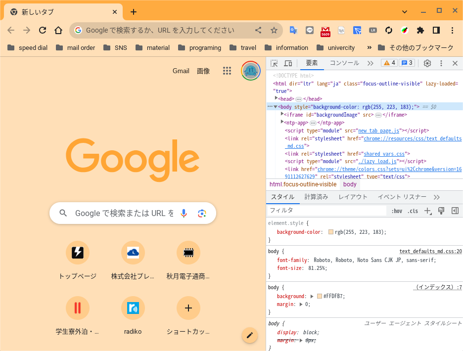

ここで開発者ツールの左上にある点線と矢印のアイコンをクリックすると要素選択ツールが使えます。  
このツールはページの要素をクリックして要素の詳細を確認できます。

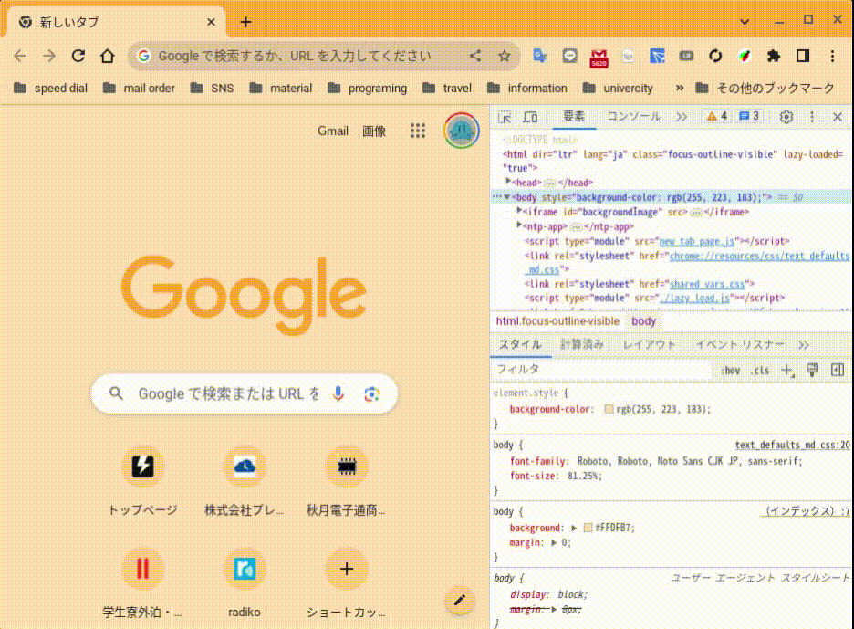

#### 1-1-2. Style(スタイル)タブを見よう

1-1-1. でやったように要素選択ツールで適当な要素を選択すると、それに合わせて開発者ツール下部にあるスタイルタブ内の表示も変わります。  
ここでは各要素に適用されているスタイルを確認することができます。
また、ここで適当にスタイルを書き換えることもできます。

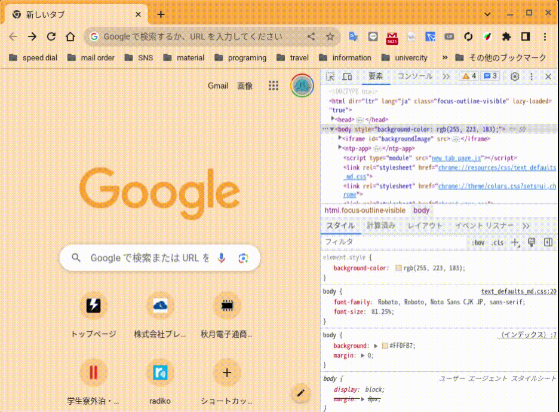

#### 1-1-3. Computed(計算済み)タブを見よう

1-1-2. で確認したStyleタブの横に Computed(計算済み)タブ があるので、そこも確認しましょう。

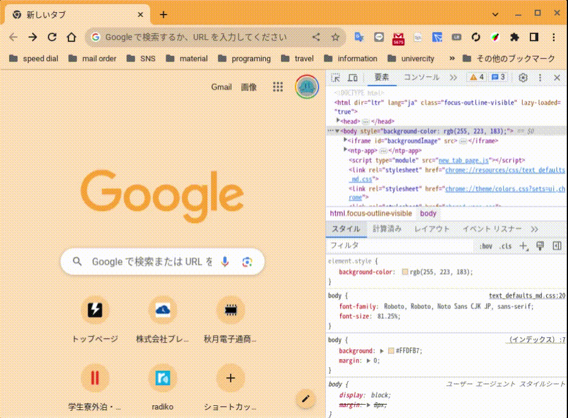

このタブでは選択中の要素の計算された大きさが表示されます。  
外から順にmargin、border、padding、content それぞれの大きさがわかります。  
そのため意図しない大きさが設定されている部分などを見つけやすいです。

### 1-２. VisBugを使ってみよう

ここでChromeで使える便利な拡張機能「VisBug」を紹介します。[こちら](https://chrome.google.com/webstore/detail/visbug/cdockenadnadldjbbgcallicgledbeoc?hl=ja)からインストールできます。

インストールしたら `Alt`+`Shift`+`D` のショートカットでVisBugを起動できます。  
様々な機能がありますが、特に便利なガイドツールとインスペクトツールを紹介します。

VisBug の起動時に自動で開くツールがガイドツールです。  
このツールでは、クリックした要素とマウスホバー中の要素の大きさの差分が表示されます。

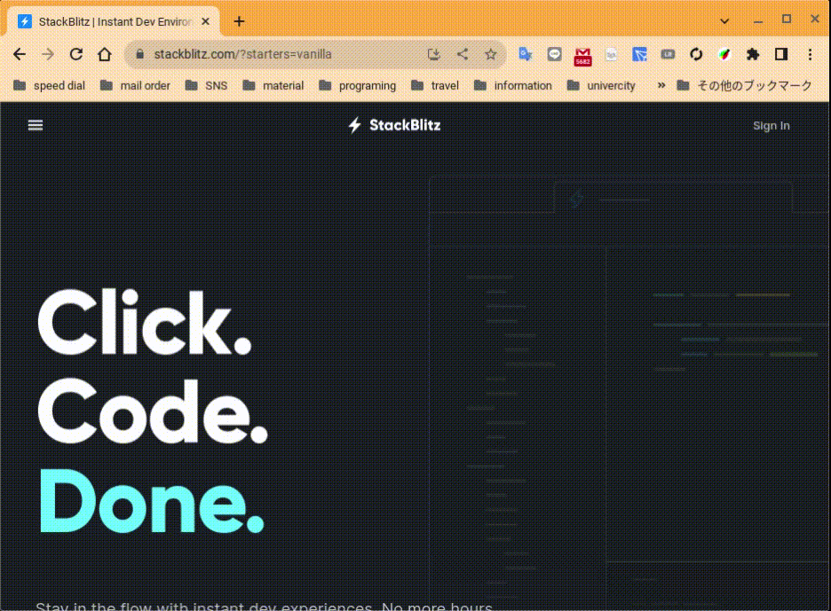

標準だと左側に出てくるツールバーから二番目のツールを開くとインスペクトツールになります。  
このツールはホバー中の要素の詳細が簡単に見れるツールです。  
開発者ツールのComputedタブで確認した要素の大きさや、Styleタブで確認した色周りの設定を一発で見れるのが便利です。

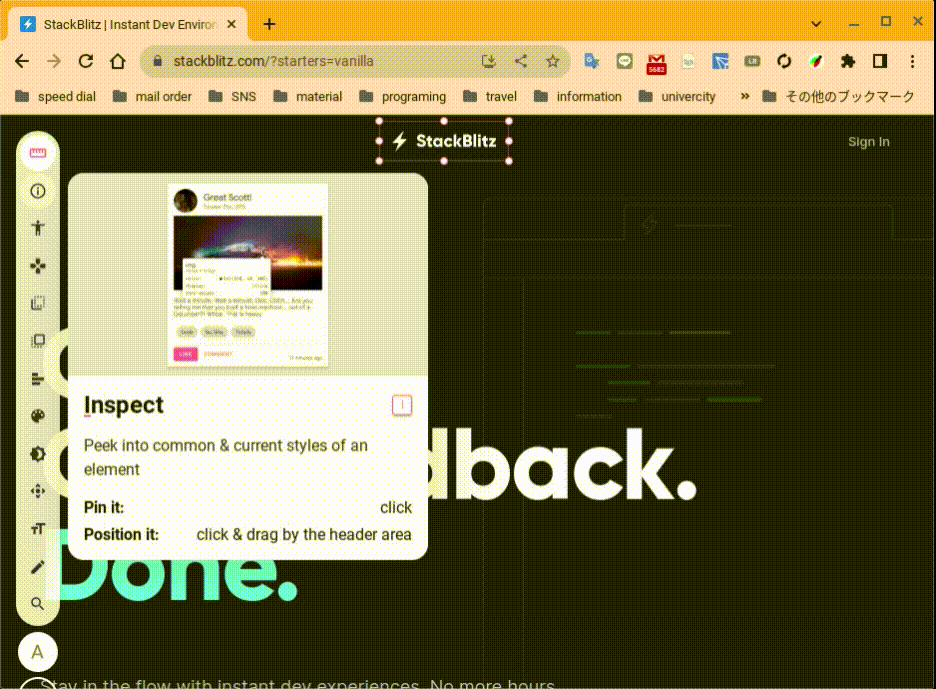

ここで紹介した開発者ツールと拡張機能は何かと使えると便利なので頭の片隅にでもおいておいてください。

## 2. ページを作ってみよう

では実際にWebページの開発を始めてみましょう！  
ここでは [StackBlitz](https://stackblitz.com/?starters=vanilla) というWeb IDEを使います。

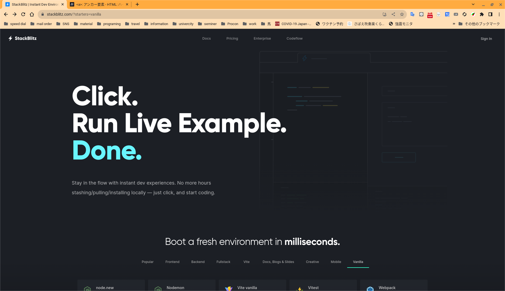

GitHubアカウントでログイン可能なので右上の「Sign in」からログインしておいてください。(制作物の保存に必要です)  
ログインが成功すると↓のような画面に遷移します。

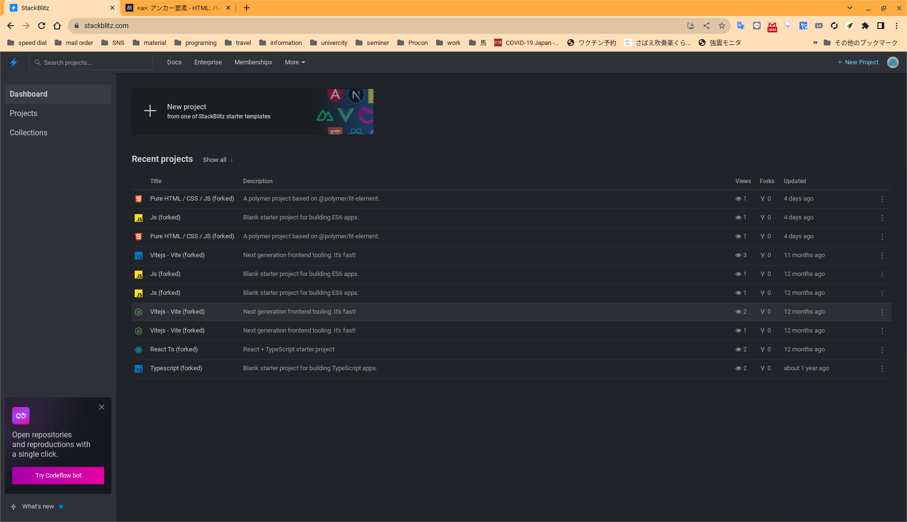

「New Project」をクリックすると新規プロジェクトダイアログが開くので、Vanillaタブにある Static をクリックしてください。

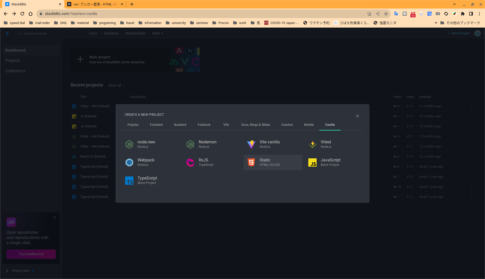

↓の画像のようにエディタとエミュレータが表示された状態に遷移します。

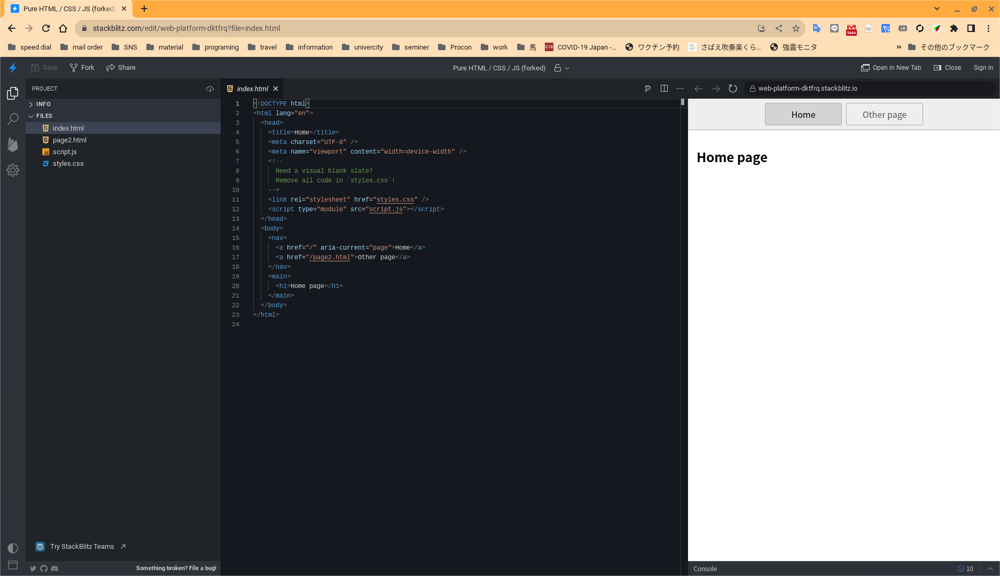

ファイルビューアにあるファイルをすべて削除して準備完了です。

### 2-1. HTMLをはじめよう

では空になったファイルビューアの右上にカーソルをホバーして、アイコンからファイルの追加をクリックします。  
最初に作るHTMLファイルは `index.html` とします。以下の内容を`index.html`に書き込んでください。

```HTML:index.html
Hello, World !
```

StackBlitzのエミュレータに↓のように表示されていることを確認してください。

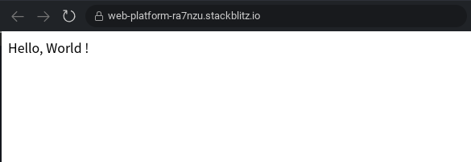

先程の`Hello, World !`の前後を`<h1>`と`</h1>`で囲んで↓のように書き換えててください。

```HTML:index.html
<h1>Hello, World !</h1>
```

これでエミュレータに表示されるテキストが大きくなったはずです。

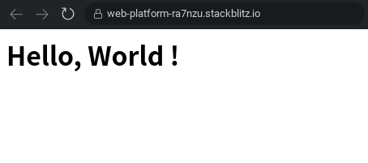

このとき↑のコードの`<h1>`,`</h1>`を **タグ**　*（開始タグ、終了タグ）* といい、タグを含む全体を **要素** といいます。  
ここで使用している`h1`タグは heading のhをとった見出しを示すタグで、ページで最も重要な見出し要素に使うものです。  
このように、文字列をタグで囲むことをマークアップといい、マークアップすることでブラウザが要素を解釈でき、内容に合わせた表示をとることができます。

### 2-2. HTMLの基本的な構造を知ろう

ではより実用的なHTMLの記述に移っていきます。まずは↓のコードを`index.html`に入力してみてください。  
(StackBlitzでhtmlファイルに `<!` まで入力すると候補に出てくるスニペットに2-1.のコードを入れ込んだものです)

```HTML
<!DOCTYPE html>
<html lang="ja">
  <head>
    <meta charset="UTF-8" />
    <meta name="viewport" content="width=device-width, initial-scale=1.0" />
    <title>サンプルページ</title>
  </head>
  <body>
    <h1>Hello, World !</h1>
  </body>
</html>
```

表示が少しだけ変わったかと思います。これは本来2-1.で示したコードでは表示がうまくいっていないことを示しています。

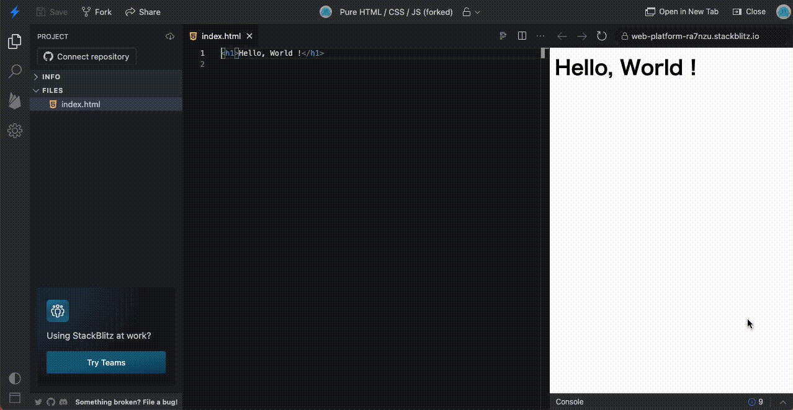

#### 2-2-1. 文書型定義とルート要素

試しに上から順に1行ずつコメントにして表示が変わった原因を探りましょう。

HTMLでのコメントは、コメントにしたい記述一帯を `<!--` \~ `--->` で囲むことで表現できます。  
>Tips: StackBlitzではコメントにしたい行にカーソルをおいて `Ctrl`+`/` を押すことでコメントにできます

1行目の `<!DOCTYPE html>` をコメントにすると表示が変わっているのがわかります。  
この行は*文書型定義*と呼ばれるもので、ブラウザにファイルがHTMLで記述されていることを伝えています。  
この記述がない場合には先程のような不具合が発生し得るため、必ずHTMLファイルの先頭には文書型定義を記述しましょう。

HTMLの記述は`<html>`\~`</html>`の中に記述し、この要素をルート要素と言います。  
ルート要素の子には *一つの`<head>`要素* と *そのあとに続く一つの`<body>`要素* が許可されています。  
サンプルコードでは開始タグに`lang="ja"`という記述があります。これはサイトがja=japanese=日本語で記述されていることを示していて、この記述のおかげでブラウザはページの内容をサイト制作者が意図した言語で解釈することができます。(文字化けが起こらなくなるなど)
この`lang="ja"`のようにタグの中に書かれる設定を **属性** といいます。

<details>
  <summary>HTMLにおける子孫</summary>

  要素の中に入れ子になった要素のことを *子* といい、要素の中の要素からみて自分を含む要素を *親* と言い表すことがあります。  
  共通の親を持つ要素を *兄弟*、親から見て子要素の子要素の子要素の...と続いていく要素郡を *子孫* などと表すこともあります。この資料で頻出する表現になるので覚えておくと良いでしょう。
</details>

#### 2-2-2. head要素

`<head>`要素は、HTMLファイルに記述するもののうち、閲覧者に見せる **コンテンツでないもの** を子孫に記述する要素です。  
例えば、ページのタイトルや説明文が含まれます。2-2.のコードから`<head>`要素を切り出すと以下のようになります。

```HTML
<head>
  <meta charset="UTF-8" />
  <meta name="viewport" content="width=device-width, initial-scale=1.0" />
  <title>Document</title>
</head>
```

このうち、`<meta`\~`/>`で囲まれた要素を *メタ要素* と言います。その名の通りメタデータを表現するために利用します。  
属性を`charset="UTF-8"`としたものは「文書の文字セットをUTF-8に設定する」意味を持ちます。  
属性に`name="<指定するメタデータの名前>"`とされているメタ要素はまた別に特定のメタデータを指定することができ、この例では`"viewport"`が指定されています。  
これは表示領域に関する指定で、主にスマートフォンでページを閲覧したときに意図しない幅で表示されないようにしたり、表示が拡大・縮小されたりしないようにできます。

`<title>`~`</title>`で囲まれた`<title>`要素は、ページを開いたときにブラウザのタブに表示されるタイトルを指定します。  
これもページ閲覧者に伝えるよりブラウザに伝えて使ってもらうような値であるため、HTMLメタ関連の要素になります。

これ以外にも、`<head>`要素の中にはJavaScriptを記述したり読み込んだりする`<script>`要素や後述するCSSを記述できる`<style>`要素、現在のファイルと外部リソースの関係を表現できる`<link>`要素等が記述できます。

#### 2-2-3. body要素

`<body>`要素は、HTMLファイルに記述するもののうち **ページに表示されるすべてのコンテンツ** を子孫に記述する要素です。  
この例では`<h1>Hello, World !</h1>`のみがページに表示されるコンテンツです。  
例えば、このページにあなたの自己紹介を表示することになったら、その内容はすべて`<body>`要素の中に書かれます。

以下のコードを、コメントを置き換えつつ追記してみてください。

```HTML
  <body>
    <h1>Hello, World !</h1>
    <!-- ここから追加の記述 -->
    <h2>自己紹介</h2>
    <ul>
      <li>名前: <strong><!-- あなたの名前 ---></strong></li>
      <li>出身校: <!-- あなたの出身校 ---></li>
      <li>
        好きな食べ物ランキング: 
        <ol>
          <li><!-- 好きなもの1位 ---></li>
          <li><!-- 好きなもの2位 ---></li>
          <li><!-- 好きなもの3位 ---></li>
        </ol>
      </li>
    </ul>
    <!-- ここまで追加の記述 -->
  </body>
```

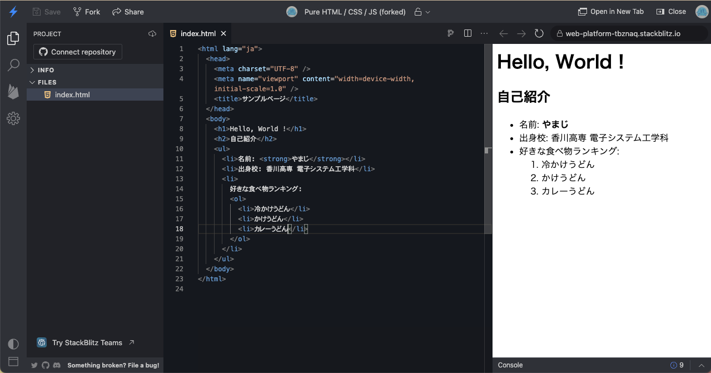

これがHTMLの基本的な構造です。

### 2-3. コンテンツを見やすく書くHTMLを知ろう

2-2.が終了した時点ではコードが↓のようになっていると思います。

```HTML
<!DOCTYPE html>
<html lang="ja">
  <head>
    <meta charset="UTF-8" />
    <meta name="viewport" content="width=device-width, initial-scale=1.0" />
    <title>サンプルページ</title>
  </head>
  <body>
    <h1>Hello, World !</h1>
    <h2>自己紹介</h2>
    <ul>
      <li>名前: <strong><!-- あなたの名前 ---></strong></li>
      <li>出身校: <!-- あなたの出身校 ---></li>
      <li>
        好きな食べ物ランキング: 
        <ol>
          <li><!-- 好きなもの1位 ---></li>
          <li><!-- 好きなもの2位 ---></li>
          <li><!-- 好きなもの3位 ---></li>
        </ol>
      </li>
    </ul>
  </body>
</html>
```

ここでは`<body>`要素の中身について、つまりページに表示されるコンテンツの表現について詳しく説明していきます。

#### 2-3-1. 見出しと段落

文書を表現するとき、見やすく、わかりやすくするためには塊を作って構造化することが重要です。  
物語でも論文でも章立てで (k部-)n章-m節-l項 というようにある程度の塊で分割、構造化されていますね。（もちろんこの資料もです）

このような構造を表現する方法が見出しと段落です。すでに見出し要素は登場済みですね。`<h1>`要素がそうだと2-1.で説明しました。  
似たタグがコード中にありますね？このように、見出し要素はその章立てにおける大きさを表現できるよう`<h1>`\~`<h6>`まで用意されています。

↓のコードを追加してどんな表示になるか感覚を掴んでおきましょう。

```HTML
<h1>Windowsでコンピューターの世界が広がります。1234567890</h1>
<h2>Windowsでコンピューターの世界が広がります。1234567890</h2>
<h3>Windowsでコンピューターの世界が広がります。1234567890</h3>
<h4>Windowsでコンピューターの世界が広がります。1234567890</h4>
<h5>Windowsでコンピューターの世界が広がります。1234567890</h5>
<h6>Windowsでコンピューターの世界が広がります。1234567890</h6>
<span>Windowsでコンピューターの世界が広がります。1234567890</span>
```

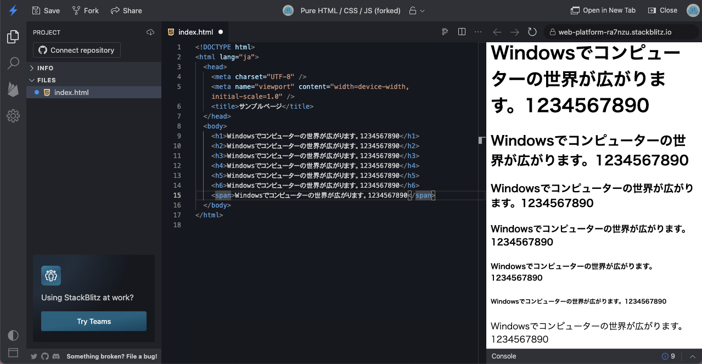

ここで比較対象として`<span>`要素を用意しました。この要素はコンテンツを囲む以外に意味を持たない、コンテンツをただ表示するだけの要素です。  
最も一般的なテキストの表示が`<span>`要素での表示になるので、これと比較することで見出し要素の見え方がよく分かるでしょう。

見出し要素の使用にはいくつかのポイントがあります。

- `<h1>`要素はページに一つだけあるのが好ましいとされています。`<h1>`要素は最も大きな見出し、いうなれば物語や記事の題を表すための要素のようなもので、これが複数あることはありえないからです。  
- 見出し要素の大きさを入れ替えて使用するべきではありません。節の中に章があるのはおかしいように、`<h3>`要素の下に`<h2>`要素があるのは望ましくありません。  
- 見出し要素は本文中で多用されるものは3段階にとどめた方がよいです。一般に章-節-項が使われて、巨大な文書を分けるために部が使われることからもそのほうが適しているでしょう。部まで必要になるような場合にはページそのものを分割することを考えるべきです。

また、段落を表す`<p>`要素も合わせて使用しましょう。  
一般に日本語では行頭を一字下げることで表現されますが、HTMLでは`<p>`\~`</p>`で囲むことで段落を表現できます。

#### 2-3-2. 箇条書き(リスト)

説明文などを書いていると特に、箇条書きで事柄を列挙したいことがあります。
これは`<ul>`要素とその子要素の`<li>`要素で表現できます。2-3-1.の見出し要素の使用のポイントや2-3.のサンプルの自己紹介でも登場していますね。

```HTML
<ul>
  <li>かけうどん</li>
  <li>しょうゆうどん</li>
  <li>ぶっかけうどん</li>
  <li>ざるうどん</li>
  <li>釜揚げうどん</li>
  <li>釜玉うどん</li>
  <li>カレーうどん</li>
  <li>しっぽくうどん</li>
</ul>
```

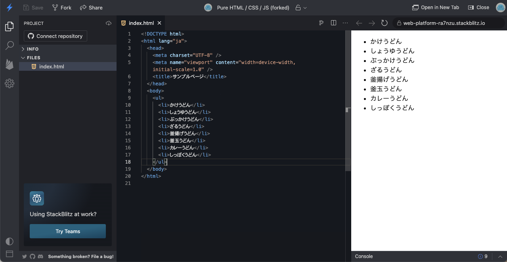

このうどん屋のメニューの列挙のように、項目の並びが重要でないものには順序のない箇条書きで表現するのが良いです。  
それに対して、私の好きな順に並んだうどんのリストを表現したいときのように、順序が重要なものには`<ol>`要素とその子要素の`<li>`要素で記述できます。

```HTML
<strong>私の好きなうどんメニュー</strong>
<ol>
  <li>かけうどん</li>
  <li>しっぽくうどん</li>
  <li>ぶっかけうどん</li>
  <li>カレーうどん</li>
  <li>しょうゆうどん</li>
  <li>ざるうどん</li>
  <li>釜玉うどん</li>
  <li>釜揚げうどん</li>
</ol>
```

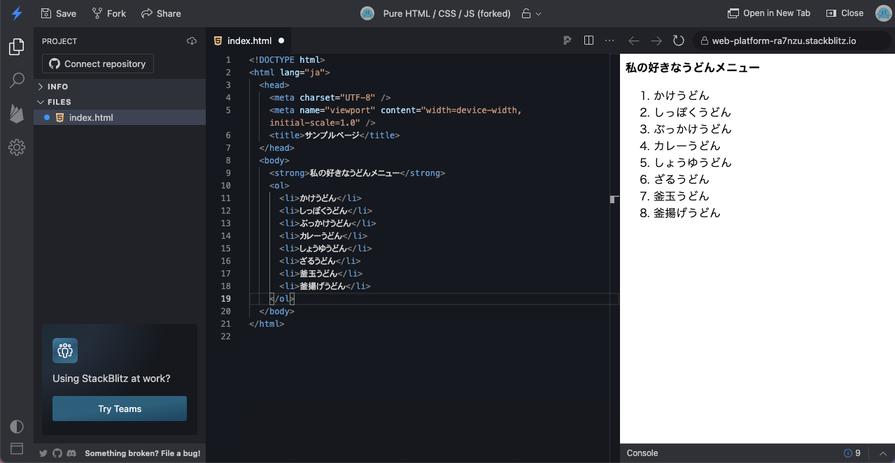

また、箇条書きの中に箇条書きを書く(入れ子にする)ことで箇条書きでも階層を表現できます。

```HTML
<ul>
  <li>
    材料(3~4人前): 
    <ul>
      <li>小麦粉: 400 g</li>
      <li>塩: 20 g</li>
      <li>水: 200 ml</li>
    </ul>
  </li>
  <li>
    作り方
    <ol>
      <li>分量通りの塩と水を混ぜて塩水をつくります。</li>
      <li>大きめのボウルにあけた小麦粉に塩水を加え、そぼろ状になるように熊手様にした手で素早く混ぜます。</li>
      <li>パラパラとした粒がおおよそひとかたまりになるようにこねます。</li>
      <li>ひとかたまりになったら生地の橋から中心に向けて生地を折りたたむようにして更にこねます。（20回程度）</li>
      <li>10~20分寝かせます。</li>
      <li>4.の手順を再度行います。(30回程度)</li>
      <li>10~20分寝かせます。</li>
      <li>伸ばして切ります。このとき四角形に近い形に伸ばせるときれいな麺になる部分が増えます。</li>
      <li>沸騰したたっぷりのお湯で10~12分茹でます。時々麺をつまんで茹で具合を確認してください。</li>
      <li>氷水に取り、やさしくこすり合わせるようにしてぬめりを落とします。</li>
      <li>一人前200g程度に玉を取ってうどんの完成です。</li>
    </ol>
  </li>
</ul>
```

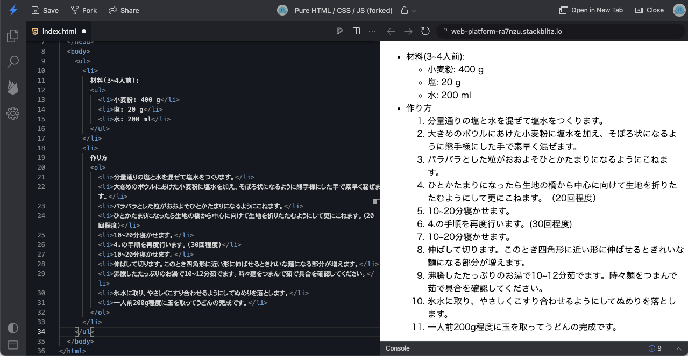

#### 2-3-3. 強調と重要の表現とその違い

HTMLでも私達が普段話したり書いたりするのと同じように表現や意味を強調したり重要であることを伝えるための要素があります。

`<em>`要素は強調を示す要素です。  
コンテンツはイタリック(斜体)で表示されますが、イタリックでの表示のみが目的ならば`<span>`要素とCSSでの表現を使用するべきです。

例えば、以下のような例で重宝するでしょう。

```HTML
<p>
  クイズの問読みに置いて、パラレルと呼ばれる「ですが問題」では強調される部分の違いで,その後の問題分でどこが変化するのかがわかります。
  <ul>
    <li>「日本で <em>一番</em> 高い山は富士山ですが、」となった場合、「一番」が変化する→「二番目に」なら北岳</li>
    <li>「 <em>日本で</em> 一番高い山は富士山ですが、」となった場合、「日本で」が変化する→「世界で」ならエベレスト</li>
    <li>「日本で一番 <em>高い</em> 山は富士山ですが、」となった場合、「高い」が変化する→「低い」なら日和山（国土地理院の地形図に山として掲載されているものの中で）</li>
  </ul>
</p>
```

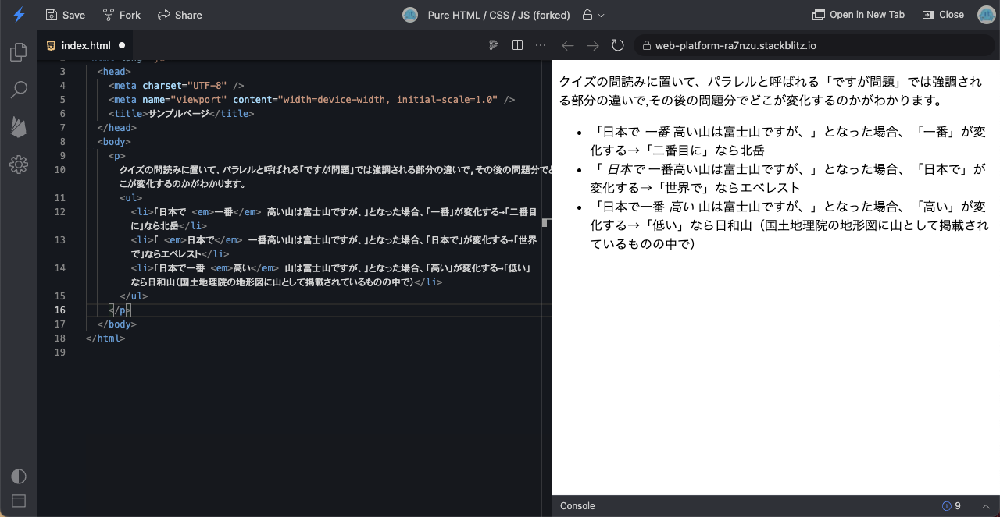

これに対して`<strong>`要素は重要性の高い言葉の表現にもちいます。  
コンテンツは太字で表示されますが、`<em>`要素と同様に太字での表示のみが目的ならば`<span>`要素とCSSでなんとかするべきです。（ここまでの資料中で使っていましたが、重要性を示す意図がない場合は誤用ですね。）

```HTML
<p>
  <strong>静的型付け</strong>、私の好きな言葉です。
</p>
```

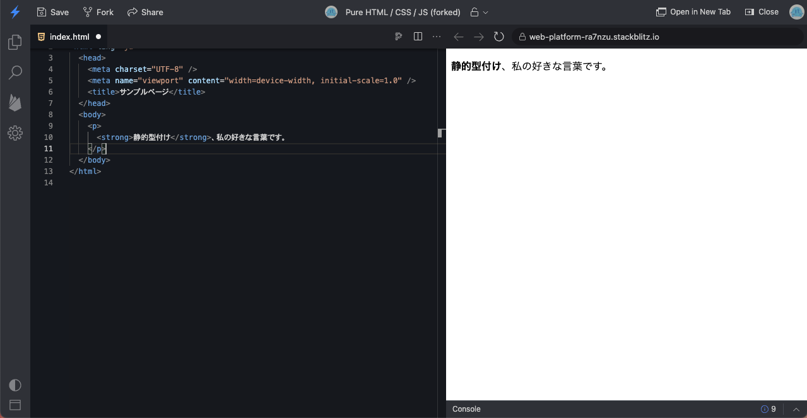

### 2-4. 画像を利用しよう

普段私達が目にするwebサイトは画像を利用しているところがほとんどでしょう。HTMLでは以下のコードのようにして画像をページに表示できます。  
> ※ StackBlitzは[バグ](https://github.com/stackblitz/core/issues/1687)があり、アップロードしたローカル画像を表示できません。そのため、ここでは自分のGitHubのプロフィールページからアイコンの画像アドレスを取得して表示させてみてください。

```HTML
" />
```

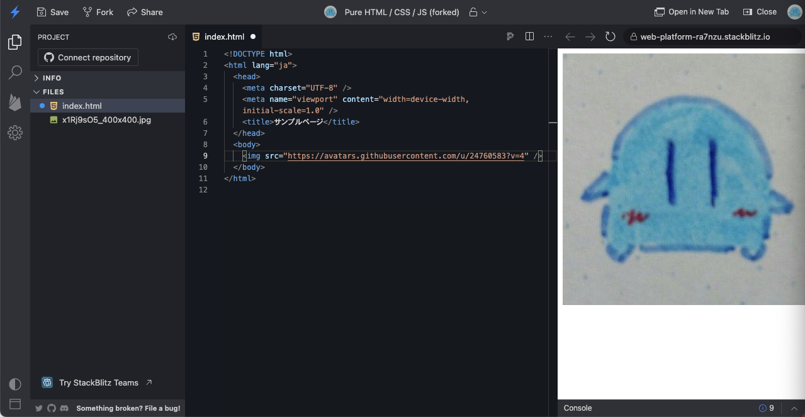

このように``タグの`src`属性に表示させたい画像までのパスを指定することで、画像を取得してページに埋め込んで表示してくれます。  
このとき`src`に指定されているURLをすべて書くパスを *絶対パス* 、それに対してHTMLファイルから見たファイルの位置を *相対パス* と言います。  
外部にあるファイルへのアクセスでは絶対パスを使い、内部にあるファイルへのアクセスでは相対パスを使います。

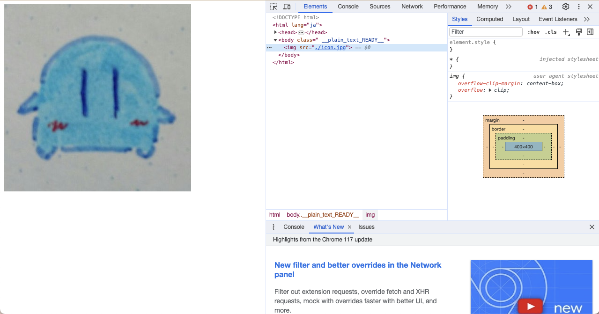

また、``要素に追加できる属性として`alt`属性があります。  
これは画像が取得できなかったときなどに表示される*代替テキスト*で、設定されている方が望ましいです。

<details>
  <summary>空要素</summary>

  HTML要素の一部は`<`~`/>`で囲まれた一つのタグだけで記述できます。このような要素を空要素と言います。
</details>

### 2-5. リンクを貼ろう

webにおけるリンクと呼ばれるものは、正式にはハイパーリンクと言います。  
このハイパーリンクによって様々な文書が相互にリンクされる要素をクモの巣になぞらえてwebと呼ばれるようになったほど、webにおいて欠かせないものです。

そんなハイパーリンクですが、↓のようにして記述できます。

```HTML
<a href="https://jig.jp">株式会社 jig.jp ホームページ</a>
```

`<a>`と`</a>`で囲まれた間の文字がリンクテキストとして表示され、`href`属性でリンク先アドレスを指定します。  
この他に`target`属性を指定することがあり、`target="_blank"`とすることで新しいタブでページを開くことができます。

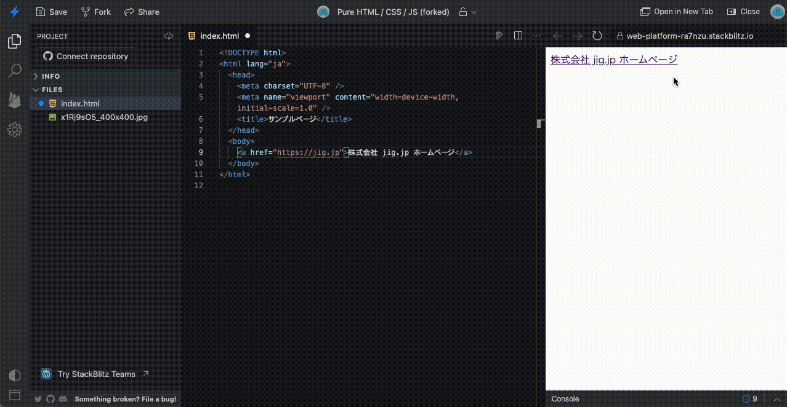

### 2-6. よくあるページのレイアウトとそのためのHTML要素を知ろう

ここまでで一般的な表示に用いるHTML要素はおおよそ説明できたでしょう。  
では実際に最近良く見るwebページの構造を考えてみましょう。  
みなさんよく↓の図のようなサイトを見ると思います。

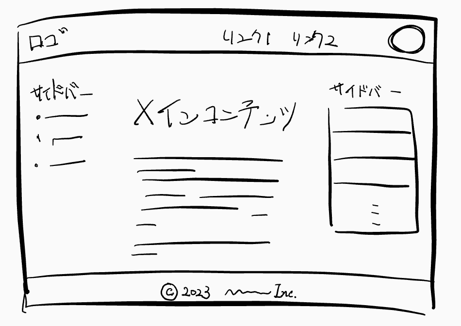

このレイアウトは、大きく分けるとヘッダー、右カラム、メインコンテンツ、左カラム、フッターで構成されています。  
このようなレイアウトを聖杯レイアウトと言います。

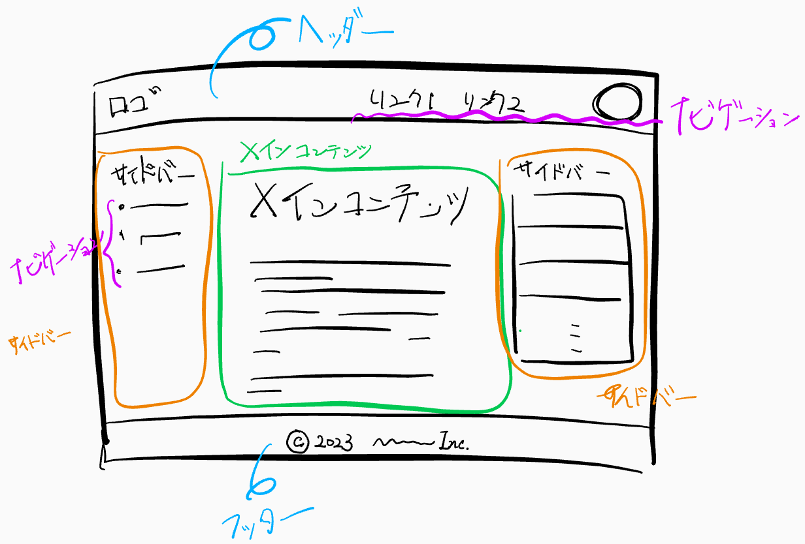

この表示上の大きな塊を表現するためのHTML要素があります。

- ヘッダー: `<header>`要素
- サイドバー: `<aside>`要素
- メインコンテンツ: `<main>`要素
- フッター: `<footer>`要素
- ナビゲーション: `<nav>`要素

これらは、ブラウザに要素がどんなコンテンツを内包しているかをより詳細に伝えることができる要素です。  
詳細な説明は省きますが、これらの要素を適切に使うことで、よりアクセス性の良いwebコンテンツを作ることができます。

### 2-7. 何でもない便利要素 `<div>`

最後に最も使用機会が多い要素として `<div>` 要素を説明します。  
この要素は本質的に何も表しません(ブラウザが解釈する際に、ただの囲い以上の意味を持ちません)。  
文字列を囲んでCSSで装飾できる要素が`<span>`だとすれば、要素を囲んでCSSで装飾できる要素が`<div>`で、基本そのように利用されます。

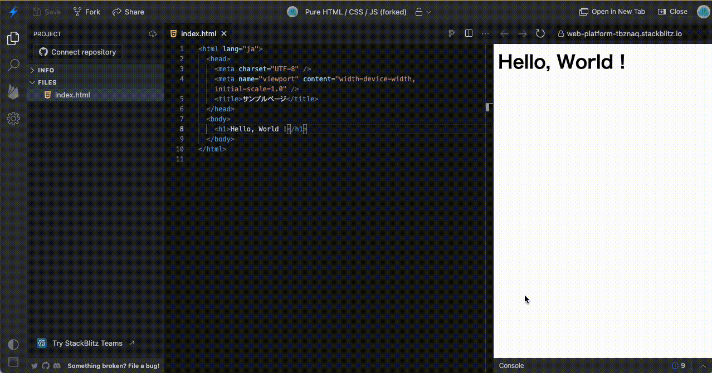

## 3. レイアウトとデザインを考えよう

2\. ではHTMLでの記述について学んできました。  
HTMLを丁寧に書くことはブラウザに内容の意味をより正確に解釈させる事につながります。  
この章では、より見た目を細かく調整できる `CSS` について説明します。

### 3-1. CSSを始めよう

CSS(カスケーディングスタイルシート)はHTMLで記述された文書の文字の大きさや色、背景や配置など、その見た目を設定する言語です。

StackBlitzで実際にCSSを書いて見た目を適用してみましょう。  
`index.html`は↓のように書いておいてください。

```HTML
<!DOCTYPE html>
<html lang="ja">
  <head>
    <meta charset="UTF-8" />
    <meta name="viewport" content="width=device-width, initial-scale=1.0" />
    <title>Blog</title>
  </head>
  <body>
    <h1>Hello, World !</h1>
  </body>
</html>
```

このときのh1タグの文字色を変更してみます。  
まず右のファイルビューアから新規ファイルとして`style.css`を作成してください。  
このCSSファイルを`index.html`から読み込んで使います。  
↓のコードを`index.html`の`<head>`要素に追記してください。

```HTML
<link rel="stylesheet" href="style.css" />
```

これでHTMLからCSSを読み込めるようになったので、`style.css`を編集して見た目を変更していきます。  
↓のコードを追記してください。

```css
h1 {
  color: red;
}
```

↓の画像のように「Hello, World !」が赤字で表示されれば成功です。

このとき、`h1`のように表示を設定する要素を識別するものを**セレクタ**、`color`のように値が設定されるものを**プロパティ**、`red`のようにプロパティに設定するものを**値**といいます。

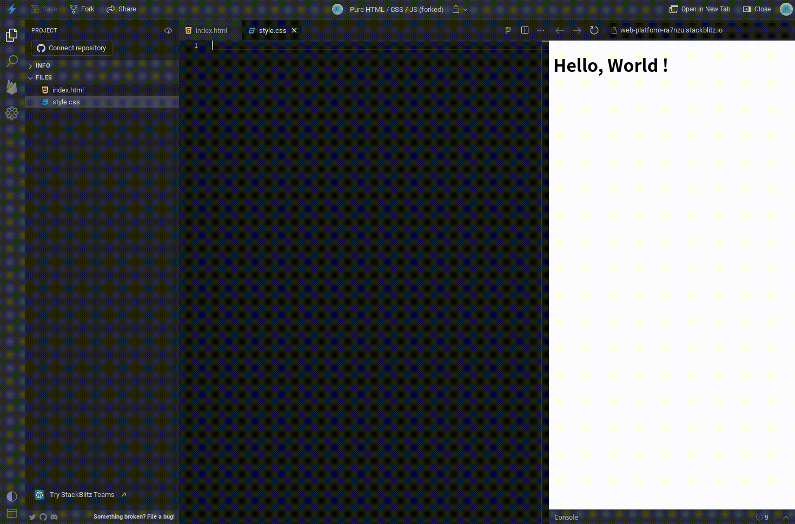

### 3-2. ボックスモデルと`box-sizing`

CSSでHTMLを装飾してページの見た目を変更していく上で、必ず知っておく必要があるものの一つがボックスモデルです。  
CSSで表現できるものはすべてボックス、四角形の領域を持ちます。(たとえ見かけ上円形に見えてもです)

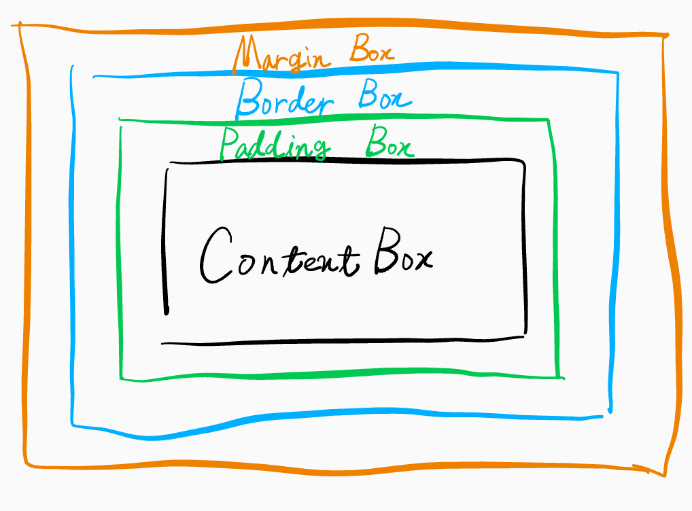

すでにこんな表示のものを見たことがあるはずです。そう、1-1-3.で紹介した開発者ツールのComputedタブです。  
また、開発者ツールでの要素選択中にマウスホバーした要素にも↑のような表示が見えることがあります。

それぞれ`margin`プロパティで設定する要素間の余白部分が「Margin Box」、`border`プロパティで設定する境界線部分が「Border Box」、`padding`プロパティで設定する要素内の余白部分が「Padding Box」、そしてコンテンツの領域が「Content Box」です。  
↓のように額に入った絵画を思い浮かべると捉えやすいです。

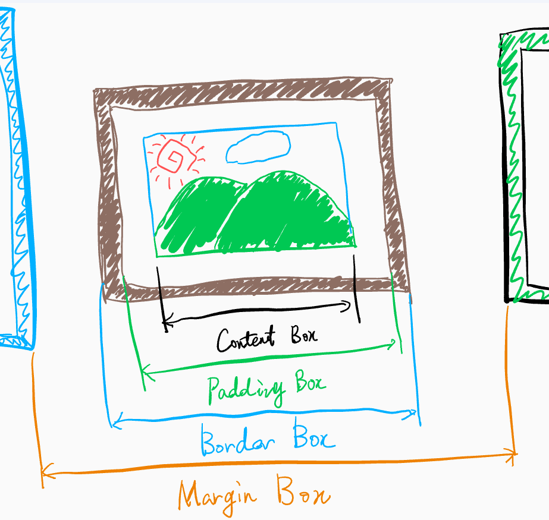

ところで、CSSでは`width`プロパティ、`height`プロパティでコンテンツの大きさを指定できます。  
しかし、デフォルトでは↑のContent Boxの大きさとして指定されてしまい、人間が扱うには直感的でないです。  

これを解決するCSSプロパティが`box-sizing`です。  
`box-sizing`プロパティには`content-box`と`border-box`が指定できますが、これは`width`と`height`がContent Boxの大きさとして指定されるか、Border Boxの大きさとして指定されるかが変わります。

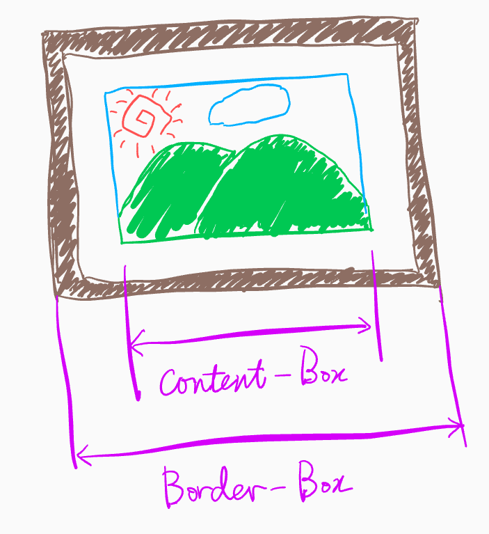

例えば、↑の図のように額に入った絵を飾る場合、絵そのものの大きさ（`content-box`）ではなく、額を含めた大きさ（`border-box`）を指定できる方が配置しやすいと考えられます。  
しかし、デフォルトでは`content-box`を指定する設定になっています。  
そのため、現在web開発では *全称セレクタ*`*` を用いて以下のように設定するのが一般的です。

```css
* {
  box-sizing: border-box;
}
```

<details>
  <summary>margin</summary>

  Margin Box の大きさはいわば額と額の間の距離です。HTML的には要素間の間隔・距離になります。  
  つまり2つの要素から別々に指定したりもできてしまいます。(通常、Aに16pxのmargin、Bに32pxのmarginを指定するとA-B間の間隔は48pxあることになります。)  
  これだと要素間の間隔に計算が必要なので、レイアウトによりますが、上下左右ではなく上と左のみ、下と右のみなど指定を工夫することでわかりやすくなると思います。

  また、marginはコンテンツの大きさに影響を与えないため、box-sizingには margin-box が存在しません。
</details>

<details>
  <summary>padding</summary>

  Padding Boxはいわば額の中の余白です。これに関する逸話として、box-sizingプロパティに padding-box が指定できる案もあったそうです。今はありません。使いみちがあんまりなかったんですね....🥺
</details>

### 3-3. スタイルシートの種類と優先度

ここで、スタイルシートは私達開発者が書くものだけではない事を説明しておきます。  
基本的にスタイルシートは3種類あります。

1. ユーザーエージェントスタイルシート(UAスタイルシート)
   - ブラウザがもつスタイルシート
2. オーサースタイルシート
   - 開発者が自由に設定できるスタイルシート
   - オーサー: Auther/著者
3. ユーザースタイルシート
   - ページの閲覧者が設定しているスタイルシート

この内、開発者が気にしなければならないのはUAスタイルシートとオーサースタイルシート、CSSの初期値です。  
例えば`<h1>`要素などはUAスタイルシートで見た目が設定されているため2-1.で何も設定せずに利用しても見た目が変わったのです。

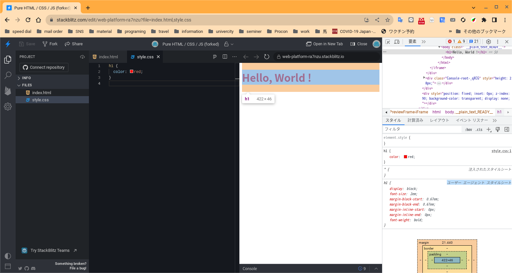

また、3-2.で説明した`box-sizing`プロパティはCSSの初期値によって`content-box`が指定されています。  
デフォルトでは`content-box`を指定する設定になっているので、`border-box`を指定し直すことを推奨しました。

UAスタイルシートやCSS初期値に対して、オーサースタイルシートのほうが優先度が高いため↑のように設定することで上書きできます。  
オーサースタイルシートより優先度が高いものにユーザースタイルシートがあります。例えばブラウザの設定で拡大率を上げて表示するときなどがこれに該当します。

オーサースタイルシートで見た目が設定されない要素はUAスタイルシートやCSS初期値によって表示されます。  
意図しない表示になったときは、設定したセレクタが間違っていないか確かめましょう。

<details>
  <summary>cssリセット</summary>

  UAスタイルシートやCSS初期値を上書きしたいとき、要素ごとに毎回CSSで修正するのは大変です。  
  世の中にはCSSリセットと呼ばれるこれらの値を扱いやすい状態にしてくれるものがあり、おおよその場合はCSSファイルとして用意されています。  
  webアプリケーション開発などで重宝することもあるので頭の片隅にでもおいておいてください。
</details>

### 3-4. セレクタでもっと限定的にスタイルを適用できるようになろう

3-1.で説明した通り、CSSはセレクタを指定することでそのセレクタ以下に見た目を設定します。  
ここではセレクタについて詳しく説明します。

#### 3-4-1. 基本セレクタと結合子

セレクタには以下のものがあります。

- 全称セレクタ
  - 全ての要素を選択するセレクタ
  - `*`と表します。
- 要素型セレクタ
  - あるHTML要素を選択するセレクタ
  - `<h1>`要素なら`h1`と表します。
- クラスセレクタ
  - `class="<クラス名>"`とclass属性が指定された要素を選択するセレクタ
  - クラス名が`class-name`なら`.class-name`と表します。
- IDセレクタ
  - `id="<id名>"`とid属性が指定された要素を選択するセレクタ
  - id名が`id-name`なら`#id-name`と表します。
  - id名は重複してはいけません
- 属性セレクタ
  - HTML要素に付与された任意の属性`attr`が付与されたすべての要素を選択するセレクタ
  - `attr`属性が付与された要素なら`[attr]`と表します。
  - `attr`に特定の値`value`が指定されている場合、`[attr=value]`として`attr`に`value`が指定された要素を選択できます。
- グループ化セレクタ
  - `,`でこれまでのセレクタをつなげる、例えば`header, footer`とすることで、`<header>`要素と`<footer>`要素の両方を選択します

結合子はこれ以外にもありますが、使用機会が少ないため省きます。知りたい方は[こちらへ](https://developer.mozilla.org/ja/docs/Web/CSS/CSS_selectors#%E7%B5%90%E5%90%88%E5%AD%90)。  

これらのセレクタと以下の結合子を用いることで要素をより限定できます。

- 子孫結合子
  - `⎵`(スペース)
  - `p span`として指定すると、`<p>`要素の *子孫にある* 全ての`<span>`要素を選択します
- 子結合子
  - `>`
  - `p>span`として指定すると、`<p>`要素の *子にある* 全ての`<span>`要素を選択します。

#### 3-4-2. 疑似表記

ここまでのセレクタはHTMLファイルに記述されている情報のみをもって要素を選択するものでした。  
ここで説明する疑似表記は、HTMLファイルにかかれていない情報も使って要素を選択できるものです。

- 擬似クラス
  - `:<擬似クラス名>`で表します。
  - `.reaction:hover`とすると、マウスホバー中の`class="reaction"`が指定された要素を選択します。
  - 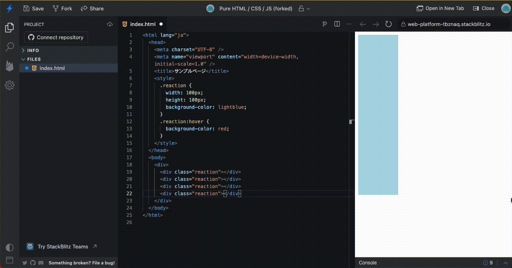
- 疑似要素
  - `::<疑似要素名>`で表します。
  - `p::first-letter`とすると、`<p>`要素の最初の文字のみを選択します。
  - 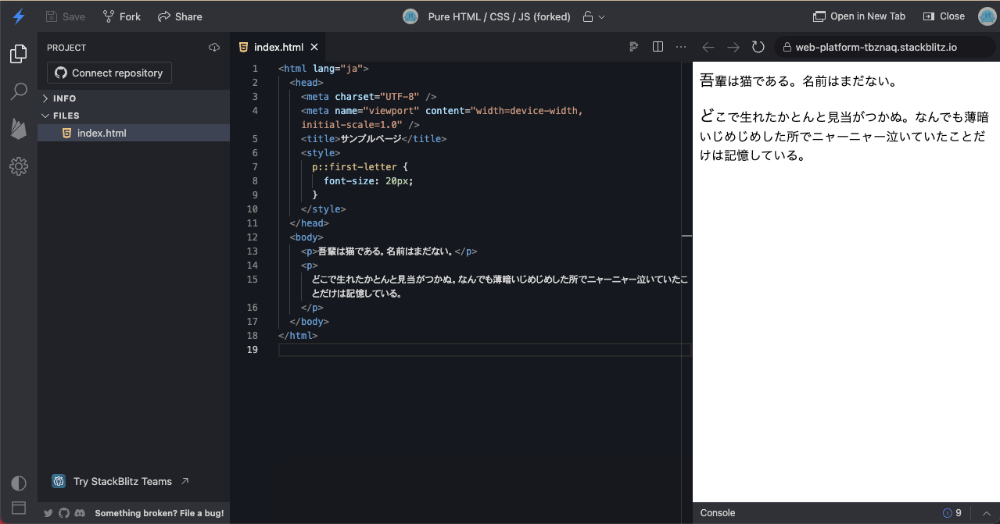

### 3-5. 思いどおりの見た目を作ろう

ここまで長い前置きでしたね。いよいよ楽しい楽しいCSSの始まりです！

#### 3-5-1. CSSカスタムプロパティを使おう

CSSには(JavaScriptでいう定数のような)設定して特定の値として利用できる*カスタムプロパティ*があります。  
↓のようにして宣言できます。

```css
:root {
  <カスタムプロパティ名>: <値>
}
```

カスタムプロパティ名は`--`から始まる必要があることに注意してください。  
ここでセレクタとして`:root`疑似要素を使用しています。これはルート要素セレクタと同等の働きをします。  
このように宣言することで文書中の適当な場所からもカスタムプロパティを利用できるようになります。  
また、カラーコードやキーワードでの指定に比べて、色の持つ意味等もカスタムプロパティ名で伝えられるので、可読性に良い影響を与えるでしょう。

```css
:root {
  --color-greeting: #668844;
}

h1 {
  color: var(--color-greeting);
}
```

↑のように、設定したカスタムプロパティに`var(<カスタムプロパティ名>);`とすることで値にアクセスできます。

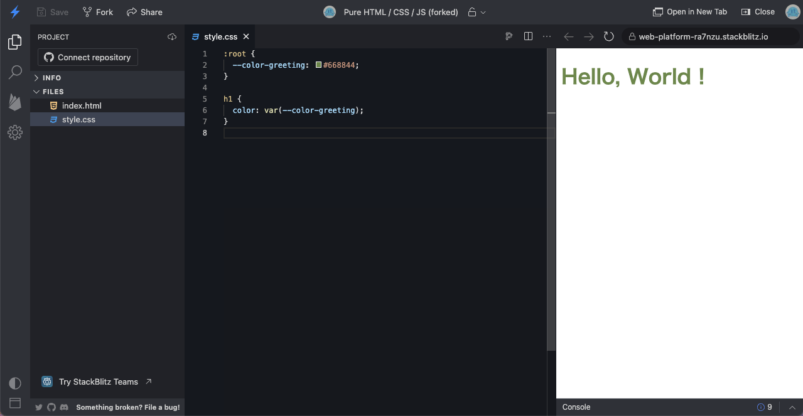

#### 3-5-2. 文字の見た目を変更しよう

ここまででも文字色の変更はやってますね。あんなふうに文字の見た目を変更するプロパティを紹介します。

| プロパティ | 影響箇所 | 実行結果 |
| ---- | ---- | ---- |
| `color` | 色 |  |
| `font-size` | 文字の大きさ | 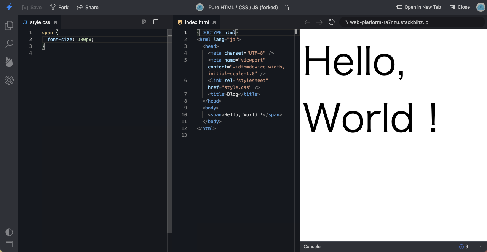 |
| `font-weight` | 文字の太さ |  |
| `font-style` | 書体(斜体) | 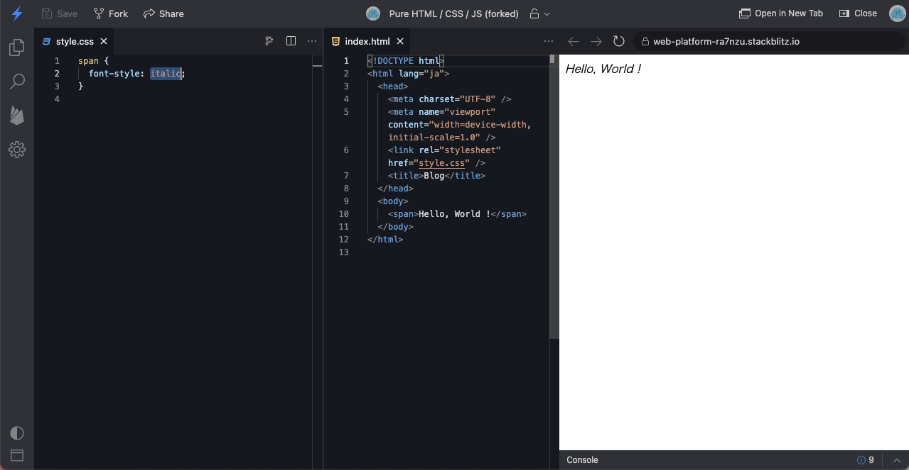 |
| `text-decoration` | 線 | 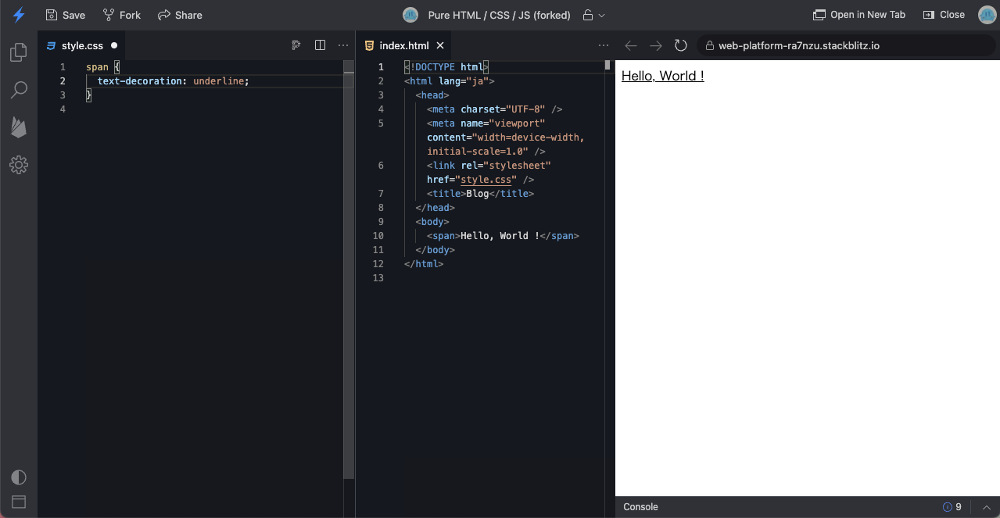 |
| `font-family` | フォント | 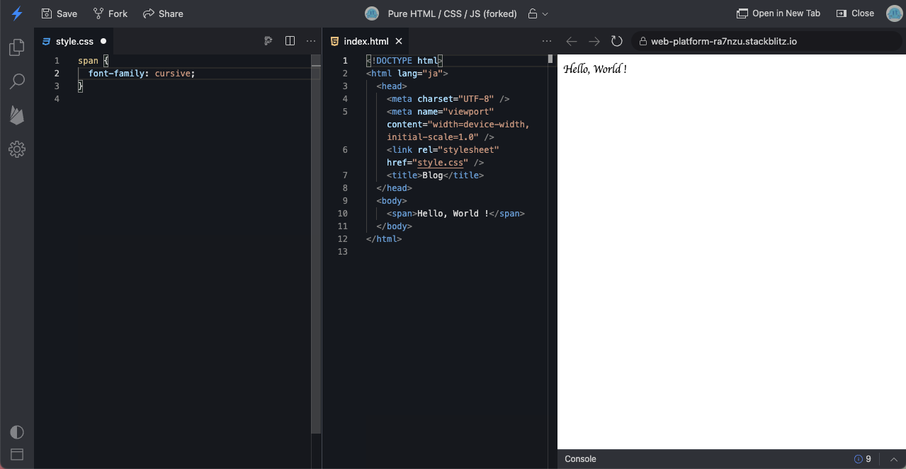 |

↑の例以外のプロパティや値もたくさんあるので、[mdn web docs](https://developer.mozilla.org/ja/docs/Web/CSS)やGoogle先生に聞いたりして調べて使ってください。

#### 3-5-3. 要素の見た目を変更しよう

ここで言う要素の見た目は例えば境界線や要素の背景などです。

要素の背景や境界線に関するプロパティと実行結果を表に示します。

| プロパティ | 影響箇所 | 実行結果 |
| ---- | ---- | ---- |
| `background-color` | 背景色 | 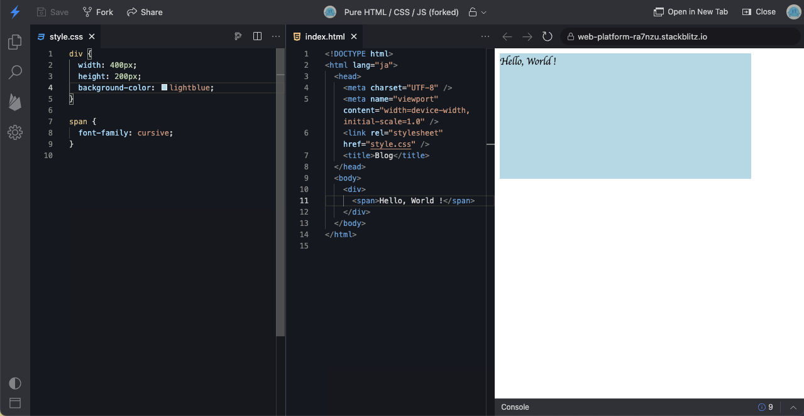 |
| `background-image` | 背景画像 | 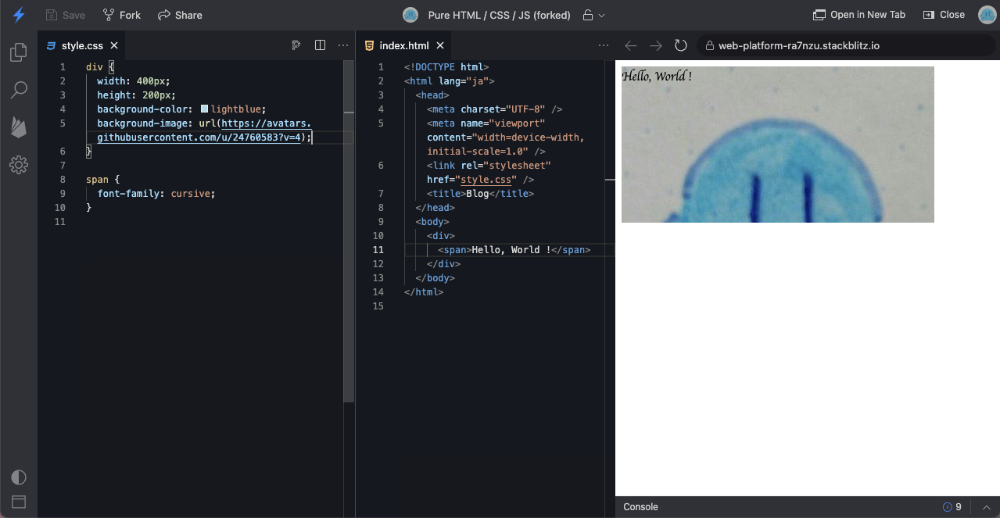 |
| `background-size` | 背景画像の大きさ | 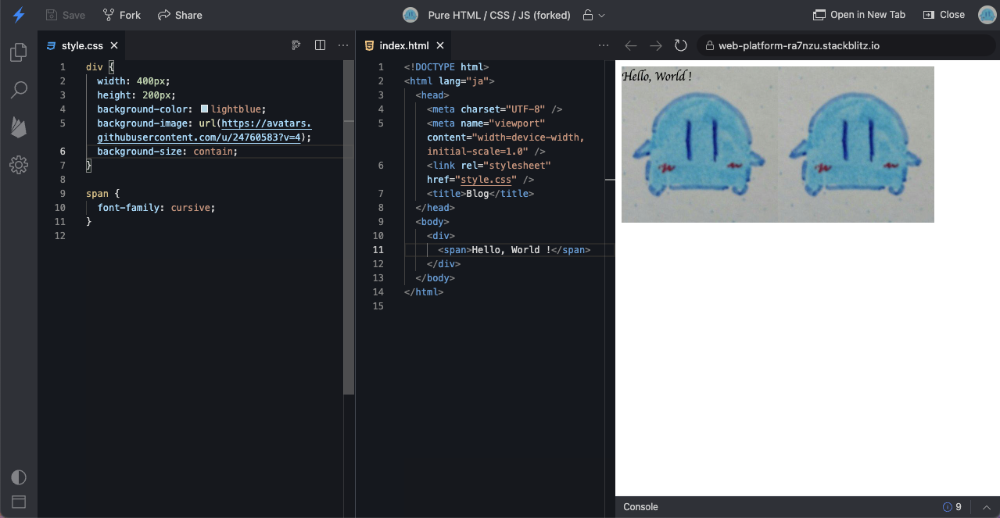 |
| `background-repeat` | 背景画像の繰り返し | 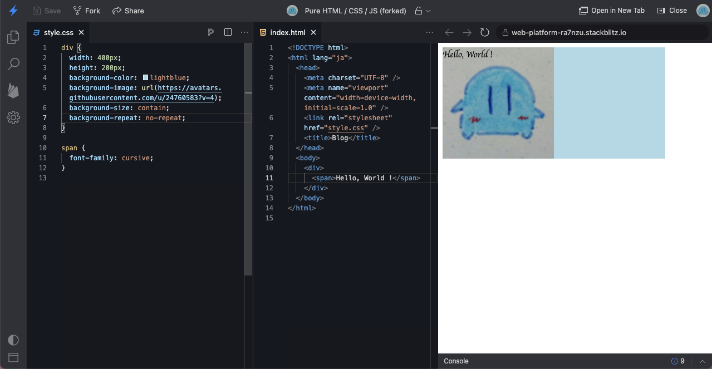 |
| `background-position` | 背景画像の位置 | 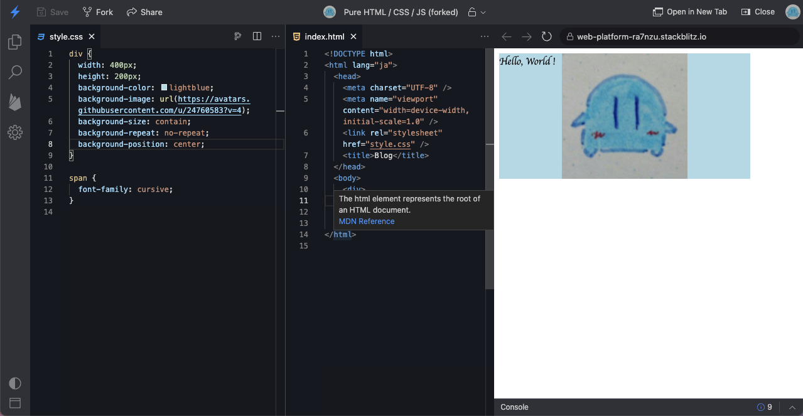 |
| `background-blend-mode` | 背景色と背景画像の混色 | 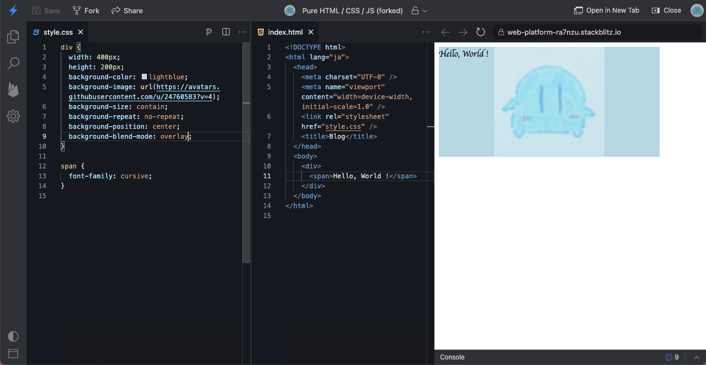 |
| `border` | 境界線 | 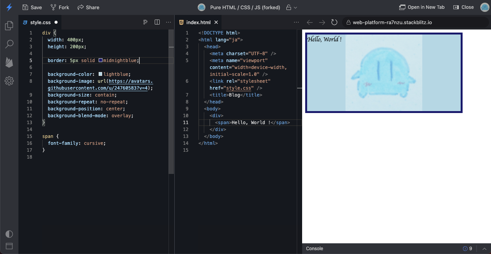 |
| `border-radius` | 境界線の角の丸め | 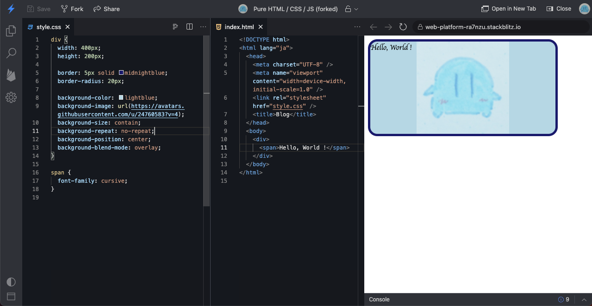 |

文字の見た目と同様に、背景や境界線に関するプロパティや値ももっとたくさんあります。  
↑に示したのは一例なので、実際に使うときに調べながら開発してください。

#### 3-5-4. 形をつくろう

↓に見かけ上の形を変えるサンプルをいくつか置いておきます。（サンプルのように書かなければならない、というものではないです。）

- <details>
  <summary>楕円</summary>

  ```css
    div {
      width: 300px;
      height: 200px;

      background-color: lightblue;

      border-radius: 50%;
    }
  ```

</details>

- <details>
  <summary>角丸四角形</summary>

  ```css
    div {
      width: 300px;
      height: 200px;

      background-color: lightblue;

      border-radius: 100vh;
    }
  ```

</details>

- <details>
  <summary>吹き出し(1)</summary>
  
  ```css
    * {
      box-sizing: border-box;
    }

    div {
      width: 300px;
      height: 200px;

      position: relative;

      background-color: #add8e6;

      border: 5px solid midnightblue;
      border-radius: 20px;
    }

    div::before {
      position: absolute;
      top: calc(200px - 5px * 2 - 5px);
      left: 20px;
      content: '';
      width: 20px;
      height: 20px;
      background-color: midnightblue;
      transform: rotate(45deg);
      z-index: -1;
    }

    div::after {
      position: absolute;
      top: calc(200px - 5px * 2 - 11px);
      left: 20px;
      content: '';
      width: 20px;
      height: 20px;
      background-color: lightblue;
      transform: rotate(45deg);
      z-index: 1;
    }

    span {
      font-family: cursive;
    }
  ```

</details>

- <details>
  <summary>吹き出し(2)</summary>
  
  ```css
    * {
      box-sizing: border-box;
    }

    div {
      width: 300px;
      height: 200px;

      position: relative;

      background-color: #add8e6;

      border: 5px solid midnightblue;
      border-radius: 20px;
    }

    div::before {
      box-sizing: border-box;
      content: '';
      position: absolute;
      top: 195px;
      left: 20px;
      border: 10px solid;
      border-color: midnightblue transparent transparent transparent;
    }

    div::after {
      box-sizing: border-box;
      content: '';
      position: absolute;
      top: 190px;
      left: 22px;
      border: 8px solid;
      border-color: lightblue transparent transparent transparent;
    }

    span {
      font-family: cursive;
    }
  ```

</details>

CSSをうまく使うと様々な図形を作れます。自分の想像力次第なのでぜひ気合で頑張ってみてください。
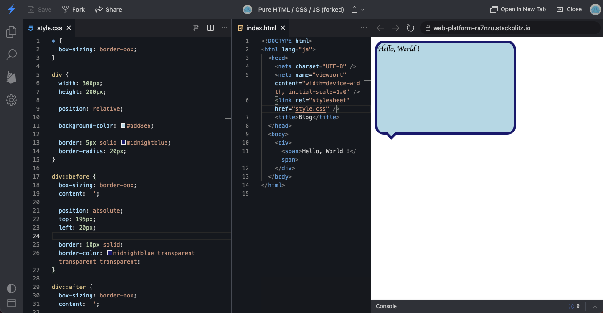

### 3-6. 思いどおりに配置しよう

ここまでで要素そのものはかなり自由に編集できるようになったと思います。  
ここで、ページそのものをデザイン・レイアウトするためのCSSについて説明します。

現在主に使うレイアウトは**グリッドレイアウト**と**フレックスボックス**です。

この節では、以下のHTMLを装飾して聖杯レイアウトを実装することを考えます。

```HTML
<!DOCTYPE html>
<html lang="ja">
  <head>
    <meta charset="UTF-8" />
    <meta name="viewport" content="width=device-width, initial-scale=1.0" />
    <title>サンプルページ</title>
    <link rel="stylesheet" href="style.css"/>
  </head>
  <body>
    <header>
      <p>ヘッダー</p>
    </header>
    <aside id="left">
      <p>左カラム</p>
    </aside>
    <main>
      <p>メインコンテンツ</p>
    </main>
    <aside id="right">
      <p>右カラム</p>
    </aside>
    <footer>
      <p>フッター</p>
    </footer>
  </body>
</html>
```

#### 3-4-1. グリッドレイアウト

グリッドレイアウトは`display`プロパティに`grid`を指定することで利用できるレイアウトです。  
行と列を用いた2次元的なレイアウト方法で、行と列の中に配置するものです。  
これを用いて聖杯レイアウトを実装してみます。

```css
* {
  box-sizing: border-box;
  margin: 0;
}

body {
  display: grid;
  grid-template:
    'header header header' 40px
    'left-column main right-colmun' auto
    'footer footer footer' 40px / 200px auto 200px;
}

header {
  grid-area: header;
  background-color: lightblue;
}
aside#left {
  grid-area: left-column;
  background-color: lightsalmon;
}
main {
  height: calc(100vh - 80px);
  grid-area: main;
  background-color: lightgreen;
}
aside#right {
  grid-area: right-colmun;
  background-color: lightsalmon;
}
footer {
  grid-area: footer;
  background-color: lightblue;
}

```

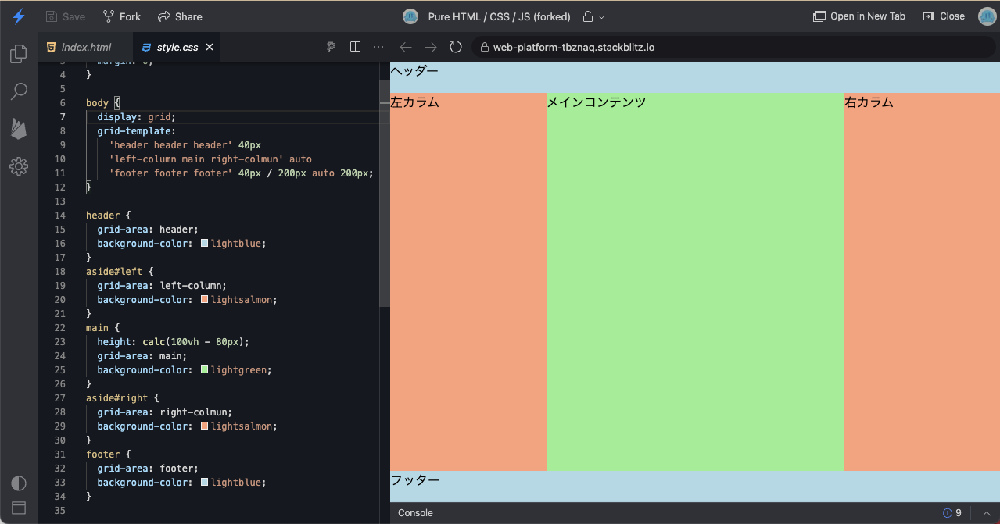

ここで重要なプロパティは以下のものです。

- `display: grid`
  - 指定された要素の子に対してグリッドレイアウトによる配置を適用します。
- `grid-template:`
  - グリッドレイアウトでの要素の配置を指定します。
  - `grid-template-areas`、`grid-template-rows`、`grid-template-columns`を一括指定するプロパティです。
- `grid-area:`
  - `grid-template-areas`で指定した文字列を指定することで、`template`中の該当文字列部分に要素が入ることを示します。

グリッドレイアウトにより親しみたいあなたは[Grid Garden](https://cssgridgarden.com/#ja)に取り組んでみてください。

#### 3-4-2. フレックスボックス

フレックスボックスは`display`プロパティに`flex`を指定することで利用できるレイアウトです。

フレックスボックスは要素を行または列のどちらかに一次元に配置するレイアウトです。  
この性質から、聖杯レイアウトのような縦のレイアウトの中に横のレイアウトがあるものは、階層構造を取って表現する必要があります。

3-4.にあるHTMLに追記してください。

```html
    </header>
    <div class="mid"> <!-- 追加 --->
      <aside id="left">
        <p>左カラム</p>
      </aside>
      <main>
        <p>メインコンテンツ</p>
      </main>
      <aside id="right">
        <p>右カラム</p>
      </aside>
    </div> <!-- 追加 --->
    <footer>
```

↑のhtmlに対して以下のCSSを適用することで聖杯レイアウトを実現できます。

```css
* {
  box-sizing: border-box;
  margin: 0;
}

body {
  display: flex;
  flex-direction: column;
}

header {
  height: 40px;
  background-color: lightblue;
}
.mid {
  display: flex;
}
aside#left {
  width: 200px;
  background-color: lightsalmon;
}
main {
  height: calc(100vh - 80px);
  width: 100%;
  background-color: lightgreen;
}
aside#right {
  width: 200px;
  background-color: lightsalmon;
}
footer {
  height: 40px;
  background-color: lightblue;
}
```

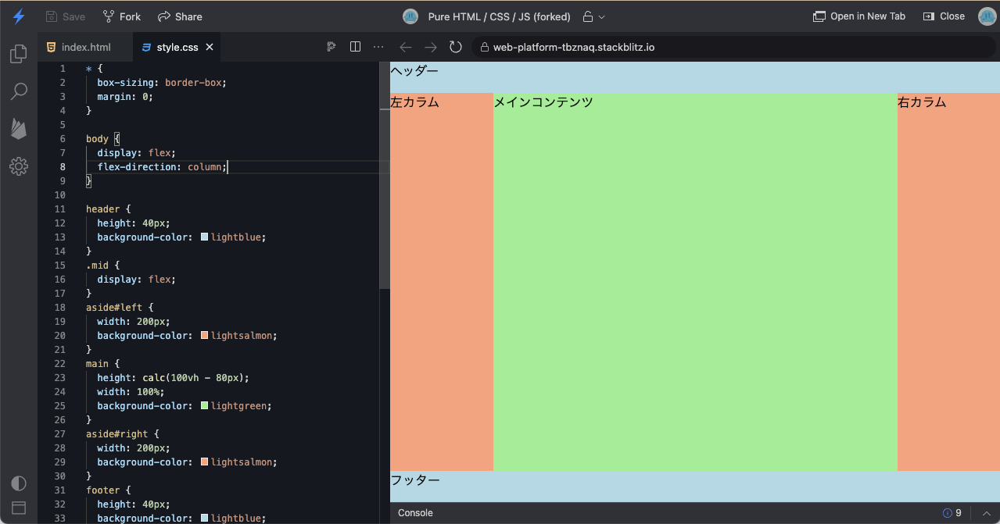

フレックスボックスを使ったレイアウトの面倒なところは、先述の通り、水平方向に要素を並べるか垂直方向に要素を並べるかの*どちらかしかできない*ところです。  
今回の聖杯レイアウトでは、二行目の水平に並んだレイアウトがあり、ヘッダー・フッターにその要素が挟まれているため、二行目を`<div>`要素で囲むことで実現しています。

フレックスボックスにより親しみたいあなたは[FlexBox Floggy](https://flexboxfroggy.com/#ja)に取り組んでみてください。

グリッドレイアウトとフレックスボックス、どちらを利用してレイアウトを実装するかは好みの部分もあります。  
しかし、一般にフレックスボックスのみを使ったレイアウトのほうがHTMLの構造は複雑になりやすいです。  
複雑な文書はパフォーマンスの低下を招くことに注意するべきでしょう。  
かといって、すべてのデザインでgridが優れているわけではないので、あくまでデザインにあった方法で実装するようにしましょう。

## 4. ページに変更を加えよう

ここでは閲覧者の入力に合わせてページの表示を変える方法を説明します。

### 4-1. HTMLでユーザーの入力を受け取ろう

webページは、閲覧者が著者によって提供された情報を一方的に受け取るだけのものではありません。  
以下のようなHTML要素を利用することで閲覧者からの入力を受け取ることができます。

#### 4-1-1. ボタン要素

閲覧者からの入力を受け取るモノの代表がボタンでしょう。webサイトにもよく登場する要素の一つです。  
HTMLではボタン要素は以下のようにして記述できます。

```HTML
<button>ボタンです</button>
<button disabled>無効なボタンです</button>
```

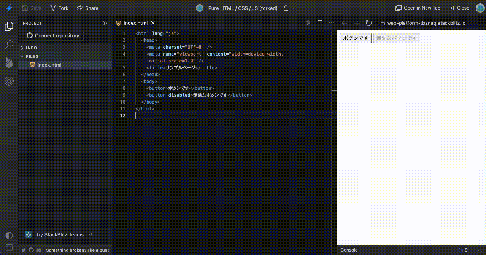

#### 4-1-2. 要素のイベントを処理する

ボタンは置いただけでは何にもなりません。  
閲覧者による入力、例えばクリックを処理するには、JavaScriptを用いて要素のクリックを取得して処理する必要があります。

まずはJavaScriptを記述する`main.js`ファイルを用意してください。  
用意したJavaScriptファイルをHTMLから読み込みます。`index.html`を以下の内容に書き換えてください。

```HTML
<!DOCTYPE html>
<html lang="ja">
  <head>
    <meta charset="UTF-8" />
    <meta name="viewport" content="width=device-width, initial-scale=1.0" />
    <title>サンプルページ</title>
    <script src="main.js" defer></script>
  </head>
  <body>
    <button id="main-button">ボタンです</button>
  </body>
</html>
```

JavaScriptでは以下のようにしてHTML要素を取得できます。

```javascript
document.querySelector("<セレクタ>")
```

`<セレクタ>`にはCSSのセレクタを使えます。これを使って、ボタンがクリックされたときにアラートを出すようにします。  
以下のコードを`main.js`に書き込んでください。

```javascript
const mainButton = document.querySelector('#main-button');

const showAlert = function () {
  window.alert('ボタンがクリックされました。');
}

mainButton.addEventListener('click', showAlert);
```


このように、HTML要素に対して閲覧者が特定の操作をすることを、JavaScriptでは**イベント**として扱います。  
閲覧者がボタンをクリックしたとき、`'click'`イベントが*発火*すると言います。  
この例ではid属性に`main-button`が設定されたボタンに対して、`'click'`イベントの購読を行っていて、イベントが発生したときに処理を行う**イベントハンドラ**に`showAlert`関数を呼び出すように設定しています。

<details>
  <summary>`defer`属性の意味</summary>

  この`<script>`要素に追加した`defer`属性は、文書の解析語にスクリプトを実行するように遅延する意味があります。  
  `defer`属性、`async`属性か、`type="module"`属性を持たない場合、スクリプトは読み込まれた順に即時実行されます。  
  今回はページに表示される要素を取得する必要があり、実行時に要素がない（表示されていない）とエラーになってしまうため、`defer`属性を与えています。

  `async`属性や`type="module"`属性は、`defer`属性とは違った意味を持ちます。詳しくは[mdn web docs](https://developer.mozilla.org/ja/docs/Web/HTML/Element/script#%E5%B1%9E%E6%80%A7)を見てみてください。
</details>

### 4-２. JavaScriptで要素に変更を加えよう

ここでは、操作を受け取って処理した結果を閲覧者に見せるために、JavaScriptで要素に変更を加える方法を説明します。

#### 4-2-1. コンテンツに変更を加えよう

JavaScriptで取得した要素は、様々なプロパティを持つオブジェクト([HTMLElement](https://developer.mozilla.org/ja/docs/Web/API/HTMLElement))です。  
コンテンツを変更するときに使用するプロパティには以下のようなものがあります。

- `innerHTML`
  - 要素内のHTMLタグを**含む**、全てのテキストを扱う
- `innerText`
  - 要素内のHTMLタグを**含まない**、**非表示でない**テキストを扱う
  - `\n`で改行が表現できる
- `textContent`
  - 要素内のHTMLタグを**含まない**、全てのテキストを扱う

今回は`innerText`を用いて、ボタンがクリックされるたびにクリックされた回数をページに追記するページをサンプルに示します。

- HTML

  - ```HTML
      <!DOCTYPE html>
      <html lang="ja">
        <head>
          <meta charset="UTF-8" />
          <meta name="viewport" content="width=device-width, initial-scale=1.0" />
          <title>サンプルページ</title>
          <script src="main.js" defer></script>
        </head>
        <body>
          <button id="main-button">ボタンです</button>
          <p id="messages"></p>
        </body>
      </html>
    ```

- JavaScript

  - ```javascript
      let clickCount = 0;

      const mainButton = document.querySelector('#main-button');
      const messages = document.querySelector('#messages');

      const updateMessage = function () {
        clickCount++;
        messages.innerText += `${clickCount}回クリックされました。\n`;
      };

      mainButton.addEventListener('click', updateMessage);
    ```


#### 4-2-2. 見た目に変更を加えよう

続いて、見た目にも変更を加えて見ましょう。ここでは`style`プロパティを用います。  
以下にサンプルを示します。(HTMLは4-2-1.と同じものです)

```javascript
const colorList = ['pink', 'cyan', 'yellow'];
let clickCount = 0;

const mainButton = document.querySelector('#main-button');
const messages = document.querySelector('#messages');

const updateMessage = function () {
  clickCount++;
  messages.innerText += `${clickCount}回クリックされました。\n`;
  messages.style.backgroundColor = colorList[clickCount % 3];
};

mainButton.addEventListener('click', updateMessage);
```


### 4-3. CSSで要素の変化を魅せよう

最後に説明するのは簡単なCSSでのアニメーション、`transition`プロパティを用いたアニメーションを説明しておきます。  
> 注: 一般にこれをCSSアニメーションとは言いません。  
> CSSアニメーションについては[こちら](https://developer.mozilla.org/ja/docs/Web/CSS/CSS_animations/Using_CSS_animations)を確認してください。

以下にサンプルを示します。この例では、ボタンがクリックされるたびに移動する四角形が、移動時にアニメーションします。

- HTML

  - ```html
      <!DOCTYPE html>
      <html lang="ja">
        <head>
          <meta charset="UTF-8" />
          <meta name="viewport" content="width=device-width, initial-scale=1.0" />
          <title>サンプルページ</title>
          <script src="main.js" defer></script>
          <link rel="stylesheet" href="style.css"/>
        </head>
        <body>
          <button id="main-button">ボタンです</button>
          <div id="field">
            <div id="box">0</div>
          </div>
        </body>
      </html>
    ```

- CSS

  - ```css
      #main-button {
        margin-bottom: 16px;
      }

      #field {
        position: relative;
        width: 300px;
        height: 300px;
        border: 2px solid gray;
      }

      #box {
        position: absolute;
        top: 0px;
        left: 0px;
        width: 100px;
        height: 100px;
        display: grid;
        place-content: center;
        background-color: pink;
        transition: all ease 0.2s;
      }
    ```

- JavaScript

  - ```javascript
      const colorList = ['pink', 'cyan', 'yellow'];
      let clickCount = 0;

      const mainButton = document.querySelector('#main-button');
      const box = document.querySelector('#box');

      const moveBox = function () {
        clickCount++;
        box.textContent = `${clickCount % 4}`;
        box.style.top = [0, 1].includes(clickCount % 4) ? '0px' : '200px';
        box.style.left = [0, 3].includes(clickCount % 4) ? '0px' : '200px';
      };

      mainButton.addEventListener('click', moveBox);
    ```


このサンプルで重要な記述は↓です

```css
  #box {
    ...
    transition: all ease 0.2s;
  }
```

`transition`プロパティは、プロパティと時間を指定することで、指定したプロパティの値が切り替わったときにその変化に指定した時間かけてゆっくり行わせるものです。  
今回は`all`で全てのプロパティに対して変化をゆるやかにするように指定し、変化には`0.2s`かけるよう指定しています。  
`ease`は変化をゆっくりはじめ、中頃は急で、終わりはまたゆっくりになるような変化をするように指定するタイミング関数というものです。他に線形的に変化する`linear`などもあります。

## 5. 終わりに

この記事では、HTML/CSSの初歩からJavaScriptを組み合わせた動的なページの変更までを説明しました。  
この資料では説明しきれていないHTML要素やCSSプロパティも多数あります。  
それらは利用するときに適宜mdn web docsやGoogle検索などのちからを借りて調べながら書いてみてください。

## 6. 参考文献

- mdn web docs
  - html: <https://developer.mozilla.org/ja/docs/Web/html>
  - css: <https://developer.mozilla.org/ja/docs/Web/css>
