# HTML/CSS を始めよう

> 想定時間: 90分
> 動作環境: Google Chrome / [StackBlitz](https://stackblitz.com)

<details>
<summary>目次</summary>

- [HTML/CSS を始めよう](#htmlcss-を始めよう)
  - [1. HTML/CSSを観察してみよう](#1-htmlcssを観察してみよう)
    - [1-1. 開発者ツールを見よう](#1-1-開発者ツールを見よう)
  - [2. ページを作ってみよう](#2-ページを作ってみよう)
    - [2-1. HTMLをはじめよう](#2-1-htmlをはじめよう)
      - [用語](#用語)
    - [2-2. HTMLの基本的な構造を知ろう](#2-2-htmlの基本的な構造を知ろう)
      - [各要素の役割](#各要素の役割)
      - [`<head>` の中身](#head-の中身)
      - [`<body>` を埋めてみよう](#body-を埋めてみよう)
    - [2-3. コンテンツを見やすく書くHTMLを知ろう](#2-3-コンテンツを見やすく書くhtmlを知ろう)
      - [2-3-1. 見出しと段落](#2-3-1-見出しと段落)
      - [2-3-2. 箇条書き（リスト）](#2-3-2-箇条書きリスト)
      - [2-3-3. 強調と重要](#2-3-3-強調と重要)
    - [2-4. 画像を利用しよう](#2-4-画像を利用しよう)
    - [2-5. リンクを貼ろう](#2-5-リンクを貼ろう)
    - [2-6. ページレイアウトとHTML要素](#2-6-ページレイアウトとhtml要素)
    - [2-7. 何でもない便利要素 `<div>`](#2-7-何でもない便利要素-div)
  - [3. レイアウトとデザインを考えよう](#3-レイアウトとデザインを考えよう)
    - [3-1. CSSを始めよう](#3-1-cssを始めよう)
    - [3-2. ボックスモデルと `box-sizing`](#3-2-ボックスモデルと-box-sizing)
    - [3-3. スタイルシートの種類と優先度](#3-3-スタイルシートの種類と優先度)
    - [3-4. セレクタ](#3-4-セレクタ)
      - [3-4-1. 基本セレクタと結合子](#3-4-1-基本セレクタと結合子)
      - [3-4-2. 疑似表記](#3-4-2-疑似表記)
    - [3-5. 思いどおりの見た目を作ろう](#3-5-思いどおりの見た目を作ろう)
      - [3-5-1. CSSカスタムプロパティ](#3-5-1-cssカスタムプロパティ)
      - [3-5-2. 文字の見た目](#3-5-2-文字の見た目)
      - [3-5-3. 要素の見た目](#3-5-3-要素の見た目)
      - [3-5-4. 形をつくろう](#3-5-4-形をつくろう)
    - [3-6. 思いどおりに配置しよう](#3-6-思いどおりに配置しよう)
      - [3-6-1. グリッドレイアウト](#3-6-1-グリッドレイアウト)
      - [3-6-2. フレックスボックス](#3-6-2-フレックスボックス)
      - [グリッドとフレックスのどちらを使うか](#グリッドとフレックスのどちらを使うか)
  - [4. ページに変更を加えよう](#4-ページに変更を加えよう)
    - [4-1. HTMLでユーザーの入力を受け取ろう](#4-1-htmlでユーザーの入力を受け取ろう)
      - [4-1-1. ボタン要素](#4-1-1-ボタン要素)
      - [4-1-2. 要素のイベントを処理する](#4-1-2-要素のイベントを処理する)
    - [4-2. JavaScriptで要素に変更を加えよう](#4-2-javascriptで要素に変更を加えよう)
      - [4-2-1. コンテンツの変更](#4-2-1-コンテンツの変更)
      - [4-2-2. 見た目の変更](#4-2-2-見た目の変更)
    - [4-3. CSSで要素の変化を魅せよう](#4-3-cssで要素の変化を魅せよう)
  - [5. 発展: VisBugを使ってみよう](#5-発展-visbugを使ってみよう)
  - [6. 終わりに](#6-終わりに)
  - [7. 参考文献](#7-参考文献)

</details>

---

## 1. HTML/CSSを観察してみよう

Web開発では `HTML` / `CSS` / `JavaScript` の3つをよく使います。まずはブラウザ上でそれらを観察するところから始めましょう。

### 1-1. 開発者ツールを見よう

ブラウザ右上のメニューから「その他のツール」→「デベロッパーツール」で開発者ツールを開きます。

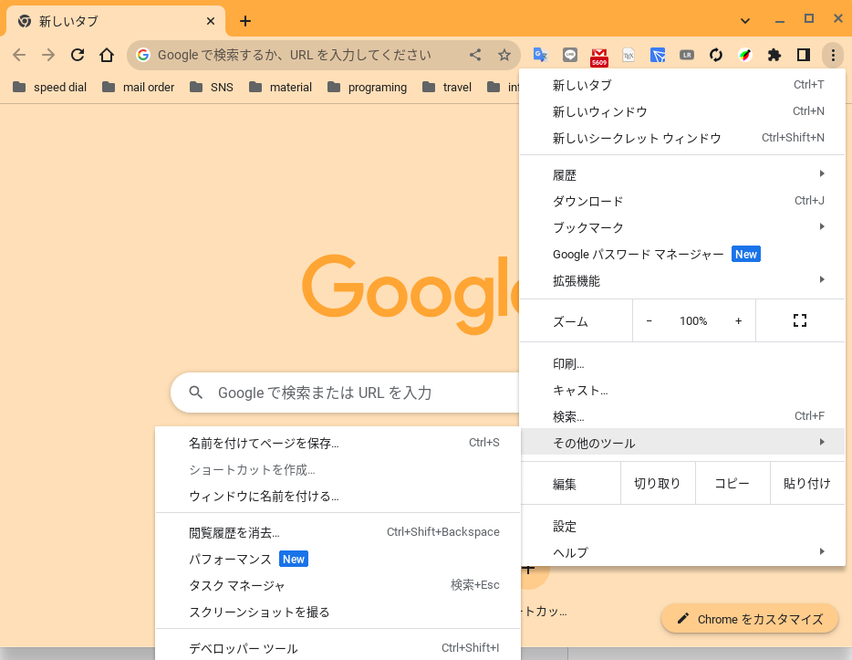

主に使うタブは以下の3つです。

| タブ | 用途 |
| ---- | ---- |
| Elements (要素) | ページの要素ツリーを表示・編集します。左上の選択ツールでページ上の要素を選べます。 |
| Styles (スタイル) | 選択した要素に適用されているCSSを確認・書き換えできます。 |
| Computed (計算済み) | 選択した要素の最終的な大きさ（margin / border / padding / content）を表示します。 |

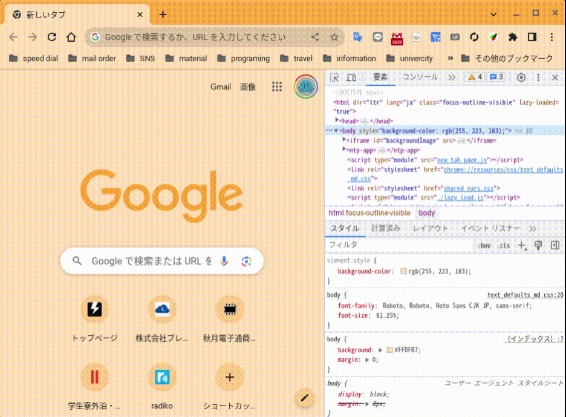
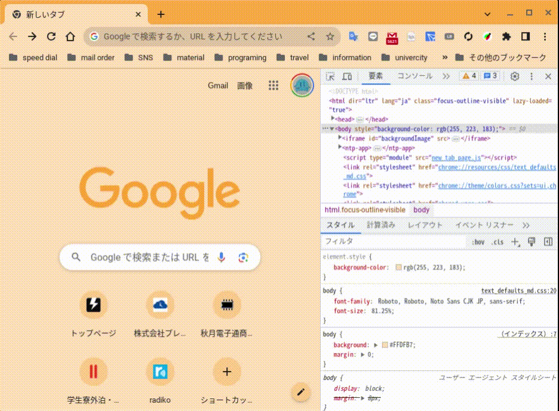


#### 発展: 各タブの使い分け

- **Elements** は「HTMLの構造を確認・実験する」ための場所です。ここでの変更はページに即時反映されますが、リロードすると元に戻ります。気軽に試して構いません。
- **Styles** は「あるセレクタからどのプロパティが効いているか／打ち消されているか」を確認できます。取り消し線が引かれているプロパティは、他のスタイル指定に優先度で負けています。
- **Computed** は「最終的に何pxになっているか」を見るのに便利です。意図しない余白や境界線が入っていないかをここで確認できます。

## 2. ページを作ってみよう

ここからは [StackBlitz](https://stackblitz.com/?starters=vanilla) を使います。GitHubアカウントでログインし、New Project → Vanilla タブの **Static** を選びます。`index.html` / `package.json` / `package-lock.json` の3ファイルだけ残して他は削除しておきましょう。

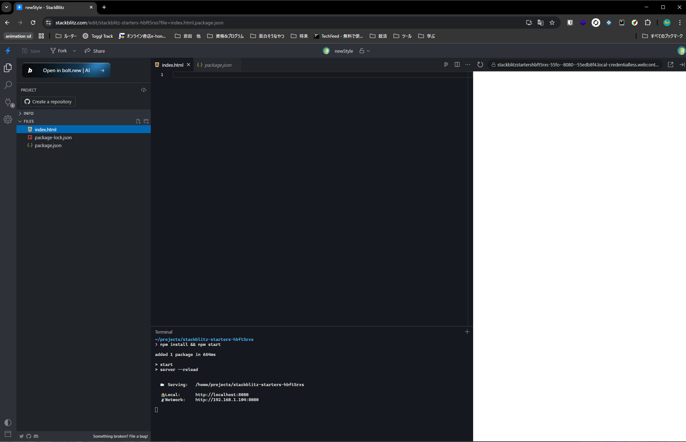

### 2-1. HTMLをはじめよう

`index.html` を空にして、以下を書きます。

```html
Hello, World !
```

次に `<h1>` で囲みます。

```html
<h1>Hello, World !</h1>
```

文字が大きくなります。

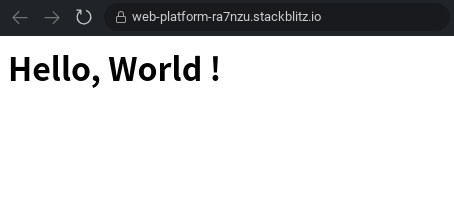

#### 用語

| 用語 | 説明 |
| ---- | ---- |
| タグ | `<h1>` や `</h1>` のような記述。開始タグ / 終了タグがあります。 |
| 要素 | 開始タグから終了タグまでを含む全体。 |
| マークアップ | 文字列をタグで囲んで意味付けすること。 |

`h1` は heading（見出し）の h で、最も重要な見出しを表します。

#### 発展: マークアップすると何が嬉しい？

文字列をタグで囲むと、ブラウザは「これは見出しだ」「これは段落だ」と内容を解釈できるようになります。その結果、以下のような恩恵が得られます。

- ブラウザが意味に合わせた既定の見た目（見出しは大きく太く、など）を適用する。
- スクリーンリーダーが文書構造を読み上げられる。
- 検索エンジンが文書の構造を理解できる。

「見た目を変える」だけが目的ではなく、「意味を伝える」のがマークアップの本質です。

### 2-2. HTMLの基本的な構造を知ろう

実用的なHTMLは以下のような構造で書きます。

```html
<!DOCTYPE html>
<html lang="ja">
  <head>
    <meta charset="UTF-8" />
    <meta name="viewport" content="width=device-width, initial-scale=1.0" />
    <title>サンプルページ</title>
  </head>
  <body>
    <h1>Hello, World !</h1>
  </body>
</html>
```

2-1のコードと比べて表示が少し変わります。1行ずつコメントアウト（StackBlitzでは `Ctrl`+`/`、HTMLでは `<!-- -->` で囲む）して挙動を確認してみましょう。

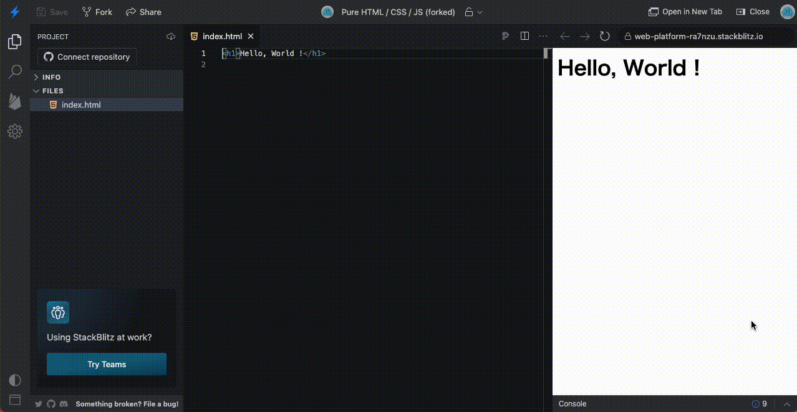

#### 各要素の役割

| 要素 | 役割 |
| ---- | ---- |
| `<!DOCTYPE html>` | 文書型定義。HTMLであることをブラウザに伝えます。これがないと表示が崩れることがあります。 |
| `<html>` | ルート要素。子に `<head>` と `<body>` を1つずつ持ちます。 |
| `<head>` | 閲覧者に直接見せないメタ情報を入れます。 |
| `<body>` | ページに表示されるすべてのコンテンツを入れます。 |

`<html lang="ja">` のように、タグの中に書く設定を **属性** と呼びます。`lang="ja"` はページが日本語で書かれていることを示します。

#### 発展: なぜ `<!DOCTYPE html>` が必要なの？

ブラウザには「標準モード」と「互換モード（quirks mode）」という2つの解釈モードがあります。`<!DOCTYPE html>` がないと、ブラウザは古いHTMLとの互換性を保つために互換モードで動き、CSSの解釈などが微妙に変わってしまいます。

現代のWeb開発ではほぼ常に標準モードで動かしたいので、HTMLファイルの先頭には必ず `<!DOCTYPE html>` を書きます。

#### `<head>` の中身

| 要素 | 役割 |
| ---- | ---- |
| `<meta charset="UTF-8">` | 文書の文字セットを指定します。 |
| `<meta name="viewport" ...>` | スマホ等での表示領域の指定です。 |
| `<title>` | ブラウザのタブに表示されるタイトルです。 |
| `<script>` / `<style>` / `<link>` | JavaScript / CSS の埋め込みや外部リソース参照に使います。 |

#### `<body>` を埋めてみよう

```html
<body>
  <h1>Hello, World !</h1>
  <h2>自己紹介</h2>
  <ul>
    <li>名前: <strong><!-- あなたの名前 --></strong></li>
    <li>出身校: <!-- あなたの出身校 --></li>
    <li>
      好きな食べ物ランキング:
      <ol>
        <li><!-- 好きなもの1位 --></li>
        <li><!-- 好きなもの2位 --></li>
        <li><!-- 好きなもの3位 --></li>
      </ol>
    </li>
  </ul>
</body>
```

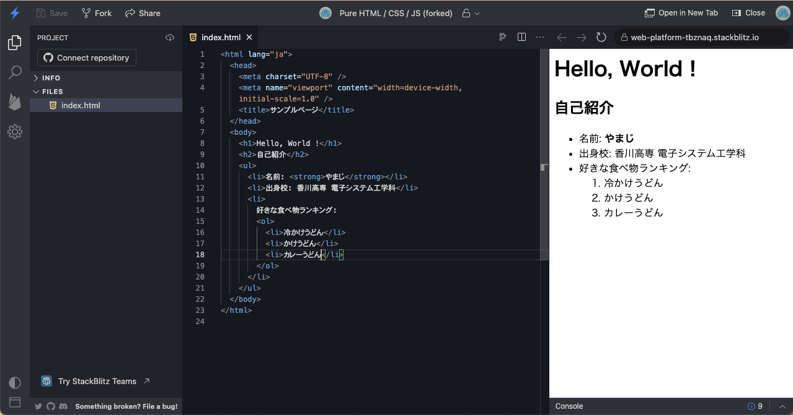

<details>
<summary>HTMLにおける親子・兄弟・子孫</summary>

| 関係 | 説明 |
| ---- | ---- |
| 子 | ある要素に入れ子で含まれる要素。 |
| 親 | ある要素を直接囲んでいる要素。 |
| 兄弟 | 同じ親を持つ要素同士。 |
| 子孫 | 子の子、そのまた子…と続く、階層が下にあるすべての要素。 |

この資料で頻出する表現なので覚えておくとよいでしょう。

</details>

### 2-3. コンテンツを見やすく書くHTMLを知ろう

#### 2-3-1. 見出しと段落

見出しは `<h1>` 〜 `<h6>` の6段階。`<p>` は段落を表します。

```html
<h1>Windowsでコンピューターの世界が広がります。</h1>
<h2>Windowsでコンピューターの世界が広がります。</h2>
<h3>Windowsでコンピューターの世界が広がります。</h3>
<h4>Windowsでコンピューターの世界が広がります。</h4>
<h5>Windowsでコンピューターの世界が広がります。</h5>
<h6>Windowsでコンピューターの世界が広がります。</h6>
<span>Windowsでコンピューターの世界が広がります。</span>
```

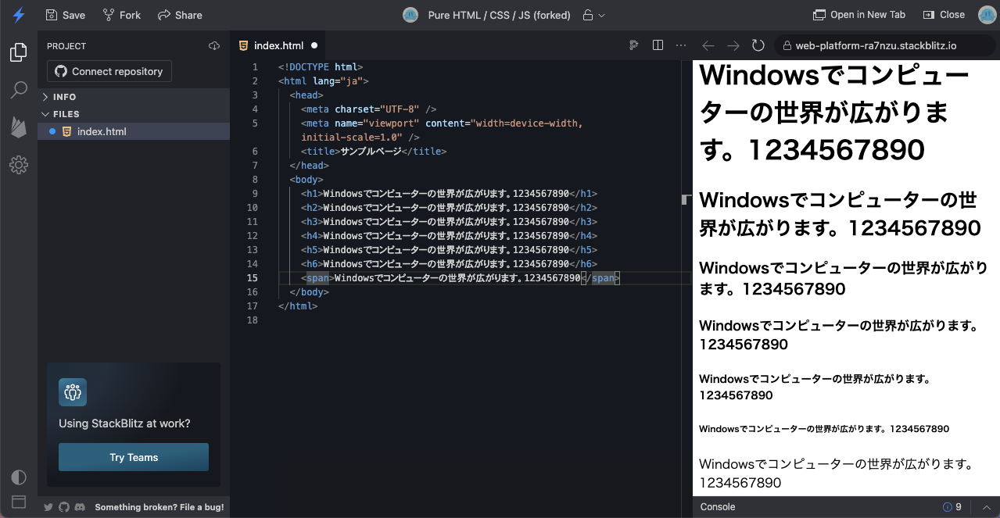

> `<span>` はコンテンツを囲むだけで意味を持たない要素です。比較用に並べました。

見出しを使う上でのポイント:

- `<h1>` はページに1つだけが望ましいです。
- 階層を飛ばさないようにしましょう（`<h3>` の下に `<h2>` を入れたりしない）。
- 本文中の見出しは3段階程度に抑えるのが読みやすいです。

##### 発展: なぜこのルールがあるの？

見出し要素は、文書の階層構造をブラウザや支援技術（スクリーンリーダーなど）に伝える役割を持っています。

- `<h1>` が複数あると、文書の「主題」が複数あることになり、読み上げ時や検索エンジンの解釈で混乱が生じます。
- 階層を飛ばすと、本来「節の中に項」と読まれるべき構造が崩れます。
- 大きすぎる階層は文書として扱いづらいので、部レベルが必要なときはページそのものを分割することを考えましょう。

#### 2-3-2. 箇条書き（リスト）

| 要素 | 用途 |
| ---- | ---- |
| `<ul>` + `<li>` | 順序のない箇条書き |
| `<ol>` + `<li>` | 順序のある箇条書き |

```html
<ul>
  <li>かけうどん</li>
  <li>しょうゆうどん</li>
  <li>ぶっかけうどん</li>
</ul>
```

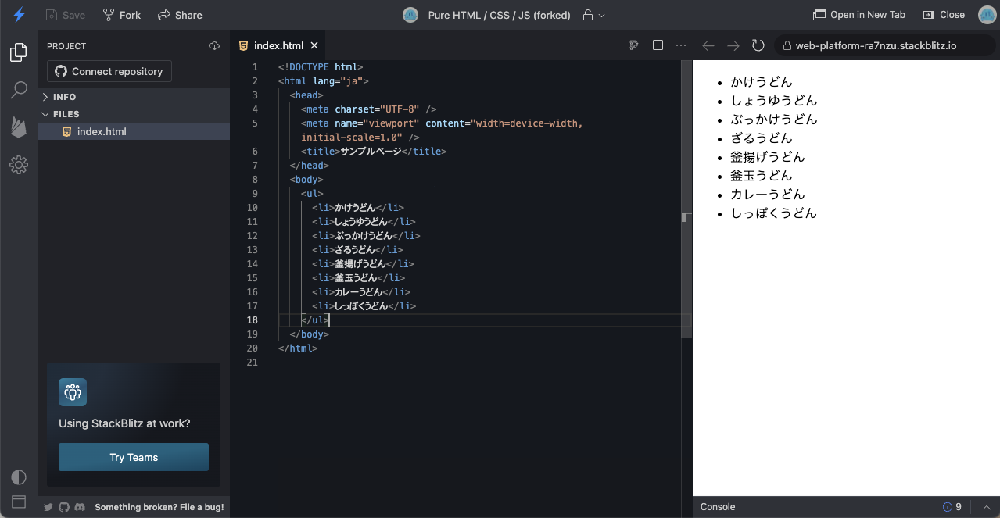

```html
<strong>私の好きなうどんメニュー</strong>
<ol>
  <li>かけうどん</li>
  <li>しっぽくうどん</li>
  <li>ぶっかけうどん</li>
</ol>
```

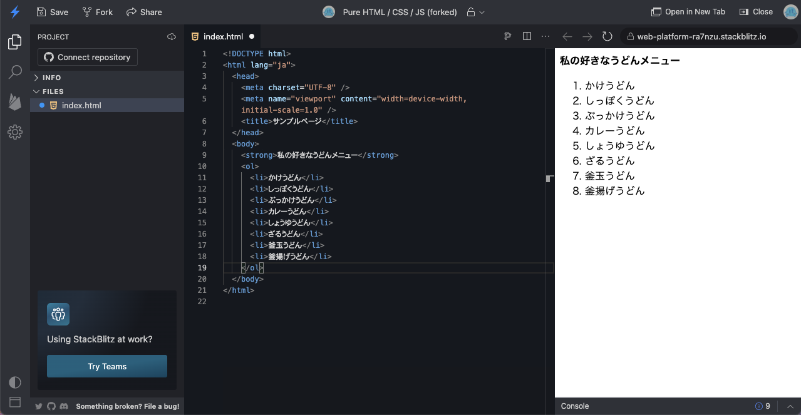

リストはネストできます。

```html
<ul>
  <li>
    材料(3〜4人前):
    <ul>
      <li>小麦粉: 400 g</li>
      <li>塩: 20 g</li>
      <li>水: 200 ml</li>
    </ul>
  </li>
  <li>
    作り方
    <ol>
      <li>塩水を作ります。</li>
      <li>小麦粉に加えて混ぜます。</li>
      <li>こねて寝かせます。</li>
    </ol>
  </li>
</ul>
```

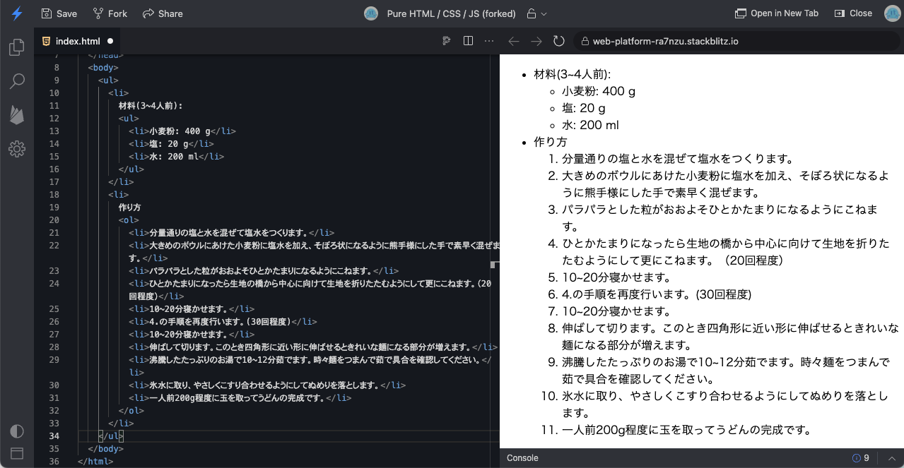

#### 2-3-3. 強調と重要

| 要素 | 意味 | 既定の表示 |
| ---- | ---- | ---- |
| `<em>` | 強調 | 斜体 |
| `<strong>` | 重要 | 太字 |

見た目だけが目的なら `<span>` + CSS を使いましょう。

```html
<p>
  「日本で <em>一番</em> 高い山は富士山ですが、」<br>
  → 「一番」が強調されているので、対の問いは「二番目に高い山は？」になります。
</p>
```

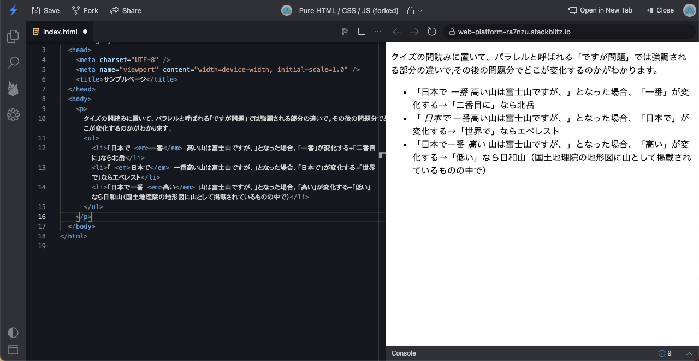

```html
<p><strong>静的型付け</strong>、私の好きな言葉です。</p>
```

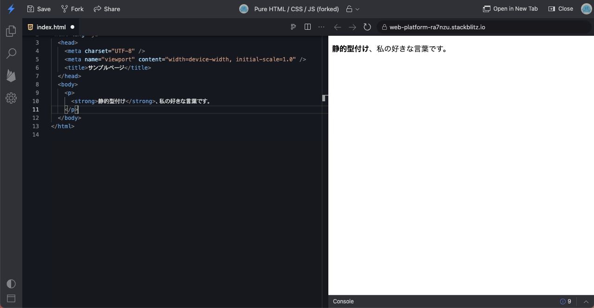

##### 発展: なぜ「見た目だけが目的なら `<span>` + CSS」？

`<em>` や `<strong>` は「強調」「重要」という **意味** を持つ要素です。スクリーンリーダーは `<strong>` で囲まれた箇所を強めに読み上げたりします。

ただ太字や斜体にしたいだけの理由でこれらを使うと、本来重要でない箇所が支援技術によって強調されてしまいます。見た目だけを変えたい場合は、意味のない `<span>` に CSS で `font-weight: bold` や `font-style: italic` を適用するのが適切です。

### 2-4. 画像を利用しよう

`` の `src` 属性に画像のパスを指定します。

```html
<!-- 絶対パス -->


<!-- 相対パス -->

```

| 属性 | 役割 |
| ---- | ---- |
| `src` | 画像のパス。外部リソースは絶対パス、サイト内は相対パスを使います。 |
| `alt` | 画像が表示できないときの代替テキスト。読み上げ機能でも利用されます。 |

> 【Try】GitHubのプロフィールアイコン画像を2種類の方法で表示してみましょう。

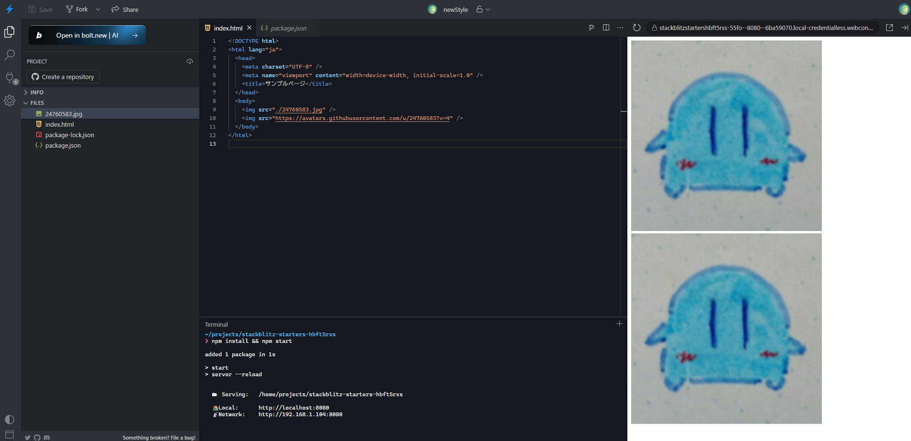

<details>
<summary>空要素</summary>

`` のように開始タグだけで完結する要素を **空要素** と呼びます。

</details>

### 2-5. リンクを貼ろう

```html
<a href="https://jig.jp">株式会社 jig.jp ホームページ</a>
```

| 属性 | 役割 |
| ---- | ---- |
| `href` | リンク先URL |
| `target="_blank"` | 新しいタブで開く |

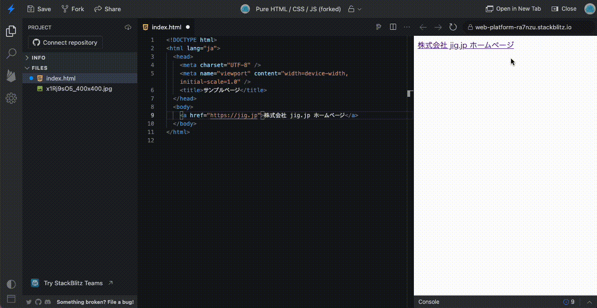

### 2-6. ページレイアウトとHTML要素

よく見るwebサイトはこんなレイアウトをしています（**聖杯レイアウト**）。

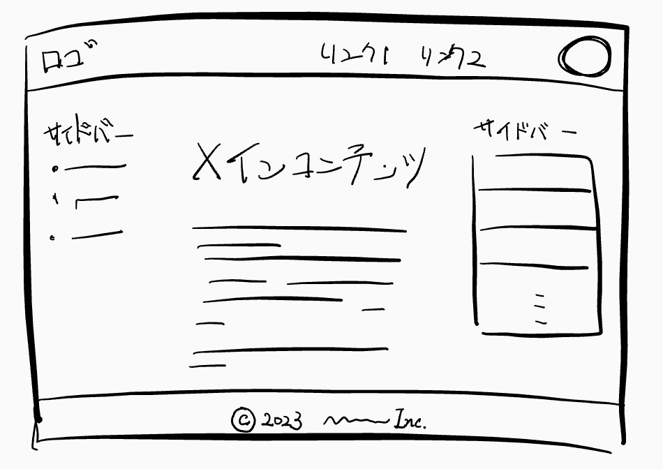
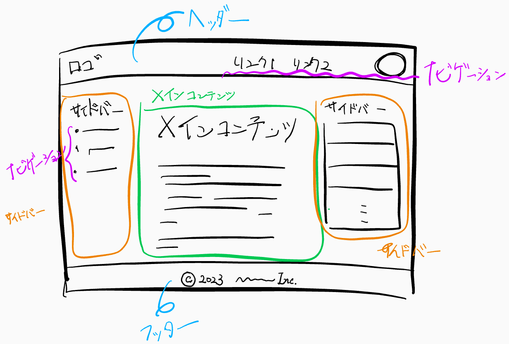

| 役割 | 要素 |
| ---- | ---- |
| ヘッダー | `<header>` |
| サイドバー | `<aside>` |
| メインコンテンツ | `<main>` |
| フッター | `<footer>` |
| ナビゲーション | `<nav>` |

これらを適切に使うとアクセシビリティが上がります。

### 2-7. 何でもない便利要素 `<div>`

`<div>` 自体は何の意味も持ちません。要素をひとまとめにしてCSSで装飾するための入れ物として使います。文字列版が `<span>` だと思えばよいでしょう。

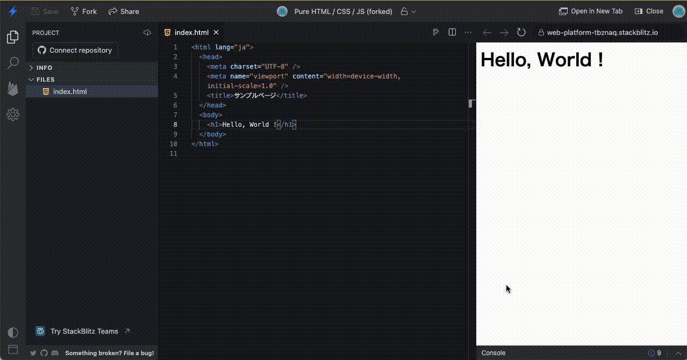

---

## 3. レイアウトとデザインを考えよう

### 3-1. CSSを始めよう

CSSはHTMLの見た目（文字サイズ・色・配置など）を指定する言語です。

まず `index.html` を以下にしておきます。

```html
<!DOCTYPE html>
<html lang="ja">
  <head>
    <meta charset="UTF-8" />
    <meta name="viewport" content="width=device-width, initial-scale=1.0" />
    <title>Blog</title>
    <link rel="stylesheet" href="style.css" />
  </head>
  <body>
    <h1>Hello, World !</h1>
  </body>
</html>
```

`style.css` を新規作成して以下を書きます。

```css
h1 {
  color: red;
}
```

「Hello, World !」が赤くなれば成功です。

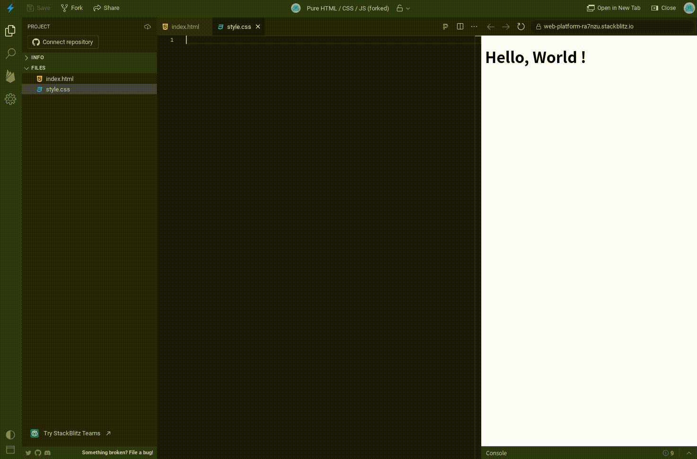

| 名称 | 役割 | 例 |
| ---- | ---- | ---- |
| セレクタ | 適用対象の要素を指定 | `h1` |
| プロパティ | 設定する項目 | `color` |
| 値 | プロパティの設定値 | `red` |

### 3-2. ボックスモデルと `box-sizing`

CSSで扱うすべての要素は四角形（ボックス）の領域を持ちます。

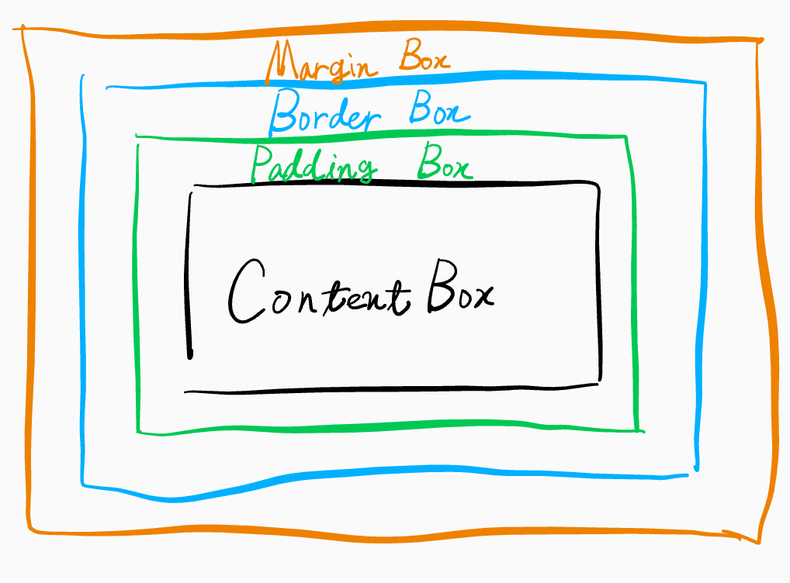

| 領域 | プロパティ | 内容 |
| ---- | ---- | ---- |
| Margin Box | `margin` | 要素間の余白 |
| Border Box | `border` | 境界線 |
| Padding Box | `padding` | 要素内側の余白 |
| Content Box | — | コンテンツ本体 |

額縁に入れた絵に例えると分かりやすいです。

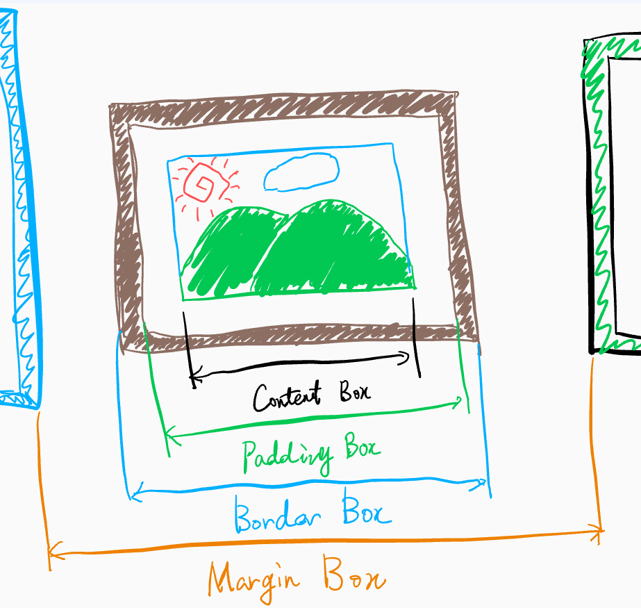

`width` / `height` がどの領域のサイズを指すかは `box-sizing` で切り替えられます。

| 値 | `width`/`height` の対象 |
| ---- | ---- |
| `content-box`（既定） | Content Box |
| `border-box` | Border Box |

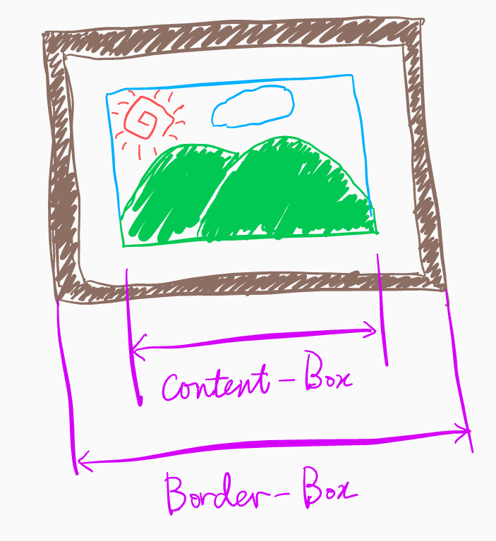

実用上は `border-box` のほうが直感的なので、全称セレクタで一括指定するのが一般的です。

```css
* {
  box-sizing: border-box;
}
```

#### 発展: なぜ `border-box` のほうが直感的？

`content-box` だと、`width: 100px` と指定した要素に `padding: 10px` を足すと、ボックス全体の幅は `120px` になります。境界線も加わるとさらに広がります。

これだと「100pxの幅で並べたい」と思っても、padding を足した瞬間にレイアウトが崩れます。

`border-box` を使えば、`width: 100px` は **境界線まで含めた最終的な幅** を指すので、padding を増やしても外枠のサイズは変わらず、レイアウトが安定します。

<details>
<summary>margin の相殺について</summary>

兄弟要素同士の `margin` や、親子の `margin-top` / `margin-bottom` 同士は **相殺** されます（大きい方が採用される）。

例えば A に `margin-bottom: 16px`、B に `margin-top: 32px` を指定すると、A と B の間隔は `48px` ではなく `32px` になります。

このため、要素間の間隔は「上下両方」ではなく「上だけ」「下だけ」と片方に揃えて指定するとわかりやすくなります。詳細は [MDN: マージンの相殺の習得](https://developer.mozilla.org/ja/docs/Web/CSS/CSS_box_model/Mastering_margin_collapsing) を参照してください。

</details>

### 3-3. スタイルシートの種類と優先度

| 種類 | 概要 | 優先度 |
| ---- | ---- | ---- |
| UAスタイルシート | ブラウザが持つデフォルトのスタイル | 低 |
| オーサースタイルシート | 開発者が書くスタイル | 中 |
| ユーザースタイルシート | 閲覧者が設定するスタイル（拡大表示など） | 高 |

`<h1>` がデフォルトで大きいのはUAスタイルシートのおかげです。開発者のCSSはUAスタイルシートを上書きできます。

<details>
<summary>もう少し詳しく: UAスタイルシートの例</summary>

たとえば Chrome のUAスタイルシートでは、`<h1>` 要素には `font-size: 2em; font-weight: bold; margin: 0.67em 0;` といったスタイルが既に当たっています。

これがあるおかげで、CSSを一切書かなくても見出しは見出しらしく表示されます。一方で、サイト全体で見た目を統一したいときは、このデフォルトが邪魔になることもあります。

そんなときに **CSSリセット**（normalize.css や Tailwind の preflight など）を使ってUAスタイルシートの差異を平らにします。

</details>

### 3-4. セレクタ

#### 3-4-1. 基本セレクタと結合子

| セレクタ | 表記 | 対象 |
| ---- | ---- | ---- |
| 全称セレクタ | `*` | すべての要素 |
| 要素型セレクタ | `h1` | 指定要素 |
| クラスセレクタ | `.class-name` | `class="class-name"` の要素 |
| IDセレクタ | `#id-name` | `id="id-name"` の要素（重複不可） |
| 属性セレクタ | `[attr]` / `[attr=value]` | 指定属性を持つ要素 |
| グループ化 | `header, footer` | 複数セレクタの和 |

| 結合子 | 表記 | 意味 |
| ---- | ---- | ---- |
| 子孫結合子 | `p span`（スペース） | `<p>` の子孫の `<span>` |
| 子結合子 | `p > span` | `<p>` の直接の子の `<span>` |

詳しくは [MDN: CSSセレクタ](https://developer.mozilla.org/ja/docs/Web/CSS/CSS_selectors#%E7%B5%90%E5%90%88%E5%AD%90)。

#### 3-4-2. 疑似表記

HTMLに書かれていない情報（ホバー状態など）も使って要素を選択できます。

| 種類 | 表記 | 例 |
| ---- | ---- | ---- |
| 擬似クラス | `:hover` など | `.reaction:hover` |
| 疑似要素 | `::first-letter` など | `p::first-letter` |

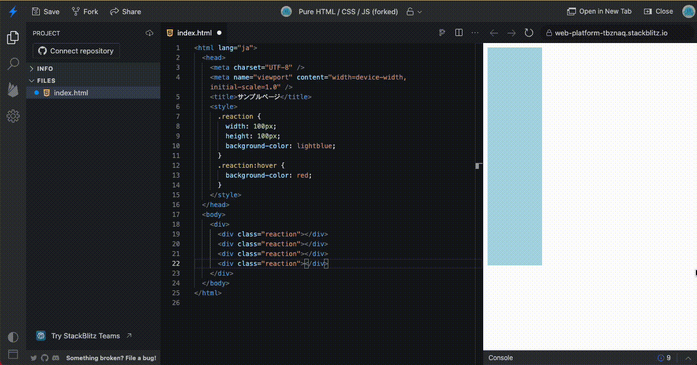
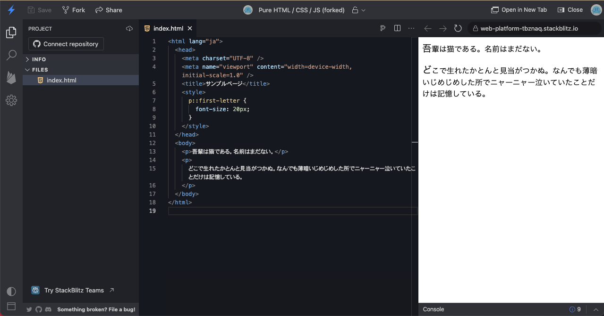

### 3-5. 思いどおりの見た目を作ろう

#### 3-5-1. CSSカスタムプロパティ

JavaScript の定数のように使える仕組みです。プロパティ名は `--` で始めます。

```css
:root {
  --color-greeting: #668844;
}

h1 {
  color: var(--color-greeting);
}
```

`:root` はルート要素を指す擬似クラスです。ここで宣言すると文書全体から使えるようになります。

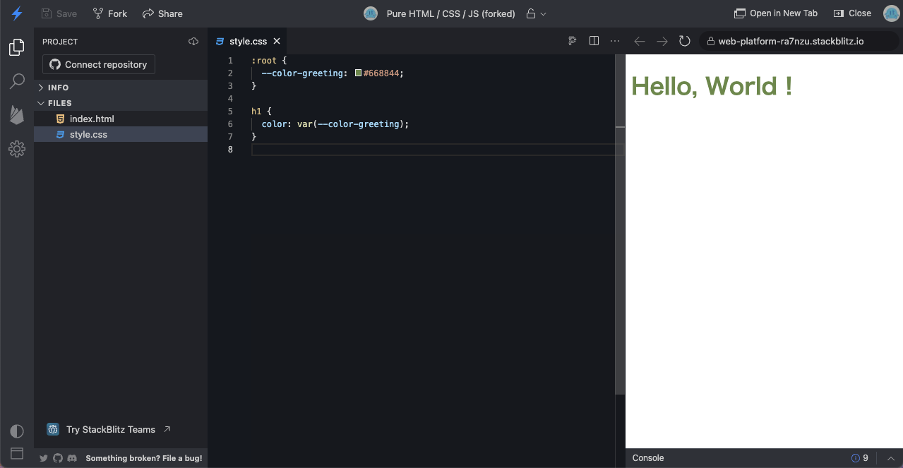

##### 発展: カスタムプロパティを使うと何が嬉しい？

- **意味を名前で伝えられる**: `#668844` よりも `--color-greeting` の方が読み手にとって意図が分かりやすいです。
- **一括変更がラク**: 色を全体的に変えたいとき、`:root` の宣言1箇所を直すだけで済みます。
- **テーマ切り替えに使える**: ダークモード用に `:root` の値を上書きするだけでテーマを切り替えられます。

#### 3-5-2. 文字の見た目

| プロパティ | 影響箇所 | 実行結果 |
| ---- | ---- | ---- |
| `color` | 色 | 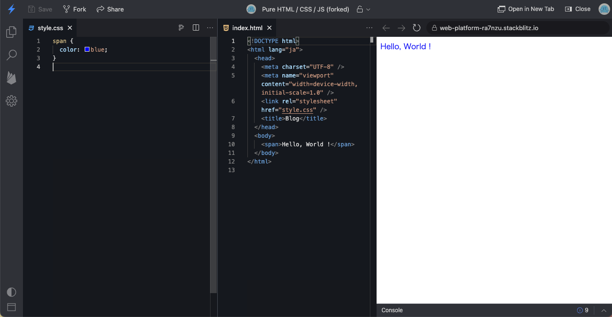 |
| `font-size` | 大きさ | 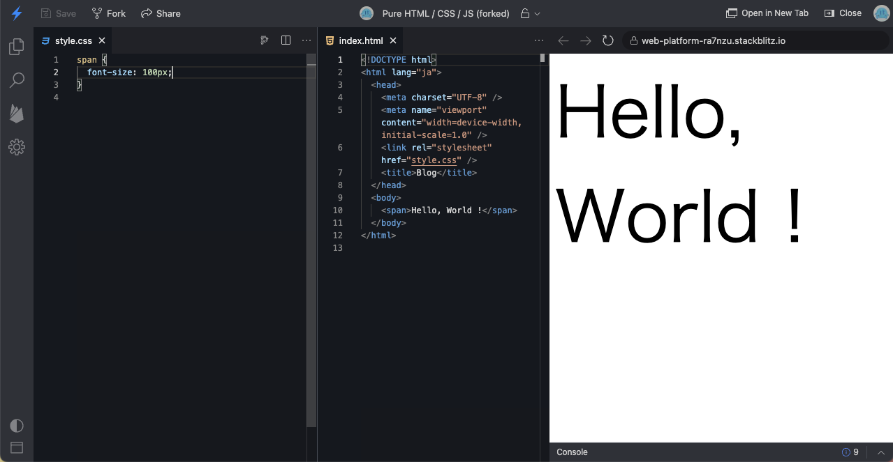 |
| `font-weight` | 太さ |  |
| `font-style` | 斜体 | 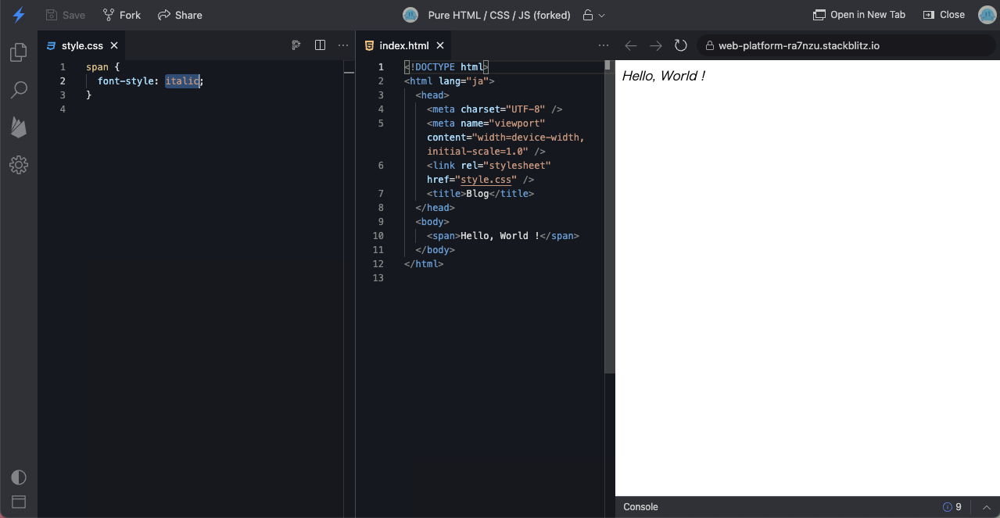 |
| `text-decoration` | 線 | 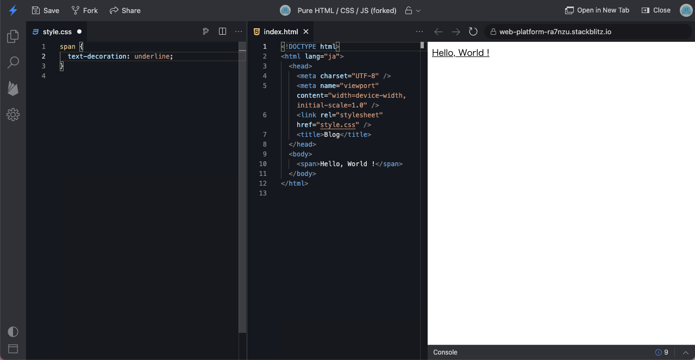 |
| `font-family` | フォント |  |

#### 3-5-3. 要素の見た目

| プロパティ | 影響箇所 | 実行結果 |
| ---- | ---- | ---- |
| `background-color` | 背景色 | 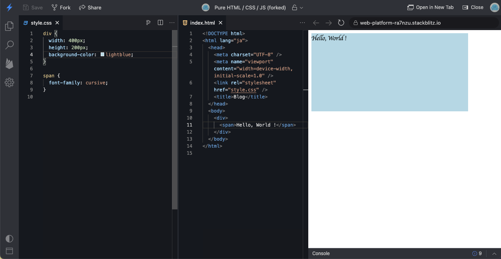 |
| `background-image` | 背景画像 | 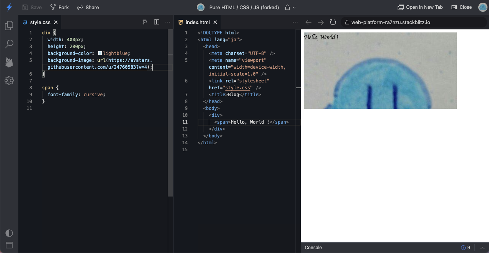 |
| `background-size` | 背景画像の大きさ | 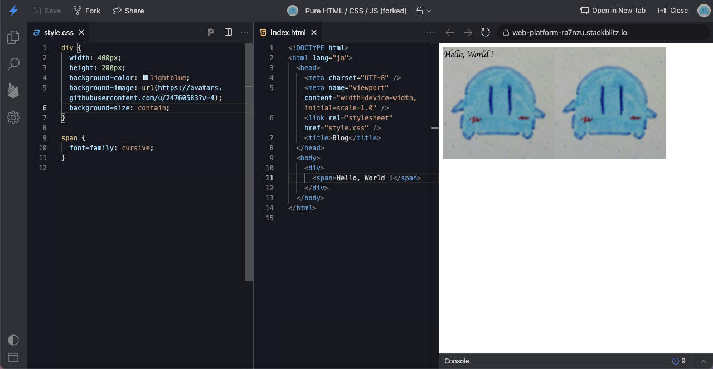 |
| `background-repeat` | 背景画像の繰り返し | 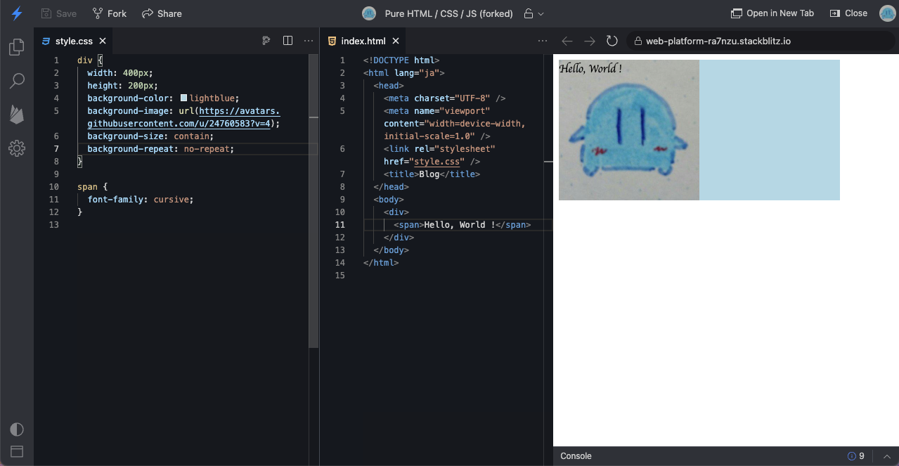 |
| `background-position` | 背景画像の位置 | 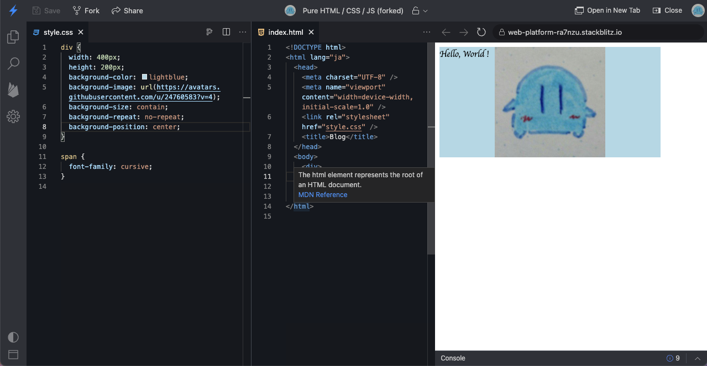 |
| `background-blend-mode` | 背景色と背景画像の混色 | 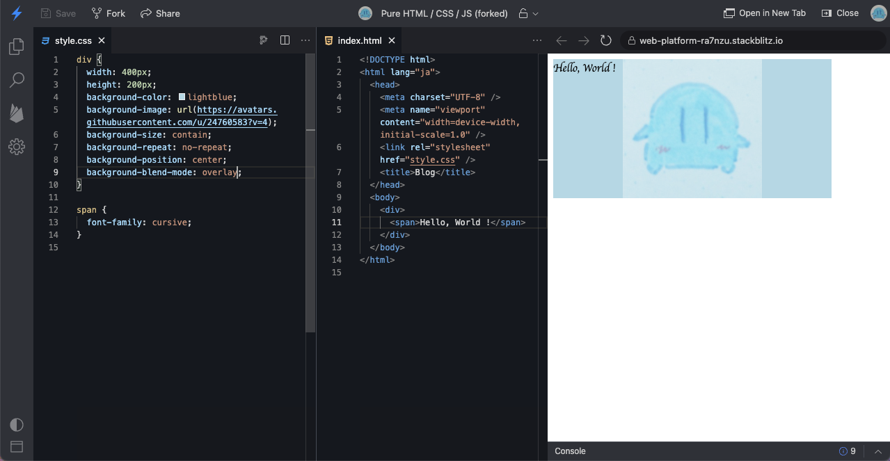 |
| `border` | 境界線 | 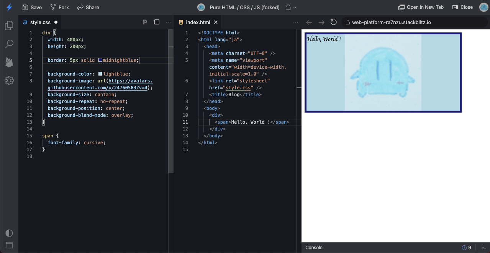 |
| `border-radius` | 角の丸め | 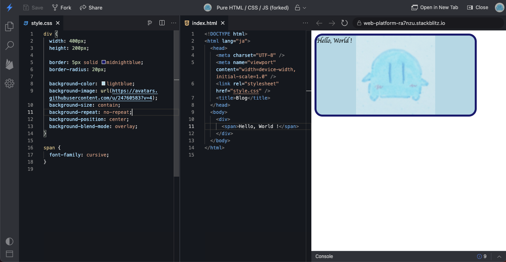 |

詳細は [MDN web docs](https://developer.mozilla.org/ja/docs/Web/CSS) や検索を活用してください。

#### 3-5-4. 形をつくろう

CSSで作れる形のサンプルです。

<details>
<summary>楕円 / 角丸四角形 / 吹き出し のサンプルCSS</summary>

```css
/* 楕円 */
div {
  width: 300px;
  height: 200px;
  background-color: lightblue;
  border-radius: 50%;
}
```

```css
/* 角丸四角形 */
div {
  width: 300px;
  height: 200px;
  background-color: lightblue;
  border-radius: 100vh;
}
```

```css
/* 吹き出し */
* { box-sizing: border-box; }

div {
  width: 300px;
  height: 200px;
  position: relative;
  background-color: #add8e6;
  border: 5px solid midnightblue;
  border-radius: 20px;
}

div::before {
  box-sizing: border-box;
  content: '';
  position: absolute;
  top: 195px;
  left: 20px;
  border: 10px solid;
  border-color: midnightblue transparent transparent transparent;
}

div::after {
  box-sizing: border-box;
  content: '';
  position: absolute;
  top: 190px;
  left: 22px;
  border: 8px solid;
  border-color: lightblue transparent transparent transparent;
}
```

</details>

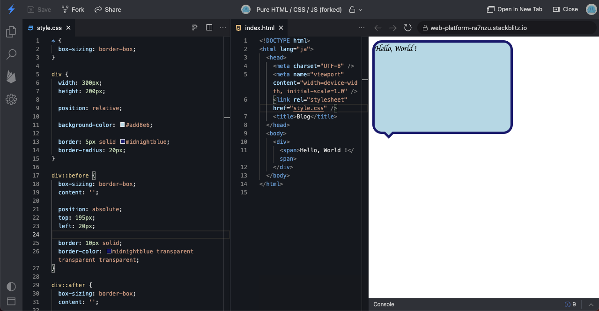

### 3-6. 思いどおりに配置しよう

レイアウトの主役は **グリッドレイアウト** と **フレックスボックス** の2つです。
以下のHTMLに対して、両方の方法で聖杯レイアウトを実装してみます。

```html
<body>
  <header><p>ヘッダー</p></header>
  <aside id="left"><p>左カラム</p></aside>
  <main><p>メインコンテンツ</p></main>
  <aside id="right"><p>右カラム</p></aside>
  <footer><p>フッター</p></footer>
</body>
```

#### 3-6-1. グリッドレイアウト

`display: grid` で有効化します。行・列の2次元レイアウトです。

```css
* { box-sizing: border-box; margin: 0; }

body {
  display: grid;
  grid-template:
    'header header header' 40px
    'left main right' auto
    'footer footer footer' 40px / 200px auto 200px;
}

header { grid-area: header; background-color: lightblue; }
aside#left { grid-area: left; background-color: lightsalmon; }
main { grid-area: main; height: calc(100vh - 80px); background-color: lightgreen; }
aside#right { grid-area: right; background-color: lightsalmon; }
footer { grid-area: footer; background-color: lightblue; }
```

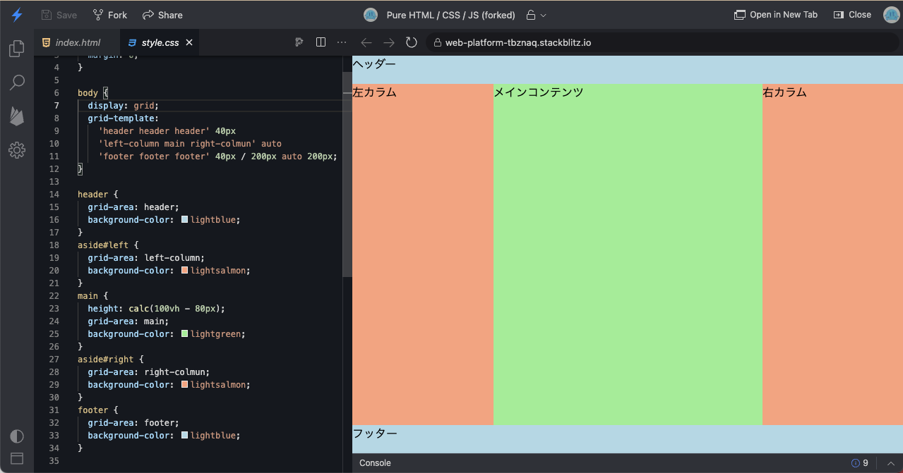

| プロパティ | 役割 |
| ---- | ---- |
| `display: grid` | 子要素にグリッドレイアウトを適用 |
| `grid-template` | `grid-template-areas` / `-rows` / `-columns` の一括指定 |
| `grid-area` | `grid-template-areas` のどの領域に置くか指定 |

練習用ゲーム: [Grid Garden](https://cssgridgarden.com/#ja)

#### 3-6-2. フレックスボックス

`display: flex` で有効化します。1次元（行 or 列）のレイアウトです。

聖杯レイアウトのような2次元構造はネストして表現する必要があるため、中段を `<div class="mid">` で囲みます。

```html
<body>
  <header><p>ヘッダー</p></header>
  <div class="mid">
    <aside id="left"><p>左カラム</p></aside>
    <main><p>メインコンテンツ</p></main>
    <aside id="right"><p>右カラム</p></aside>
  </div>
  <footer><p>フッター</p></footer>
</body>
```

```css
* { box-sizing: border-box; margin: 0; }

body { display: flex; flex-direction: column; }

header { height: 40px; background-color: lightblue; }
.mid { display: flex; }
aside#left { width: 200px; background-color: lightsalmon; }
main { height: calc(100vh - 80px); width: 100%; background-color: lightgreen; }
aside#right { width: 200px; background-color: lightsalmon; }
footer { height: 40px; background-color: lightblue; }
```

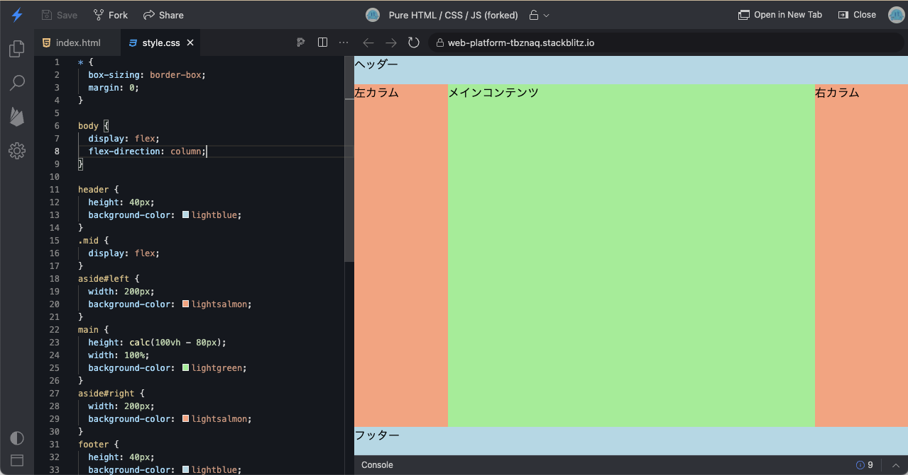

練習用ゲーム: [Flexbox Froggy](https://flexboxfroggy.com/#ja)

#### グリッドとフレックスのどちらを使うか

| 観点 | グリッド | フレックス |
| ---- | ---- | ---- |
| 次元 | 2次元 | 1次元 |
| HTMLの構造 | シンプル | ネストが増えやすい |
| 得意なケース | ページ全体のレイアウト | 並び（メニュー、カード列など） |

デザインに合わせて選びましょう。

#### 発展: HTML構造が複雑になると何が困る？

フレックスボックスだけでページ全体を組むと、レイアウトのために `<div>` を入れ子にする必要が出てきます。これには次のような副作用があります。

- HTMLの意味（セマンティクス）が薄くなる: コンテンツの構造ではなく、見た目のためのタグが増える。
- 描画パフォーマンスが落ちやすい: ブラウザが解釈する要素数が増えるとレンダリングコストが上がる。
- 後からのスタイル変更が大変: レイアウト用のタグと意味のあるタグが混ざる。

逆にグリッドはページ全体の枠組みを1つの要素で表現できるので、こうした問題が起きにくいです。とはいえ細かい並びはフレックスのほうが書きやすいので、適材適所で使い分けます。

---

## 4. ページに変更を加えよう

ここから先は、閲覧者の操作に応じて表示を変える方法です。

### 4-1. HTMLでユーザーの入力を受け取ろう

#### 4-1-1. ボタン要素

```html
<button>ボタンです</button>
<button disabled>無効なボタンです</button>
```

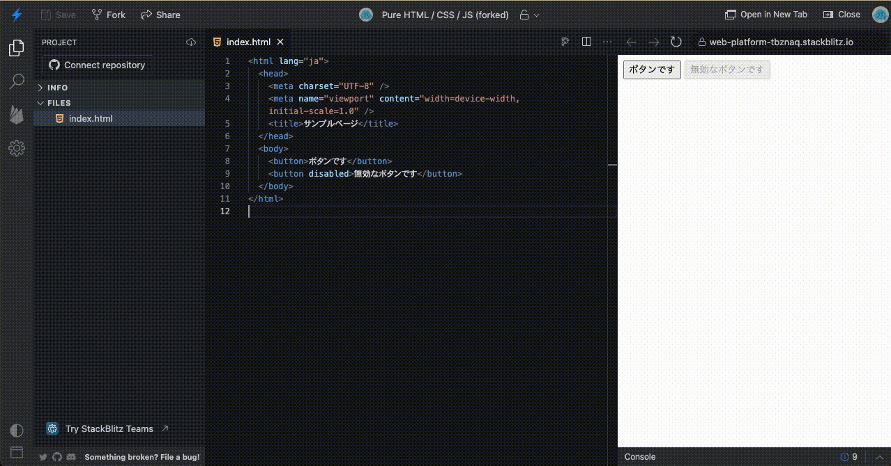

#### 4-1-2. 要素のイベントを処理する

ボタンの操作にはJavaScriptを使います。`main.js` を新規作成し、`index.html` から読み込みます。

```html
<!DOCTYPE html>
<html lang="ja">
  <head>
    <meta charset="UTF-8" />
    <meta name="viewport" content="width=device-width, initial-scale=1.0" />
    <title>サンプルページ</title>
    <script src="main.js" defer></script>
  </head>
  <body>
    <button id="main-button">ボタンです</button>
  </body>
</html>
```

```javascript
const mainButton = document.querySelector('#main-button');

const showAlert = function () {
  window.alert('ボタンがクリックされました。');
};

mainButton.addEventListener('click', showAlert);
```


| 用語 | 説明 |
| ---- | ---- |
| イベント | ユーザー操作などをきっかけに発生する出来事（クリックなど） |
| 発火 | イベントが発生すること |
| イベントハンドラ | イベント発火時に呼ばれる関数 |

`document.querySelector('<セレクタ>')` でCSSセレクタを使って要素を取得できます。

<details>
<summary>もう少し詳しく: `defer` 属性の意味</summary>

`defer` は、HTMLの解析が終わってからスクリプトを実行する指定です。これがないと、要素が読み込まれる前にスクリプトが走ってエラーになる場合があります。

たとえば上のサンプルで `defer` を外すと、`document.querySelector('#main-button')` を実行する時点ではまだ `<button>` がDOMに存在せず、`mainButton` が `null` になります。

似た属性として `async` や `type="module"` もあります。詳細は [MDN: scriptタグの属性](https://developer.mozilla.org/ja/docs/Web/HTML/Element/script#%E5%B1%9E%E6%80%A7) を参照してください。

</details>

### 4-2. JavaScriptで要素に変更を加えよう

#### 4-2-1. コンテンツの変更

| プロパティ | HTMLタグを含むか | 備考 |
| ---- | ---- | ---- |
| `innerHTML` | 含む | HTMLとして解釈されます |
| `innerText` | 含まない | 非表示テキストは除外、`\n` で改行 |
| `textContent` | 含まない | 非表示テキストも含めて取得 |

```html
<body>
  <button id="main-button">ボタンです</button>
  <p id="messages"></p>
</body>
```

```javascript
let clickCount = 0;

const mainButton = document.querySelector('#main-button');
const messages = document.querySelector('#messages');

const updateMessage = function () {
  clickCount++;
  messages.innerText += `${clickCount}回クリックされました。\n`;
};

mainButton.addEventListener('click', updateMessage);
```


#### 4-2-2. 見た目の変更

`element.style.<プロパティ名>` でCSSを直接書き換えられます。

```javascript
const colorList = ['pink', 'cyan', 'yellow'];
let clickCount = 0;

const mainButton = document.querySelector('#main-button');
const messages = document.querySelector('#messages');

const updateMessage = function () {
  clickCount++;
  messages.innerText += `${clickCount}回クリックされました。\n`;
  messages.style.backgroundColor = colorList[clickCount % 3];
};

mainButton.addEventListener('click', updateMessage);
```


### 4-3. CSSで要素の変化を魅せよう

`transition` プロパティを使うと、CSSの値が変わるときの変化をなめらかにできます。

```html
<button id="main-button">ボタンです</button>
<div id="field">
  <div id="box">0</div>
</div>
```

```css
#main-button { margin-bottom: 16px; }

#field {
  position: relative;
  width: 300px;
  height: 300px;
  border: 2px solid gray;
}

#box {
  position: absolute;
  top: 0px;
  left: 0px;
  width: 100px;
  height: 100px;
  display: grid;
  place-content: center;
  background-color: pink;
  transition: all ease 0.2s;
}
```

```javascript
let clickCount = 0;

const mainButton = document.querySelector('#main-button');
const box = document.querySelector('#box');

const moveBox = function () {
  clickCount++;
  box.textContent = `${clickCount % 4}`;
  box.style.top = [0, 1].includes(clickCount % 4) ? '0px' : '200px';
  box.style.left = [0, 3].includes(clickCount % 4) ? '0px' : '200px';
};

mainButton.addEventListener('click', moveBox);
```


| 値 | 意味 |
| ---- | ---- |
| `all` | すべてのプロパティを対象に |
| `0.2s` | 変化にかける時間 |
| `ease` | 変化のタイミング関数。始めと終わりがゆっくり。他に `linear` など。 |

> 注: ここで紹介したのは `transition` による補間で、いわゆる「CSSアニメーション」とは別物です。詳しくは [MDN: CSS animations](https://developer.mozilla.org/ja/docs/Web/CSS/CSS_animations/Using_CSS_animations) を参照してください。

---

## 5. 発展: VisBugを使ってみよう

ここは任意の発展内容です。Chrome拡張機能 [VisBug](https://chrome.google.com/webstore/detail/visbug/cdockenadnadldjbbgcallicgledbeoc?hl=ja) を入れると、ページ上の要素を直接観察・調整できます。必要になったときに試してみましょう。

`Alt`+`Shift`+`D` で起動できます。

| ツール | 用途 |
| ---- | ---- |
| ガイドツール | クリック中とホバー中の要素の大きさの差分を表示します。 |
| インスペクトツール | ホバー中の要素のサイズや色設定を一覧表示します。 |


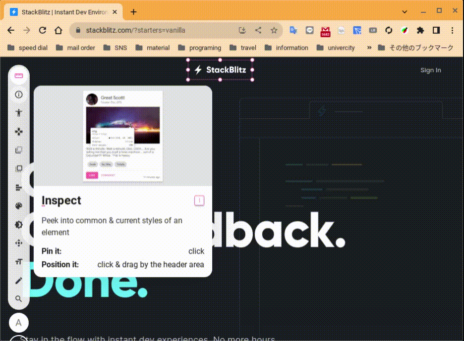

---

## 6. 終わりに

この資料ではHTML/CSSの基礎と、JavaScriptを組み合わせた動的なページ変更までを扱いました。
ここで扱いきれなかった要素やプロパティは多数あるので、使うときにMDNや検索で調べながら書いていきましょう。

## 7. 参考文献

- MDN web docs
  - HTML: <https://developer.mozilla.org/ja/docs/Web/html>
  - CSS: <https://developer.mozilla.org/ja/docs/Web/css>
