# JavaScriptを始めよう

> 想定時間: 90分
> 動作環境: Google Chrome
<!-- Author: Yamaji Toshiyuki (@haruyuki-16278) -->

<details>
  <summary>TOC</summary>

- [JavaScriptを始めよう](#javascriptを始めよう)
  - [1. JavaScript に触れてみよう](#1-javascript-に触れてみよう)
    - [1-1. ブラウザの開発者ツールを見よう](#1-1-ブラウザの開発者ツールを見よう)
    - [1-2. Hello, World! しよう](#1-2-hello-world-しよう)
    - [1-3. 読みやすいコードを書くために](#1-3-読みやすいコードを書くために)
      - [1-3-1. 厳格モード](#1-3-1-厳格モード)
      - [1-3-2. コメント](#1-3-2-コメント)
      - [1-3-3. 命名](#1-3-3-命名)
      - [1-3-4. インデント](#1-3-4-インデント)
  - [2. JavaScript で処理させよう](#2-javascript-で処理させよう)
    - [2-1. 変数](#2-1-変数)
    - [2-2. 四則演算](#2-2-四則演算)
    - [2-3. その他の算術演算](#2-3-その他の算術演算)
    - [2-4. 文字列の処理](#2-4-文字列の処理)
    - [2-5. 論理演算](#2-5-論理演算)
  - [3. 条件によって処理を変えよう](#3-条件によって処理を変えよう)
    - [3-1. 比較演算子](#3-1-比較演算子)
    - [3-2. if文](#3-2-if文)
    - [3-3. 三項演算子](#3-3-三項演算子)
  - [4. 繰り返し処理をさせよう](#4-繰り返し処理をさせよう)
    - [4-1. 配列](#4-1-配列)
    - [4-2. for文](#4-2-for文)
    - [4-3. `Array.prototype.forEach()`](#4-3-arrayprototypeforeach)
  - [5. コードをまとめてわかりやすくしよう](#5-コードをまとめてわかりやすくしよう)
    - [5-1. 関数](#5-1-関数)
      - [5-1-1. 関数](#5-1-1-関数)
      - [5-1-2. 無名関数](#5-1-2-無名関数)
      - [5-1-3. 値としての関数](#5-1-3-値としての関数)
    - [5-2. オブジェクト](#5-2-オブジェクト)
      - [5-2-1. 定義とアクセス](#5-2-1-定義とアクセス)
      - [5-2-2. プロパティの追加と存在確認](#5-2-2-プロパティの追加と存在確認)
    - [5-3. クラス](#5-3-クラス)
  - [6. 非同期処理を使おう](#6-非同期処理を使おう)
    - [6-1. `Promise`/`then()`/`catch()`](#6-1-promisethencatch)
    - [6-2. `async`/`await`](#6-2-asyncawait)
  - [7. ブラウザの標準APIを使ってみよう](#7-ブラウザの標準apiを使ってみよう)
    - [7-1. Web Storage API](#7-1-web-storage-api)
    - [7-2. 位置情報API](#7-2-位置情報api)
  - [8. 終わりに](#8-終わりに)
  - [9. 参考文献](#9-参考文献)

</details>

## 1. JavaScript に触れてみよう

JavaScript(以下JS)とは一般にWeb開発やシステム開発に用いられるプログラミング言語の一つです。
今回はインターンでのチーム開発にあたって基礎的なJSについて説明します。
> **※注意** 本記事には一部説明の簡単のために厳密には正しくない表現・説明があります。なるべく正確な記述を行いますが、気になる箇所は参考文献にある記事などから調べて貰えればと思います。

### 1-1. ブラウザの開発者ツールを見よう

Chromeではウィンドウ右上のケバブボタンから開いたメニューの「その他のツール」から「デベロッパーツール」を開けます。


ショートカットキーが設定されているため、WindowsやChromeOSでは `Ctrl`+`Shift`+`I` で、macOSでは `Cmd`+`Option`+`I` でも開くことができます。また、ページの適当な部分で右クリックして「検証」を押すことでも開発者ツールが開けます。  
無事にツールが開けていれば以下のような表示になるはずです。


開いているタブが要素タブ(Elementタブ)ではなかったり日本語化されてなかったり日本語化案内が出るかもしれませんが、ひとまずコンソールタブ(Consoleタブ)を開いてください。これで準備完了です。


### 1-2. Hello, World! しよう

「新たにプログラミング言語の学習を始めるとき、まず`Hello, World!`から始める教」に入信しているため、まずは標準的な出力方法で「Hello, World!」を表示させることにします。
先程開いたコンソールタブに以下のコードを入力してみてください。

```JavaScript
console.log('Hello, World!');
```

実行すると以下の画像のように表示されるはずです。


このように、JSでは `Console.log(<任意の文字列>);` とすることでコンソールタブに出力を出すことができます。

### 1-3. 読みやすいコードを書くために

これから始まるインターンやその他でも「チーム開発」をしなければならないタイミングがあると思います。
そんなとき最も大事なことの一つが「**コードを読んだ人間に処理の意味・意図が伝わること**」です。
自分以外の人が見ても読みやすいコードを書くために、JSの機能やプログラムを書く上で気をつける点を説明します。

#### 1-3-1. 厳格モード

厳格モード (strictモード) とは、そうでない状態ではエラーにはならない微妙な実装をエラー扱いとするモードです。これによって、暗黙的に失敗していた処理をエラーとして検知できるようになったり、JSのエンジンが最適化しづらい手順を修正できるようになったりといったメリットがあります。しかし、利用したい構文がstrictモードに非対応である場合には注意が必要です。

厳格モードはJSのコード内に`"use strict";`と記述することで有効化できます。
試しに以下のコードを実行してみてください。

```JavaScript
"use strict";
a = 1;
```


↑の画像のようにエラーが出れば問題なく厳格モードが有効になっています。この場合は未宣言の変数を操作しようとしたことでエラーが発生しています。
これは意図せずグローバル変数を宣言してしまうことを防いでくれます。

このように便利な厳格モードですが、スクリプト全体で有効にしてしまうと他のライブラリやファイルが厳格モードに対応しない記述で書かれていたときに動作しなくなってしまうことには注意が必要です。
使用方法のおすすめとしては関数の冒頭部で有効化するものです。そうすることで厳格モードは関数内でのみ有効になります。

#### 1-3-2. コメント

コメントは他のほぼすべてのプログラミング言語にもある「コード中に記述されているが処理に影響がない文」のことで、JSでは以下の二通りで記述できます。

```javascript
console.log('コメントの説明');
// console.log('これは一行だけをコメントにするやつ');
console.log('//が書いてある行にしか影響しない');

/**
 * console.log('これは複数行をコメントにするやつ');
 * console.log('/* から * /までの間が実行されない');
 */
```

コメントを適切に書くことでコードの意図や内容を他の開発者にわかりやすく伝えることができます。
また、実行したくないコードをコメントにすることで開発中のデバッグをやりやすくする使い方もあります。

#### 1-3-3. 命名

命名はプログラムを書く上で逃れられず、かつ難しい要素の一つです。
「名は体を表す」ということわざがありますが、意識するべきはまさにこれです。
コードを読む上でわざわざ他人の書いたコードをすべて読んで意味を理解してから使うことはあまりにも面倒です。そのため、完結で処理の内容や意味、効果がわかりやすい命名を変数・関数にするべきだとされています。

| 良い例 | 悪い例 |
| ---- | ---- |
| `let count = 0;` | `let a = 0;` |
| `function solveQuadraticEquation () {...}` | `function solve() {...}` |

1つ目の例はあまりにも極端ですが、`count`という名前で宣言されている方が変数の利用目的が明確です。
2つ目の例は場合によってどちらがいいかの判断が変わる場合があります。特にクラスのメンバとしてある式を解くような関数の場合では悪い例は悪いとは言い切れません。また、エディタの補完機能がない場合には冗長な命名の関数は嫌われるため良い例が必ずしも良いわけではありません。

時と場合に合わせて命名とコメントを組み合わせて誰が読んでもわかりやすいコードになるよう心がけましょう。

#### 1-3-4. インデント

インデントとは、行頭の字下げのことを指します。
主にコード中のブロックをわかりやすくするために利用されます。Pythonのようなインデントベースの言語ではブロックそのものを表すために使われますが、JSではコードのブロックは`{}`で表現されるため、インデントがなくてもエラーになったりはしません。
インデントをつけたほうが処理の塊がわかりやすくなるので、つけるようにしましょう。なお、`{}`で囲まれた文をそれまでの字下げよりもう1段階深くインデントするのが一般的です。

インデントなし

```javascript
function myFunc () {
let i = 0;
for (i = 0; i < 10; i++) {
console.log(i);
}
}
```

インデントあり

```javascript
function myFunc () {
  let i = 0;
  for (i = 0; i < 10; i++) {
    console.log(i);
  }
}
```

## 2. JavaScript で処理させよう

ここでは様々な計算や処理をJSにやってもらう方法を説明します。

### 2-1. 変数

はじめに、プログラムを書くにあたって重要な変数から説明します。
変数は値を格納する入れ物です。例えるとラベルの付いた箱のようなものです。
`let`と記述した後に変数の名前を記述することで変数を宣言できます。

```javascript
let myVariable;
```

変数のあとに`=`と値を順番に記述すると、その値を変数に割り当てることができます。
値の割り当てと変数の宣言をまとめて、一行で記述することもできます。

```javascript
let myVariable;
myVariable = 1;

let nextVariable = 100;
```

`let`を使って宣言すると、後から変数に割り当てた値を変更できます。
`let`のかわりに`const`を使って宣言すると、後から変更できない定数として宣言できます。

```javascript
let myVariable = 1;
myVariable = 23;

const constantValue = 10;
```

### 2-2. 四則演算

次に計算といえばな四則演算について説明します。それぞれ以下のようにして記述することができます。

| 演算 | 記述 | 実行結果 |
| ---- | ---- | ---- |
| 加法 | `1 + 1` | 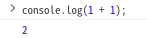 |
| 減法 | `1 - 1` | 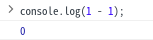 |
| 乗法 | `2 * 2` | 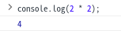 |
| 除法 | `2 / 2` | 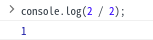 |
| 剰余 | `3 % 2` | 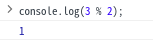 |

この他に`+=`、`-=`のような二項演算子の後ろに`=`をつける、加算代入演算子や減算代入演算子などもあります。
この演算子は計算と変数への値の割り当てと一行で記述できます。

```javascript
let value = 1;
value += 2;
```

この加算代入演算子を使った処理は、以下のコードと同じ処理になります。

```javascript
let value = 1;
value = value + 2;
```

### 2-3. その他の算術演算

プログラムでは四則演算以外でも頻繁につかう演算があります。
変数の値を一つ増やすインクリメントや、一つ減らすデクリメントがその例です。
インクリメントのようなプログラム中で特に利用する演算は、演算子として用意されています。

また、三角関数のような高度な演算はJSでは `Math` という名前の組み込みオブジェクトから呼び出せます。

以下にいくつか例を示します。

| 演算 | 記述 | 実行結果 | 補足 |
| ---- | ---- | ---- | ---- |
| インクリメント | 後置インクリメント:`x++`<br>前置インクリメント:`++x` | <br>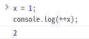 | 後置:先に評価結果を返して加算を行う<br>前置:先に加算を行って評価結果を返す |
| デクリメント | 後置デクリメント:`x--`<br>前置デクリメント:`--x` | 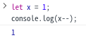<br>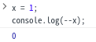 | 後置:先に評価結果を返して減算を行う<br>前置:先に減算を行って評価結果を返す |
| べき乗 | `2 ** 2`<br>`Math.pow(2,2)` | 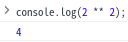<br>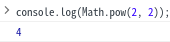 | べき乗演算子`**`が後に実装された |
| 円周率 | `Math.PI` | 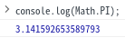 |  |
| 正弦 | `Math.sin(θ)` | 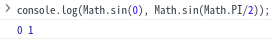 |  |
| 余弦 | `Math.cos(θ)` |  |  |

その他のMathオブジェクトのプロパティやメソッドは[こちら](https://developer.mozilla.org/ja/docs/Web/JavaScript/Reference/Global_Objects/Math)から確認できます。

### 2-4. 文字列の処理

文字列はJSではStringオブジェクトとして扱われ、様々な操作を行うことができます。連結、分割、置き換えなどの一部操作の方法を以下に示します。

| 操作 | 記述 | 実行結果 |
| ---- | ---- | ---- |
| 結合 | `'jig' + '.' + 'jp'` | 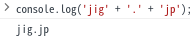 |
| 結合 | `str += otherStr` | 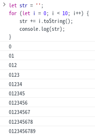
| 文字の取り出し | `'jig.jp'.charAt(1)` | 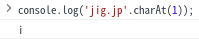 |
| 分割 | `'jig.jp'.split('.')` | 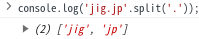 |
| 文字列の切り出し | `'jig.jp'.slice(1, 4)` | 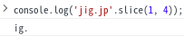 |
| 文字列の置き換え | `'jig.jp'.replace('ji', 'じぇいあい')` | 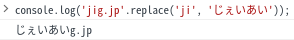 |
| 文字列の長さ | `'jig.jp'.length` | 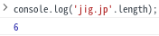 |
| 文字列の位置 | `'jig.jp'.indexOf('jp')` | 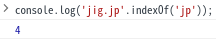 |

その他のStringオブジェクトのプロパティやメソッドは[こちら](https://developer.mozilla.org/ja/docs/Web/JavaScript/Reference/Global_Objects/String)から確認できます。

### 2-5. 論理演算

論理演算はプログラムで頻出する演算の一つです。それぞれの演算は以下のように表せます。

| 演算 | 記述 | 実行結果 |
| ---- | ---- | ---- |
| AND | `a && b` | 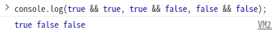 |
| OR | `a \|\| b` | 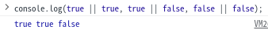 |
| NOT | `!a` | 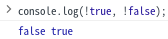 |

## 3. 条件によって処理を変えよう

数学の問題でも場合分けが発生するように、プログラムでも条件によって処理を変更したいことがあります。
ここではプログラムで条件分岐を記述する方法を説明します。

### 3-1. 比較演算子

場合分けが発生する簡単な例として、二次方程式の判別式Dがあります。判別式Dは以下の式で、次のような分岐がわかります。
判別式D: $D = b^2 - 4ac$
判別式Dの結果が

- 正の値 → 実数解
- 0 → 重解
- 負の値 → 虚数解

これは判別式Dの結果を`value`として、それぞれ比較演算子を用いて以下のように表現できます。

- 正の値 → `value > 0`
- 0 → `value === 0`
- 負の値 → `value < 0`

JSではこのようにして値の大小や等価かどうかを比較できます。
以下に比較演算子の表を示します。

| 演算 | 記述 |
| ---- | ---- |
| `厳密等価` | `a === b` |
| `厳密不等価` | `a !== b` |
| `超過/より大きい` | `a > b` |
| `以上` | `a >= b` |
| `未満/より小さい` | `a < b` |
| `以下` | `a <= b` |

<details>
  <summary>厳密でない等価/不等価</summary>

  厳密等価/厳密不等価の演算が存在するということは、厳密**でない**等価・不等価の演算があると言うことです。
  これらは暗黙的な型変換を行うため一見して予想できない挙動をすることがあります。
  このため、厳密等価演算子・厳密不等価演算子を使用することが推奨されます。
  以下に厳密でない等価・不等価演算子の表を示します。

  | 演算 | 記述 |
  | ---- | ---- |
  | 等価 | `==` |
  | 不等価 | `!=` |

  繰り返しになりますが、厳密でない演算子の使用は非推奨です。
</details>

### 3-2. if文

3-1.でプログラムで条件を表現する方法を説明しました。先程の判別式Dの結果を評価し、実数解、重解、虚数解のどれになるかを出力するプログラムを作ることを考えてみましょう。
評価の結果によって処理を分岐させるためには `if`文を使います。

```javascript
if (<条件1>) {
   条件1が真のときの処理
} else if (<条件2>) {
   条件2が真のときの処理
} else {
   条件1も条件2も偽のときの処理
}
```

if文は`()`内の評価結果が真のときに直後の`{}`で囲まれたブロック内の処理を行い、`()`内の評価結果が偽のときに直後の`else`句の処理を行います。このとき、`else`のあとに`if`でif文をつなげることで条件分岐を追加できます。`else`句のあとにある`{}`ブロック内の処理は、それより前にある`if`と`else if`のすべての条件を満たさなかったときに実行されます。
`if`\~`else if`\~`else`句は一連の処理の塊として捉えられます。この中で上から順に評価が行われるため、条件の順番には気をつける必要があります。

では判別式の結果から解がどうなるかを出力するプログラムを以下に書きます。

```javascript
let a, b, c;
a = <x2 の係数>;
b = <x の係数>;
c = <定数項>;

const d = b ** 2 - 4 * a * c;

if (d === 0) {
   console.log('重解');
} else if (d > 0) {
   console.log('実数解');
} else {
   console.log('虚数解');
}
```

実行結果は以下のようになります。

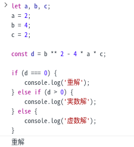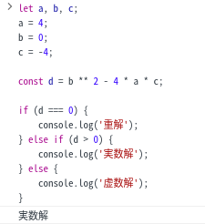

### 3-3. 三項演算子

三項演算子とは条件によって返す値を変えられる演算子です。
以下のような記法で利用できます。

```javascript
value = <条件> ? <条件が真のときの値> : <条件が偽のときの値>;
```

例えばある値の真偽によって値を返したいときに活用できます。↑の判別式の例を書き換えると以下のようになります。

```javascript
let a, b, c;
a = <x2 の係数>;
b = <x の係数>;
c = <定数項>;

const d = b ** 2 - 4 * a * c;

const res = d === 0
            ? '重解'
            : d > 0
              ? '実数解'
              : '虚数解';

console.log(res);
```

三項演算子はこのように三項演算子の下に三項演算子を書くことができます。
しかし、階層が深くなると複雑で読みづらくなるので注意が必要です。

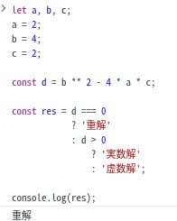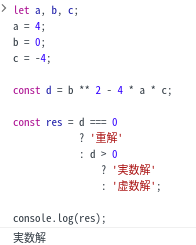

## 4. 繰り返し処理をさせよう

複数回処理をするとき、何度も同じコードを書くのは面倒です。ですよね？
JSには同じ処理を複数回行うための文法があります。ここではその文法 `for`文について説明します。

### 4-1. 配列

繰り返し処理と関連の深い値として配列があります。
配列とは、変数が列になって連なったようなもので、以下のような記述で利用できます。

```javascript
const array = [1, 2, 3, 4, 5];
console.log(array[0]); // 1
console.log(array[3]); // 4
```

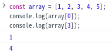

配列は `[]` で囲まれ `,` で区切られた一連の値で表現されます。
個々の値にアクセスするには配列名の後ろに`[index]`と書くことで取り出せます。この`index`とは配列の中の順番のことで、0番から順に番号が振られます。

1からではなく、0から数えることに注意してください。ほとんどのプログラミング言語では0から数を数えるので覚えておきましょう。

### 4-2. for文

先程の配列を使って、繰り返し処理の実例を見てみましょう。
ここでは第10項までのフィボナッチ数列を作ることを考えます。

`for`文は実はしれっとすでに資料中で登場していますが、以下のような記述で使うことができます。

```javascript
for (<ループ前の処理>; <ループ終了条件>; <ループごとの処理>) {
  <繰り返す処理内容>
}
```

<ループ前の処理>は、ループがはじまる前に一度だけ処理されます。
`i`, `j`, `k`を`for`文での制御変数として利用し、`let i = 0;`のように変数宣言と初期値の代入をすることが多いです。

<ループ終了条件>は、評価結果が偽になったときにループを抜けるものです。
制御変数を含めた判定式を記述することが多いです。

<ループごとの処理>は、<繰り返す処理内容>が完了した後に毎回処理されます。
`i++`のように制御変数をインクリメントすることが多いです。

では具体的なフィボナッチ数列の生成コードを見てみましょう。

```javascript
let fibonacciSeries = [];
for (let i = 1; i <= 10; i++) {
  const len = fibonacciSeries.length;
  if (len < 2) {
    fibonacciSeries.push(1);
  } else {
    fibonacciSeries.push(fibonacciSeries[len - 2] + fibonacciSeries[len - 1]);
  }
}
console.log(fibonacciSeries); // [1, 1, 2, 3, 5, 8, 13, 21, 34, 55]
```

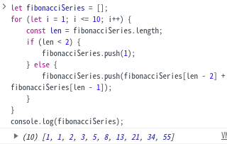

このように面倒な手順を繰り返し処理で簡単に記述できました。

<details>
  <summary>負の値をインデックスに使いたい</summary>

  Pythonなど一部言語では配列のインデックスに負の値を入力することで配列の後側から値を取り出すことができます。JSでは通常の`array[index]`ではこの記法が利用できませんが、`Array`オブジェクトの`at()`メソッドを利用することで同様の処理が可能です。

  ```javascript
  let fibonacciSeries = [];
  for (let i = 1; i <= 10; i++) {
    if (fibonacciSeries.length < 2) {
      fibonacciSeries.push(1);
    } else {
      fibonacciSeries.push(fibonacciSeries.at(-2) + fibonacciSeries.at(-1));
    }
  }
  console.log(fibonacciSeries);
  ```

  個人的にはこの書き方のほうが行数も減って直感的にわかりやすくて好みです。適宜つか分けられると良いでしょう。
</details>

### 4-3. `Array.prototype.forEach()`

配列には`.forEach()`というメソッドがあります。メソッドとはオブジェクトから呼び出せる関数のことで、メソッドや関数については5.1で詳しく説明します。
`.forEach()`は配列の1要素ごとに繰り返し処理を行うためのもので、以下のようにして利用できます。

```javascript
let array = [];
for (let i = 0; i < 10; i++) {
  array.push(Math.floor(Math.random() * 10 * i));
}

array.forEach((value) => {
  if (value % 2 === 0) {
    console.log(`${value} is even.`);
  } else {
    console.log(`${value} is odd.`);
  }
});
```

このコードは10個の乱数を生成して配列にしたあと、それぞれに対して偶数か奇数かを判定するコードです。
`(value) => {}`と渡している処理をコールバック関数と呼びます。このようにJSでは関数の引数に関数を渡すことがあります。

同様の処理はfor文でも記述できますが、インデックスによるアクセスが発生し混乱のもとになりやすいです。(特に配列のインデックスが0から始まることを忘れているとバグのもとになります。)

```javascript
let array = [];
for (let i = 0; i < 10; i++) {
    array.push(Math.floor(Math.random() * 10 * i));
}

for (let i = 0; i < 10; i++) {
    if (array[i] % 2 === 0) {
        console.log(`${array[i]} is even.`);
    } else {
        console.log(`${array[i]} is odd.`);
    }
}
```

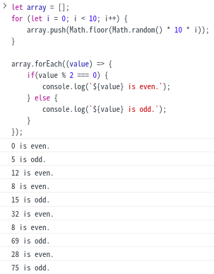 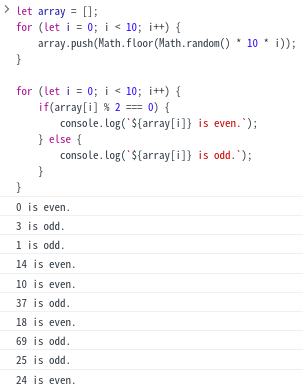

for文中の処理の最初で`array[i]`を別の変数(例えば`value`)に代入しても良いですが、同様のことが`forEach()`では`(value) => {...}`とするだけでかけます。またfor文での処理と違い配列の長さを気にせず処理を行えるのも便利な特徴です。適宜使い分けると良いでしょう。

## 5. コードをまとめてわかりやすくしよう

ここまででJSでの基本的な処理の説明を行ってきました。
それらの組み合わせで多種多様な処理を作っていくわけですが、処理のたびに毎回同じコードを書くのは気が引けますよね？一連の処理に名前をつけて呼び出せたら...それを実現する愉快な仲間たちを紹介します。

> ※ このセクションは全体的にだいぶ端折った説明をしています。
> より詳細な説明は参考文献から[mdn web docs](https://developer.mozilla.org/ja/docs/Web)や[JSPrimer](https://jsprimer.net/)の該当箇所を読んでください。

### 5-1. 関数

#### 5-1-1. 関数

すでに関数の呼び出しは資料中にたくさん登場しています。例えば`console.log()`は立派な関数呼び出しです。このように`関数名(引数)`という形で関数は呼び出せます。

では関数はどのようにプログラム中で記述できるのかというと、基本的に以下のように記述できます。

```javascript
function <関数名> (<引数>) {
  <処理内容>
  return <返り値>;
}
```

具体的に二次方程式の解を求める関数を作成してみます。(ただし、JSは標準では虚数を表現できません)

```javascript
function solveQuadraticEquation (a, b, c) {
  const d = b ** 2 - 4 * a * c;
  if (d === 0) {
    return {
      type: '重解',
      ans: [b / (2 * a)]
    };
  } else if (d > 0) {
    return {
      type: '実数解',
      ans: [
        (b + Math.sqrt(d)) / (2 * a),
        (b - Math.sqrt(d)) / (2 * a)
      ]
    };
  } else {
    return {
      type: '虚数解',
      ans: [
        `(${b} ± √${Math.abs(d)}i) / ${2 * a}`
      ]
    };
  }
}
```

ここで `a`, `b`, `c` は**仮引数**と呼ばれ、関数の呼び出し時に`()`の中の対応する位置に与えられた値(**引数**)を参照できます。その後`return`で関数の処理結果を**返り値**として返しています。
この`return`文は値を返す必要がない関数では省略可能です。

また、`return`は値を返す、つまり関数の処理を終えたことを意味します。そのため上記の処理のように処理の途中で関数を終了したり、条件によって複数の終了処理を記述することができます。

#### 5-1-2. 無名関数

JSで頻出する関数の書き方には名前はないけど関数として宣言されて実行されるものがあります。それが無名関数です。以下のようなものが無名関数と呼ばれます。

```javascript
function (msg) {
  console.log(msg);
};

(msg) => {
  console.log(msg);
};
```

後者は特別に*アロー関数*と呼ばれる場合もあります。これらは返り値として関数を返します。
そのため、変数に関数を代入して変数名の後ろに`()`をつけることで代入した関数を呼び出すことができます。

```javascript
const log = function (msg) {
  console.log(msg);
};
log('test');
```

#### 5-1-3. 値としての関数

5-1-2.では無名関数を変数に代入していました。このことから、JSの関数は値として扱うことができるのがわかります。
また、この性質を利用してコールバックという処理方法を取れます。`setTimeout(callback, delay)`の`callback`のように関数を値として渡すことで特別な処理がしやすくなります。

```javascript
setTimeout(() => {
  const now = new Date();
  console.log(now);
}, 5 * 1000);
```

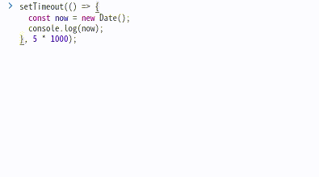

<details>
  <summary>setInterval</summary>

  `setInterval`は`setTimeout(callback, delay)`のように2つの引数を取ります。
  `callback`はコールバック関数で`delay`ミリ秒後に実行されます。
  また、返り値として正の整数値を返します。これは登録されたtimeoutのIDで、`setTimeout`が呼ばれてから`delay`ミリ秒の間に`clearTimeout(timeoutID)`とすることで登録されたコールバック関数の実行をキャンセルできます。
</details>

### 5-2. オブジェクト

#### 5-2-1. 定義とアクセス

オブジェクトの名はここまでにも登場していますが、あらためて説明します。
JSにおけるオブジェクトとは、キーと値が対になった**プロパティの集合**です。
以下の文法で定義・アクセスできます。

```javascript
let obj = {
  key1: 'value1',
  key2: 'value2'
};

console.log(obj.key1, obj['key2']);
```

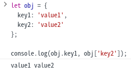

このとき、`[]`(ブラケット記法)を利用したアクセスでは`obj['key2']`のように、プロパティ名を文字列として記述するほうが望ましいです。仮に`obj[key2]`と記述してアクセスしようとしたとき、`key2`が変数として解釈されて未定義のためエラーが発生します。
これに対して、`.`(ドット記法)を利用したアクセスでは、使えないプロパティ名があることに注意が必要です。数字で始まるプロパティ名やハイフンを含んだプロパティ名はブラケット記法でアクセスする必要があります。

#### 5-2-2. プロパティの追加と存在確認

JSのオブジェクトは、一度作成したあとその値自体を変更できる特性を持ちます。これは`const`を利用して宣言したときも同様です。
そのため、以下のようにしてオブジェクトにプロパティを追加できます。

```javascript
const obj = {};

obj.key1 = 'value1';
obj['key2'] = 'value2';

console.log(obj.key1, obj['key2']);
```

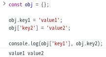

またこの特性から、オブジェクトにないプロパティも参照できてしまいます(参照すると`undefined`が返ります)。この挙動によるバグを回避するために、いくつかの方法でオブジェクトに目的のプロパティが存在するかを確認することができます。ここでは最も使いやすい手法として**Optional Chaining演算子**`?.`を用いた方法を以下に示します。

```javascript
const obj = {
  prop1: {
    key1: 'value1'
  },
  key2: 'value2'
};

console.log(obj.key1); // X  undefined
console.log(obj.key2); // O  'value2'
console.log(obj.prop1); // O  {key1: 'value1'}
console.log(obj.prop1.key1); // O  'value1'
console.log(obj.prop1.key2); // X  undefined
console.log(obj.prop2); // X  undefined
console.log(obj.prop2.key1); // エラー  undefinedに対して更にプロパティにアクセスしようとした
console.log(obj.prop2.key2); // エラー  undefinedに対して更にプロパティにアクセスしようとした

// optional chaining
// `?.`のつなげられたプロパティが存在するかを確認して
//   存在すれば`?.`でつながったプロパティにアクセスする
//   存在しなければundefinedを返す
console.log(obj.prop2?.key1); // X  undefined
console.log(obj?.prop2.key1); // エラー (obj?.prop2 が undefinedになり、undefined.key1と同じ意味になる)
console.log(obj?.prop2?.key1); // X  undefined (obj?.prop2 が undefinedになり、undefined?.key1がundefinedになる)
```

例えば、APIリクエストのレスポンスにあったりなかったりするプロパティにアクセスするときや、入力が必須でない項目があるフォームなどを扱うときに重宝する機能です。覚えていると良いことがあるかもしれません。

<details>
  <summary>オブジェクトのプロパティに関数を</summary>

  JSの関数は値として扱える、という話をしましたが、ならばキーと値が対になったプロパティに関数を使うこともできそうですよね？できます。

  ```javascript
  const basicArithmeticOperations = {
    sum: (a, b) => a + b,
    diff: (a, b) => a - b,
    multi: (a, b) => a * b,
    div: (a, b) => a / b
  };

  console.log(basicArithmeticOperations.sum(1, 1));
  console.log(basicArithmeticOperations.diff(1, 1));
  console.log(basicArithmeticOperations.multi(2, 2));
  console.log(basicArithmeticOperations.div(2, 2));
  ```

  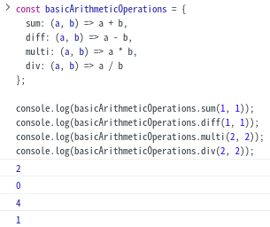
</details>

### 5-3. クラス

クラスは以下のような文で定義し、インスタンスを生成してメソッドやプロパティにアクセスできます。

```javascript
// クラス定義
class <クラス名> {
  <プロパティの宣言>

  constructor (<コンストラクタ引数>) {
    <コンストラクタ関数での処理>
    <※ コンストラクタ関数では`return`は基本的にしない>
  }

  <メソッド(関数)の定義>
}

// インスタンス生成
<const または let> <インスタンス変数名> = new <クラス名>(<コンストラクタ引数>);

// メソッド・プロパティアクセス
<インスタンス変数名>.<プロパティ または メソッド>
```

↑の疑似コードでは分かりづらい部分もあるので具体的に

- クラス名: `MyClass`
  - 文字列を与えて初期化できる（与えなくても初期値をもつ）
  - `printText`メソッドを呼び出すことで自身が持つ文字列を出力する

というクラスを実装してみます。

```javascript
class MyClass {
  text = 'initial text';
  
  constructor (text) {
    if (text) this.text = text;
  }

  printText () {
    console.log(this.text);
  }
}
```

これがクラスです。クラスは設計書のようなもので、これをもとに実体(**インスタンス**)を生成します。

```javascript
const myClass = new MyClass('my text');
```

これで自身の文字列として`'my text'`を持つ`MyClass`のインスタンスを生成して`myClass`に代入できました。
`myClass`から`printText`メソッドを呼び出せば`'my text'`と出力されるはずです。

```javascript
myClass.printText();
```

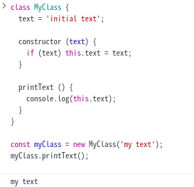

## 6. 非同期処理を使おう

非同期処理とはその名の通りプログラム中で非同期的な処理を行うことです。例えばサーバーへのリクエストを送ってレスポンスを受けとりたいときに使用されます。
ここまでのコードはすべて同期処理で、非同期処理とは対称的に書いてあるコードが上から順に処理されて行きます。しかし、同期処理ではサーバーへのリクエストを送ったあとレスポンスが返ってくるまで何もすることができず（正確には「レスポンスを待つ」ことが処理になっているため次の処理に移れず）、処理にかかる時間が大幅に伸びてしまったりします。この待ち時間を解消するための仕組みが非同期処理です。

[](https://mermaid-js.github.io/docs/mermaid-live-editor-beta/#/edit/eyJjb2RlIjoic2VxdWVuY2VEaWFncmFtXG4gIHBhcnRpY2lwYW50IEMgYXMg44Kv44Op44Kk44Ki44Oz44OIXG4gIHBhcnRpY2lwYW50IEggYXMg44Ob44K544OIXG5cbiAgQyAtPj4rIEg6IOODquOCr-OCqOOCueODiFxuICBOb3RlIHJpZ2h0IG9mIEM6IOW-heOBoeaZgumWk1xuICBIIC0tPj4tIEM6IOODrOOCueODneODs-OCuVxuIiwibWVybWFpZCI6eyJ0aGVtZSI6ImRlZmF1bHQifSwidXBkYXRlRWRpdG9yIjpmYWxzZX0)[](https://mermaid-js.github.io/docs/mermaid-live-editor-beta/#/edit/eyJjb2RlIjoic2VxdWVuY2VEaWFncmFtXG4gIHBhcnRpY2lwYW50IEMgYXMg44Kv44Op44Kk44Ki44Oz44OIXG4gIHBhcnRpY2lwYW50IFAgYXMg6Z2e5ZCM5pyf5Yem55CGXG4gIHBhcnRpY2lwYW50IEggYXMg44Ob44K544OIXG5cbiAgQyAtPj4rIFA6IOWHpueQhueZu-mMslxuICBQIC0-PisgSDog44Oq44Kv44Ko44K544OIXG4gIE5vdGUgcmlnaHQgb2YgQzog5LuW44Gu5Yem55CGXG4gIEggLS0-Pi0gUDog44Os44K544Od44Oz44K5XG4gIFAgLS0-Pi0gQzog44Kz44O844Or44OQ44OD44Kv5ZG844Gz5Ye644GXIiwibWVybWFpZCI6eyJ0aGVtZSI6ImRlZmF1bHQifSwidXBkYXRlRWRpdG9yIjpmYWxzZX0)

<details>
  <summary>JSにおける非同期処理の捉え方</summary>

  JSの処理は基本的にシングルスレッドで、実際には↑の図のような形にはなりづらいです。(実現する方法はあります。)
  非同期処理は並列に処理される(同時の2つの処理が行われる)わけではなく平行に処理されます(一つの処理の流れの中で2つの処理が行われる)。イメージとしては人間二人が一つずつの作業を行うわけではなく、人間一人が順序をつけて2つの作業を行う感じです。
  JSにおける非同期処理は、サーバーからもらうデータが必要などの理由で、*今すぐに実行することができない処理を一旦後回しにして、必要なデータが揃ったものから処理していく*という認識が妥当に思います。

  詳しくは[こちらのページ](https://jsprimer.net/basic/async/)がわかりやすいです。
</details>

### 6-1. `Promise`/`then()`/`catch()`

ここでは非同期処理の状態や結果を扱うことのできる`Promise`オブジェクトについて説明します。

```javascript
const randomDelay = () => new Promise((resolve, reject) => {
  const delay = Math.floor(Math.random() * 1000);
  setTimeout(() => {
    if (delay % 2 === 0) {
      resolve(`${delay} is even.`);
    } else {
      reject(`${delay} is odd.`)
    }
  }, delay);
});

randomDelay()
  .then(v => console.log(`resolve: ${v}`))
  .catch(e => console.log(`reject: ${e}`));
```

↑のコードではランダムな0~1000ミリ秒後に、待機時間が偶数秒なら`resolve`で解決され、奇数秒なら`reject`で拒否される`Promise`インスタンスを返す関数 `randomDelay` を宣言しています。
その後、`randomDelay()`でインスタンス生成、`Promise`を`then()`/`catch()`で受け取って解決・拒否を処理しています。

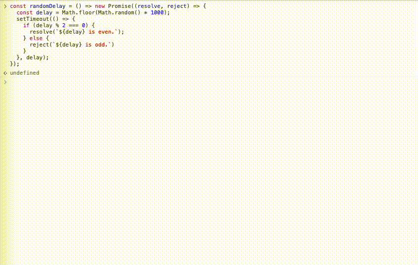

### 6-2. `async`/`await`

`async`はAsync Function(直訳: 非同期関数)を定義するための構文です。これは必ず`Promise`インスタンスを返す関数で通常の関数定義の構文とは異なります。
それに対して`await`は`Promise`インスタンスを右辺にとり、その状態が解決もしくは拒否されるまでその場で待機するものです。

これらを用いて 6-1. の`randomDelay`を実装すると次のようになります。

```javascript
async function randomDelay () {
  const startedAt = new Date();
  const delay = Math.floor(Math.random() * 1000);
  while (true) {
    if (startedAt.getTime() + delay < (new Date().getTime())) break;
  }
  if (delay % 2 === 0) {
    return `${delay} is even.`;
  } else {
    return Promise.reject(`${delay} is odd.`);
  }
}

try {
  const v = await randomDelay();
  console.log(`resolve: ${v}`);
} catch (e) {
  console.log(`reject: ${e}`);
}
```

ランダムな時間待機するコードが変わっていますが、処理内容は同様です。気になる方は以下のサマリーを確認してください。
ここで `try` ~ `catch` という構文が登場しますが、これは例外処理のための文です。
`Promise` ~ `then` ~ `catch` では例外を `catch` がひろってくれるのですが、`await`式を用いた実装では例外は明示的に処理しなければなりません。そのため、この記述が必要になります。


<details>
  <summary>JSで処理を一時待機させる方法</summary>

  ↑のコードでは関数が呼ばれた時刻を保持して、`while`文を利用して現在時刻と比較し続けて`delay`秒経過したら`break`で`while`ループを抜ける処理になっています。
  この方法は処理の負荷が非常に高いため、普通まずやってはいけない処理です。

  ではどのような方法で実装できるかというと、以下の定義で`sleep`関数を用意することができます。

  ```javascript
  const sleep = delay => new Promise(resolve => setTimeout(resolve, delay));
  ```

  これを使うことで以下のようにコードを書き直せます。

  ```javascript
  async function randomDelay () {
    const delay = Math.floor(Math.random() * 1000);
    await sleep(delay);
    if (delay % 2 === 0) {
      return `${delay} is even.`;
    } else {
      return Promise.reject(`${delay} is odd.`);
    }
  }

  try {
    console.log(await randomDelay());
  } catch (e) {
    console.log(e);
  }
  ```

  ではなぜ非推奨なコードをサンプルで書いたのかというと、関数定義を一つだけにしたい、`await`の使用箇所を一つにしたいという理由のために使用しました。
  特別な事情がないかぎり、`sleep`関数を定義して利用するのが良いでしょう
</details>

処理によって`Promise`~`then`を利用するか`async`/`await`を利用するか、どちらが読みやすいかを考えながら使い分けられると良いですね。

## 7. ブラウザの標準APIを使ってみよう

さて、最後にweb開発を助けてくれるブラウザの機能についてです。
我々が普段使うブラウザには様々なAPIが用意されています。特に有用な2つを使ってみましょう。

### 7-1. Web Storage API

Web Storage API はブラウザにキーと値の対を保存できるAPIです。
その中でも特に `localStorage` について説明します。

`localstorage`は以下のようにして利用できます。

```javascript
// 値のセット
localStorage.setItem('name', 'jig太郎');
// 値の取り出し
console.log(localStorage.getItem('name'));
// ローカルストレージに保存されている値の数
console.log(localStorage.length); // 1
// 値の削除
localStorage.removeItem('name');

console.log(localStorage.getItem('name')); // null

localStorage.setItem('name', 'jig太郎');
localStorage.setItem('age', '20');
// ローカルストレージを空にする
localStorage.clear();

console.log(localStorage.length); // 0
```

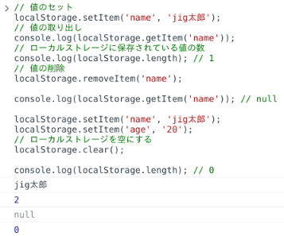

注意する点として、`localStorage`に保存する値はすべて文字列になることが挙げられます。
例えば、`localStorage.setItem('age', 20);`としてnumber型で保存できたと思っても、`getItem`で取り出したときには`'20'`として文字列で返ってきます。このあと数値として扱いたい場合には`Number(<文字列>)`としてnumber型に変換する必要があります。

また、`localStorage`への操作はパフォーマンスが悪いという問題もあります。あまりにも多用するのは問題ですが、その扱いの容易さ故に許容されがちです。気をつけて利用するようにしましょう。

### 7-2. 位置情報API

インターネットにアクセスできる環境下で便利なものの一つが位置情報でしょう。手元の小さな端末が自分の位置を正確に取得してくれるおかげで我々は迷子になることが減りました。

そんな位置情報を取得するためのAPIがブラウザにも実装されています。以下のようにして自分の緯度経度を取得することができます。

```javascript
// 位置情報が利用可能か確認する
if ('geolocation' in navigator) {
  const geolocation = navigator.geolocation;
  geolocation.getCurrentPosition((position) => {
    console.log(`latitude: ${position.coords.latitude}, longitude: ${position.coords.longitude}`);
  });
} else {
  console.error('this browser has not support geolocation.');
}
```

↑のコードを実行すると↓のようなポップアップが表示されます。「許可する」をクリックして位置情報を利用できるようにしてください。


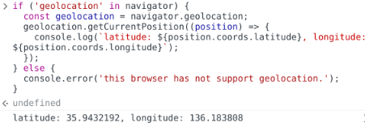

↑のように緯度経度が出力されれば問題なく実行できています。

[地図](https://fukuno.jig.jp/app/map/latlng/)で調べて見ると若干のズレはあるもののおおよその位置はあっていました

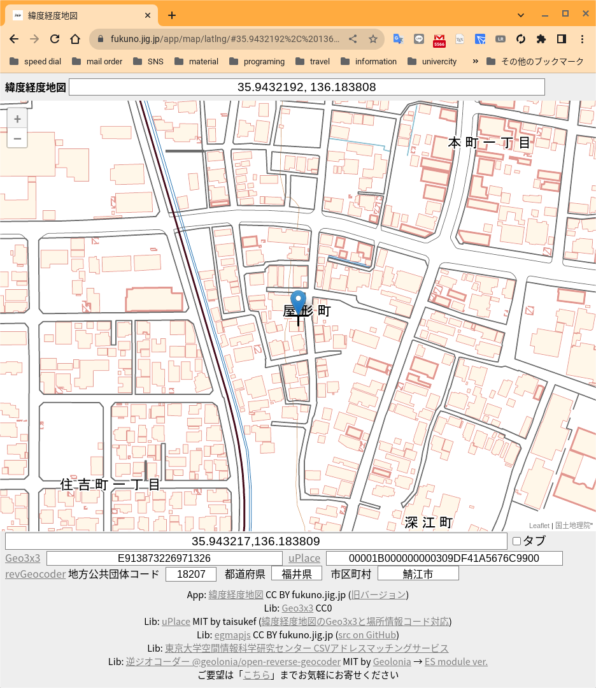

位置情報の応用は[こちらの記事](https://hackmd.io/@haruyuki16278/Hk2Tmh7b3)や[mdn web docs](https://developer.mozilla.org/ja/docs/Web/API/Geolocation_API/Using_the_Geolocation_API#examples)を確認してみてください。

## 8. 終わりに

ここまででこの記事ではJSの初歩〜ブラウザのAPIを利用するまでを駆け足で説明してきました。
が、簡単のために省略した部分や実際の内容とは異なる解説をしている部分もあるため、理解しきれてない部分もあるかもしれません。
わからないところ、詳しく知りたいところは筆者やメンターに聞いたり、参考文献から調べたりしてみてください。

## 9. 参考文献

- mdn web docs: <https://developer.mozilla.org/ja/docs/Web/JavaScript>
- JSPrimer: <https://jsprimer.net/>
- ECMAScript2020言語仕様　私的日本語訳: <https://xn--ecmascript2020-tt9vf572amitfjlc.com/>
