

<!-- _class: title -->

# サーバとの通信

ウェブ実装で必要になる通信の知識

---

## この資料の目標

Webアプリを支える<strong>サーバとの通信</strong>の 
しくみを、<strong>ざっくりつかむ！</strong>

---

## この資料で扱うこと

1. **HTTP** とは
2. **URL** の構成
3. **HTTPメソッド**（GET / POST）
4. **HTTP** の中身（ヘッダ）
5. **CORS** とは

---

<!-- _class: chapter -->

CHAPTER 1

# HTTPとは

---

HTTP は、Webでよく使われる 通信の<strong>ルール（プロトコル）</strong>

<strong>HTTP</strong> ＝ Hypertext Transfer Protocol

---

## HTTPとは

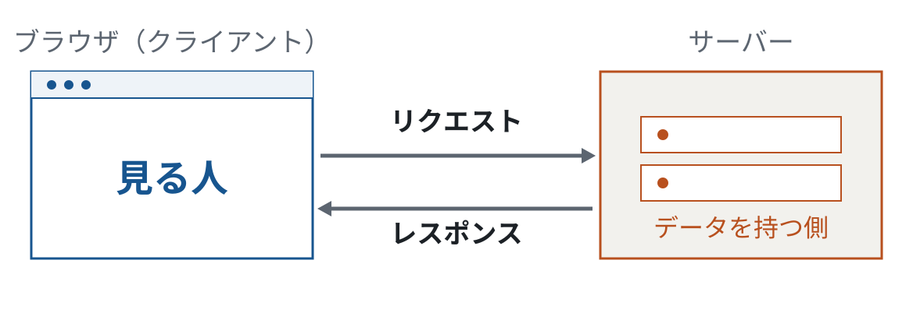

もとはブラウザ⇄サーバ間の通信用。<strong>WebAPIの呼び出し</strong>などにも使われる。

---

## いまの主流は HTTPS

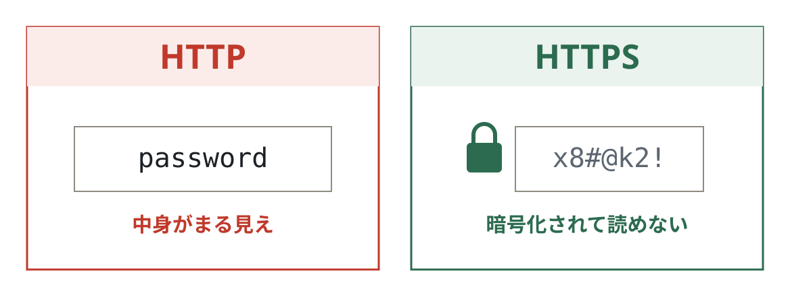

<strong>HTTPS</strong> は、HTTPの通信を<strong>暗号化</strong>したもの。盗み見や改ざんを防ぐ。

---

## SSL と TLS

- <strong>SSL</strong>：古い暗号化の規格（いまは使われない）
- <strong>TLS</strong>：SSL の後継。実際に使われているのはこちら
- 慣習で、TLS のことを<strong>「SSL」と呼ぶ</strong>ことも多い

つまり <strong>HTTPS ＝ HTTP を TLS で暗号化</strong>したもの。 
この資料は HTTP を前提に解説。詳しくは <strong>HTTPS / SSL / TLS</strong> で調べてみよう。

---

## HTTPは「ステートレス」

通信は<strong>1回ごとに独立</strong>していて、 前回の続きとしては扱われない

<strong>ステート</strong>（状態）＋ <strong>レス</strong>（ない）。 
サーバーは前の通信を覚えていない。たとえば「ログイン成功」も保持しない。

---

## でも「セッションレス」ではない

通信に<strong>セッション情報</strong>を乗せるので、 ログイン状態は保てる

だから HTTP は <strong>ステートレスだが、セッションレスではない</strong>。

---

<!-- _class: chapter -->

CHAPTER 2

# URLの構成

---

URL は、インターネット上の リソースへの<strong>あて先</strong>

<strong>URL</strong> ＝ Uniform Resource Locator

---

## URL と URI

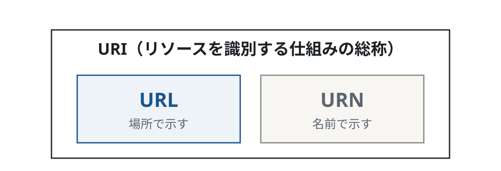

<strong>URI</strong> はリソースを識別する仕組みの総称。<strong>URL はその一種</strong>で、実務ではほぼ URL を使う。

---

## URLの構成

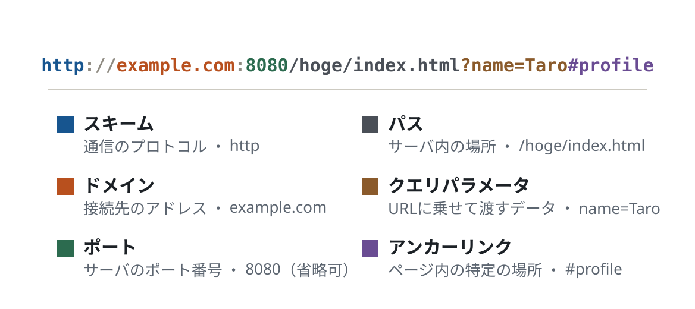

---

## オリジン

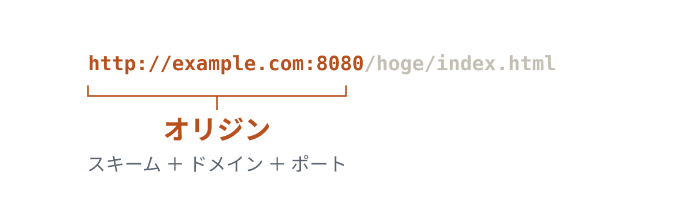

スキーム・ドメイン・ポートの3つをまとめて <strong>オリジン</strong> と呼ぶ。

---

## オーソリティ

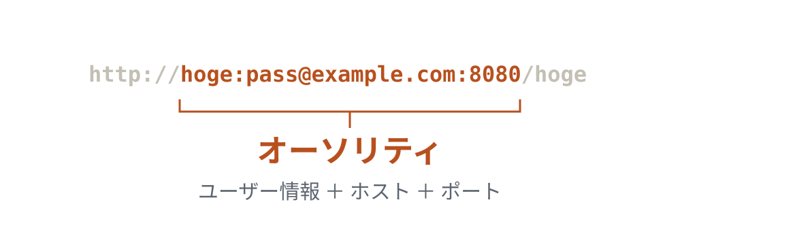

<code>//</code> の後ろ、パスの前までの部分。ホストの前に<strong>認証用のユーザー情報</strong>を含めることもある。 
オリジンとは違い、<strong>スキームを含まず・ユーザー情報を含む</strong>。

---

<!-- _class: chapter -->

CHAPTER 3

# HTTPメソッド

---

## メソッド ＝ 通信のアクション

仕様上のメソッド
GET / POST / PUT / DELETE / HEAD / CONNECT / OPTION / TRACE / PATCH

今回は、よく使う <strong class="view">GET</strong> と <strong class="logic">POST</strong> の2つを見る。

---

## GET と POST

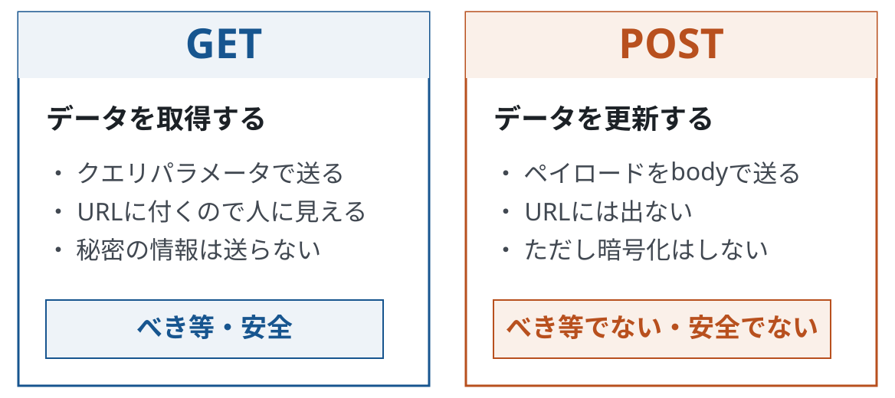

---

## GET とは

- サーバから**データを取得**する
- クエリパラメータを URL に含められる
- URLは人の目に触れやすい → **個人情報は送らない**

HTTPメソッドとして<strong>べき等・安全</strong>。 
ここでの「安全」は、サーバ側へ<strong>更新を要求しない</strong>という意味。

---

## POST とは

- サーバの**データを更新**する
- データは **body に含めて**送る（＝ペイロード）
- URLには出ないが、**暗号化はしない**

HTTPメソッドとして<strong>べき等でなく・安全でない</strong>。 
個人情報を扱うなら HTTPS で通信ごと暗号化する。

---

## TIPS：べき等とは

同じリクエストを<strong>何回処理しても</strong>、 サーバのデータが<strong>同じ状態</strong>になること

ここまでは<strong>メソッドの定義</strong>の話。 
GET/POSTを使ったAPIのべき等性・安全性は、<strong>サーバ/クライアントの実装しだい</strong>。

---

## 実際にやってみる（GET）

1. 新しいタブで開発者ツールを開く（githubログイン中ならシークレットウィンドウ）
1. `Network` タブを開いて `github.com` にアクセス
1. 一覧の `github.com` の行がメソッド **GET** になっているか確認
1. リロードやロゴのクリックで内容が変わらないことを確認（**べき等**）
1. 検索窓に `jigintern` など入れて検索
1. `search` を探し、**GET** で呼ばれ、Request URL に入力文字列が含まれることを確認
1. 同じ文字列なら何度でも同じ結果になることを確認

---

<!-- _class: pic -->

### Network タブで確認する

---

## 実際にやってみる（POST）

1. github にログインする
1. 一覧から `session` を探し、**POST** で呼ばれていることを確認
1. URLにはパスワードが入っていないのに、**Payload** タブを開くとパスワードが入っていることを確認

---

## まとめ（HTTPメソッド）

- <strong class="c-view">GET</strong>：クエリで送る／人に見える情報だけ／べき等な処理に
- <strong class="c-logic">POST</strong>：body で送る／秘密の情報に／更新する処理に（暗号化はしない）

メソッドは動作や性質が<strong>定義</strong>されているだけ。 
定義どおりに動くよう、<strong>サーバ側が実装する</strong>必要がある。

---

<!-- _class: chapter -->

CHAPTER 4

# HTTPの中身

---

## リクエストとレスポンスの構成

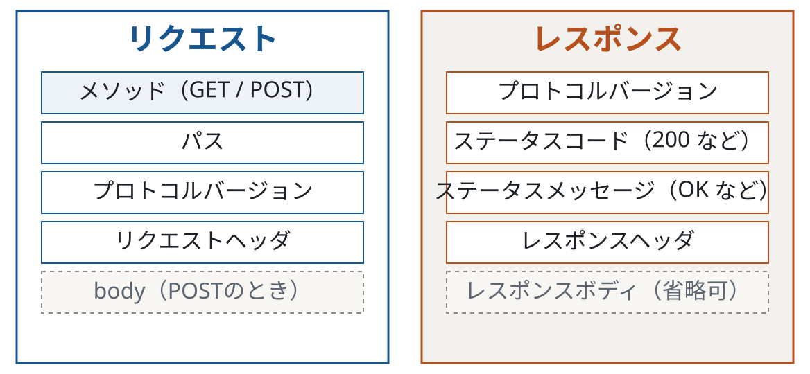

---

## 主なリクエストヘッダ

| ヘッダ | 役割 |
| --- | --- |
| user-agent | ブラウザ・OS の種類 |
| cookie | サーバから預かった情報（セッションなど） |
| host | 接続先のホスト名 |
| accept | 受け取れるデータ形式 |
| accept-language | 受け取れる言語 |
| accept-encoding | 受け取れる圧縮形式 |

---

## 主なレスポンスヘッダ

| ヘッダ | 役割 |
| --- | --- |
| content-type | 本文のデータ形式 |
| Content-Encoding | 本文の圧縮形式 |
| set-cookie | ブラウザに保存させる情報 |
| connection | 接続の扱い方 |
| server | サーバのソフトウェア名 |

ヘッダは基本 <strong>ブラウザが自動で付与</strong>。慣れるまで自作・付与はしなくてよい。

---

## 実際に見てみる

**GETの中身**
- ログイン済みの `github.com` を開く（リロード）
- Nameが `github.com` の行をクリック
- リクエスト/レスポンスヘッダ、レスポンスボディを確認

**POSTの中身**
- github にログイン（済みなら一度サインアウト → 再ログイン）
- Nameが `session` の行をクリック
- ヘッダやペイロードを確認

---

## まとめ（HTTPの中身）

- リクエストもレスポンスも、**本体以外の情報**をたくさん持つ
- **ヘッダ**から通信の情報を得られる
- ヘッダは任意に足せるが、**基本はやらなくてよい**

---

<!-- _class: chapter -->

CHAPTER 5

# CORSとは

---

CORS は、<strong>オリジンをまたいで</strong> データをやり取りするしくみ

<strong>CORS</strong> ＝ Cross-Origin Resource Sharing

---

## 同一オリジンポリシー

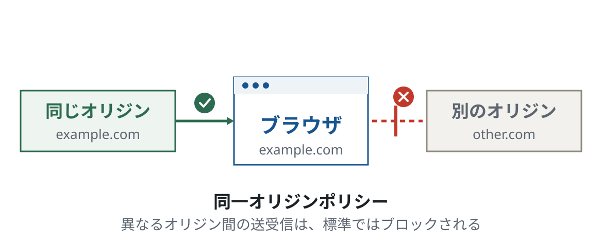

CSRF や XSS といった攻撃を防ぐため、異なるオリジン間の送受信は標準でブロックされる。

---

## なぜ CORS が必要？

HTML/JS を取ってくるオリジンと、 叩く<strong>APIのオリジン</strong>が違うことがある

そこで、<strong>安全と認められたオリジン間</strong>だけ、またいで通信できるようにしたのが CORS。

---

## この教材でのしくみ

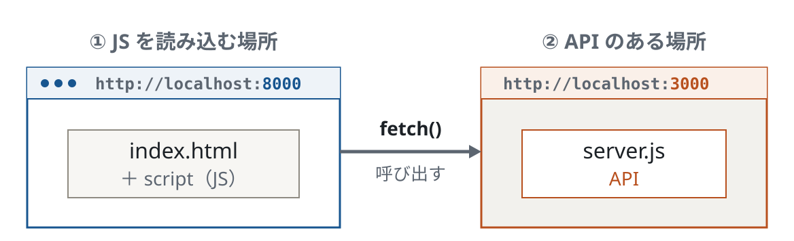

<strong class="c-view">8000</strong> のページから、その JS が <strong class="c-logic">3000</strong> の API を呼ぶ。ポートが違う＝<strong>別オリジン</strong>なので CORS が必要。

---

## CORSリクエスト

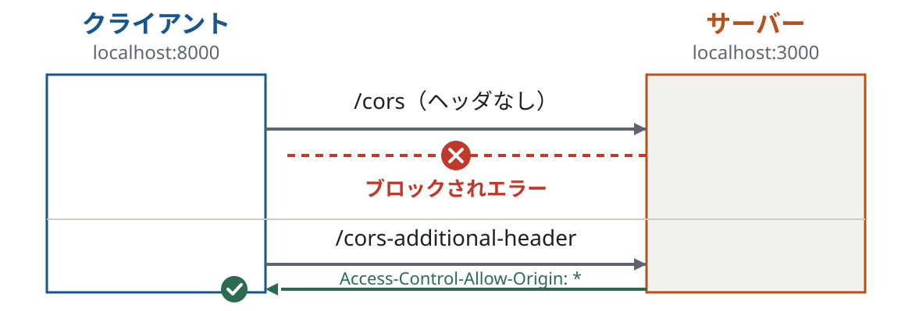

リクエストに <code>origin</code>、レスポンスに <code>Access-Control-Allow-Origin</code> を付け、両者が一致すれば受け取れる。

---

## プリフライトを起こさない条件（単純リクエスト）

メソッド
GET / HEAD / POST

ヘッダ
Accept / Accept-Language / Content-Language / Content-Type / Range

Content-Type
x-www-form-urlencoded / multipart/form-data / text/plain

加えて、アップロード監視のイベントリスナーや <code>ReadableStream</code> を使っていないこと。

---

## 実際に見てみる（単純リクエスト）

1. `/transfer-protocol` に移動
1. `deno run server.js` を実行（サーバは **3000番**）
1. 別ターミナルで `deno run client.js` を実行（クライアントは **8000番**）
1. `http://localhost:8000` を開き、開発者ツールを開く
1. `try cors` ボタン → Network / Console を確認（**エラー**）
1. `try cors (simple request)` ボタン → 正常に受け取れることを確認

<code>/cors</code> はヘッダなし、<code>/cors-additional-header</code> は <code>Access-Control-Allow-Origin: *</code> を付けて返している。

---

## プリフライトリクエスト

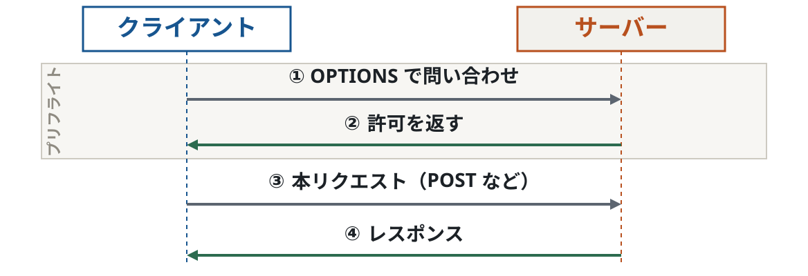

条件を満たせない（主にユーザのデータに影響する）通信では、先に <code>OPTION</code> で安全性を確認してから本リクエストを送る。

---

## 実際に見てみる（プリフライト）

1. `/transfer-protocol` に移動
1. `deno run server.js` を実行
1. 別ターミナルで `deno run client.js` を実行
1. `http://localhost:8000` を開き、開発者ツールを開く
1. `try cors (prefright request)` ボタン → Network / Console を確認

POST で <code>Content-Type: application/json</code> を持つため単純リクエストにならず、先にプリフライトで必要な許可を確認している。

---

## まとめ（CORS）

- オリジンをまたぐアクセスを許すなら **CORSの設定**を行う
- 条件を満たせないと **プリフライト**（安全確認の通信）が起きる
- **外部のWebAPI** を呼ぶときは CORS の設定が必要になることがある

---

<!-- _class: chapter -->

FINALE

# 実装で意識すること

---

## まとめ

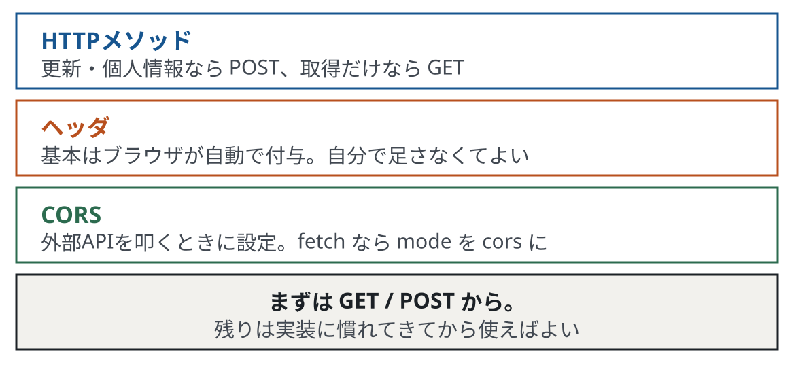

---

## 実装のときは

- メソッドは、更新・個人情報なら **POST**、取得だけなら **GET**
- サーバ側は、原則そのメソッドの**仕様を守って**実装する
- ヘッダは基本ノータッチ。**ブラウザ任せ**でよい

自作サーバは別オリジンから叩かれないので、サーバ側のCORSはあまり気にしなくてよい。 
クライアントで外部APIを叩くときは、<code>fetch</code> の <strong>mode を cors</strong> にすればおおむね動く。

---

<!-- _class: title -->
<!-- _paginate: false -->

# おわりに

もっと深く知りたい人は、参考文献で自学してみよう ◎

---

## 参考文献

- [HTTPの概要（MDN）](https://developer.mozilla.org/ja/docs/Web/HTTP/Overview)
- [HTTPメソッドについて（MDN）](https://developer.mozilla.org/ja/docs/Web/HTTP/Methods)
- [GETとPOSTの違いについて（Qiita）](https://qiita.com/kanataxa/items/522efb74421255f0e0a1)
- [CORSについて（MDN）](https://developer.mozilla.org/ja/docs/Web/HTTP/CORS)
- [CORSを絶対に理解する（Zenn）](https://zenn.dev/syo_yamamoto/articles/445ce152f05b02)
